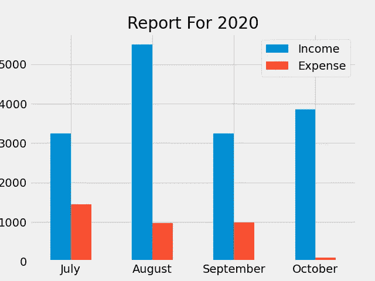

# 跟踪和可视化每月费用的程序

> 原文：<https://medium.com/analytics-vidhya/program-for-tracking-and-visualizing-monthly-expenses-38909409b075?source=collection_archive---------5----------------------->


照片由[rupixen.com](https://unsplash.com/@rupixen?utm_source=medium&utm_medium=referral)在 [Unsplash](https://unsplash.com?utm_source=medium&utm_medium=referral) 上拍摄

> "**那些不理财的****将永远为理财的**效力。"—戴夫·拉姆齐

我们都曾试图写日记来记录我们每月的收入和支出，但只有少数人成功地做到了这一点。就我个人而言，我觉得定期记下所有的收入-支出细节真的很乏味，而且我也不能正确地保持账目。

所以，我想出了这个简单但有用的 Python 程序，你可以在旅途中用它来填写你的收入-支出细节，你甚至可以图形化地显示你的支出和收入。

让我们开始编码…

我们将使用两个模块；

**Pandas** 以 csv 格式存储和读取月度报表，以及 **Matplotlib** 以图表形式可视化数据。

 [## pandas 文档- pandas 1.1.3 文档

### 在文档中看到了一个错别字？想要改进现有功能？投稿指南将指导您…

pandas.pydata.org](https://pandas.pydata.org/docs/) [](https://matplotlib.org/tutorials/introductory/pyplot.html) [## Pyplot 教程- Matplotlib 3.3.2 文档

### pyplot 接口介绍。是使 matplotlib 像 MATLAB 一样工作的函数的集合。每个…

matplotlib.org](https://matplotlib.org/tutorials/introductory/pyplot.html) 

现在让我们安装模块，

```
pip install pandas
pip install matplotlib
```

现在，您已经安装了所需的模块，让我们导入它们，

我们将使用函数来执行程序的各个部分，所以让我们写一些函数。

我们将定义的第一个函数是`values()`,我们将使用它来收集收入-支出值。

该函数接受收入和支出细节的输入，比如相同的值和描述，并将这些细节作为参数传递给`tracker()`函数。

`tracker()`函数使用输入的数据创建一个. csv 文件，该文件以收入-支出数据涉及的月份命名。它使用`month_tracker()`函数返回当前月份的名称，并将月份名称传递给`checkIf()`，以检查包含月份名称的 csv 文件是否为空，如果为空，则返回。csv 文件将以“w”模式写入，否则将以“a”模式追加。

让我们定义`month_tracker()` & `checkIf()`功能，

您可能已经注意到了，在创建了。我们调用另一个函数`Balance_get()`，这个函数返回当月的余额(即收入-支出)。

我们还定义了另一个函数来查看我们已经输入数据的所有月份的余额。

现在到了真正可视化我们的数据的有趣部分，我们定义了一个`chart()`函数。图表功能将为我们已输入数据并已创建的月份绘制一个条形图。的 csv 文件。

`chart()`绘制了这样一幅图，



功能输出

我们使用了**‘fivethirtyeight’**样式，但是在 matplotlib 中有很多样式选项。您可以使用`print(styles.available)`查看所有可用选项的列表。

现在，开始实际调用上面所有的函数。

我已经使用了函数调用，使它感觉像一个应用程序，所以它很有趣，易于使用。

## 项目创意

您可以使用这个程序，并尝试使用 PyQt 或 Tkinker 创建一个基于 GUI 的应用程序。

## 结论

就是这样，你自己试着运行这段代码，你可以从我的 **GitHub** 库 [**这里**](https://github.com/sectrumsempra/Monthly_Cost.py/blob/master/monthly_cost.py) 获得完整的代码。