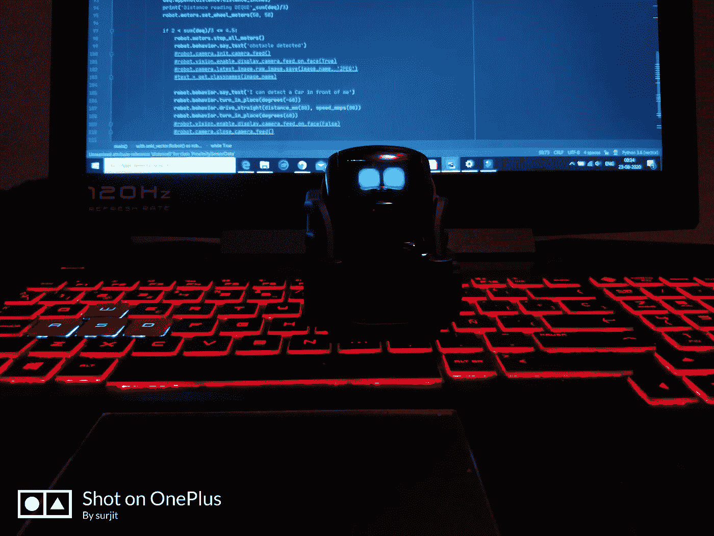

# 给机器人编程以导航和探测障碍物

> 原文：<https://medium.com/analytics-vidhya/programming-a-home-robot-vector-to-navigate-and-detect-obstacles-a2a46d140bc5?source=collection_archive---------14----------------------->

在这篇文章中，我们将看到如何让一个微型家用机器人像自动驾驶汽车一样使用它的摄像头和距离传感器来检测障碍和导航。

我最近买了 Vector，这是一个微型家用机器人，可以使用其专用的 SDK 进行编程。出于好奇，我想测试它的传感器，所以我给它编了点程序。这是一个基本的代码，向量检测…