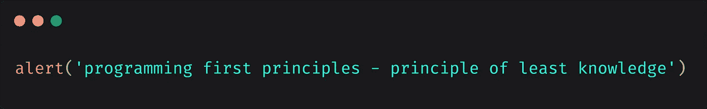

# 编程首要原则— 10。第一原理——最少知识原理

> 原文：<https://medium.com/analytics-vidhya/programming-first-principles-10-first-principle-principle-of-least-knowledge-8e570871f472?source=collection_archive---------18----------------------->



本帖([编程首要原则— 10。第一原理——最小知识原理](https://www.sargalias.com/blog/programming-first-principles-first-principle-principle-of-least-knowledge/)最初发表在[杂志](https://www.sargalias.com/)上。

1.  [目的——这个系列是关于什么的](https://www.sargalias.com/blog/programming-first-principles-purpose-what-this-series-is-about/)
2.  [观众——这个系列是给谁看的](https://www.sargalias.com/blog/programming-first-principles-audience-who-this-series-is-for/)
3.  [软件需求](https://www.sargalias.com/blog/programming-first-principles-requirements-of-software/)
4.  [前提—最少信息](https://www.sargalias.com/blog/programming-first-principles-premise-minimal-information/)
5.  [前提——我们必须明白我们在做什么](https://www.sargalias.com/blog/programming-first-principles-premise-we-must-understand-what-were-doing/)
6.  [前提——最小化在整个系统中传播的变更](https://www.sargalias.com/blog/programming-first-principles-premise-minimize-propagating-changes/)
7.  [前提—复杂性随规模呈指数增长](https://www.sargalias.com/blog/programming-first-principles-premise-complexity-increases-exponentially-with-scale/)
8.  [第一原则——证明代码有效](https://www.sargalias.com/blog/programming-first-principles-first-principle-proof-that-code-works/)
9.  第一原理——最小惊讶原理
10.  [第一原理——最少知识原理](https://www.sargalias.com/blog/programming-first-principles-first-principle-principle-of-least-knowledge/)(本文)
11.  [第一原则——关注点分离](https://www.sargalias.com/blog/programming-first-principles-first-principle-separation-of-concerns/)
12.  [第一原理——抽象](https://www.sargalias.com/blog/programming-first-principles-first-principle-abstraction/)
13.  [副作用](https://www.sargalias.com/blog/programming-first-principles-side-effects/)

还建议:

*   [何时不应用编程原则](https://www.sargalias.com/blog/when-not-to-apply-programming-principles/)
*   [为什么代码更改容易出错](https://www.sargalias.com/blog/why-code-changes-are-error-prone/)

本文视频版:[https://youtu.be/IIECT7Q5-Gk](https://youtu.be/IIECT7Q5-Gk)

最少知识原则意味着代码应该尽可能少地了解其他代码。

在我们开始之前，有一个小提示。从现在开始，我们将讨论所有剩下的首要原则(最少知识原则、关注点分离、抽象等。)重叠相当多。甚至前面的原则(最小惊讶原则)也可以被认为是这个原则的应用，反之亦然。我将尽可能保持它们的不同，但是请注意，在大多数情况下，它们都是彼此的应用程序。

回到最少知识原则。

# 这是什么意思？

代码应该尽可能少地了解其他代码是什么意思？

仅仅说这句话可能没有多大意义，所以让我们从几个例子开始，以便更好地理解。

**快速示例**

*   一个类或模块应该有尽可能少的公共或导出函数。完成工作所需的绝对最小值。
*   模块/类不应该公开任何私有函数。
*   除非绝对必要，否则不应公开任何属性。
*   模块或类的“公共 API”之间应该有明确的区别。
*   等等。

例如，如果我们使用像 Java 这样的语言……Java 是基于类的，并且有公共和私有方法的正式概念。私有方法不向它们所在的类之外的任何东西公开。从其他地方无法访问它们。

这应用了最少知识的原则。使用该类的代码只知道一些公共函数，其他一无所知。其他的都是隐藏的，不可接近的。

尽管像 JavaScript 这样的语言还没有私有方法的正式概念，但其原理和重要性是完全一样的。不坚持这一原则将会付出同样的消极后果。应该应用同样的概念来避免这些后果。

**散列表示例**

该原理的另一个应用是编码到[接口](https://en.wikipedia.org/wiki/Protocol_(object-oriented_programming))而不是实现。

当我们使用一个接口时，我们会说“我不关心你内部如何工作，或者你有什么其他的方法，只要你有方法 X”。

[接口分离原则](https://en.wikipedia.org/wiki/Interface_segregation_principle)更进一步，有效地说“你的接口应该尽可能小”。即代码应该知道的越少越好。

不过还是说一些代码吧。

例如，假设我们的一些 Java 代码需要一个`Map`(相当于 JavaScript 中的`object`或`Map`)。在 Java 中，我们的代码会接受一个实现了`Map`接口的对象，它不会关心 map 是如何在内部实现的。可以是`HashMap`、`LinkedHashMap`、`CustomImplementation1`、`CustomImplementation2`等。这是一个实现细节。

我们的代码所关心的只是它是*类似地图的*。它有我们的代码想要使用的特定方法。换句话说，需要最少的信息。它不需要知道内部实现。

**例**

JavaScript 中 Java HashMap 的一个类似例子是`Array.from`。如果我们查看 Array.from 的 [MDN 文档(在撰写本文时，2020 年 1 月),我们会看到在语法下面写着:](https://developer.mozilla.org/en-US/docs/Web/JavaScript/Reference/Global_Objects/Array/from)

> `*Array.from(arrayLike[, mapFn[, thisArg]])*`

注意“类似数组”的部分。该功能适用于多种情况，如`Set`、`Array`、`HTMLCollection`等。它不关心我们使用什么样的数组。它关心的只是它有一个迭代器/可以在 for 循环中使用。

这是最少知识原则的一个应用。

想象一下，如果我们只能使用带有`Set`的`Array.from`而没有其他的。我们会失去这个功能的大部分功能。

**交货示例**

作为另一个人为的例子，让我们考虑一个假想的送货公司。

这将再次是空谈多于编码，首先尝试获得概念上的理解。下一个例子将有更多的代码。

因此，我们的员工已经收到订单，让他们的团队准备产品，现在需要发送产品进行交付。

这个人关心谁交付产品吗？

不完全是。他们所关心的是它能送到合适的人手里。但是他们不关心它最终是在飞机上还是在汽车上或者其他什么地方。

让我们把这个概念翻译成一些粗略的代码。

像这样的代码就可以了:

```
function send(package, transporter) {
  transporter.send(package);
}
```

这段代码可能不太好:

```
function send(package, transporter) {
  switch (transporter.type) {
    case 'Car':
      if (!transporter.hasFuel()) {
        transporter.fuelUp();
      }
      transporter.startEngine();
      transporter.drive(package.destination);
      break;
    case 'Bicycle':
      if (transporter.isHungry()) {
        transporter.eatFood();
      }
      transporter.rideTo(package.destination);
      break;
  }
}
```

上面的代码知道太多关于不同运输商的信息。我们有一个`switch`语句，询问运输机是什么类型，然后给它具体的指令。

如果我们把这和现实生活中的例子联系起来，那就太疯狂了。我们的仓库员工根本不会关心这东西是如何运输的。毕竟他们不是职业自行车手或司机。他们相信司机会专业地完成工作，他们不会微观地管理他们的工作方式。

仓库员工不需要知道或关心司机会做什么。

我们希望我们的代码是相同的。

**外形示例**

让我们看一个更像代码的例子。还是很简单做作…

经典的形状案例。

考虑以下代码:

```
class Circle {
  constructor(radius) {
    this.radius = radius;
    this.someImportantCircleProperty = 'something';
  } getArea() {
    return Math.PI * this.radius ** 2;
  } draw(canvas) {
    // Note: This implementation is fake and not important, don't spend time deciphering it
    canvas.draw({ shape: 'Circle', center: [0, 0], radius: this.radius });
  } _somePrivateCircleHelper() {
    return 'foo';
  }
}class Square {
  constructor(width) {
    this.width = width;
    this.someImportantSquareProperty = 'something';
  } getArea() {
    return sideLength ** 2;
  } draw(canvas) {
    // Note: This implementation is fake and not important, don't spend time deciphering it
    canvas.draw({
      points: [
        [0, 0],
        [this.width, 0],
        [this.width, this.width],
        [0, this.width],
      ],
    });
  } _somePrivateSquareHelper() {
    return 'foo';
  }
}// do stuff with shape
function main(shape, canvas) {
  console.log(shape.getArea());
  shape.draw(canvas);
}
```

上面的代码试图遵循最少知识的原则。

主函数知道工作所需的最小值。该代码旨在尽量减少我们的主要功能工作所需的知识。

如果语言支持接口，那么每个类都将实现一个`Shape`接口，其中包含每个形状所需的方法，以便我们的主函数能够工作。请注意，在这些类之外，不会使用任何私有属性或辅助方法。

这段代码怎么样:

```
class Circle {
  constructor(radius) {
    this.radius = radius;
    this.type = 'Circle';
  }
}class Square {
  constructor(width) {
    this.width = width;
  }
}// do stuff with shape
function main(shape, canvas) {
  if (shape.type === 'Circle') {
    const area = Math.PI * shape.radius ** 2;
    console.log(area);
    canvas.draw({ shape: 'Circle', center: [0, 0], radius: shape.radius });
  } else if (shape instanceof Square) {
    const { width } = shape;
    const area = width ** 2;
    console.log(area);
    canvas.draw({
      points: [
        [0, 0],
        [width, 0],
        [width, width],
        [0, width],
      ],
    });
  }
}
```

上面我们有一个知道得太多的主函数:

*   它必须明确询问它当前使用的是什么形状。
*   它需要知道每个形状上不同命名的属性(应该是私有的)。
*   它需要知道如何计算每个形状的面积。
*   它需要知道如何画出每一个形状。

还有，可能不仅仅是主要功能。出于不同的原因，我们可能有多个函数需要使用形状。也许一个需要面积，另一个需要周长，等等。它们都需要与我们的主函数相似的代码。

所以我们研究了最小知识原则的含义。我们也看到了一些例子。

但那又怎样？如果我们违反了这个原则，又有什么关系呢？为什么上面的代码示例被认为是不好的？

# 为什么最少知识原则很重要？

让我们考虑一些实际后果。

**在形状示例中，如果我们需要添加另一个形状呢？**

我们将不得不遍历像`main`函数这样的每一个函数，并为那里的新形状添加逻辑。

想象一下一个有 10 种形状的`main`函数会是什么样子。

这打破了[最小惊讶/亲吻](https://www.sargalias.com/blog/programming-first-principles-first-principle-principle-of-least-astonishment/)原则。

另外[代码更改容易出错](https://www.sargalias.com/blog/why-code-changes-are-error-prone/)，所以我们希望将它们包含在尽可能小的范围内，而不是让它们与函数中的其他 10 件事情搅在一起。

但是在干净的例子中，我们只需要为形状添加一个新的类，我们就完成了。我们的`main`函数只与提供的方法接口，所以不需要修改。

**如果我们想改变 Circle 的工作方式会怎样？**

出于某种原因，我们想把`radius`改名为`diameter`。

我们必须改变所有使用这个属性的函数，比如`main`，并且修改每个地方的逻辑，现在除以 2(因为直径是半径的 2 倍)。

再举个例子怎么样？我们有一个存储项目集合的类。如`this.points = [point1, point2, point3];`。例如，如果我们因为性能原因想换成`Set`呢？

简而言之，我们必须修改所有知道我们试图改变的属性的代码。

当然，在这两个例子中，不知道这些私有属性的代码不会受到任何影响，如果我们改变它们的话。

**所以我们需要修改很多代码，为什么会有问题？**

简答:[代码修改容易出错](https://www.sargalias.com/blog/why-code-changes-are-error-prone/)。

总结一下代码更改的一些问题:

1.  我们不会记得需要修改什么代码。我们将不得不搜索代码库，寻找将会受到影响的内容。
2.  很有可能我们会遗漏一些东西，破坏系统。
3.  这是大量重复的工作。我们不擅长重复。我们在做重复性的工作时很容易出错。
4.  这将比我们不需要改变任何东西(除了我们试图修改的东西)花费更长的时间。

更不用说，如果我们在一个区域有级联变化，很可能我们会在整个代码库中都有它们。一个简单的改变需要修改系统中的每一个文件的经典案例。

所以我们只想尽可能地做最小的改变。

在好的形状示例中，我们不需要更改任何代码来创建新的形状。

如果我们真的需要修改代码，例如为了性能，必要的修改会尽可能地包含在内。

# 其他应用

最少知识原则适用于不同的形式，也与其他原则重叠。

使用[接口](https://en.wikipedia.org/wiki/Interface_(computing))是类中最少知识原则的一个应用。将一个接口应用于许多实现被称为[多态](https://en.wikipedia.org/wiki/Polymorphism_(computer_science))。

[界面分离原则](https://en.wikipedia.org/wiki/Interface_segregation_principle)是一个更严格的应用，鼓励更少的知识。

我们不应该能够访问事物的“私有”属性。它的正式名称是[信息隐藏](https://en.wikipedia.org/wiki/Information_hiding)，这也是我们创建[封装](https://en.wikipedia.org/wiki/Encapsulation_(computer_programming))的方式。

德米特定律[在方法和函数的范围内应用最少知识原则。](https://en.wikipedia.org/wiki/Law_of_Demeter)

[开闭原则](https://en.wikipedia.org/wiki/Open%E2%80%93closed_principle)正式强调最小化代码变更的重要性。它本质上由编程第一原则组成，其中最少知识原则起着重要作用。

不访问全局变量，这是最少知识原则的应用。理想情况下，我们不希望我们的函数知道任何事情，除了直接在它们作用域内的事情。如果有必要，我们可以达到实例范围或模块范围。这属于[副作用](https://www.sargalias.com/blog/programming-first-principles-side-effects/)的概念，也是[函数式编程](https://en.wikipedia.org/wiki/Functional_programming)中的一个重要话题。

上面给出的例子也可以被认为是应用了关注点分离或抽象原则。

**非面向对象代码中的用法**

不是所有的东西都使用接口，比如函数或者模块。然而，所有的东西都应该被视为有正式的接口。

换句话说，代码中最少知识的原则是通用的，不管语言是否为类提供接口，为函数提供参数类型(例如，TypeScript)或其他任何东西。

**使用建议**

对我个人来说，最少知识原则是最基本的原则之一。它可以用来推导其他的，如界面，界面分离原理，德米特定律，信息隐藏等。

这样我就知道了**为什么**，原则背后的动机。这意味着我可以就如何更自然地构建我的代码做出明智的决定，甚至不用直接考虑诸如接口、德米特法则等原则。

如果有什么不同的话，这些原则更多的是作为如何进行的想法，或者确认我正在沿着正确的路线思考。此外，它让我更好地理解这些原则，因为通过最少知识原则，我可以看到它们背后的动机，它们试图解决什么，以及它们的目的是什么。

那不一定是你必须要做的，那只是对我有用的。

# 理论

现在是本系列中承诺的理论治疗。这个会短很多，因为很笼统。

概括地说，我们对软件的要求是:

*   它应该按预期工作。
*   应该很容易改变。

我们的前提是:

*   我们只能意识到最少的信息
*   我们必须明白我们在做什么
*   我们必须尽量减少变化的传播
*   复杂性随着规模呈指数增长

**最小惊讶原则的动机**

案例:代码 X 知道 Y 和 z。

动作:我们需要修改 y。

问题:

1.  我们需要意识到并记住 X 会受到影响。
2.  我们可能需要知道**X 将会受到怎样的影响，所以我们不会做那些我们永远无法用在 X 上的改变，至少不会对 X 做太大的修改，超出了我们想要做的范围。**
3.  我们需要改变 X 来适应 y 的变化。
4.  x 可能在其他代码中有自己的级联更改，这将重复该过程。

结论:

这与我们所有的前提相冲突。

我们需要了解更多的事情，理解更多的代码，这样我们才能做出改变。将会有传播的变化，潜在的非常复杂的变化和大量的大规模变化。

另一方面，如果我们对 Y 所做的任何改变都不会影响 X 或其他任何东西，那么我们将满足我们的前提。

**指导方针**

*   记住这个原则。记住这一点，你可能会一直朝着它前进。这肯定比你一开始就不知道这个原则要好。
*   重要的是使用代码创建系统，使它和其他代码之间的交流和知识最少。
*   理想情况下，代码要么什么都不知道，要么只知道存在于其局部范围内的东西和它已显式接收的东西(参数)。
*   正如接口分离原则和 Demeter 定律所建议的那样，代码应该只知道尽可能少的参数。
*   所有的交流和知识都应遵循约定的不变和不冲突的契约(也称为接口)。接口只是一种方式来说明某些东西在对象上总是可用的。它们可以安全使用，并且不会改变。

**好处**

*   程序员所需的关于代码所知道和依赖的最少知识。
*   代码之间需要最少的知识。
*   更改代码时传播更改的可能性最小(可能没有)。

本文是“编程首要原则系列”的一部分:

1.  [目的——这个系列是关于什么的](https://www.sargalias.com/blog/programming-first-principles-purpose-what-this-series-is-about/)
2.  [观众——这个系列是给谁的](https://www.sargalias.com/blog/programming-first-principles-audience-who-this-series-is-for/)
3.  [软件需求](https://www.sargalias.com/blog/programming-first-principles-requirements-of-software/)
4.  [前提—最少信息](https://www.sargalias.com/blog/programming-first-principles-premise-minimal-information/)
5.  [前提——我们必须明白我们在做什么](https://www.sargalias.com/blog/programming-first-principles-premise-we-must-understand-what-were-doing/)
6.  [前提——最小化在整个系统中传播的变更](https://www.sargalias.com/blog/programming-first-principles-premise-minimize-propagating-changes/)
7.  [前提—复杂性随规模呈指数增长](https://www.sargalias.com/blog/programming-first-principles-premise-complexity-increases-exponentially-with-scale/)
8.  [第一原则——证明代码有效](https://www.sargalias.com/blog/programming-first-principles-first-principle-proof-that-code-works/)
9.  [第一原理——最小惊讶原理](https://www.sargalias.com/blog/programming-first-principles-first-principle-principle-of-least-astonishment/)
10.  [第一原理——最小知识原理](https://www.sargalias.com/blog/programming-first-principles-first-principle-principle-of-least-knowledge/)(本文)
11.  [第一原则——关注点分离](https://www.sargalias.com/blog/programming-first-principles-first-principle-separation-of-concerns/)
12.  [第一原理——抽象](https://www.sargalias.com/blog/programming-first-principles-first-principle-abstraction/)
13.  [副作用](https://www.sargalias.com/blog/programming-first-principles-side-effects/)

还建议:

*   [何时不应用编程原则](https://www.sargalias.com/blog/when-not-to-apply-programming-principles/)
*   [为什么代码更改容易出错](https://www.sargalias.com/blog/why-code-changes-are-error-prone/)

*最初发表于*[*https://www.sargalias.com*](https://www.sargalias.com/blog/programming-first-principles-first-principle-principle-of-least-knowledge/)*。*