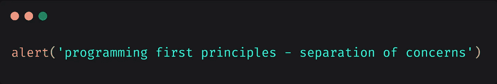

# 编程首要原则— 11。第一原则——关注点分离

> 原文：<https://medium.com/analytics-vidhya/programming-first-principles-first-principle-separation-of-concerns-sargalias-web-developer-497bd0b3420f?source=collection_archive---------18----------------------->



本帖([编程第一原则— 11。第一原则——关注点分离](https://www.sargalias.com/blog/programming-first-principles-first-principle-separation-of-concerns/))最初发表在 [Sargalias](https://www.sargalias.com/) 上。

本文是“编程首要原则系列”的一部分:

1.  [目的——这个系列是关于什么的](https://www.sargalias.com/blog/programming-first-principles-purpose-what-this-series-is-about/)
2.  [观众——这个系列是给谁看的](https://www.sargalias.com/blog/programming-first-principles-audience-who-this-series-is-for/)
3.  [软件需求](https://www.sargalias.com/blog/programming-first-principles-requirements-of-software/)
4.  [前提—最少信息](https://www.sargalias.com/blog/programming-first-principles-premise-minimal-information/)
5.  [前提——我们必须明白我们在做什么](https://www.sargalias.com/blog/programming-first-principles-premise-we-must-understand-what-were-doing/)
6.  [前提——最小化在整个系统中传播的变更](https://www.sargalias.com/blog/programming-first-principles-premise-minimize-propagating-changes/)
7.  [前提—复杂性随规模呈指数增长](https://www.sargalias.com/blog/programming-first-principles-premise-complexity-increases-exponentially-with-scale/)
8.  [第一原则——证明代码有效](https://www.sargalias.com/blog/programming-first-principles-first-principle-proof-that-code-works/)
9.  第一原理——最小惊讶原理
10.  [第一原理——最少知识原理](https://www.sargalias.com/blog/programming-first-principles-first-principle-principle-of-least-knowledge/)
11.  [首要原则——关注点分离](https://www.sargalias.com/blog/programming-first-principles-first-principle-separation-of-concerns/)(本文)
12.  [第一原理——抽象](https://www.sargalias.com/blog/programming-first-principles-first-principle-abstraction/)
13.  [副作用](https://www.sargalias.com/blog/programming-first-principles-side-effects/)

还建议:

*   [何时不应用编程原则](https://www.sargalias.com/blog/when-not-to-apply-programming-principles/)
*   [为什么代码更改容易出错](https://www.sargalias.com/blog/why-code-changes-are-error-prone/)

连同其他首要原则，这是复杂系统中最重要的事情之一。

在我们开始之前，我想回顾一下我们的许多首要原则是重叠的。它们的某些方面可以被认为是其他基本原理的应用。还有许多其他原则，如“单一责任原则”、“开闭原则”等。这也可以被认为是这些原理的应用或等同物。解释的时候，我会尽量保持原理清晰。

# 关注点分离是什么意思？

这个有点难以描述。

你知道在 OOP 中，我们是如何看待对象的，就好像它们在模拟现实生活中的事物一样？例如，我们有一个代表汽车的`Car`类，或者一个代表关于一个人和他们能做什么的信息的`Person`类。

我将试着用这种精神来解释关注点的分离。

这意味着:

*   **代码要尽可能的自私、无知、懒惰**。
*   它应该只做一件事，一件非常小的事。它应该是极其懒惰的。
*   它应该将所有其他事情委托给其他函数/方法。它不应该关心其他函数是如何工作的。应该是懵懂吧。
*   它应该尽可能少地了解代码库中的其他内容。关于这方面的更多信息，请参见最小知识原理。
*   它应该只关心它自己和它做的那件小事。应该是绝对的自私。
*   它不应该关心谁调用它，为什么调用它或者在哪里调用它(那是调用方的责任)。它应该是自私的，除了自己什么都不在乎。

# 例子

让我们从一些现实生活中的类比开始。

# 订购产品

如果你在网上订购了送货上门的产品，你不会特别在意送货方式。

这不关你的事。

不管它是开车来的，还是在某个时候必须坐飞机，或者坐船，或者其他什么方式。

你只是不在乎，这不会以任何方式影响你的生活。

# 投递邮件

如果你要给朋友送东西，流程可能是这样的:

1.  邮局有你需要遵守的某些规则，它接受的东西的规格，等等。你要记住这些。
2.  你得到了你朋友的确切地址。
3.  你按照邮局的要求准备包裹。
4.  你去邮局，把包裹给他们，他们就寄出去。

在关注点分离方面:

*   你不关心邮局如何投递。这不关你的事。你只要相信一切都会好的。
*   你不关心你的朋友住在哪里(至少在这个练习的上下文中……)。他们可以住在英国，或者北极。你只要从他们那里拿到地址，写在包裹上就行了。
*   你只需要做最少的工作(询问地址和准备包裹)，然后把剩下的工作委派给别人。

(好吧，我们通过忽略奇怪的地址、保险等来简化情况。但除此之外，情况与编程非常相似。)

让我们把它和代码联系起来。代码可能是这样的:

```
function getItem(item) {
  // Internal stuff that no one else in the codebase cares about
}function createPackage(item, address) {
  // Internal stuff that no one else in the codebase cares about
}function post(package) {
  // Internal stuff that no one else in the codebase cares about
}function main() {
  const item = getItem('super-gadget');
  const address = myFriend.getAddress();
  const package = createPackage(item, address);
  post(package);
}
```

下面是不应该出现的代码:

```
function main() {
  // Code to go buy item from the store
  // Code to get address from friend
  // Code to package up the item
  // Code to deliver the item
}
```

在坏版本中，我们有一个`main`函数，它可以做任何事情。

假设我们把所有来自`post`、`packageItem`等的代码。在 main 中，包括所有的辅助函数，`main`可能长达数百或数千行。

有更多的原因和暗示说明为什么这是不好的，但是稍后会有更多的解释。

在这个好例子中，我们试图清晰地分离关注点:

*   就像在现实生活中一样，投递邮件是一个独立的问题，不是你的问题，你也不关心。
*   你的朋友给了你地址，仅此而已。你不出去寻找它或什么的。
*   你准备包裹。包装的准备方式对其他任何事情都没有影响。这是一个单独的问题。因此它应该是程序中一个独立的函数。
*   得到物品是它自己关心的事情。这是一个单独的过程，你可以委托给别人。物品是如何获得的(在线购买/亲自到商店购买/自己制造)并不重要。这是一个完全独立的问题，绝不会影响其他任何事情。所以应该隔离分开。

# Fizzbuzz 示例

接下来让我们看看类似 fizzbuzz 的东西。

我们将从简单的 fizzbuzz 开始，然后扩展这个例子来展示在实际应用程序中可能发生的更多情况。

无论如何，让我们从这个开始:标准 fizzbuzz +我们需要记录前 100 个数字的结果。

好例子:

```
function fizzbuzz(n) {
  if (n % 15 === 0) {
    return 'fizzbuzz';
  } else if (n % 3 === 0) {
    return 'fizz';
  } else if (n % 5 === 0) {
    return 'buzz';
  }
}function main() {
  for (let i = 1; i <= 100; i++) {
    console.log(fizzbuzz(i));
  }
}
```

更好的关注点分离的例子，虽然我实际上不会使用这个版本，因为我认为在这个简单的场景中有点矫枉过正。(参见[何时不应用编程原则](https://www.sargalias.com/blog/when-not-to-apply-programming-principles/)。)

```
function fizzbuzz(n) {
  if (n % 15 === 0) {
    return 'fizzbuzz';
  } else if (n % 3 === 0) {
    return 'fizz';
  } else if (n % 5 === 0) {
    return 'buzz';
  }
}function display(content) {
  console.log(content);
}function main() {
  for (let i = 1; i <= 100; i++) {
    display(fizzbuzz(i));
  }
}
```

坏例子:

```
function fizzbuzz(n) {
  let result;
  if (n % 15 === 0) {
    result = 'fizzbuzz';
  } else if (n % 3 === 0) {
    result = 'fizz';
  } else if (n % 5 === 0) {
    result = 'buzz';
  }
  console.log(result);
}function main() {
  for (let i = 1; i <= 100; i++) {
    fizzbuzz(i);
  }
}
```

最坏的例子:

```
function fizzbuzz(n) {
  if (n % 15 === 0) {
    console.log('fizzbuzz');
  } else if (n % 3 === 0) {
    console.log('fizz');
  } else if (n % 5 === 0) {
    console.log('buzz');
  }
}function main() {
  for (let i = 1; i <= 100; i++) {
    fizzbuzz(i);
  }
}
```

上一个例子中的细微差别是，我们现在将显示逻辑和 fizzbuzz 计算混合到一个函数中。

更糟糕的是，在最后一个例子中，我们有许多重复的`console.log`语句。

让我们来谈谈这些可能会产生的后果:

**可测试性:**

`fizzbuzz`不再是一个纯粹的函数了。在第一个例子中，测试非常简单。在第二个例子中，我们必须做额外的工作来模仿`console.log`。

`main`这里应该没有区别。测试它的最好方法是模仿`console.log`，看看它被称为什么。通过这种方式，我们不测试实现细节，只测试最终结果，但是当我们讨论测试的原则时，我们会更多地测试最终结果。如果我们使用依赖注入，更多的事情会有所不同，但是现在让我们忽略这一点。

**可重用性**

在第一个例子中，我们可以在代码库中的任何地方重用`fizzbuzz`。

在后面的例子中，`fizzbuzz`是不可能重用的，除非我们每次也需要`console.log`它。

当然，我们混合在一起的关注点越多，重用代码就越困难。

分离关注点增加了可重用性。这也可以被认为是抽象的应用。

**可变性**

在这个非常简单的例子中，我们可能永远不会改变`fizzbuzz`的计算。Fizzbuzz 在世界范围内有一个全球性的定义。它不是由我们的客户需求驱动的，客户需求可能会随时改变。

然而，我们可能需要改变我们的显示功能。也许新的需求需要我们在 DOM 上显示它。相当简单的东西。我们只需获得目标元素，并替换/追加内容。

DOM 显示代码可能是这样的:

```
const target = document.getElementById('target');
target.textContent = 'something';
```

下面是这一变化的例子:

好例子:

```
function fizzbuzz(n) {
  if (n % 15 === 0) {
    return 'fizzbuzz';
  } else if (n % 3 === 0) {
    return 'fizz';
  } else if (n % 5 === 0) {
    return 'buzz';
  }
}function display(content) {
  const target = document.getElementById('target');
  target.textContent += `\n${content}`;
}function main() {
  for (let i = 1; i <= 100; i++) {
    display(fizzbuzz(i));
  }
}
```

坏例子:

```
function fizzbuzz(n) {
  let result;
  if (n % 15 === 0) {
    result = 'fizzbuzz';
  } else if (n % 3 === 0) {
    result = 'fizz';
  } else if (n % 5 === 0) {
    result = 'buzz';
  }
  display(result);
}function display(content) {
  const target = document.getElementById('target');
  target.textContent += `\n${content}`;
}function main() {
  for (let i = 1; i <= 100; i++) {
    fizzbuzz(i);
  }
}
```

非常糟糕的例子:

```
function fizzbuzz(n) {
  const target = document.getElementById('target'); let result;
  if (n % 15 === 0) {
    result = 'fizzbuzz';
  } else if (n % 3 === 0) {
    result = 'fizz';
  } else if (n % 5 === 0) {
    result = 'buzz';
  } target.textContent += `\n${result}`;
}function main() {
  for (let i = 1; i <= 100; i++) {
    fizzbuzz(i);
  }
}
```

请注意:

*   在第一个例子中`fizzbuzz`根本不需要改变。
*   在我们最初的第二个例子中(最初应用了最佳关注点分离的例子)，`main`函数也不需要改变。只有`display`功能需要改变，其他都不需要改变。换句话说，没有传播变化。
*   在这个糟糕的例子中，我们至少只对`fizzbuzz`做了微小的改动，并抽象出了我们的`display`函数。
*   在这个非常糟糕的例子中，我们不得不改变`fizzbuzz`，让它变得更大。对于更复杂的代码，这可能是一个重大的变化。

那又怎样？

在好的例子中，我们必须做最小的改变。

在糟糕的例子中，我们不得不对更多的东西做出更多的改变。

并且[代码变更容易出错](https://www.sargalias.com/blog/why-code-changes-are-error-prone/)。

当这个例子如此小而简单时，这几乎无关紧要。

然而，复杂性随着规模呈指数增长。

在大规模和复杂的情况下，即使很小的变化也很难做出，而且容易出错。如果我们需要担心一个 100 行的函数而不是一个 5 行的函数，那就更是如此了(因为如果我们不应用关注点分离，函数很容易变得那么长)。重复也增加了出错的机会。我们往往不擅长重复性的工作。

考虑一下，如果我们有一个函数`generateAndDisplayAndEmailReport`,它可以:生成一个报告，在同一个函数中有显示功能，除此之外，它还可以将报告作为电子邮件发送。

对该功能进行更改将是非常可怕的。

*   对这些方面中的任何一个方面进行任何更改都会破坏其余的方面，因为所有的代码都放在一起，可能会与分散在整个函数中的每个方面的部分交织在一起。我们可能会犯一个逻辑错误，或者只是错过一些使用显示功能的时间。
*   在我们开始改变之前，有更多的东西需要我们去阅读和理解。如果我们想改变显示功能，我们必须读取整个 100 行函数。我们必须这样做，因为我们需要确保我们已经阅读并理解了所有的显示功能，并且我们没有错过任何使用它的实例。我们还打破了最小惊讶原则，使用了一个更复杂的函数。
*   很可能会有级联变化，特别是如果我们在多个地方使用该功能。如果包含显示逻辑的 fizzbuzz 目前在 3 个地方使用，而我们只需要在其中一个地方更改显示逻辑，我们该怎么办？如果我们需要将结果写到一个文件中呢？总之会有很多层叠式的变化。我们必须改变 fizzbuzz，还要改变 2 到 3 个其他的东西。在一个真正的代码库中，那两三个其他的东西可能会产生它们自己的级联变化，等等。典型的例子是，我们想做一个简单的改变，必须改变系统中的每个文件。

**可测试性和可重用性**原始示例中的所有要点仍然适用。好的例子比坏的例子更容易重用和测试。

请注意，有了好的例子，我们就不会有任何问题了。我们可以用最少的努力进行单独的更改，不会有级联的更改，事情将非常容易测试(或者至少是最容易的)并且最大限度地重用。

# 反应示例

另一个例子，这次使用 React。

注意事项:

*   如果我来开发这个，这将更多的是我的想法，而不是一个预先做好的例子和描述。
*   我认为重构在这里非常适用，尤其是对于非常小的代码。
*   实用主义在这里是有价值的。之前在 fizzbuzz 的例子中，在第一个例子中我提到我不会将`console.log`语句提取到一个单独的函数中。在这么小的范围内可能不值得。如果东西太小，就没必要拆分。然而，我认为尽早应用关注点分离比以后应用要好。如果我们觉得应该的话，我们应该快速地应用关注点分离。

这个场景很简单，即使你不知道反应。

这是关于 React 中的容器、表示/视图组件，以及 React 自定义挂钩。

**快速反应概述**

首先快速概述一下，以防你不知道反应。

React 主要是一个视图库。它的用途类似于其他模板库。它允许我们在 DOM 上显示内容，并且易于编写和开发。

当然，在展示东西之前，我们通常需要先获取数据。在这个例子中，我们将只使用应用程序状态。在真实的应用程序中，也可能是 AJAX 调用或其他东西。

我将使用反应术语进行讨论，但请理解:

*   当我说 React 时，我在概念上是指任何视图库。
*   当我说“容器”时，我指的是收集数据并呈现给视图，或者设置功能的东西。有点像 MV*架构中的控制器或演示器。
*   React 钩子只是我们在 React 中用于某些逻辑的东西。
*   关于 React 定制钩子，可以把它们看作 React 中的一个实现细节，允许我们为多个视图重用容器或逻辑。有点像普通的`import`语句，但是是针对 react 代码的。

**场景**

我们只要一个非常简单的柜台。

一个带有+图标的按钮，旁边有一个数字。当我们点击+号时，数字会增加。

我们应该如何构建视图、容器甚至 React 钩子之类的东西？

我认为我们应该始终做的第一件事是考虑我们的需求:

*   我们需要显示一个+按钮。
*   我们需要显示一个数字。
*   我们需要保存一些关于我们在哪个数字上的状态。
*   当我们点击+按钮时，我们需要增加数字。

在这种情况下，如果有更好的解决方案，我们不会挑战或思考任何需求，也不会试图找到它们背后的动机。我们将照原样接受这些要求。

好吧，我们从简单的开始。

**视图**

谁来展示这些东西？

在同一个组件中同时显示+按钮和数字有意义吗，或者我们应该把它们分开？这些事情是独立的问题，还是属于一起的？

我觉得这个时候让他们在一起是有意义的。它们肯定是相关的，我不认为代码有足够的关注来保证它们在这个时候是分开的。

也许如果将来我们有 3 个按钮，将它们分开会更容易。我们可以拆分成一个视图组件来显示三个按钮，一个单独的视图组件来显示数字。即使在这种规模下，这可能有点矫枉过正，但至少这展示了我们在这种情况下可能有的一些想法。无论如何，在这个小比例下，让我们在一个视图中显示它们。

好了，我们决定看风景了。

视图关心什么？它想要什么？

*   它希望数字显示出来。
*   它希望将功能应用于按钮。

视图不关心什么？

它不关心处理递增数字值的功能。在这么小的例子中，我们可以把它放在同一个组件中，但是特别是在一个更复杂的组件中，我们不希望这个逻辑出现在视图中。

我喜欢做的是将视图(或任何与此相关的东西)视为一个实体，并思考它会关心什么。视图不关心功能和状态。像我们所有的其他代码一样，视图想要变得懒惰、自私和无知。视图只想显示内容，不做任何其他事情。它需要这个数字，但并不刻意去获取它。它只是懒洋洋地接受它作为一个道具(React 中的参数)。按钮还必须具有功能。由于视图不想提供功能，我们也必须接受功能作为附加到按钮上的道具，所以我们也这样做。

我们的视图可能是这样的:

```
// React setup code.
import React from 'react';const CounterView = props => (
  <div>
    <div>Count: {props.count}</div>
    <button type="button" onClick={props.onIncrement}>
      +
    </button>
  </div>
);export default CounterView;
```

**好处**

为什么像这样分离功能(容器)和视图是好的？

*   我们可以在代码库中的任何地方重用这个视图。我们甚至可以把它放在 NPM 模块中，在其他代码库中重用它。例如，我们可能有一些通用的 BlogPostView 组件，我们可能希望与以不同方式获取数据的不同容器一起使用。
*   代码更小，关注点更少，使得更改更容易，更不容易出错。
*   我们可以很容易地测试它，而不需要嘲笑或担心 Redux 之类的东西。

另一方面，如果它与逻辑相结合，我们将失去所有的好处:

*   除了需要完全相同的逻辑的地方，我们不能在任何地方重用视图。
*   代码会更大，并且有多个关注点，因此更改会更困难。
*   测试仍然很好，因为组件足够简单，但是很快就需要用更复杂的组件变得更复杂。

**逻辑**

我们的视图需要一些东西来提供数据和功能。

谁应该扮演这个角色？

应该是调用者(应用程序、页面等。)?

大概不会。

应用程序不必担心 Counter 如何工作的细节。它不在乎。它想把它委托给别的东西。

应用程序想要的只是一个`<Counter />`的声明。在最坏的情况下，它可能会传入一个初始数字或其他什么，比如`<Counter initialCount={10} />`，但不会传入其他任何东西。

好的，我们需要一个中间层。在 React 中，我们需要所谓的“容器”。这一层将处理允许我们的应用程序只写`<Counter />`的事情。我们的容器将创建并传递视图所需的一切。

以下是一些容器代码示例:

```
import React, { useState } from 'react';
import CounterView from './CounterView';const Container = ({ initialCount = 0 }) => {
  const [count, setCount] = useState(initialCount);
  const handleIncrement = () => setCount(count + 1); return <CounterView count={count} onIncrement={handleIncrement} />;
};export default Container;
```

不要太担心代码的细节。它所做的只是:

*   如果调用者将计数作为道具传递，则将计数初始化为`initialCount`，否则为 0。
*   跟踪 count 的当前值。
*   创建一个 handleIncrement 函数，用于处理递增计数值的逻辑。
*   调用并呈现视图，传递它需要的一切。

剩下的问题是视图是硬编码的。

在 fizzbuzz 的例子中，我们特别研究了将 fizzbuzz 的计算与我们显示结果的方式捆绑在一起会产生什么问题。

这里的主要问题是，我们不能重用具有不同视图的容器。

一个简单的例子就是我们为什么要这样做，那就是以不同的格式显示博客文章。博客文章可能有相同的数据，但是我们可以使用许多视图中的一个在不同的场景中以不同的方式显示它。

理解动机是重要的一部分。有了这些，我们就可以使用 React 自定义钩子、高阶组件或渲染道具来轻松重用功能。

# 关于依赖注入的旁注

如果您使用依赖注入，您可能会认为给出的示例可以用它来改进。

我同意。我觉得依赖注入很牛逼，欢迎大家使用。

依赖注入允许我们使用间谍而不是模拟来测试，这看起来是一种更好、更自然的测试方式。它还允许我们在专用层修改程序的各个方面，而不是改变硬编码的源代码。

我没有在示例中使用它的原因是因为它在 JavaScript 和前端中通常不是特别流行(Angular 除外)。

如果你不使用依赖注入，那么不要太担心它。但是不管怎样，请随意检查一下，看看你是否喜欢它。

# 总结——为什么我们应该关注关注点的分离？

给出的例子已经涵盖了这一点，所以这里是一个简短的总结。

通过关注点分离，我们获得了以下好处:

**代码变得最大可重用**

如果一个函数或方法、类或模块只做一件事，这意味着它在整个代码库中是最大限度可重用的。

任何需要的东西都可以导入并重用代码。

然而，如果它做两件或更多的事情，只有同时需要这两件事情的代码才能重用。

我们看到了 fizzbuzz 的例子，它也将结果记录到屏幕上。

不可能重用 fizzbuzz 功能，也就是说，不可能将其写入 DOM。我们只有在需要计算 fizzbuzz 并写入屏幕的情况下才能重用它。

另一方面，如果 fizzbuzz 只计算 fizzbuzz，我们可以在任何地方重用它。

**代码变得最大可测试**

较小的函数更容易测试，尤其是纯函数。

单独测试`fizzbuzz()`和`appendToTargetNode(target)`比捆绑在一起测试更容易。

**代码更小，做的事情更少，更容易理解**

根据最小惊讶原则的要求。

**功能可以通过最少的更改来改变，并且没有级联更改**

[代码变更很容易出错](https://www.sargalias.com/blog/why-code-changes-are-error-prone/)，所以我们想最小化它们的范围和我们必须做的变更的数量。

如果我们已经清楚地将显示逻辑和计算逻辑分开，我们可以对其中任何一个进行独立的更改，而不用担心会影响另一个(假设界面不变)。

另一方面，如果它们被捆绑在同一个函数中，试图对其中一个进行更改可能会破坏另一个。

**奖励:代码读起来应该像写得很好的散文**

遵循最小惊奇原则的结果，良好的命名、抽象和关注点分离。

# 理论

最后，是时候讨论本系列中承诺的理论了。

概括地说，我们对软件的要求是:

*   它应该按预期工作。
*   应该很容易改变。

我们的前提是:

*   我们只能意识到最少的信息。
*   我们必须明白我们在做什么。
*   我们必须尽量减少变化的传播。
*   复杂性随着规模呈指数增长。

所以我们有分离关注点的动机。

**最少的信息，我们必须明白我们在做什么**

适当分离关注点的代码会产生尽可能小的代码。这意味着我们需要了解的更少，代码也更容易理解。

我们需要理解才能做出改变。同样，在所有条件相同的情况下，在较小的范围内做出改变要比在较大的范围内做出改变容易。

**抽象**

它有可能打破抽象的原则，这打破了我们对代码应该易于更改的要求。(关于这方面的更深入的信息，请参见关于专用原则的帖子。)

抽象意味着不应该有语义相同的重复代码。

如果我们不遵循关注点分离，这意味着我们的功能可以做不止一件事。

在代码库中的其他地方，我们可能需要我们的某个函数已经做的某件事情。但是，它可能捆绑了我们无法使用的附加功能。

可能无法将做多件事的函数重构为单独的函数。如果功能的状态很糟糕，或者如果我们的整个代码库都是这样，我们甚至不会考虑重构。每次都从零开始写东西甚至可能是常态。我们的整个代码库可能就是这样，重复的功能分散在各处。

这里我想起了《实用程序员》中提到的破窗理论。

在这种情况下，我们需要为我们需要的功能再次创建重复的代码。

这打破了抽象的原则，打破了我们对代码应该易于更改的要求。

# 指导方针

*   记住这个原则。记住这一点，你可能会一直朝着它前进。这肯定比你一开始就不知道这个原则要好。
*   问自己这样的问题:
*   “这个函数关心什么？”
*   “如果它自私、无知、懒惰，它会在乎/不在乎什么？”
*   “它关心的是什么？”
*   “打电话的人关心什么？”"调用者希望如何调用这个函数？"(这种想法也受到 TDD 的鼓励，在 TDD 中，我们本质上首先考虑的是呼叫者。)
*   一封来自罗伯特·马丁:“这个代码有什么理由必须改变？”
*   “谁(公司中的哪个人)可能想要更改此函数/方法或类/模块？”例如，设计师可能想改变风格，这是一个 CSS 问题。会计人员可能想要更改生成的报告。管理员可能希望更改报告的显示位置。所有这些场景都暗示了代码中不同的关注点。
*   让你写的代码尽可能的自私、无知、懒惰。
*   一切都应该只做绝对最小的需要。
*   代码应该只关心它自己，不关心其他。例如，不关心谁调用它，或者系统的状态。只有关于它自己，它做的小事和它通过争论得到的东西。
*   [榨取直到你滴下](https://sites.google.com/site/unclebobconsultingllc/one-thing-extract-till-you-drop)技术(感谢罗伯特·马丁)。

# 利益

*   最大的可重用性。
*   最大可测性。
*   最大可变性。

本文是“编程首要原则系列”的一部分:

1.  [目的——这个系列是关于什么的](https://www.sargalias.com/blog/programming-first-principles-purpose-what-this-series-is-about/)
2.  [观众——这个系列是给谁看的](https://www.sargalias.com/blog/programming-first-principles-audience-who-this-series-is-for/)
3.  [软件需求](https://www.sargalias.com/blog/programming-first-principles-requirements-of-software/)
4.  [前提—最少信息](https://www.sargalias.com/blog/programming-first-principles-premise-minimal-information/)
5.  [前提——我们必须明白自己在做什么](https://www.sargalias.com/blog/programming-first-principles-premise-we-must-understand-what-were-doing/)
6.  [前提——最小化整个系统中传播的变更](https://www.sargalias.com/blog/programming-first-principles-premise-minimize-propagating-changes/)
7.  [前提—复杂性随规模呈指数增长](https://www.sargalias.com/blog/programming-first-principles-premise-complexity-increases-exponentially-with-scale/)
8.  [第一原则——证明代码有效](https://www.sargalias.com/blog/programming-first-principles-first-principle-proof-that-code-works/)
9.  [第一原理——最小惊讶原理](https://www.sargalias.com/blog/programming-first-principles-first-principle-principle-of-least-astonishment/)
10.  [第一原理——最少知识原理](https://www.sargalias.com/blog/programming-first-principles-first-principle-principle-of-least-knowledge/)
11.  [首要原则——关注点分离](https://www.sargalias.com/blog/programming-first-principles-first-principle-separation-of-concerns/)(本文)
12.  [第一原理——抽象](https://www.sargalias.com/blog/programming-first-principles-first-principle-abstraction/)
13.  [副作用](https://www.sargalias.com/blog/programming-first-principles-side-effects/)

还建议:

*   [何时不应用编程原则](https://www.sargalias.com/blog/when-not-to-apply-programming-principles/)
*   [为什么代码更改容易出错](https://www.sargalias.com/blog/why-code-changes-are-error-prone/)

*最初发表于*[*【https://www.sargalias.com】*](https://www.sargalias.com/blog/programming-first-principles-first-principle-separation-of-concerns/)*。*