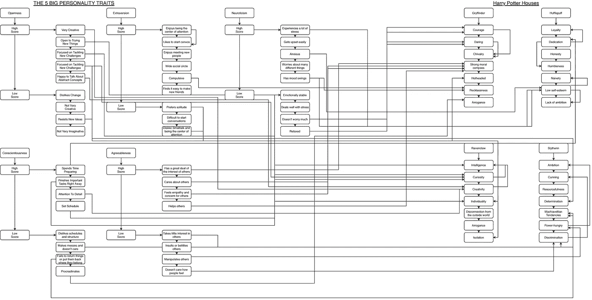
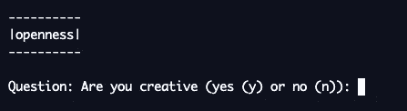
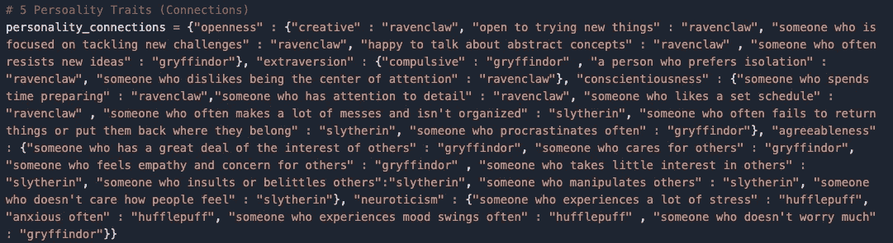
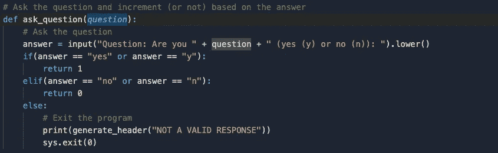
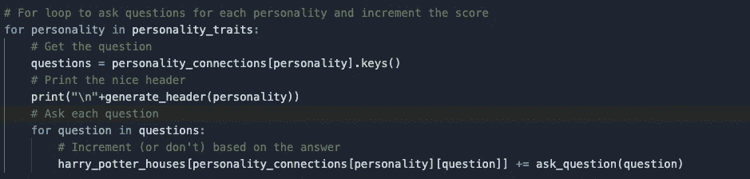
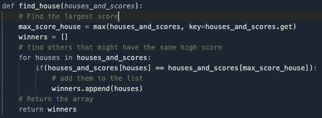
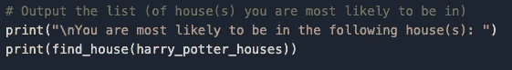
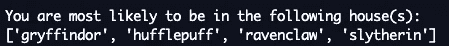

# 编程—哈利·波特分院帽

> 原文：<https://medium.com/analytics-vidhya/programming-harry-potter-sorting-hat-a145b0cda976?source=collection_archive---------18----------------------->

“嗯……嗯……对……赫奇帕奇！”

编程这种排序并不太糟糕。这只是一个基本的算法。总结整个项目，它提出了性格特征问题，并将其映射到具体的房子。如果你说是，那房子加一分，否则不加一分。它是这样映射出来的(想看更好的视图，点这里:[https://github . com/aaron-sc/CSCI-100/blob/master/sorting _ hat/sortinghat activity . pdf](https://github.com/aaron-sc/CSCI-100/blob/master/sorting_hat/SortingHatActivity.pdf)):

房子的个性特征

当你启动分院帽时，它会把要测试的个性放进盒子里，并根据那个特征开始问你问题。

开放性问题

这些问题取自字典里的一本大字典。字典的第一个关键是人格特质，关键(作为第一个关键的值)是没有“你是不是”的问题。第一个关键字的值是要添加点的房屋。

人格特征词典

如你所见，所有的问题都是“你是”问题的一部分。为了提出问题，我们只需要调用这个函数:

提问功能

游戏在每个人身上循环运行。它获取每个问题，并通过调用 ask_question()函数来提问。然后，它根据 ask_question()函数的返回值递增 house。

游戏循环

最后，调用一个函数来确定具有最多点数的房屋。如果出现平局，它也会将其添加到获胜数组中。

查找点数最多的房屋

程序的结果返回给用户:

输出代码

输出给用户

注:REPL。我用来运行代码的服务现在已经关闭了，所以代码不会运行！

如果你想使用分院帽，请点击这里:【https://repl.it/@AaronSanta/Sorting-Hat#main.py 