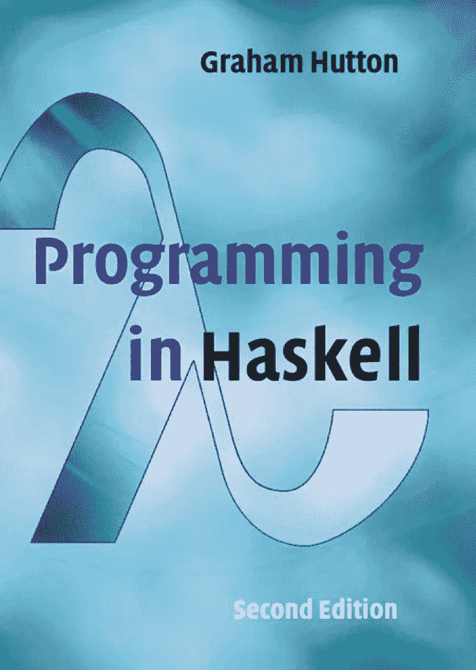
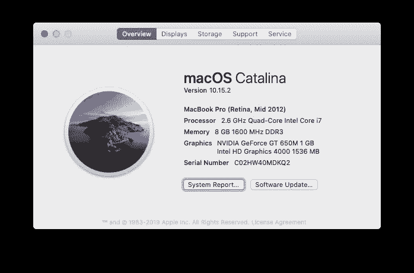

# Haskell 编程练习(2)

> 原文：<https://medium.com/analytics-vidhya/programming-in-haskell-exercises-2-2c2afbc73bc9?source=collection_archive---------10----------------------->


## 进行第二章第一步的练习



在这台 mac 上测试的代码

更改终端提示符和 ghci 提示符。让 ghci 支持多行。

```
% export PS1="👍 "
👍 cat ~/.ghci     
:set prompt "λ: "
:set +m
:set prompt-cont " | "
👍 ghci
GHCi, version 8.2.1: [http://www.haskell.org/ghc/](http://www.haskell.org/ghc/)  :? for help
Loaded GHCi configuration from /Users/zhijunsheng/.ghci
λ:
```

1.  使用 GHCi 完成本章中的示例。

```
λ: 2+3*4
14
λ: (2+3)*4
20
λ: sqrt (3^2 + 4^2)
5.0
λ:
```

函数头、尾、取、长、和、积和反:

```
λ: head [1,2,3,4,5]
1
λ: tail [1,2,3,4,5]
[2,3,4,5]
λ: [1,2,3,4,5] !! 2
3
λ: take 3 [1,2,3,4,5]
[1,2,3]
λ: drop 3 [1,2,3,4,5]
[4,5]
λ: length [1,2,3,4,5]
5
λ: sum [1,2,3,4,5]
15
λ: product [1,2,3,4,5]
120
λ: [1,2,3] ++ [4,5]
[1,2,3,4,5]
λ: reverse [1,2,3,4,5]
[5,4,3,2,1]
```

文件 test.hs 中的 Haskell 源代码:

```
👍 vim test.hs
👍 ghci test.hs 
GHCi, version 8.2.1: [http://www.haskell.org/ghc/](http://www.haskell.org/ghc/)  :? for help
Loaded GHCi configuration from /Users/zhijunsheng/.ghci
[1 of 1] Compiling Main             ( test.hs, interpreted )
Ok, 1 module loaded.
λ: quadruple 10
40
λ: take (double 2) [1,2,3,4,5]
[1,2,3,4]
```

在另一个终端编辑 test.hs。用 vim 命令更新代码并保存。

```
double x = x + xquadruple x = double (double x)factorial n = product [1..n]average ns = sum ns `div` length ns~                                                   
~                                                   
~                                                   
~                                                   
"test.hs" 8L, 118C written
```

使用 ghci 命令重新加载 test . hs:reload 或:r。

```
λ: :reload
[1 of 1] Compiling Main             ( test.hs, interpreted )
Ok, 1 module loaded.
λ: factorial 10
3628800
λ: average [1,2,3,4,5]
3
```

带有压痕样本的 test.hs:

```
double x = x + xquadruple x = double (double x)factorial n = product [1..n]average ns = sum ns `div` length nsa = b + c
    where 
      b = 1
      c = 2
d = a * 2
```

重新加载并尝试:

```
λ: :reload
[1 of 1] Compiling Main             ( test.hs, interpreted )
Ok, 1 module loaded.
λ: a
3
λ: d
6
```

使用花括号:

```
a = b + c
    where 
      { b = 1;
        c = 2 };
d = a * 2
```

重新加载并尝试:

```
λ: :r
[1 of 1] Compiling Main             ( test.hs, interpreted )
Ok, 1 module loaded.
λ: a
3
λ: d
6
```

将所有内容放在一行中:

```
a = b + c where { b = 1; c = 2 }; d = a * 2
```

重新加载并尝试:

```
λ: :r
[1 of 1] Compiling Main             ( test.hs, interpreted )
Ok, 1 module loaded.
λ: a
3
λ: d
6
```

单行注释和块注释:

```
{-
double x = x + xquadruple x = double (double x)
-}-- Factorial of a positive integer:
factorial n = product [1..n]-- Average of a list of integers:
average ns = sum ns `div` length nsa = b + c where { b = 1; c = 2 }; d = a * 2
```

函数 double 被注释掉了:

```
λ: :r
[1 of 1] Compiling Main             ( test.hs, interpreted )
Ok, 1 module loaded.
λ: double 3<interactive>:16:1: error:
    Variable not in scope: double :: Integer -> t
λ: a
3
```

2.给下列数字表达式加上括号:
2 ^ 3 * 4
2 * 3 + 4 * 5
2 + 3 * 4 ^ 5

```
λ: 2^3*4
32
λ: (2^3)*4
32
λ: 2*3+4*5
26
λ: (2*3)+(4*5)
26
λ: 2+3*4^5
3074
λ: 2+(3*(4^5))
3074
```

3.下面的脚本包含三个语法错误。更正这些错误，然后使用 GHCi 检查您的脚本是否正常工作。
N =一个‘div’长度 xs

```
N = a 'div' length xs
    where
       a = 10
      xs = [1,2,3,4,5]
```

n 应该是 n

应该是

x 应该与前一行的 a 对齐

```
λ: let
 | N = a 'div' length xs
 |     where
 |        a = 10
 |       xs = [1,2,3,4,5]
 |<interactive>:27:1: error:
    parse error (possibly incorrect indentation or mismatched brackets)
λ:
```

纠正了 3 个错误:

```
λ: let
 | n = a `div` length xs
 |     where
 |        a = 10
 |        xs = [1,2,3,4,5]
 | 
λ: n
2
```

4.库函数`last`选择非空列表的最后一个元素；比如`last [1,2,3,4,5] = 5`。展示如何用本章介绍的其他库函数来定义函数`last`。你能想到另一个可能的定义吗？

```
λ: let 
 | last' :: [a] -> a
 | last' xs = head $ reverse xs
 | 
λ: last' [1..20]
20
```

下面是使用索引的一种不同方式:

```
λ: let 
 | last' :: [a] -> a
 | last' xs = xs !! (length xs - 1)
 | 
λ: last' [1..20]
20
```

5.库函数`init`从非空列表中移除最后一个元素；例如，`init [1,2,3,4,5] = [1,2,3,4]`。展示如何以两种不同的方式定义 init。

```
λ: let 
 | init' :: [a] -> [a]
 | init' xs = take (length xs - 1) xs
 | 
λ: init' [1..20]
[1,2,3,4,5,6,7,8,9,10,11,12,13,14,15,16,17,18,19]
```

下面是使用 reverse 和 tail 的另一种方法:

```
λ: let 
 | init' :: [a] -> [a]
 | init' xs = reverse $ tail $ reverse xs
 | 
λ: init' [1..20]
[1,2,3,4,5,6,7,8,9,10,11,12,13,14,15,16,17,18,19]
```

[Haskell 编程练习题(1)](/analytics-vidhya/exercises-of-chapter-1-682ad72d25c8?source=friends_link&sk=548cbffc0d042d36b29c4aa9466cd44e)

[Haskell 编程练习(二)](/@zhijunsheng/programming-in-haskell-exercises-2-2c2afbc73bc9?sk=107d6c9f8fd970b92f6f3ad161b3b3fc)

[编程中的 Haskell 练习(3)](/@zhijunsheng/programming-in-haskell-exercises-3-9a3255f1e07e?sk=d66930454ef4ae1d5b23af40f85e2593)