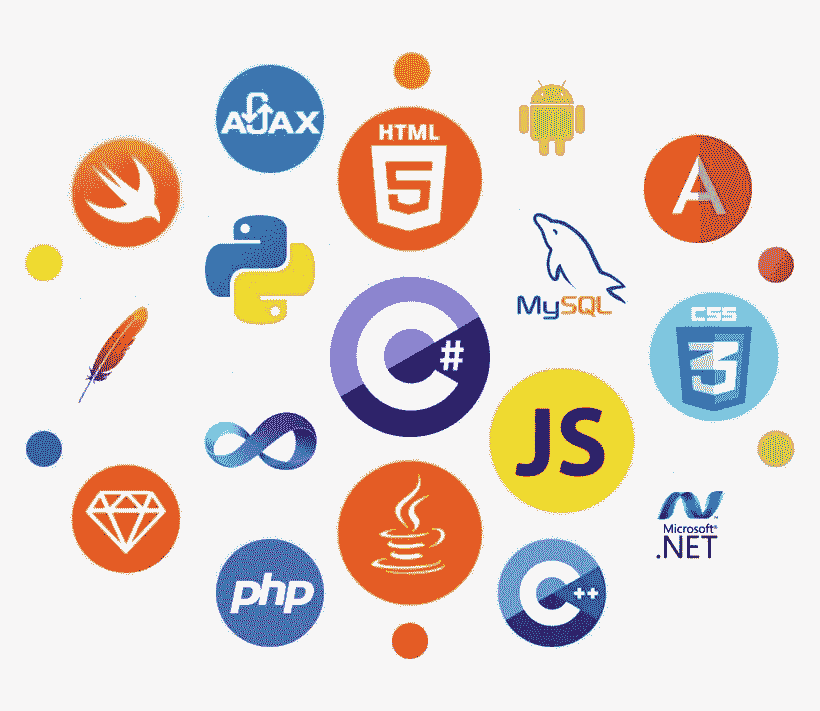
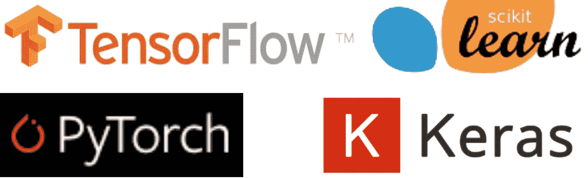
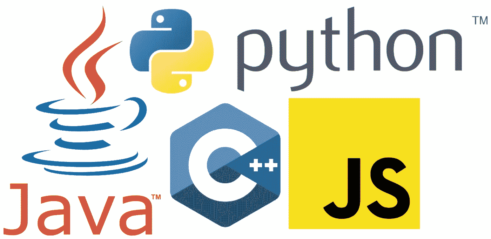
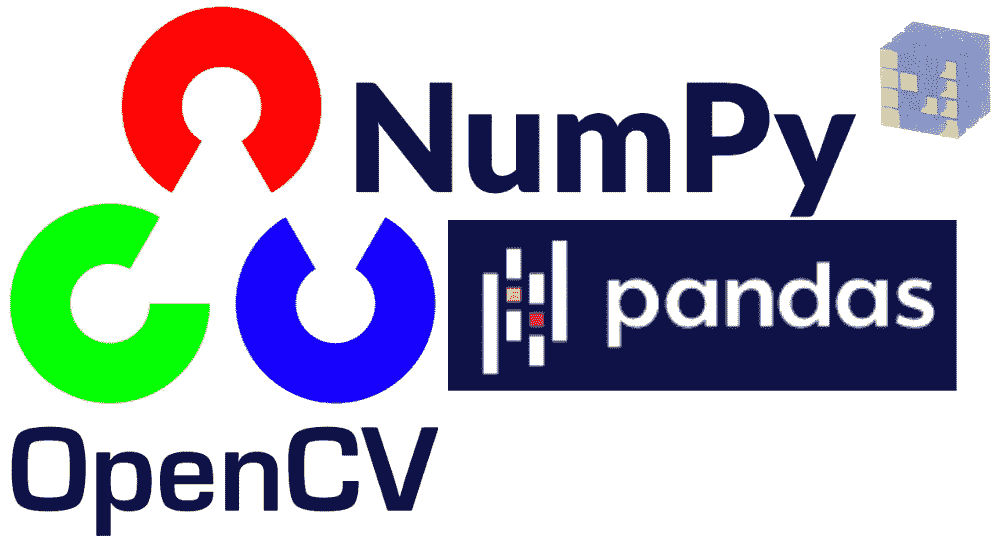
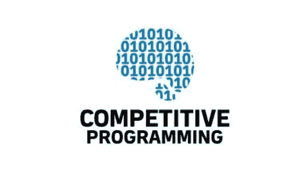
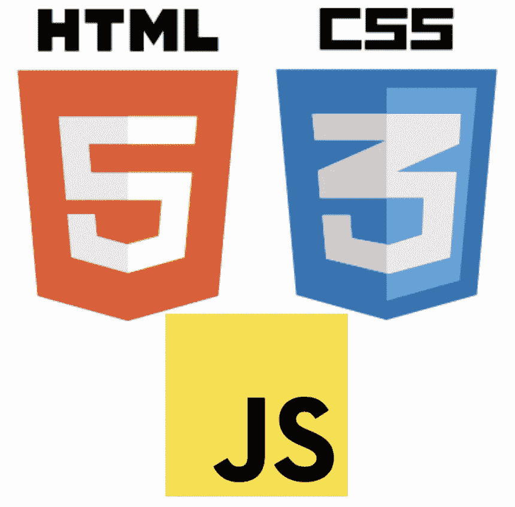
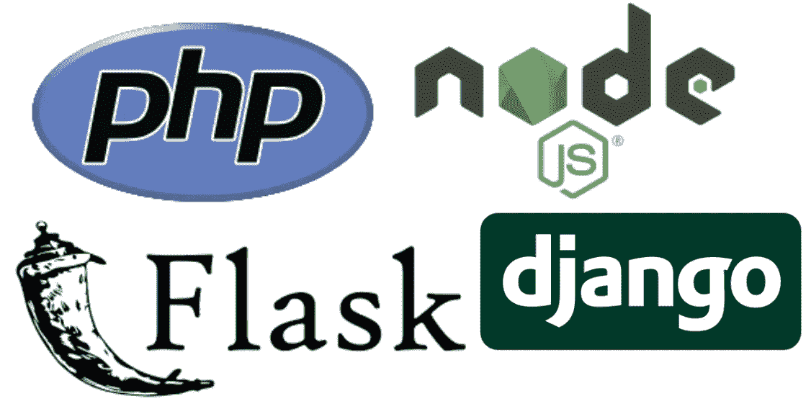
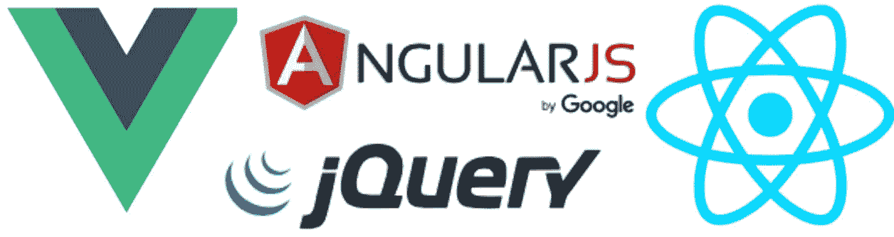
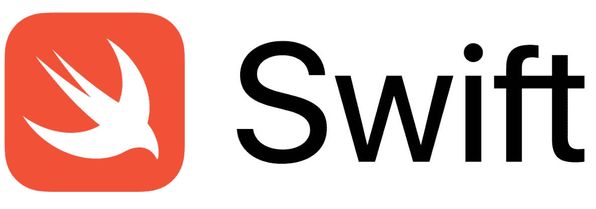
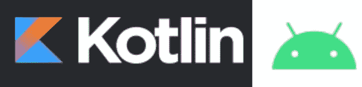

# 21 世纪的编程:应该学习哪些语言？

> 原文：<https://medium.com/analytics-vidhya/programming-in-the-21st-century-which-languages-should-you-learn-d4055e5871f4?source=collection_archive---------15----------------------->

*来源:* [*编程语言中的*](/@iliasshaikh/programming-languages-d9a55a3a44ed)

21 世纪在各个领域都取得了显著的进步；但是也许在过去的二十年里，科技的发展是最重要的。智能手机、平板电脑、花哨的应用程序和新的强大编程语言和库的推出，加上人工智能和机器学习、大数据和加密货币领域的巨大进步，创造了一种技术在所有其他行业中发挥关键作用的氛围。在这样一个世界里，编码能力对每个人都非常有用，不管他们的职业是什么。

许多人已经开始理解学习编码的重要性，并且有大量的编程语言和学习资源可供选择。然而，由于有这么多不同的编程语言可供使用，初学者通常很难确定他们应该学习哪种语言。

在本文中，我将尝试简化根据您的特定需求确定您应该学习哪种语言的过程。

# 我们如何确定我们应该学习和使用哪种语言？

重要的是要明白，当一个人在学习编写代码时，最重要的部分是教你的大脑如何思考解决特定问题所需的逻辑。一旦你理解了编程背后的理论，学习编程语言就变得非常简单。在很大程度上，它们都具有相似的功能，但语法不同(不同编程语言中，您为执行相同操作而键入的确切代码会有所不同，但逻辑是相同的)。

也就是说，基于你想在哪里应用你正在学习的编程技能，肯定有某些语言更适合在那个特定的领域使用。

现在，我们将研究一些刚开始学习编程的人的主要兴趣领域，以及我对在这些领域中使用的“最佳”编程语言的看法。

我将在本文中涉及的 4 个主要领域是:

1.  机器学习和人工智能
2.  竞争性编程
3.  Web 开发
4.  应用程序开发

# 机器学习和人工智能

*来源:*[*cubix.co*](https://www.cubix.co/blog/machine-learning-ai)

最近，随着像 [*TensorFlow*](https://www.tensorflow.org/) 、 [*PyTorch*](https://pytorch.org/) *、*[*SciKit-Learn*](https://scikit-learn.org/stable/)*和*[*Keras*](https://keras.io/)这样的库的开发，机器学习开发已经变得简单得多，并且可以被更多的人使用。因此，我觉得如果你想开始学习机器学习和人工智能，最好的语言是 [*Python*](https://www.python.org/) *，*[*Java*](https://www.java.com/)*，甚至可能是 [*C++*](https://isocpp.org/) 。如果你想开发支持机器学习的网站，你也可以考虑学习 JavaScript。***

****

**总的来说， *Python* 绝对是我推荐学习机器学习开发的语言，因为它支持广泛的非常有帮助的库，用于创建机器学习模型和预处理数据，如[*【NumPy】*](https://numpy.org/)*，*[*【PIL*](https://pypi.org/project/Pillow/)*(Python 图像库)，* [*熊猫*](https://pandas.pydata.org/) *，***

******

***使用 API(应用程序编程接口)开发工具，如 [*Flask*](https://flask.palletsprojects.com/) 、 *Python* 也可以用于开发支持机器学习的网络应用，这使得 *Python* 非常适合机器学习开发。***

**另外，我还会推荐了解机器学习理论的在线课程。我自己参加的一门课程是[吴恩达的机器学习课程](https://www.coursera.org/learn/machine-learning)，我觉得它非常有用，帮助我学习了很多与机器学习相关的理论。**

# **竞争性编程**

****

***来源:* [*竞技编程入门*](/@kkdubey94310/beginners-guide-to-competitive-programming-ea287e1fb49c)**

**竞争性编程通常涉及一个你必须通过写一段代码来解决的问题，问题在于写任何代码都不会给你带来满分，即使它给出了正确的答案。**

**这是因为竞争性编程就是挑战你的大脑高效思考。每个问题都有一组时间限制。如果执行大量测试用例的代码所花费的时间超过了最大时间限制，您将得不到任何分数。**

**因此，像 c++和 Java*这样的语言是初学者在竞争性编程中最常用的语言，因为这些语言比其他语言如 Python*更快。一些初学者倾向于发现 *C++* 有点难以理解，所以我建议从像 *Java* 这样更容易学习的语言开始。这可以作为你掌握重要编程概念的基础，一旦你对这些语言有了一些经验，学习一门新的语言，比如 C++，应该不是一个挑战。**

**如果你是一个初学者，想开始学习竞争性编程，我建议你注册 [Codechef](https://www.codechef.com/) 。我相信精通竞争性编程的最好方法是解决大量的问题。Codechef 有一个按难度排序的大型问题库。随着你在你能解决的问题的难度中前进，你变得更好，并且能理解要学习什么概念。**

# **Web 开发**

**在一个大量的东西都转移到网络空间的世界里，web 开发已经成为任何计算机科学家武库中的一项关键技能。**

****

**一般来说，为了建立网站而必须学习的语言取决于你想要开发的网站的类型。如果你正在寻找建立一个静态网站(简单的网站，只是显示一些内容)，你应该熟悉的语言是*(*超文本标记语言*)， *CSS* ( *级联样式表*)和[*JS*](https://www.javascript.com/)*(*JavaScript*)。HTML 通常被认为是一种标记语言，而不是“编程语言”,但是考虑到它的重要性，我仍然把它包括在这个列表中。****

**另一方面，如果你的目标是建立动态网站，除了 *HTML* 、 *CSS* 和 *JS* 之外，你还需要使用服务器端脚本语言。我会向任何初学者推荐的服务器端脚本语言有 [*PHP*](https://www.php.net/) *(超文本预处理器)*， *Python* 或 [*Node.js*](https://nodejs.org/en/) 。PHP 在后台工作，确保你的网站按预期运行，并能执行所需的代码，使其具有交互性。你也可以使用 *Python* ，这是另一个很好的选择，因为像 [*Flask*](https://flask.palletsprojects.com/) 和 [*Django*](https://www.djangoproject.com/) 这样的框架让学习变得容易，也确保它有很多有用的功能。**

****

**现在，重要的是要认识到 web 开发大致分为两种类型:前端开发和后端开发。**

## **前端开发**

**网站的前端是你打开网站时在屏幕上看到的东西。为了设计一个好看的前端，你需要知道的语言只有 *HTML* 、 *CSS* 和 *JS* 。**

***HTML* 和 *CSS* 齐头并进。虽然 *HTML* 用于定义什么组件应该出现在网站的特定位置，但是 *CSS* 给你提供了更广泛的样式、颜色和字体，可以用来增强你使用 *HTML* 创建的组件的外观。一旦你获得了一些使用 *HTML* 和 *CSS* 的经验，我会推荐你学习 [*SASS*](https://sass-lang.com/) ，这是一种非常有用的 *CSS* 扩展语言。**

****

**JavaScript 在轻松创建任何本质上是交互的前端组件中扮演着重要的角色。前端开发最好的一些前端 *JavaScript* 框架有 [*React.js*](https://reactjs.org/) 、 [*Angular JS*](https://angularjs.org/) 、 [*Vue.js*](https://vuejs.org/) 和 [*jQuery*](https://jquery.com/) 。**

**我推荐的另一个前端开发框架是 [*Bootstrap*](https://getbootstrap.com/) 。Bootstrap 允许你无缝地集成 HTML、CSS 和 JS，并利用一个容器系统来更容易地确保内容在所有类型的设备上正确显示，不管它们的长宽比有什么不同。**

## **后端开发**

**任何网站的后端都是用户无法直接看到或与之交互的部分，但后端赋予了网站所有的功能。理解这一点的简单方法是，后端包含网站的实际工作部分，以及所有被管理的数据，用户通过前端间接与后端交互。**

**我推荐的两种主要后端语言是 *PHP* 和 *Python* 。像 *Flask* 这样的库使得用 *Python* 创建 API 变得非常容易，从而允许轻松创建后端功能。此外，像 *Django* 这样的框架使得快速开发高功能网站变得非常容易。**

**后端开发中使用的另一种流行语言是*node . js。**node . js*使您能够在 web 浏览器之外运行 *JavaScript* 代码，从而允许在后端使用它。它对于构建各种用途的后端 API 非常有用。**

**我推荐给初学者学习网页开发的一个资源是密歇根大学的 Coursera 网页设计课程。**

# **应用程序开发**

**就 app 开发而言，我觉得你应该学习的语言完全是你想在其上使用这个 App 的平台的一个功能。我将推荐的三个主要平台是苹果(iOS，macOS)，Windows 和 Android。**

## **苹果(iOS、macOS)**

****

**苹果产品的应用程序只能用一种叫做 [*Swift*](https://developer.apple.com/swift/) 的编程语言来制作。 *Swift* 比像 *C* 这样的语言快得多，这就是为什么使用 *Swift* 开发的应用程序比使用其他语言开发的应用程序快得多。捕获物；然而， *Swift* 不能用于构建苹果应用之外的目的。此外，你必须有一台 Mac 电脑，以便安装 [*XCode*](https://developer.apple.com/xcode/) 软件，该软件允许你使用 *Swift* 编写应用程序。**

## **Windows 操作系统**

**可以使用多种编程语言为 Windows 开发应用程序；但是，对于初学者，我肯定会推荐学习 *Java* 。它是一种相对快速的语言，容易学习，也可以用于开发 Android 应用程序，如果你想开发一个可以在多个平台上部署的应用程序，这是一种很好的学习语言。**

**其他我会推荐的开发 Windows 应用的语言有 [*C*](https://en.wikipedia.org/wiki/C_(programming_language)) ， *C++* 和 [*C#*](https://docs.microsoft.com/en-us/dotnet/csharp/) 。这些也可以用于 Android 开发，因此它们也将拥有与 Java 相同的优势，可以更容易地为多个平台创建应用程序。也就是说，我确实觉得 *Java* 更容易学，所以如果你是初学者，我肯定会推荐。**

## **机器人**

**Java 是目前最流行的用于开发 Android 应用程序的语言，原因和我前面提到的一样。另一种流行的语言是 [*Kotlin*](https://kotlinlang.org/) ，我发现学习和理解起来比 *Java* 稍微复杂一些。或者，你也可以使用 *C、C++* 或 *C#* 来开发 Android 应用，但我会推荐 *Java* 或 *Kotlin* 来代替。**

**大多数 Android 应用程序开发人员倾向于使用 Android Studio，因为它允许将 Java 代码与 XML 布局轻松集成。我还觉得 Android Studio 让快速开发应用程序变得容易，它让创建更具视觉吸引力的应用程序的过程变得非常容易。它还允许创建更稳定的应用程序，这是一个额外的好处。**

****

**范德比尔特大学提供了一门关于 Android 应用开发的综合在线课程。Coursera 也有 LearnQuest 提供的[课程，对于学习 Swift 的 App 开发非常有用。如果你想学习 Windows 应用程序开发，我建议你使用](https://www.coursera.org/specializations/swift-5-ios-app-developer) [TutorialsPoint](https://www.tutorialspoint.com/windows10_development/index.htm) ，因为他们有关于创建 Windows 应用程序所需语言的简短教程和一套关于 Windows 应用程序开发的综合教程。**

# **结束语**

**就个人而言，我发现学习 *Java* 和 *Python* 作为我的前两种语言非常简单，因为 *Python* 使用非常简单的方法来编写代码，而 *Java 的*顶端面向对象的方法使得理解起来相对简单。我发现这两种语言的语法都非常简单，之后学习其他语言也变得很容易，因为我已经掌握了重要的编程概念。**

***Java* 和 *Python* 都可以用于多种用途，从机器学习到 Web 开发和应用程序开发。虽然它们也可以用于竞争性编程，但我建议在你掌握使用 *Java* 和 *Python 之后，学习 *C++* 来实现这个目的。***

*你可以在这里查看我的其他文章:*

* [## 机器学习-决策树和随机森林分类器

### 决策树及其扩展背后的复杂概念的简单解释:随机…

medium.com](/analytics-vidhya/machine-learning-decision-trees-and-random-forest-classifiers-81422887a544)  [## 机器学习:Google Colab——为什么、何时以及如何使用它

### 深入了解使用 Google Colab 的好处

medium.com](/swlh/machine-learning-google-colab-why-when-and-how-to-use-it-9624e34abd6d)  [## 机器学习——带代码遍历的最近邻算法

### 对最近邻算法的深入了解以及在 MNIST 数据集上执行该算法的代码教程。

levelup.gitconnected.com](https://levelup.gitconnected.com/machine-learning-nearest-neighbours-algorithm-with-code-walkthrough-d7fc05cdd698)  [## 使用随机数计算圆周率的值:蒙特卡罗模拟

### 深入了解如何使用随机数相当准确地计算像“圆周率”这样具体的数字…

medium.com](/@karankashyap_7430/calculating-the-value-of-pi-using-random-numbers-a-monte-carlo-simulation-d4b80dc12bdf)*