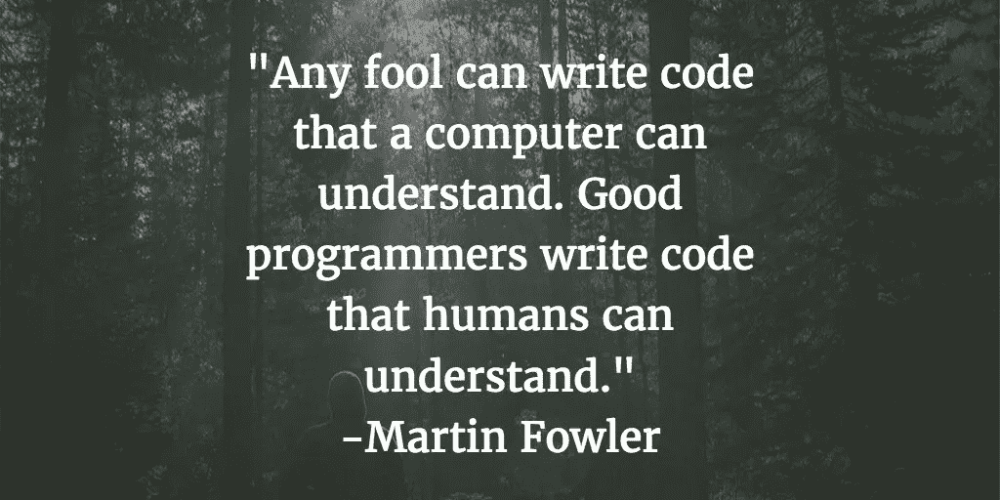
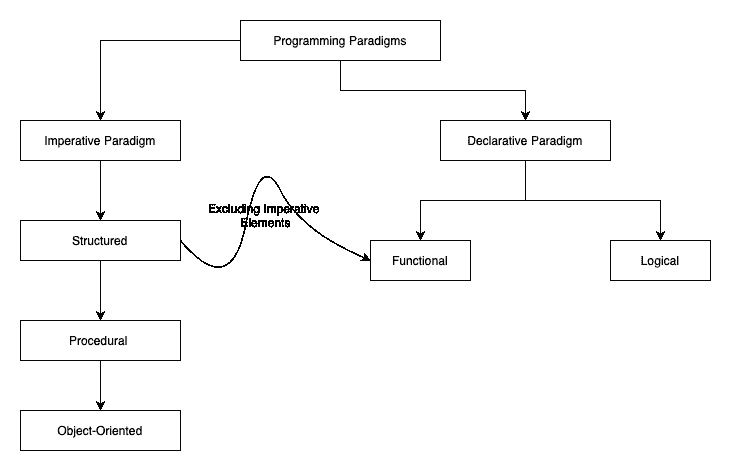

# 编程范例

> 原文：<https://medium.com/analytics-vidhya/programming-paradigms-cb560f5125a1?source=collection_archive---------3----------------------->

马库斯·斯皮斯克在 [Unsplash](https://unsplash.com?utm_source=medium&utm_medium=referral) 上的照片

## 什么是编程范例？

编程范式是编写程序的一种风格、技术或方式。我们也可以说编程范例是解决问题的各种方法。使用不同的范例解决同一个问题是可能的，就像从一个村庄到另一个村庄可能有多条路线。然而，某些类型的问题更自然地适合特定的范例。

## 为什么要研究它？

正如我们所知，编程范式是编写程序的不同风格，因此了解这些风格和技术将有助于我们根据问题选择正确的范式。**我认为每个程序员都应该知道不同的范式，因为学习一种语言就像学习一种特定语言的语法或句法，但另一方面，学习范式就像学习语言赖以建立的原则。**例如，当我们学习合并排序时，我们不仅仅是学习多一种排序技术。相反，我们学习分而治之的范式以及我们可以使用这种范式的地方。

几乎所有的高级计算机编程语言都支持用一种或多种范例编写程序，选择正确范例的决定权在程序员。例如，现在，汇编语言具有高级语言的特征。我们可以用面向对象的方式用汇编语言写一个程序。

有两种主要的编程范例，**命令式和声明式**，并且有几种范例受到这两种类型的影响。我将逐一介绍所有的主要范例。在这篇博文中，我们将关注命令式和声明式范例。让我们开始吧:

计算机程序是可以由中央处理器执行的一系列指令。这些指令是机器语言，是 0 和 1 的二进制形式。但是这些指令不是人类可读的格式；因此，它不容易理解，这限制了我们修复错误或修改现有程序的能力。

为了克服这个问题，我们创造了一种包含英语单词的汇编语言。我们称之为记忆术。汇编语言使用这些[助记符](https://en.wikipedia.org/wiki/Mnemonic)来表示每一条低级机器指令。请记住，**所有编程语言(包括汇编语言)的主要目的是提供底层机器架构的抽象。与机器语言相比，汇编语言易于修改和理解。比如我们可以在汇编中将机器码 10110000 01100001 写成 **MOV AL，61h** ，意思是*在 AL* 寄存器中加载 97 十进制(61 十六进制)。MOV 是此举的缩写。**

在上面的程序中，我们通知计算机下一步做什么，并指示改变它的状态(寄存器值)。这种编程风格被称为命令式编程风格。

命令式编程的根源深深植根于[计算机架构](https://en.wikipedia.org/wiki/Von_Neumann_architecture)。几乎所有计算机的硬件实现都是必不可少的。

# 命令式范式:

命令式编程风格**强调显式控制流**，它意味着语句、指令或函数调用的执行顺序。所以术语*显式控制流*意味着程序员本身明确定义了指令的执行顺序。命令式编程风格的主要特征是**赋值语句和全局变量**。

## 赋值语句:

命令式编程风格使用改变程序状态的语句。程序状态只不过是特定时间内存的内容。在计算机程序设计中，赋值语句设置或重新设置存储在由变量名表示的存储单元中的值。在大多数命令式编程语言中，如 C、C++、Java、Kotlin、PHP，赋值语句是一个基本的构造。例如，在下面的代码片段中，我们使用赋值操作符(=)初始化变量 a、b 和 total。

## 全局变量:

全局变量是具有全局范围的变量。 ***范围*** 指变量的可见性。就全局范围而言，它意味着变量在整个程序中都是可见的和可访问的。

## 类比:

我记得命令式编程风格使用了两个类比:

1.  假设你在餐馆里，在点菜的时候，你不仅仅是选择菜，你还向厨师发出如何准备菜的指令。
2.  把程序员当国王，把电脑当国王的军队。在命令式编程风格中，king 不仅给军队下达命令做一些动作，而且还指示如何执行这些动作。

简而言之，**步骤和序列**是**在命令式范式中明确给出的**。

一些范例受到命令式范例的影响，例如结构化范例、过程化范例和面向对象范例。C、C++、Java、Kotlin、PHP 是一些支持命令式范例的语言。我将在单独的文章中介绍这些范例。

# 声明性范例:

声明性范例是一种非命令式的编程风格。在声明式编程范例中，我们只告诉计算机问题是什么，让系统决定采取什么步骤以及这些步骤的顺序。这种行为与命令式风格形成对比，在命令式风格中，我们提到解决问题的所有步骤。

祈使句说怎么做，陈述句说做什么。换句话说，声明性编程表达了计算的逻辑，而没有描述它的控制流。以下是声明式编程方式的示例:

在上面的例子中，我们使用查询`select name from vegetables;`作为获取所有蔬菜名称信息的指令，我们没有告诉计算机如何获取这些信息。相反，我们只是描述了我们想要什么，而不是如何得到它。这种类型的编程风格被称为声明式编程范例。
有几种范式和语言受到声明性范式的影响，例如函数范式、逻辑范式和数据库。Prolog、SQL 是支持声明性范例的语言的几个例子。我将在单独的文章中介绍这些范例。

## 命令式与声明式范例:

在命令式范例中，程序员指导机器如何改变其状态。在声明性范例中，程序员只声明所需结果的属性，而不声明如何计算它。

在接下来的两篇文章中，我们将研究其他类型的范式，它们是这两种主要范式的形式。

关于语言的一个注意事项，**一些语言支持多范例编程**，例如，像 Java 这样的高级语言，Kotlin 支持以面向对象和函数的方式编写程序。

# 奖金:

我创建了下面的图表来帮助我理解范例的分类，让我知道你对它的想法。

在接下来的文章中，我们将详细介绍其他形式的命令式和声明式范例。

命令式范例:

 [## 编程范例:命令式

medium.com](/@shivam.gosavi340_58315/programming-paradigms-imperative-1472c4f08723) 

声明性范例:

 [## 编程范例:声明式

medium.com](/@shivam.gosavi340_58315/programming-paradigms-declarative-a6ee23ca8dc9) 

感谢你阅读这篇博客。我希望你喜欢这篇关于编程范例的文章，并且学到了一些新东西。如果你有任何建议或问题，请在下面的评论中添加，快乐学习👏。

# 我的更多信息:

 [## 揭开 Kotlin 数据类的神秘面纱

medium.com](/@shivam.gosavi340_58315/demystifying-kotlin-data-classes-a806f90368b3)  [## 揭开 URI 概念的神秘面纱

### 理解统一资源标识符(URI)概念的新系列文章。

medium.com](/@shivam.gosavi340_58315/demystifying-the-concept-of-uri-6dcc82fdeef5)  [## 生产力黑客

### 提高软件工程师生产力的一些技巧和工具。

medium.com](/@shivam.gosavi340_58315/productivity-hacks-200f235a0acc)