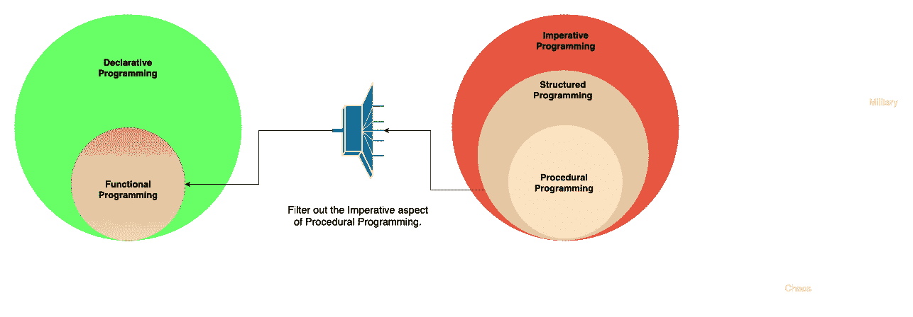

# 编程范例:声明式

> 原文：<https://medium.com/analytics-vidhya/programming-paradigms-declarative-a6ee23ca8dc9?source=collection_archive---------10----------------------->

马库斯·斯皮斯克在 [Unsplash](https://unsplash.com?utm_source=medium&utm_medium=referral) 上的照片

你好，

在[的第一篇博文](/@shivam.gosavi340_58315/programming-paradigms-cb560f5125a1)中，我们讨论了命令式和声明式范例。同样，在第二篇博文中，我们讨论了受命令式范式影响的范式。在这篇博文中，我们将讨论范例，也就是声明性范例的形式。如果你没有读过我以前的关于范例的博客，那么我建议你在深入之前读一读。
以下是受声明性范例影响的范例列表:

1.  功能范式
2.  逻辑范式

# 函数式编程:

函数式编程中的模块化和代码重用原则与过程式编程中的相同，因为它们都源于结构化编程。例如，过程类似于函数。两者都允许在程序的不同部分重用相同的代码。

这两种风格的主要区别在于，函数式编程语言删除了过程式编程的命令性元素。众所周知，赋值操作符和全局变量是命令式编程的两个主要方面。所以函数式编程不推荐使用赋值操作符和访问函数范围之外的变量。是的，你没看错，没有赋值操作符的编码。

这种方法的好处是，*没有赋值操作符=没有改变变量值=没有副作用*。但是我们知道，当我们做一些计算或应用一些逻辑时，我们需要变量来存储这些结果，那么我们如何在函数式编程中实现呢？。我们没有给变量赋值，而是将这些值作为输入参数传递给同一个或其他函数。

没有副作用意味着函数不会改变任何变量的值，这超出了它的范围。这种方法使系统保持在调用函数之前的状态。

换句话说，任何函数的输出只依赖于函数的输入，无论我们使用相同的输入参数调用函数多少次，每次函数都会返回相同的输出。只有当我们不访问/改变变量的状态时，这才是可能的，这超出了函数的范围。

让我们以一个计算前 n 个数之和的程序为例。在下面的代码片段中，函数 sum()改变了变量 total 的值，这超出了它的范围。不仅如此，初始值也会对变量 total 的最终值产生影响。因此，函数 sum 并不总是产生相同的结果，即使我们向它传递相同的输入。

图 1.1

看完上面的例子，你可能会想，伙计，你说过没有赋值操作符，对吗？。是的，但那是过程式编程风格，在其中使用赋值操作符是可以的。以下是函数式风格的示例:

使用函数式编程风格。

没有助理操作员，没有保存状态。不使用循环。很好，不是吗？

函数式语言的特性是为支持纯函数编写程序而设计的。在函数式编程中，我们使用函数递归而不是循环来遍历值集。大多数函数式编程支持高阶函数、lambda 函数、匿名函数、闭包、函数递归等特性。赋予功能更多的权力。

# 函数式编程的特点:

大多数函数式编程语言支持以下特性:

## 高阶函数:

[高阶函数](https://en.wikipedia.org/wiki/Higher-order_function)是既可以接受其他函数作为参数，也可以返回一个函数作为结果的函数。

## 一流的功能:

函数是函数式编程中的一等公民，这意味着对它们的使用没有限制。它们可以出现在程序中的任何地方，就像数字等其他一级实体一样。例如，我们可以将一个函数赋给一个变量，将其作为参数传递给其他函数，并可以将它们用作函数的返回值。

## 递归:

函数式语言中的迭代(循环)通常是通过递归实现的。递归函数调用它们自己，它不断重复，直到到达基本情况。

## 懒评:

惰性计算不计算函数参数，除非需要它们的值来计算函数调用本身。

## 参考透明度:

函数式程序是引用透明的，这意味着任何变量都可以用它的实际值替换。这消除了任何副作用的可能性，因为变量的值一旦定义就永远不会改变。

赋值语句从来都不是引用透明的，这也是函数式编程中不提倡使用赋值语句的原因之一。考虑下面的例子，这里变量 total 的初始值是 0，但是我们不能用它的值替换变量 total 的所有出现，即 0，因为它在每次迭代时都被赋予新的值。因此，我们可以说下面的程序是不透明的。

现在，考虑下面的例子，我们可以用它的值代替 n 的所有出现，因为它在整个程序中不会改变。所以，我们可以把下面的程序称为引用透明的。

## **函数式编程与程序式编程:**

在过程式编程中，程序的执行是一系列命令性的命令，这些命令可能会隐式地改变共享状态(上例中的变量 total(图 1.1)是共享的)。

在函数式编程中，程序的执行是对复杂表达式的求值，这些表达式只在输入参数和返回值方面相互依赖。由于这个原因，函数式程序可以有一个自由的代码执行顺序。此外，函数之间没有共享的元素/状态，这意味着它们可以独立使用而不会相互影响。当涉及到并发和多线程编程时，这种方法是有益的。

# 逻辑编程:

在编程的逻辑风格中，首先，我们定义一些已知的事实和规则，使计算机意识到问题域。然后，当我们向计算机提出查询时，它会根据最初给定的事实和规则进行一些逻辑推理，并返回我们问题的解决方案。逻辑编程语言包括 Prolog、answer set programming (ASP)和 Datalog。

逻辑范式采用声明式方法来解决问题。在逻辑编程中，我们有各种各样的逻辑断言，它们的执行是使用一个模型生成器来完成的，它的行为不受程序员的控制。我们可以使用以*子句形式编写的规则创建逻辑断言，在下面的序言示例中，H 是 head，B 是 body:*

> H :- B。
> 
> 诗人(X) :-人类(X)。

我们这样理解——如果 X 是人，那么 X 就是诗人。

事实是没有主体的规则，以简化形式写成:

> H.
> 
> 动物(猫)

我们把这理解为——猫是一种动物。

以下是教计算机山姆喜欢吃什么和不喜欢吃什么的示例规则。

就像计算机知道山姆的好恶一样，现在我们可以问这样的问题，山姆是否喜欢 paneer_tikka？

> ？-喜欢(sam，paneer_tikka)。
> 
> 没错。

我们还可以查询 sam 喜欢使用的所有菜肴:

> ？-喜欢(山姆，X)。
> X = paneer _ ti kka；
> X =烙饼；
> X =面条；
> X =客家 _ 面条；
> X =披萨；
> X =意大利面；

看，我们只是让计算机给我们 X 的值，但是我们没有告诉计算机如何得到 X 的值，这是一种声明式的编程方式。

感谢你阅读这篇博客。我希望您喜欢这个关于[编程范例](/analytics-vidhya/programming-paradigms-cb560f5125a1)的系列文章，并且学到了一些新东西。如果你有任何建议或问题，请在下面的评论中添加，快乐学习👏。

# 我的更多信息:

 [## 编程范例

### 什么是编程范式？

medium.com](/@shivam.gosavi340_58315/programming-paradigms-cb560f5125a1)  [## 揭开 Kotlin 数据类的神秘面纱

medium.com](/@shivam.gosavi340_58315/demystifying-kotlin-data-classes-a806f90368b3)  [## 揭开 URI 概念的神秘面纱

### 理解统一资源标识符(URI)概念的新系列文章。

medium.com](/@shivam.gosavi340_58315/demystifying-the-concept-of-uri-6dcc82fdeef5)  [## 生产力黑客

### 提高软件工程师生产力的一些技巧和工具。

medium.com](/@shivam.gosavi340_58315/productivity-hacks-200f235a0acc)