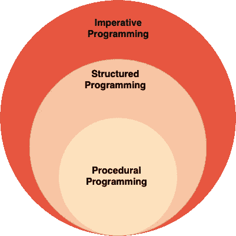

# 编程范例:命令式

> 原文：<https://medium.com/analytics-vidhya/programming-paradigms-imperative-1472c4f08723?source=collection_archive---------8----------------------->

马库斯·斯皮斯克在 [Unsplash](https://unsplash.com?utm_source=medium&utm_medium=referral) 上的照片

你好，

在[之前的博客文章](/@shivam.gosavi340_58315/programming-paradigms-cb560f5125a1)中，我们详细讨论了命令式和声明式范例。在这篇博文中，我们将讨论受命令式范式影响的范式。如果你还没有读过我之前关于范式的博客，那么我建议你在继续深入之前读一读。
以下是受命令式范例影响的几种范例:

1.  结构化范例
2.  程序范式
3.  面向对象的范例

# 结构化编程:

结构化编程是一种使用结构化控制流(无 goto)来提高代码清晰度和质量的编程范式。

结构化编程有三种组合程序的方式——**排序、选择和迭代**。

这种范式大量使用了**块结构**(排序) **if/else** (选择)，以及 **while or for 循环**(重复)。Edsger W. Dijkstra 在他关于[Go To Statement behaviour](https://en.wikipedia.org/wiki/Go_To_Statement_Considered_Harmful)的公开信中创造了结构化编程这个术语。

例如，在下面的代码片段中，我们使用 For 循环来迭代代码:

结构化编程也是命令式编程的一种形式，因为我们明确地*循环* (for，while，repeat)并且*在每个循环中用明确的赋值操作改变变量*。结构化语言的例子有 C、C++、Java、PHP 等。因为这些语言支持**测序、选择和迭代**的特性。

## 结构化编程的优势:

以下是结构化编程的一些好处:

*   代码组织得很好。
*   我们可以重复执行一段代码，直到给定的条件匹配。
*   提高决策能力。基于某些条件，我们可以决定是否执行任何代码块。
*   使用 if/else 和 for/while 的结构化执行流。这与[非结构化编程](https://en.wikipedia.org/wiki/Non-structured_programming)形成对比，后者使用 [goto](https://en.wikipedia.org/wiki/Goto) 语句或等效语句，使用非结构化跳转到标签或指令地址。

# 程序编程:

过程化编程范例**是从结构化**编程中派生出来的。它基于过程调用的概念。过程也称为例程、子例程、方法或函数。

一个过程包含一系列耦合在一起的指令。我们可以在程序执行的任何时候调用任何过程。

计算机处理器通过[堆栈寄存器](https://en.wikipedia.org/wiki/Stack_register)和指令[调用程序](https://en.wikipedia.org/wiki/Subroutine#Jump_to_subroutine)并从中返回，为程序编程提供硬件支持。

大多数过程编程语言本质上都是命令式的，因为它们明确引用了执行状态。下图说明了命令式结构化程序范例之间的关系。

过程编程与结构化和命令式编程的关系。

让我们以一个计算前 n 个数总和的程序为例。我们可以用过程式编程风格编写代码，如下所示:

使用过程式编程风格

这里我们把程序分成了两个功能。main()充当执行的入口点或起始点，sumOfFirst()计算前 n 个数的相加。

分离计算总和的逻辑的主要优点是，我们现在可以重用具有不同输入值的相同代码块。注意这里的命令式；当我们遍历给定的数字范围时，我们使用赋值操作符来更新变量 total 的值。

过程语言的例子有 C、C++、Java、Kotlin、PHP 等。因为这些语言支持函数、方法、过程。使用函数，我们可以将复杂的问题分解成更小的子问题。

## 过程化编程的优势:

以下是过程化编程的一些好处:

*   代码变得可重用。
*   编写模块化代码是可能的；这催生了另一个范例，即[模块化编程](https://en.wikipedia.org/wiki/Modular_programming)。
*   跟踪控制流更容易。

# 面向对象编程:

面向对象的编程范例基于**对象的概念。**对象可以是任何现实世界的实体。一个对象有数据(属性、变量)和行为(方法)。面向对象的范例通过支持抽象、封装、继承、多态等特性，将编程带到了一个新的高度。

有两种类型的面向对象编程——一种是基于类的，另一种是基于原型的。

## 基于类别:

在[基于类的语言](https://en.wikipedia.org/wiki/Class-based_programming)中，预先定义了*类*，基于类实例化了*对象*。例如，如果我们想要创建两个新对象，一个表示苹果*另一个表示桔子*，*，那么首先我们需要创建水果类*。然后*我们可以创建水果类的两个实例(对象)，一个用于苹果，另一个用于橘子*。**

在基于类的语言中，对象是类的实例。Java 支持基于类的编程。

## 基于原型:

在[基于原型的语言](https://en.wikipedia.org/wiki/Prototype-based_programming)中，*对象*是主实体，其中不存在*类*。我们基于已经存在的对象创建新对象。这些已经存在的对象充当新对象的原型。

例如，如果我们想要创建两个新对象，一个表示苹果的*，另一个表示桔子*的*，那么首先我们需要创建一个水果对象*。然后*我们可以从水果对象*创建两个对象。*在这里，水果对象充当苹果和桔子对象的原型。*

委托是一种支持基于原型编程的语言特性。JavaScript 支持基于原型的编程。

## 面向对象编程的优势:

以下是面向对象编程的一些好处:

*   抽象:隐藏实现细节。一般来说，抽象是通过抽象类和接口实现的。
*   封装:就是将实现(代码)和它处理的数据(变量)封装在同一个类中。这是通过使用访问修饰符如 public、private 和 protected 来实现的。
*   继承:这是一种从现有类(基类或父类)创建新类(子类)的方法。这种机制使得代码可以重用。因为派生类获得了基类的所有功能，并且它还允许在不修改现有源代码的情况下扩展基类的功能。
*   多态性:我们可以有一个方法，根据使用它的上下文，它有不同的行为。我们可以使用方法重载和方法覆盖来实现这一点。

# 延伸阅读:

声明性范例:

 [## 编程范例:声明式

medium.com](/@shivam.gosavi340_58315/programming-paradigms-declarative-a6ee23ca8dc9) 

感谢你阅读这篇博客。我希望你喜欢这篇关于命令式范例的文章，并且学到了一些新东西。如果你有任何建议或问题，请在下面的评论中添加，快乐学习👏。

# 我的更多信息:

 [## 编程范例

### 什么是编程范式？

medium.com](/@shivam.gosavi340_58315/programming-paradigms-cb560f5125a1)  [## 揭开 Kotlin 数据类的神秘面纱

medium.com](/@shivam.gosavi340_58315/demystifying-kotlin-data-classes-a806f90368b3)  [## 揭开 URI 概念的神秘面纱

### 理解统一资源标识符(URI)概念的新系列文章。

medium.com](/@shivam.gosavi340_58315/demystifying-the-concept-of-uri-6dcc82fdeef5)  [## 生产力黑客

### 提高软件工程师生产力的一些技巧和工具。

medium.com](/@shivam.gosavi340_58315/productivity-hacks-200f235a0acc)