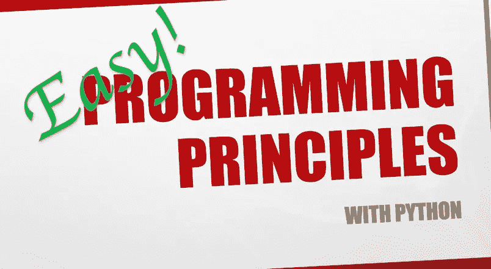

# Python 编程入门，第 1 课

> 原文：<https://medium.com/analytics-vidhya/programming-principles-with-python-lesson-1-e63d6952dffb?source=collection_archive---------23----------------------->

算法简介

## 介绍

作为一名大学教授，我教授编程课程已经超过 10 年了。本人拥有德国海德堡大学博士学位，30 多年编程经验。

媒体上这些故事的想法不仅仅是给出一些语法和基础…