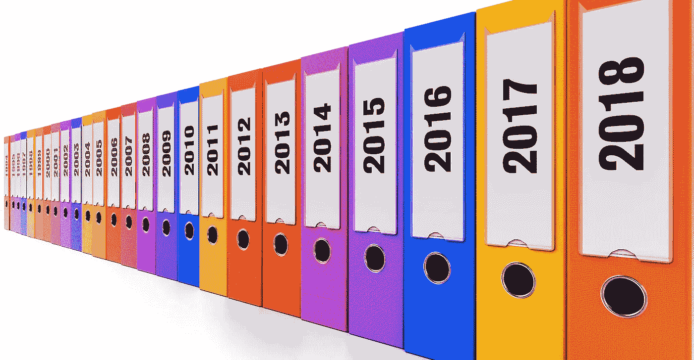

# 使用 SQLite 在 Python 中进行数据库编程

> 原文：<https://medium.com/analytics-vidhya/programming-with-databases-in-python-using-sqlite-4cecbef51ab9?source=collection_archive---------1----------------------->

图片来源:Pixabay

> 如果你渴望成为一名数据科学家，你将会与大量数据打交道。大部分数据驻留在数据库中，因此您应该能够轻松地通过查询访问数据库中的数据，然后对它们进行处理以找到关键的…