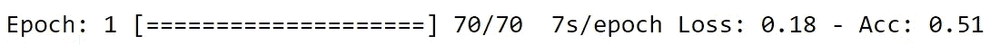
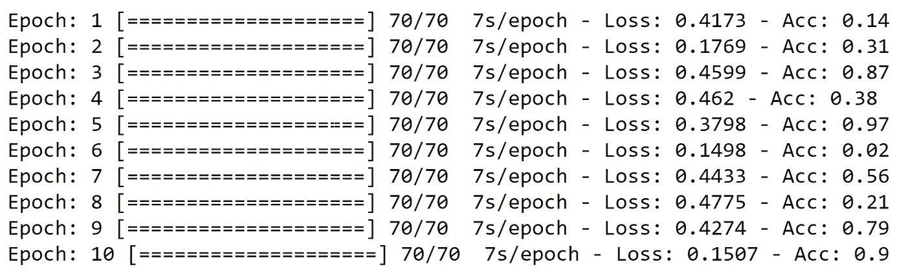

# 简单的进度条——在几秒钟内集成任何 python 项目

> 原文：<https://medium.com/analytics-vidhya/progress-bar-python-for-jupyter-notebook-f68224955810?source=collection_archive---------15----------------------->

照片由[潘卡杰·帕特尔](https://unsplash.com/@pankajpatel?utm_source=medium&utm_medium=referral)在 [Unsplash](https://unsplash.com?utm_source=medium&utm_medium=referral) 上拍摄

为什么需要进度条？是的，有时候你需要监控任务的进展。大多数时候，我发现从头开始构建进度条有问题。有时一个非常基础的就能完成工作，但并不总是如此。你用过 Keras(Python 的机器学习 API)吗？它有自己的自定义进度条，可以很好地展示训练。当我开始用 PyTorch 工作时，我感觉缺少了一些东西，因为每次我都需要建立一个进度监视器。所以，我决定建立一个包，一个简单的包，但是可以很容易地做很多事情。

今天，我将指导你如何使用我的进度条。你可以在我的 [GitHub](https://github.com/tarunk04/progress-bar-python) 库上找到文档和包。我试图让事情变得简单和直观。

您可以将它用于许多不同的用途，但我是为了用 PyTorch 进行进度监控而构建的。

# 装置

只需要一个文件`progress.py`进入你的工作目录。从 [GitHub](https://github.com/tarunk04/progress-bar-python) 获取文件。

**注意:我将很快通过 pip 安装提供 python 包。**

# 如何使用

我将通过两个简单的例子来解释。更多文档可以在我的 [GitHub](https://github.com/tarunk04/progress-bar-python) 上找到。

1.  **例 1:** 假设你需要处理图像，你有 2478 张图像要处理。让我们看看如何制作一个简单的进度监视器，如下图所示。

选项 1

选项 2

选项 1 的代码

设置进度条需要几个步骤。创建一个进度条对象，根据需要创建不同的元素实例，编译所有元素，并在需要的地方使用编译后的进度条。

第 6 行:创建一个进度条的实例。模式可以是`bar`和`no-bar`。

第 9 行:按照这个例子的要求创建一个元素。元素的第一个参数是为进度监视器显示的名称，第二个参数是元素的初始值。

**对于选项 2:** 你只需要这样添加元素参数。`counter = P.Element("Images Processed", max_value=images, value_display_mode=1)`

阅读文档了解更多关于 [GitHub](https://github.com/tarunk04/progress-bar-python/) 的参数。

编译非常简单，就像按顺序堆叠元素一样。还有一点需要注意，你可以在元素栈之间**添加**一个**自定义字符串**。您可以从如下所示的两种不同语法中进行选择:

`p = p(Element1)(Element2)...("String is also allowed")...(ElementN)`

运筹学

`p = p + Element1 + Element2 + ...+ "String is also allowed" + ...+ (ElementN)`

**第 12 行:**编译单个元素。

现在，您已经准备好将定制的进度监视器插入到您的应用程序中来跟踪进度。只是你需要在使用它之前初始化进度条，然后在每一步更新它。

更新元素的值也非常容易，只需遵循语法`Element1(updated_value)`。在更新了所有元素的值之后，您需要渲染进度条来显示更新后的值，这可以通过调用`p.update(step =1)`来完成。就是这样。

2.**例 2:** 假设你想在 PyTorch 中创建一个训练进度的进度条。因此，让我们创建一个进度条，如下例所示。

首先，决定你需要什么元素。

元素:

1.  纪元(跟踪每个纪元)
2.  条形图(预定义元素)
3.  批次(每个时期中批次的进度)
4.  ProgressTime(预定义元素)(每个时期的时间)
5.  损失(跟踪培训期间的损失)
6.  Acc(在培训期间跟踪准确性)

看代码，试着理解它。大部分事情和以前一样，但有几件事我还没有讨论过，我将会谈到。

创建元素和编译进度条。

看到第 1 行中的模式已经更改为`bar.`这里我定义了 6 个元素(4 个自定义元素和 2 个预定义元素)。Bar 和 ProgressTime 元素是预定义元素，如示例代码所示。Bar 元素也可以接受一些参数，查看 GitHub 上的文档。ProgressTime 只接受一个参数`postfix`任何你想在时间之后添加的字符串，否则留空。

编译部分与前面的例子相同。您可以通过调用`p.get_format()`来检查编译后进度条的最终格式。

初始化和更新进度条(进度条正在使用中)

决赛成绩

在这一部分，除了**第 23 行，其他都一样。**如果您不设置新的光标位置，新时代的进度将被旧时代的进度覆盖。如果您想保存每个时期的进度，那么您需要在每个时期完成后调用`p.set_cursor_postion()`。

好了😎。希望这篇帖子对你有帮助。如果你觉得我的工作有帮助，请分享。

# 完整的代码和文档

在我的 GitHub 上找到完整代码:【https://github.com/tarunk04/progress-bar-python/ 

# 反馈

今天的帖子到此为止，如果你有任何问题，请在评论中告诉我。此外，如果你发现任何错误，请写信给我在 tarun12.tarunkr@gmail.com。

如果你想让我在接下来的帖子中涉及一些特定的话题，请在评论中告诉我。

关注:

*   我在 GitHub 上有更多这样的项目
*   我在 [Kaggle](https://www.kaggle.com/tarunk04) 上。

感谢您抽出时间阅读本文。喜欢请分享。

**我正在寻找拥有不同技能的人来建立一个封闭的社区，这样我们就可以一起打造令人惊叹的产品。如果你有兴趣，请在 Linkedin 上联系我或给我发邮件**