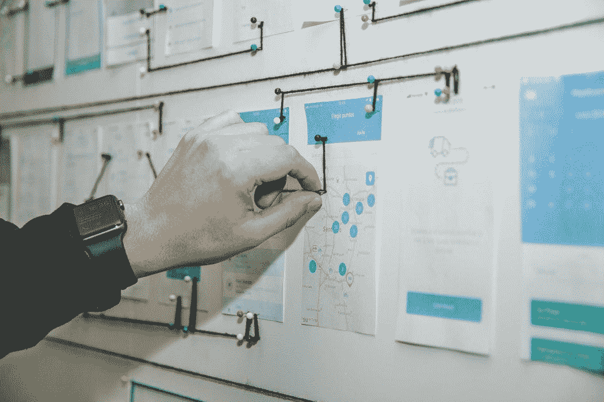

# 带有 R 的项目管理工具

> 原文：<https://medium.com/analytics-vidhya/project-management-tools-with-r-7f5fcacb2d4?source=collection_archive---------5----------------------->

## r 代表工业工程师

## 利用 R 包进行有效的项目管理

阿尔瓦罗·雷耶斯的图片可在 [Unsplash](https://unsplash.com/photos/qWwpHwip31M) 获得

# 项目管理与六适马

根据项目管理协会( [PMI](https://www.pmi.org/about/learn-about-pmi/what-is-project-management) )的说法，一个项目是“临时性的，因为它在时间上有明确的开始和结束，因此也有明确的范围和资源”。在同一个…