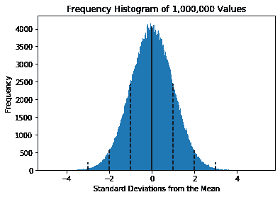
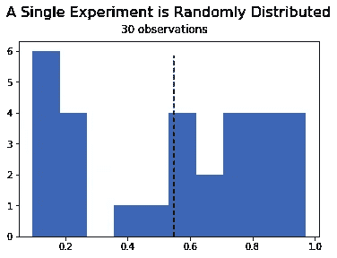
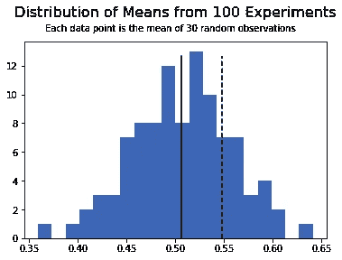
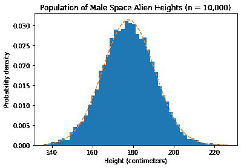
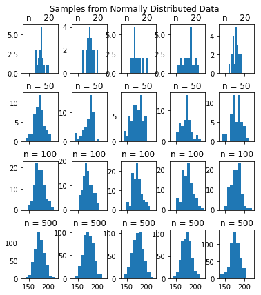
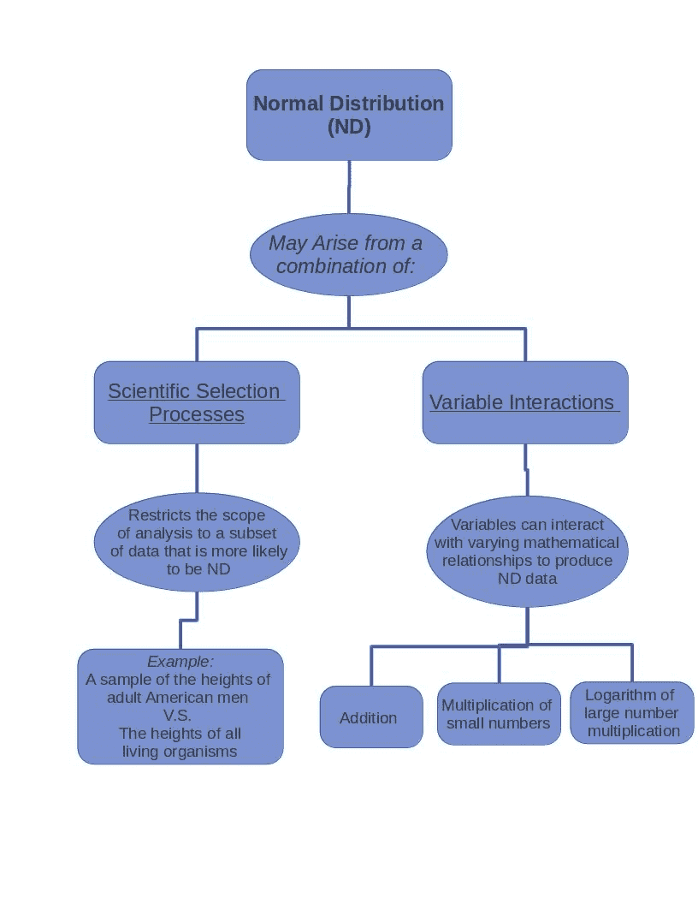
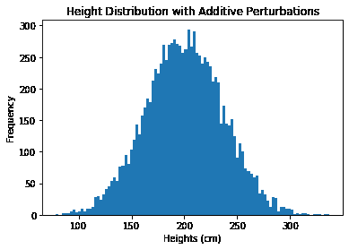
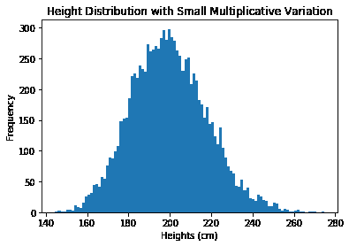
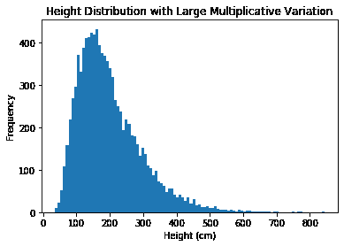
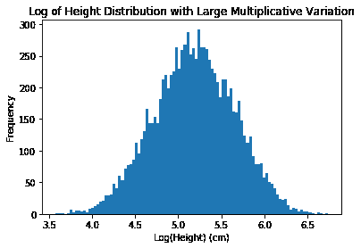

# 正态分布的性质

> 原文：<https://medium.com/analytics-vidhya/properties-of-the-normal-distribution-7f5e04e57102?source=collection_archive---------9----------------------->

*用 Python 进行实际实验*


强大的乔戈里峰。

**简介**

正态分布(ND)，也称为高斯分布，是统计学中的一个基本概念。它是所有分布类型中最常观察到的，并且存在于几乎每个研究领域。

如果发现数据呈正态分布，就可以利用数据的重要质量，如平均值和标准差。常态是一整类统计假设检验的基础。此外，通过检查正态分布的残差，可以确认模型已经符合所有可用的解释性可变性。

ND 的概念也以数据标准化的形式应用于模型训练，其中数据被强制具有 0 的平均值和 1 的标准偏差。这通常会提高模型的性能，方法是调整数据参数，使其具有相同的均值和标准差。这允许所有变量同等地影响输出，并使模型更容易学习正确的东西。

数据规范化对深度学习领域尤为重要，它可以显著减少训练时间，提高模型的性能[ [1](https://www.zotero.org/google-docs/?Pc1lTL) ]。

本文描述了正态分布的性质，样本大小的影响，以及不同来源的方差如何产生 nd 数据。使用用 Python 编写的实际实验来描述概念(所有代码都可以在这里[找到](https://github.com/jsolson4/Properties-of-the-Normal-Distribution))。

**集中趋势&分散趋势**

当连续数字数据呈现对称的钟形曲线时，观察到正态分布(**图 1** )。这条曲线可以用两个参数来表征:*集中趋势*和*分散*。

在图 1 的**中，我们可以看到数据的分布是这样的，大部分值都集中在中心附近。这种特征被称为*集中倾向。*对于完美的高斯分布，集中趋势的度量(均值、中值和众数)都相等，但均值是最常用的描述符。**



**图 1** : *一个高斯分布和均值的标准差。*该直方图通过从均值= 0(实线垂直线)和标准差为 1(最高虚线)的高斯分布中随机采样一百万个值而生成。中虚线和短虚线分别表示 2 和 3 个标准偏差。对于我们随机生成的数据，68.3%的值落在 1 个标准差内，95.5%落在 2 个标准差内，99.7%落在 3 个标准差内。

D *方差*或*方差*描述了值的频率随着偏离中心而逐渐变小的趋势。离平均值越远，出现的值就越少。这些值关于平均值对称，因此对于图 1 的**平均值处的垂直折叠，平均值两侧的频率将匹配。这允许我们可预测地估计远离平均值的任何距离的值的频率，并且期望平均值两侧的值的频率相等。**

当数据呈正态分布时，我们确信均值和标准差完全描述了数据的分布。进一步的分析，如参数测试，可以使用平均值作为组间比较的基础。

**中心极限定理**

中心极限定理(CLT)是正态分布有用性背后的驱动力。许多概率和统计方法都假设数据来自正态分布的总体。通常，人们通过评估他/她的数据的分布来检查这一点。如果数据是 ND，可以使用一整套有助于数据分析的统计方法。然而，如果你曾经处理过真实世界的数据，你会注意到数据很少是完全正常的。

CLT 在正态假设中引入了灵活性，使得假设数据来源于 ND 更容易，并且使人们能够更经常地使用那些统计方法(提供足够的样本量)。

CLT 说，当一个人有足够的数据时，样本均值的分布将接近正态分布[ [2](https://www.zotero.org/google-docs/?nh8eqq) ]。让我们尝试用代码来验证这一点。



**图 2:** 单个实验 30 次观测的结果。样本是从 0 到 1 的随机分布中产生的。



**图 3:**100 个实验的平均值分布，每个实验包含 30 个观察值。样本是从 0 到 1 之间的值的随机分布中产生的。实线是所有 100 个平均值的平均值。虚线是单次实验的平均值，如图 2 所示。

假设有人进行了一项实验，并计算了结果的平均值。这里的唯一标准是，科学家收集了足够数量的数据点，使平均值成为集中趋势的良好度量。在本例中，使用了 30 个样本，并计算了这些观察值的平均值(**图 2** )。

很明显，这个实验的数据是非正态的。

现在想象这个实验被重复 100 次，这样科学家收集了平均值的分布。CLT 规定样本均值的分布应接近正态分布。在**图 3 中，**人们可以观察到这是真的。

有趣的是，正态分布正在生成，尽管分布的基础是随机的。

人们可以把单个实验的平均值看作是来自平均值的分布。如果知道平均值的分布，就可以预计任何一个实验的平均值都落在所有实验平均值的分布范围内。此外，考虑到单一平均值更有可能落向分布的中心(落向平均值)，人们可以建立他/她期望单一平均值落在哪里的期望。在**图 3** 中，可以观察到独立实验的平均值(虚线)落在平均值的分布范围内，并且合理地接近平均值(实线)。

人们也可以从不同的角度来思考这个问题。如果有一个样本均值(从足够多的数据中生成)，就可以计算出总体均值分布的估计值。更正式地说，这意味着人们可以测量总体均值估计的精度。

我们关于中心极限定理的发现的含义是:

*   当数据不是完全正态时，CLT 允许进行参数假设检验。如果数据不是完全 ND，意味着它是偏斜的、有异常值、多峰值或不对称的，人们仍然可以使用参数统计测试来评估假设(提供足够的样本量，通常 n ≥30)[ [4](https://www.zotero.org/google-docs/?61MVa1) ]。
*   它允许人们用一个样本来估计整个人口的平均值。由于随着样本大小的增加，样本均值成为对总体的更好估计，**CLT 允许人们评估该总体均值估计的精度[**[**3**](https://www.zotero.org/google-docs/?MDpPXm)**]。**

这意味着，如果数据集通过了正态测试(checkout scipy.stats normaltest)，那么大量不同的参数(与非参数)统计测试方法可以应用于基于频率的假设测试和评估。测试差异、相似性和相关性，以及统计学家评估效应证据的方法(如置信值、效应大小和有争议的 p 值)，以确定统计显著性和以后的科学重要性。

**样本大小对正态曲线的影响**

想象一个拥有正态分布数据的完美世界。这个群体的样本是什么样的？样本大小与这些样本的分布有什么关系？这将通过对外星男性身高的假设研究来探索。数据集包含了宇宙中所有 10，000 名外星男性的身高。在**图 4** 中可以观察到高度的分布，很明显是高斯分布。



**图 4:** *异族男性高地人口呈正态分布。*一万个外星男性身高和各自概率密度(y 轴)的直方图。使用 numpy.random.Normal()生成 10，000 个值，以生成 10，000 个平均值为 177.8 厘米、标准偏差为 12.7 厘米的值。红色虚线是最佳拟合线。

从外来人口中抽取的样本可以评估样本大小对样本分布的影响:



**图 5:** *样本分布的形状随着样本量的变化而变化。*从 10，000 个伪随机生成的高度(平均值:177.8 厘米，标准差:12.7 厘米)总体中采样的具有 *n* 个值(20、50、100 和 500)的数据直方图。在每个样本量下取五个样本，并按行排列。这个数字的灵感来自奥特曼&布兰德【8】的作品。

考虑样本大小对观察分布的影响(**图 5** )。在较小的样本量下，许多分布看起来不像高斯分布。即使 n=100，分布也不是一致的高斯分布。这可能会让人怀疑某个样本是否正常。

当数据的分布导致人们质疑正态性假设时，人们可以用非参数方法进行假设检验。这些方法是“无分布的”，这意味着它们不假设数据遵循任何特定的分布。用于组间比较的不是*平均值*，而是*中位数*。

在参数方法不能使用的情况下，可以使用非参数方法，包括当结果是等级或有序尺度时，当存在极端异常值时，以及当使用不精确的方法进行测量时。

非参数检验对数据分布的假设较少，但这是有代价的。它们的功能通常不如它们的参数对应物，如果数据是正态分布的，那么最好使用后者。

在小样本预测建模的情况下，可以考虑基于树或基于神经网络的方法，因为它们不对数据的基本分布做出任何假设。

**调查高斯分布的流行程度**

高斯分布是最常见的分布类型，因为自然界中产生高斯分布的过程比产生其他分布的过程多。它们流行的一个原因是科学选择过程倾向于选择正态分布，因为变量可能以多种方式相互作用以产生正态分布(**图 6**



**图 6:** 两种方式*高斯分布可以出现* **。**高斯分布可能源于科学选择过程和变量相互作用的结合。科学的选择过程包括制定一个假设，一个将数据范围从许多可能的值内在地限制到一个选定的感兴趣的群体的过程。这种数据子集的选择消除了一些混乱，使其更有可能观察到正态分布。可变相互作用是将可变性引入数据的所有扰动，导致高度、反应时间或任何现有现象的变化。变量可以通过多种方式进行交互以生成正态分布的数据，包括通过加法、乘法以及两者的组合进行的交互。

**方差的作用**

数据几乎总是有差异的。我们并不都一样高(身高有差异),因为有一些潜在的过程影响身高，导致身高的差异。方差的常见来源包括我们的解释变量、解释变量之间的相互作用、随机性和测量误差。

以成年人的身高为例，身高的差异可能源于遗传影响、年龄、发育期间的营养状况、测量个体的时间(由于脊柱受压，一个人的身高在一天中会略有下降)、测量误差。

不管是哪种情况，数据中几乎总是存在差异。高斯分布可以在各种*不同的*过程下产生，这些过程产生方差，这是它们流行的一个原因。

集中趋势(平均值)是由被抵消的变异产生的。正态分布如此普遍的原因之一是，对于给定的现象，通常有许多方差来源。这使得一些差异可能会相互抵消，留下几乎没有差异的“中性”数据点。这些数据点将集中在中心，构成平均值。

同样，尾部的数据点出现的频率较低，因为它们需要大量的方差，并且都指向同一方向。将一个值放在均值的最左边，要求影响该值的大多数变化必须减少该值，任何增加方差的影响都会将该值推离尾部并回到均值。

关于方差如何创建正态分布的直观描述，请参见这篇姊妹文章:[通向中心的多条路径:*方差如何交互创建正态分布*](https://medium.com/p/371fe36cf0fe/edit) *。*

**正常从加法**

具有加性效应的过程可以相互抵消，产生正态分布的样本总和[6]。

为了说明这个过程，想象我们正在研究美国成年男性的身高。假设我们有一万个成年男性身高的样本。如果没有任何外界影响，这些男性的身高都将是 200 厘米。

还可以想象有十个影响身高的变量，每个变量都以累加的方式增加或减少身高。十个变量中的每一个都将是一个在-10 cm 和+10 cm 之间随机生成的数字(注意这些变量不是从 nd 中生成的)。因此，任何给定的高度都可以计算为 200 厘米加上 10 个随机产生的附加扰动的总和。

为了生成高度分布，上述过程将执行 10，000 次，代码片段如下:

```
# Conduct the following loop 10,000 times:
for _ in range(10000): # the baseline height is 200 cm
    baseline_height = 200 # randomly sample 10 values between -10 & 10 (inclusive)
    height_perturbations = np.random.uniform(-10, 10, 10)

    # total = baseline + perturbations
    total_height = baseline_height + height_perturbations.sum() 

    # add new height to list of heights
    heights.append(total_height.round(2))
```

由附加扰动产生的 10，000 个高度的最终分布:



正如我们在上面看到的，当随机变量以相加的方式相互作用时，结果接近正态分布。这是因为我们通过一系列随机正数和负数的总和(我们的方差)来调整我们的基线高度(200 cm)。我们看到平均值 200(我们的基线)左右的值，因为方差倾向于完全相互抵消。但是，它们并不总是互相抵消，这就是为什么价值观围绕着平均值。

**小乘法效应的正常**

现在想象上述实验中的十个变量通过乘法而不是加法相互作用。这种影响将被称为“小乘法”，这意味着我们将乘以仅略微改变基线值的值。将使用 0.95 和 1.05(含)范围内随机产生的变化。这些微小的变化会干扰基线高度，但不会以剧烈的、完全不合理的方式改变它们。

示例代码:

```
# Conduct the following loop 10,000 times:
for _ in range(10000):
    baseline_height = 200
    height_perturbations = np.random.uniform(0.95, 1.05, 10) 
    total_height = baseline_height * height_perturbations.prod()
    heights.append(total_height)
```

在这些条件下，最小和最大可能高度分别约为 120 和 326。虽然可能值的范围在平均值周围不平衡，但这些值仍然在高度的可能范围内。

将上述条件模拟 10，000 次，数据产生以下分布:



结合小乘法效应的过程近似于正态曲线。这是因为将小效果相乘类似于加法。

*例如:*

```
200 + 10 = 210200 * 1.05 = 210
```

所以小的随机效应会产生类似于正态分布的东西。然而，由于复合乘法效应，曲线并不完全对称。

**正常从大乘法效果**

同样的实验将再次进行。这次将探讨 10 个大乘法效应(0.75 到 1.25 之间的效应)对身高的影响。

上面的直方图表示结果高度，而下面的直方图表示对数变换的高度。



显而易见，大的乘法效应扭曲了高度分布，产生了较高频率的低于平均值的值。高于平均值的值不太密集，并且延伸到更远的范围。这种变化是由于复合乘法效应，导致指数衰减和增长(像复利)。如此巨大的倍增效应可以复合，产生一个更大的数字。而缩小原始高度的乘法效果似乎随着数字缩小而对该值的影响减小。这也可以在小乘法效应的直方图中观察到，尽管程度小得多。

**科学选择过程中会出现正态分布**

上述方法描述了随机变量相互作用产生正态曲线的不同方式。但是，还有另一个过程会产生具有重要影响的正态分布数据。

科学假说极大地影响了我们数据的性质。正态性也可以从实验条件中出现，实验条件限制了数据的范围[7] ***。*** 例如，人的身高往往呈正态分布，因此，如果一项关于美国成年男性身高的假设发现身高呈正态分布，也就不足为奇了。

现在想象一下研究所有生物的高度，这是 j .西蒙首先考虑的[7]。这样的研究可能包括许多生物，包括蚂蚁和长颈鹿。在我们开始数据采集过程之前，需要做出许多决定。什么算活着？病毒？人类是由真核细胞组成的生命体。那 200 多种不同的细胞类型呢？肠道细菌？一个人如何测量真菌的高度，是测量生物体的跨度好还是从地面开始？

当阐明一个科学假设时，许多额外的问题随之而来。这些问题会影响数据的性质。把分析范围扩大到所有生物，就不太可能发现高度呈正态曲线。科学家通过限制问题的方式选择和调整假设，使正常曲线更有可能出现。或者，有时可用数据的限制导致这种情况发生。但是要点是 ***实验设计能够并且确实影响数据的性质。***

**结论**

正态(高斯)分布有两个特征:集中趋势和方差。中心极限定理，nd 背后的驱动力，允许我们使用参数统计测试，即使数据不是完全正常的。它还允许我们估计总体的平均值，并测量估计的精确度。

从正态分布中提取的数据并不总是呈现正态，尤其是在小样本量的情况下。在这些情况下，可以考虑用其他方法进行统计假设检验。

正态分布的流行部分是由于科学选择过程限制了分析的范围，使得 ND 更容易被观察到。此外，有多种类型的变量交互作用将产生正态分布。

感谢阅读！

**连线:**加入脸书的[美国数据科学](https://www.facebook.com/groups/1947504675394524/)

**Github:**[https://Github . com/jsolson 4/Properties-of-the-Normal-Distribution](https://github.com/jsolson4/Properties-of-the-Normal-Distribution)

*致谢:*衷心感谢查林·波尔帕努马斯([https://github.com/cstorm125](https://github.com/cstorm125))和齐佩瓦谷技术学院数学系的凯文·胡尔克对本文的评论。感谢 Richard McElreath 激发了这篇文章。

*参考文献:*

[1。批量标准化:通过减少内部协变量变化加速深度网络训练。ArXiv150203167 Cs (2015)。](https://www.zotero.org/google-docs/?5x1R3M)

[2。中心极限定理。http://SPH web . bumc . bu . edu/otlt/MPH-Modules/BS/BS 704 _ Probability/BS 704 _ Probability 12 . html .](https://www.zotero.org/google-docs/?5x1R3M)

[3。中心极限定理讲解。吉姆 http://statisticsbyjim.com/basics/central-limit-theorem/的统计(2018)。](https://www.zotero.org/google-docs/?5x1R3M)

[4。泰勒，C. T. C. K .博士，麻省理工学院硕士，大学代数。》、《An I. to A .中心极限定理有什么重要的？https://www . ThoughtCo . com/importance-of-the-central-limit-theory-3126556。](https://www.zotero.org/google-docs/?5x1R3M)

5.[公共谈话，彼得·斯考利博士..2020 年 2 月 15 日。](https://www.zotero.org/google-docs/?5x1R3M)

[6。统计再思考:贝叶斯课程与 R 和 Stan 的例子。(CRC 出版社，2016)。](https://www.zotero.org/google-docs/?5x1R3M)

7。正态曲线是什么意思？*教育法学博士。第*号决议第 23 号决议第 61 号决议第 435-438 段(1968 年)。

8。奥特曼，D. G. &布兰德，J. M .统计学注释:正态分布。***BMJ(1995)310**298。*