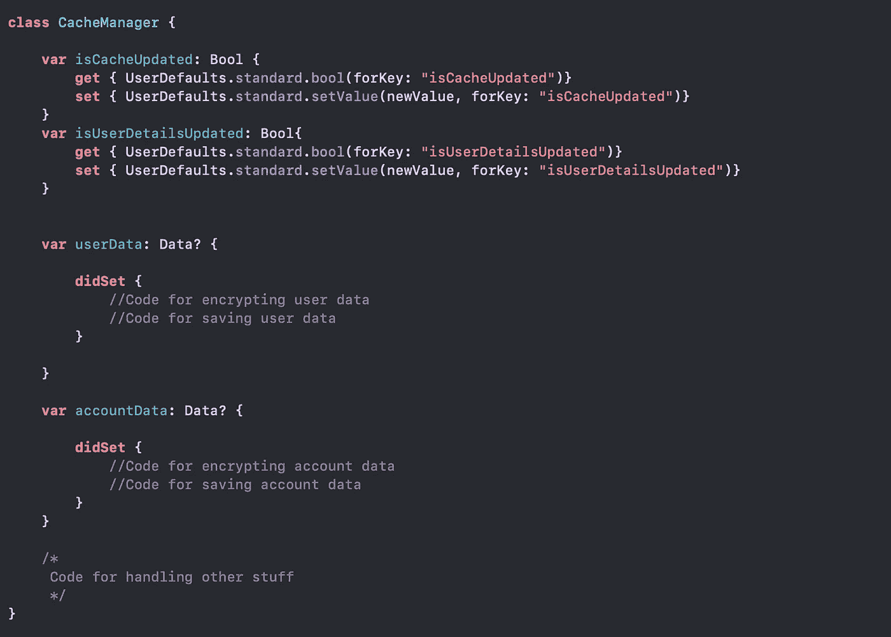

# Swift 中的属性包装器

> 原文：<https://medium.com/analytics-vidhya/property-wrappers-in-swift-2a1355bbf171?source=collection_archive---------6----------------------->

Swift 中的属性用于保存某种数据。有时这些属性在被修改时会触发某种逻辑。例如——拥有一个维护缓存状态的属性，当它发生变化时，应用程序需要将值更新为**用户默认值**。类似这样的-

在本例中，当**被缓存更新**和**被修改**时，需要保存…