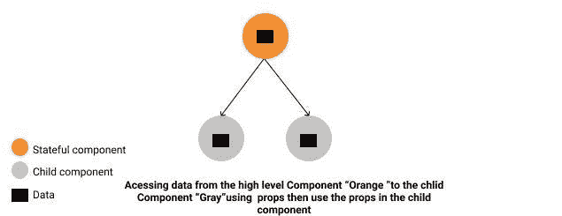
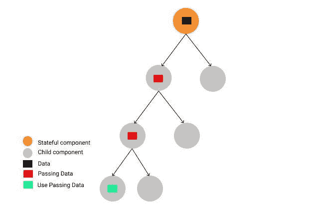

# 道具钻入反应堆。射流研究…

> 原文：<https://medium.com/analytics-vidhya/props-drilling-in-react-js-934120a4906b?source=collection_archive---------8----------------------->

轮廓-图像

首先，让我们感谢莱昂纳多·迪卡普里奥。你好奇为什么吗？让我们知道为什么；)

本文将涵盖两个主题:

*   什么是道具钻
*   如何回避道具演练

*让我们开始派对吧！*

# 什么是道具钻？

让我们先回顾一下我们所知道的关于**道具**的概念。道具是我们在网站上从顶级组件传递到任意数量的子组件的数据——或者可以访问的数据。 ***看图-1*** -

**图表-1-**

Props Drilling(也叫 threading)就是图-1-转化成这样的时候。

**图表-2-**

从图 2 来看，Props Drilling (Threading)是一个概念，指的是你将数据从父组件传递到 ***确切的*** 子组件**但**在中间，其他组件拥有***Props 只是为了沿着链传递它。***

那么，**道具钻**和**狮子座**有什么联系呢？

嗯，莱昂纳多·迪卡普里奥获得了 7 次奥斯卡提名，他凭借电影《归来者》**获得了一次。但是在 React.js 世界里，他的名字就是你传递给*不止一级的道具即使他们不需要，直到它到达你在其中使用道具的那个* ***。*****

*****你可以通过这个*** [***链接***](https://codesandbox.io/s/propsdriling-qhm6i?file=/src/App.js) ***看到代码。*****

# **2.如何回避道具演练？**

**避免支柱钻孔有几种解决方案:**

***1。反应上下文 API。***

***2。构图***

***3。渲染道具***

***4。特设***

***5。Redux 或 MobX***

# **通过使用 React 上下文 API 钻取来避免道具**

**首先，您需要初始化上下文。您可以在 js 文件或父组件的顶部这样做。
`**const** MyContext = React.createContext() ;`**

**之后，继续创建您的提供者并在其中使用上下文。然后，我们需要使用上下文并使用它来扭曲组件，这将上下文参数注入其中。**

**之后，事情就很简单了。你可以像使用道具一样使用上下文。**

****注:这里** 可以看到代码**

****恭喜，你做到了。****

********

# ****2.避免道具钻构图****

****简单地说，要组合 react 组件，您必须将组件分为容器和呈现者。然后把数据当道具传给孩子。****

****因此，主要组件将是这样的:****

****“列出电影”组件将包含如下所有组件:****

****这里，将道具传递给亡灵组件。****

> ******这里** 可以看到完整的代码****

*********好极了，你成功完成了*********

********

*******在接下来的两篇文章中我会解释其他的解决方案；)*******

********

# ****资源:****

****[组合 Vs 继承](https://reactjs.org/docs/composition-vs-inheritance.html)
[从头反应组合模式](/@alexkrolick/react-composition-patterns-from-the-ground-up-8401aaad93d7)
[避免在 React With Context API 中进行道具演练](https://dev.to/spukas/avoid-prop-drilling-in-react-with-context-api-1ne5)****