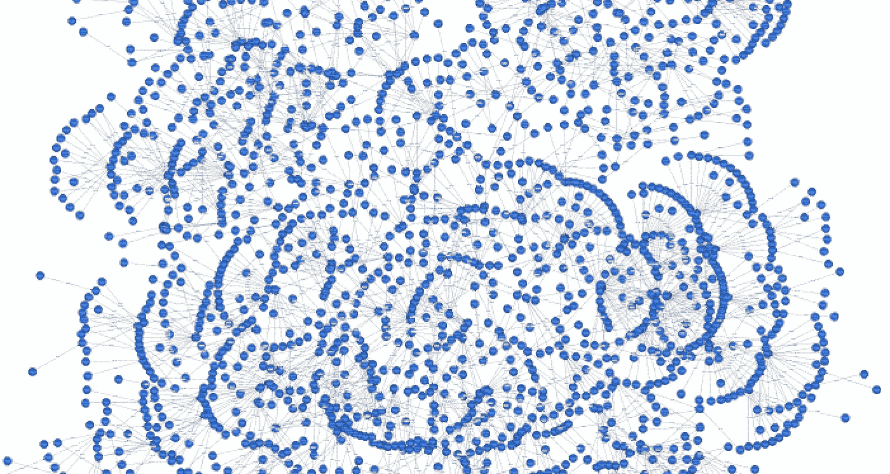
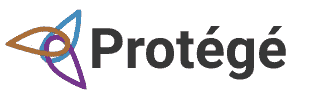
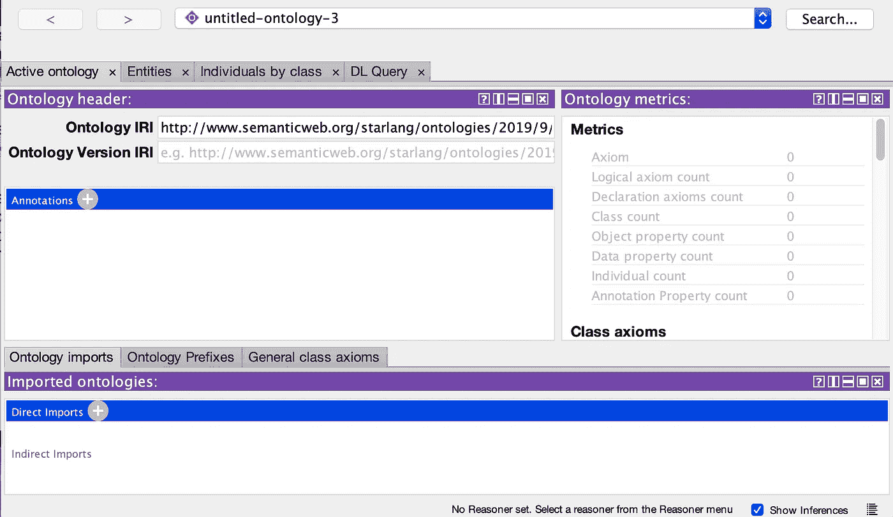
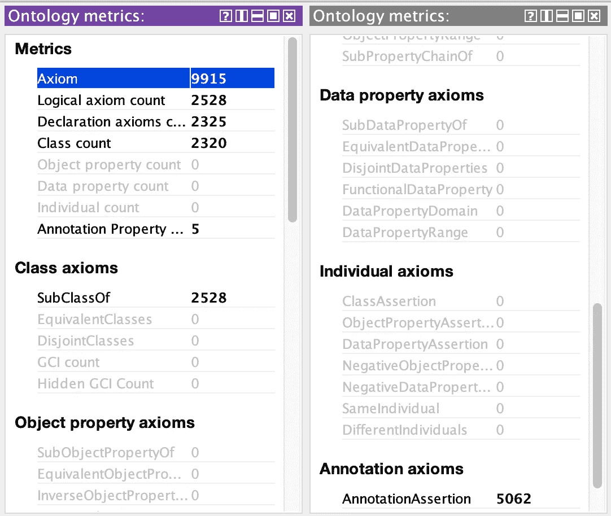
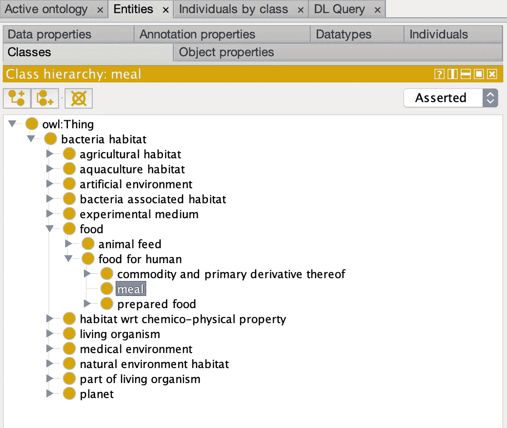
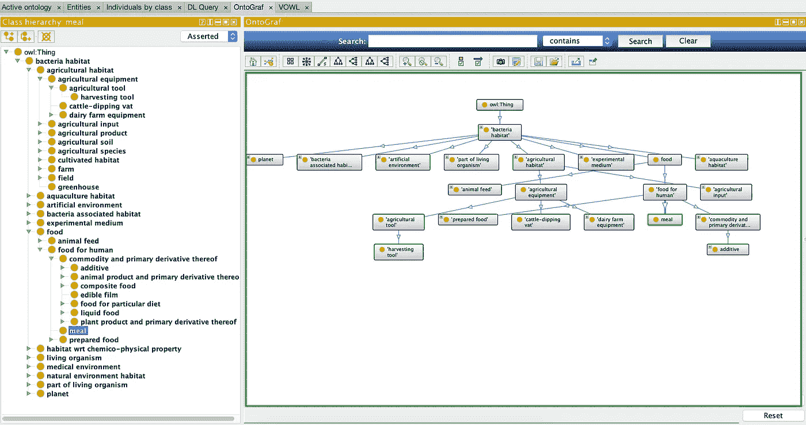
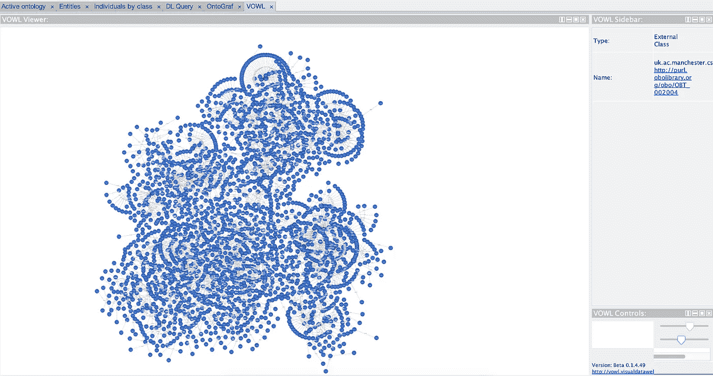
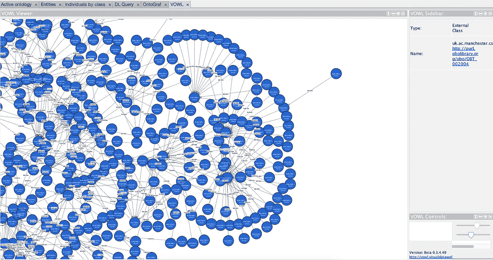
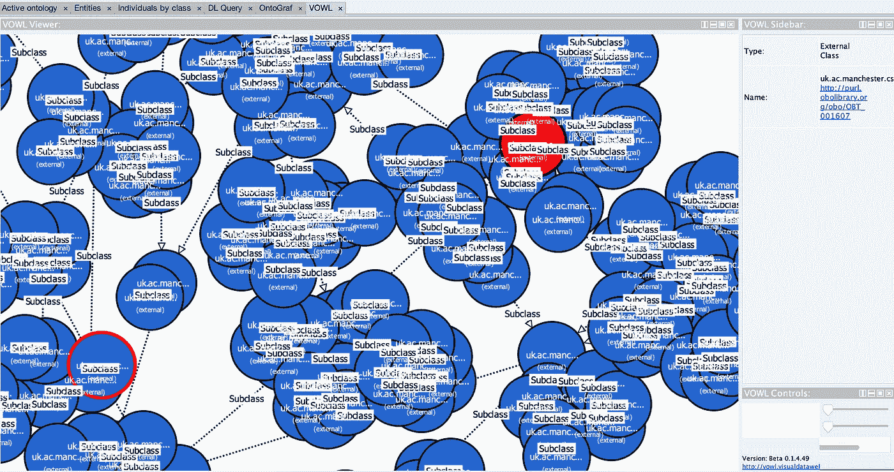

# 基于 Protégé的本体可视化

> 原文：<https://medium.com/analytics-vidhya/prot%C3%A9g%C3%A9-d533f024087b?source=collection_archive---------2----------------------->

## 如何使用一个本体编辑器？

在我以前的帖子中，我们已经讨论过用图和数据库来表示应用程序中的知识，这些知识使用数据和它们之间的关系。还有其他方法使用正式的知识表示规范，如词汇表、分类法、辞典、词网和本体论。在这篇文章中，我们将处理*本体*。

## 什么是本体？

在计算机科学中，本体是一组概念，包括对概念及其关系的描述。本体是为了限制复杂性和组织信息而创建的。

## 什么是本体编辑器？

[Protégé](https://protege.stanford.edu/) 是一个开源的本体编辑器和框架，由斯坦福生物医学信息学研究中心开发，用于构建基于知识的解决方案。它提供了一个即插即用的环境，使其成为快速原型制作的灵活基础。人们可以下载桌面应用程序或继续使用 web-protégé。在这篇文章中，我们将使用桌面应用程序，并向您展示一些用例。

一旦我们下载、提取并打开应用程序，我们就会看到主页，在这里我们可以开始创建一个新的本体或导入现有的本体。在本帖中，我们将使用在 BioBLP 共享任务之一[细菌群落生境 2016](http://2016.bionlp-st.org/tasks/bb2) 中创建和共享的现有本体，称为群落生境本体(OBO)。

被保护人主页

> 被保护人的一些见解

让我们导入 OBO，获得一些见解。上图显示了几个选项卡，如活动本体、实体、按类分类的个人和 DL 查询。

本体度量标签

在活动本体选项卡上的本体度量表中，我们可以看到不同的度量。例如，*公理*意味着一个单一的陈述，我们的本体中有 9915 个不同的公理。除此之外，我们有 2320 个不同的类公理，公理的*子类的数量是 2528。我们也看到注释公理，它将被用来把附加信息与本体、实体和公理联系起来。*

*饭菜的等级*

在 Entities 选项卡上的 Classes 视图中，我们可以看到不同的断言类层次结构。该树显示了可以从本体中的断言的*子类中获得的子类层次。让我们来看一个*餐*节点的层次结构示例。*猫头鹰:事物*是*细菌栖息地*类的超类，它有 12 个等价类，如*食物*和*行星*类。最后，*膳食*节点被*人类食物*节点所包含。*

我们也可以基于我们的本体创建一些图形。例如，在 OntoGraph 选项卡中，我们可以通过从类层次结构中选择实体来创建一个图。下面可以看到用我们本体的一小部分创建的*餐*节点的层次结构。

> 本体可视化

为了可视化我们的本体，我们需要从[这里](http://vowl.visualdataweb.org/protegevowl.html)安装 protégéVOWL(OWL 本体的可视化符号)插件。下载 VOWL jar 后，将其复制到 Protégé的 plugins 文件夹，对于 macOS 用户，通过右键单击应用程序图标并选择“显示包内容”来访问应用程序目录结构，然后导航到 Contents → Java → plugins，并将 VOWL jar 复制到 plugins 文件夹。最后，重新启动 Protégé，通过窗口→标签→ VOWL 激活插件。

一旦我们打开 VOWL 选项卡，它就开始从头开始创建我们的整个本体，并显示所有节点。在右侧，还可以看到所选节点的类型和名称。

奥博之声

如果我们在屏幕上移动，我们将能够看到条目的细节。

更详细地说…

## 总而言之…

本体有组件、类、属性和关系，以及限制、规则和公理。有了本体，我们引入了一种灵活的、可共享的、可重用的知识表示，像 Protégé和 VOWL 这样的应用程序帮助我们解释这些知识。