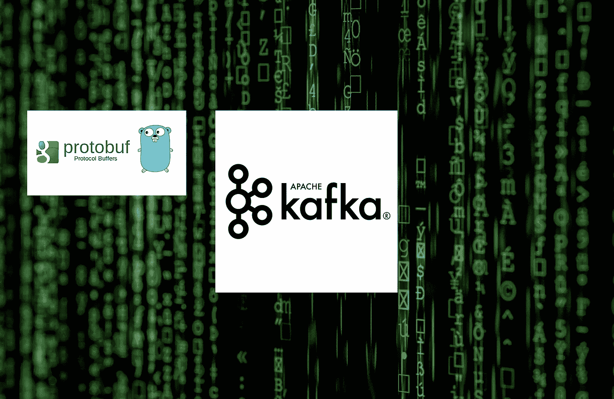
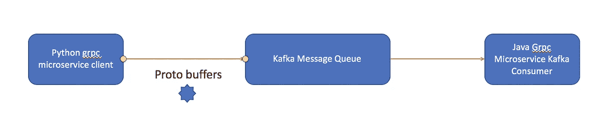

# 通过 Kafka Python 生产者和 Java 消费者的协议缓冲

> 原文：<https://medium.com/analytics-vidhya/protocol-buffer-python-kafka-producer-and-java-kafka-consumer-1168869ae0a2?source=collection_archive---------4----------------------->



通过混合卡夫卡生产者和消费者

通过 Kafka 消息传递的 JAVA 和 Python GRPC 微服务通信:

在本帖中，我们将讨论在 grpc 和协议缓冲区上使用 python 和 java 构建微服务架构时面临的最常见问题之一。

由于 JAVA 和 python 中的字节差异，从 Python 客户端传递协议缓冲区并在基于 grpc JAVA 的微服务中使用是有问题的。

只是为了批量处理消息，我们还将在中间放置 Kafka 消息队列。

看看下面的通用架构，我们将看到如何编码。



通过 kafka 传递 Python 和 Java 协议缓冲消息

版本:

*   Java — 1.8
*   python 3.6
*   议定书 3.10.1
*   pykafka

<groupid>org.apache.kafka</groupid>

<artifactid>卡夫卡-客户</artifactid>

<version>2.0.0</version>

> 让我们为通信定义一个简单的**协议缓冲区**消息

```
syntax = "proto3";

//import "google/protobuf/empty.proto";
//import "google/protobuf/timestamp.proto";

option java_package = "com.kafka.simple.genproto";
import "google/protobuf/empty.proto";

message Simple {
    string label = 1;
    string description = 2;
    int32 version = 3;
}
```

> 对于 grpc 微服务，只需实现如下 Grpc 服务

```
service SimpleMessageService {
    rpc pushSimpleMessage(Simple) returns (google.protobuf.Empty);
}
```

> Python Kafka 客户端来填充我们的简单消息(pykafka)

Base64 编码在这里非常重要，因为简单的 SerilizeToString 在 Java 消费者端无法工作。

```
client = KafkaClient(hosts="127.0.0.1:9092")

topic = client.topics["simpletopic"]

msg = simple_pb2.Simple()
msg.label = 'simple message'
msg.description = 'this is a simple message'
msg.version = 1
print(msg)

with topic.get_sync_producer(max_retries=5, required_acks=1, ack_timeout_ms=5000) as producer:
    #this is importontant to base64 encode the message
    #just using SerilizeToString wont work on the other end java consumer
 **b64encoded = base64.b64encode(msg.SerializeToString())**
    res = producer.produce(b64encoded)
    print(res)
```

> 卡夫卡-控制台-消费者它看起来怎么样

```
kafka-console-consumer.sh - bootstrap-server 127.0.0.1:9092 - topic "simpletopic"
Cg5zaW1wbGUgbWVzc2FnZRIYdGhpcyBpcyBhIHNpbXBsZSBtZXNzYWdlGAE=**Base64 Encoded protocol buffer**
```

> Java Kafka 消费线程(仅重要的解码部分)

检查代码的 Base64 解码部分。

```
public void run()
{
    logger.info("consumer thread [" + this.id + "] starting up");
try {
consumer.subscribe(topics);

while (true) {
ConsumerRecords < String, String > records = consumer.poll(Duration.ofMillis(100));
for (ConsumerRecord < String, String > record: records) {
try {
logger.info("consumer thread [" + this.id + "] received \n" + record);
Simple msg = **SimpleOuterClass.Simple.parseFrom(Base64.getDecoder().decode(record.value()));** logger.info("consumer thread [" + this.id + "] received \n" + msg.toString());
// Push to KGIngestionService MicroService

consumer.commitAsync(new OffsetCommitCallback() {
public void onComplete(Map < TopicPartition, OffsetAndMetadata > offsets, Exception exception) {
if (exception != null)
logger.info("Commit failed for offsets {" + offsets + "  }" + " exception " +
exception);
else
logger.info("Commit for offsets {" + offsets + "  } successful");
}
});

}
```

希望您已经了解了如何通过 python Kafka 客户端和 java Kafka 消费者传递协议缓冲区消息。

这两种方式都可行，只是 Base64 编码和解码部分需要更改。

希望这将帮助您使用 Grpc、协议缓冲区和 Kafka 构建可扩展的微服务架构。

谢谢你。

参考资料:

[1][https://pykafka.readthedocs.io/en/latest/](https://pykafka.readthedocs.io/en/latest/)

[https://developers.google.com/protocol-buffers](https://developers.google.com/protocol-buffers)

[3][https://kafka.apache.org/10/javadoc/index.html?org/Apache/Kafka/clients/consumer/kafkaconsumer . html](https://kafka.apache.org/10/javadoc/index.html?org/apache/kafka/clients/consumer/KafkaConsumer.html)