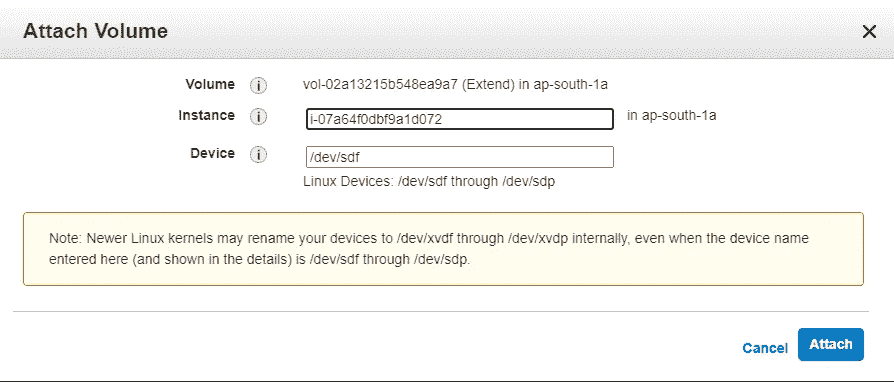

# 使用 LVM 在 Hadoop 中提供数据节点弹性

> 原文：<https://medium.com/analytics-vidhya/providing-data-node-elasticity-in-hadoop-using-lvm-e102035fdd62?source=collection_archive---------24----------------------->

在 AWS 上设置 Hadoop 集群时，启动更多实例作为数据节点会增加所提供的总存储。但是，如果我们需要增加单个数据节点提供的空间呢？这是我们可以使用**逻辑卷管理器**的地方。

## LVM 用于以下目的:

*   创建多个物理卷或整个硬盘的单个逻辑卷(有点类似于 [RAID 0](https://en.wikipedia.org/wiki/RAID_0) ，但更类似于 [JBOD](https://en.wikipedia.org/wiki/JBOD) )，允许动态调整卷大小。
*   结合[热插拔](https://en.wikipedia.org/wiki/Hot_swapping)，无需停机或服务中断即可添加和更换磁盘，从而管理大型硬盘群。
*   在小型系统(如台式机)上，LVM 允许文件系统根据需要轻松调整大小，而不必在安装时估计分区需要多大。
*   通过拍摄逻辑卷的快照来执行一致的备份。
*   用一个密码加密多个物理分区。

LVM 可以被视为硬盘和分区之上的一个精简软件层，它为管理硬盘更换、重新分区和备份创建了一个抽象的连续性和易用性。

# 集成 LVM 和 Hadoop

让我们开门见山吧—我将为我的 hadoop 集群使用一个简单的双节点设置(一个名称节点和一个数据节点)。它们都是 AWS EC2 实例，我将在 SSH 客户机(putty)上工作。虽然我个人使用过 AWS 实例，但这个概念甚至可以在本地虚拟机或任何其他基于云的计算服务上实现。运行 **hadoop dfsadmin -report** 命令(在名称节点或数据节点上)以检查您的数据节点是否已连接。

```
[root@ip-172-31-38-8 ~]# hadoop dfsadmin -report
.
.
.
-------------------------------------------------
Datanodes available: 1 (1 total, 0 dead)Name: 65.0.76.100:50010
Decommission Status : Normal
Configured Capacity: 10724814848 (9.99 GB)
DFS Used: 8192 (8 KB)
Non DFS Used: 1739907072 (1.62 GB)
DFS Remaining: 8984899584(8.37 GB)
DFS Used%: 0%
DFS Remaining%: 83.78%
Last contact: Sat Dec 05 21:34:15 UTC 2020
```

## 添加物理卷

现在，我将在 AWS 中创建一个大小为 10 GiB 的卷，并将其连接到我的 datanode，如果在本地虚拟机上执行此操作，只需向运行您的数据节点的虚拟机添加一个所需大小的额外磁盘。



将卷附加到数据节点

连接设备后，我们可以打开数据节点的终端，继续为添加的卷创建一个分区，用正确的文件系统对其进行格式化，最后在驱动器上挂载该分区。

对于上述步骤，确保系统上安装了 **lvm** 。如果没有，使用 yum 安装。

```
[root@ip-172–31–38–85 ~]# yum install lvm2
```

## **创建物理卷**

使用 **fdisk -l** 列出您连接的磁盘设备

```
[root@ip-172–31–38–85 ~]# fdisk -l
Disk /dev/xvda: 10 GiB, 10737418240 bytes, 20971520 sectors
Units: sectors of 1 * 512 = 512 bytes
Sector size (logical/physical): 512 bytes / 512 bytes
I/O size (minimum/optimal): 512 bytes / 512 bytes
Disklabel type: gpt
Disk identifier: 246B752E-8CB4–41E7-B9B1–365A93ACF890Device Start End Sectors Size Type
/dev/xvda1 2048 4095 2048 1M BIOS boot
/dev/xvda2 4096 20971486 20967391 10G Linux filesystemDisk /dev/xvdf: 10 GiB, 10737418240 bytes, 20971520 sectors
Units: sectors of 1 * 512 = 512 bytes
Sector size (logical/physical): 512 bytes / 512 bytes
I/O size (minimum/optimal): 512 bytes / 512 bytes
```

**/dev/xvdf** 磁盘是我们新附加的磁盘。我们现在将使用 **pvcreate** 命令创建该磁盘的物理卷。您可以使用 **pvdisplay** 命令显示创建的物理卷。这可以用来创建多个物理卷。

```
[root@ip-172–31–38–85 ~]# pvcreate /dev/xvdf
 Physical volume “/dev/xvdf” successfully created.
[root@ip-172–31–38–85]# pvdisplay /dev/xvdf
 “/dev/xvdf” is a new physical volume of “10.00 GiB”
 — — NEW Physical volume — -
 PV Name /dev/xvdf
 VG Name
 PV Size 10.00 GiB
 Allocatable NO
 PE Size 0
 Total PE 0
 Free PE 0
 Allocated PE 0
 PV UUID jVlAEE-ATVj-b0At-8IHp-zoyy-IXtv-Mvhcnu
```

## 创建卷组

我们可以创建多个物理卷，然后将它们组合起来创建一个**卷组**。要创建卷组，使用**vgcreate<vgname><pv1><pv2>…**和**vgdisplay<vgname>**来显示卷组。

```
[root@ip-172–31–38–85 ~]# vgcreate vgdata /dev/xvdf
 Volume group “vgdata” successfully created
[root@ip-172–31–38–85 ~]# vgdisplay vgdata
 — — Volume group — -
 VG Name vgdata
 System ID
 Format lvm2
 Metadata Areas 1
 Metadata Sequence No 1
 VG Access read/write
 VG Status resizable
 MAX LV 0
 Cur LV 0
 Open LV 0
 Max PV 0
 Cur PV 1
 Act PV 1
 VG Size <10.00 GiB
 PE Size 4.00 MiB
 Total PE 2559
 Alloc PE / Size 0 / 0
 Free PE / Size 2559 / <10.00 GiB
 VG UUID FLipJ0-kzBs-lW2v-IvjG-2HxN-1U1F-HSJwmj
```

## 创建和装载逻辑卷

我们现在可以使用命令**lvcreate-size<size>-name<lvname><vgname>**从我们的卷组创建逻辑卷。在这里，我创建了一个大小为 5 GiB 的逻辑卷，并使用**lvdisplay<vgname>/<lvname>**显示它

```
[root@ip-172-31-38-85 ~]# lvcreate --size 5G --name lvdata1 vgdata
  Logical volume "lvdata1" created.
[root@ip-172–31–38–85 ~]# lvdisplay vgdata/lvdata1
 — — Logical volume — -
 LV Path /dev/vgdata/lvdata1
 LV Name lvdata1
 VG Name vgdata
 LV UUID 1C08aW-rTGn-CTjz-UiGg-ksRM-79FK-7WWVNS
 LV Write Access read/write
 LV Creation host, time ip-172–31–38–85.ap-south-1.compute.internal, 2020–12–05 23:38:10 +0000
 LV Status available
 # open 0
 LV Size 5.00 GiB
 Current LE 1280
 Segments 1
 Allocation inherit
 Read ahead sectors auto
 — currently set to 8192
 Block device 253:0
```

接下来，让我们用 **ext4** 文件系统格式化逻辑卷。为此我们使用命令**mkfs . ext 4<LV Path>。**

```
[root@ip-172–31–38–85 ~]# mkfs.ext4 /dev/vgdata/lvdata1
mke2fs 1.45.6 (20-Mar-2020)
Creating filesystem with 1310720 4k blocks and 327680 inodes
Filesystem UUID: cac48375–3f2f-4c81–9b53–4336043bf423
Superblock backups stored on blocks:
 32768, 98304, 163840, 229376, 294912, 819200, 884736Allocating group tables: done
Writing inode tables: done
Creating journal (16384 blocks): done
Writing superblocks and filesystem accounting information: done
```

我们通常创建一个目录，可以在其中装入格式化的卷，但在这种情况下，由于我们希望增加数据节点的弹性，我们将把卷装入数据节点目录。您可以在 hadoop 目录中的 **hdfs-site.xml** 文件中验证数据节点目录的位置。

```
[root@ip-172–31–38–85 ~]# cat /etc/hadoop/hdfs-site.xml
<?xml version=”1.0"?>
<?xml-stylesheet type=”text/xsl” href=”configuration.xsl”?><! — Put site-specific property overrides in this file. →<configuration>
 <property>
 <name>dfs.data.dir</name>
 <value>/dn</value>
 </property>
</configuration>
```

在我的例子中，数据节点目录是 **/dn** 。因此，我将使用 **mount** 命令**mount/dev/mapper/<vgname>-<lvname><mount point>**将卷挂载到这个目录。
使用命令 **df -h** 确认安装。

```
[root@ip-172-31-38-85 ~]# mount /dev/mapper/vgdata-lvdata1 /dn
```

## 扩展逻辑卷

我们可以进一步从卷组向逻辑卷添加存储容量，而不必格式化已经挂载的逻辑卷。这是通过使用两个命令来完成的: **lvextend** 和 **resize2fs** 。

我们使用**lvextend-size+<size><device path>**来添加扩展逻辑卷。

```
[root@ip-172–31–38–85 ~]# lvextend — size +2G /dev/mapper/vgdata-lvdata1 Size of logical volume vgdata/lvdata1 changed from 5.00 GiB (1280 extents) to 7.00 GiB (1792 extents).
 Logical volume vgdata/lvdata1 successfully resized.
```

为了使扩展卷可用，我们使用了**resize 2fs****<device path>**

```
[root@ip-172–31–38–85 hadoop]# resize2fs /dev/mapper/vgdata-lvdata1
resize2fs 1.45.6 (20-Mar-2020)
Filesystem at /dev/mapper/vgdata-lvdata1 is mounted on /dn; on-line resizing required
old_desc_blocks = 1, new_desc_blocks = 1
The filesystem on /dev/mapper/vgdata-lvdata1 is now 1835008 (4k) blocks long.
```

最后运行 **df -h** 命令来验证扩展卷。

```
[root@ip-172–31–38–85 hadoop]# df -h
Filesystem Size Used Avail Use% Mounted on
devtmpfs 378M 0 378M 0% /dev
tmpfs 403M 0 403M 0% /dev/shm
tmpfs 403M 11M 393M 3% /run
tmpfs 403M 0 403M 0% /sys/fs/cgroup
/dev/xvda2 10G 1.7G 8.4G 17% /
tmpfs 81M 0 81M 0% /run/user/1000
/dev/mapper/vgdata-lvdata1 6.9G 23M 6.5G 1% /dn
```

现在运行 **hadoop dfsadmin -report** 命令，我们看到我们的数据节点贡献的存储现在约为 6.8 GB。

```
[root@ip-172–31–38–8 ~]# hadoop dfsadmin -report
.
.
.-------------------------------------------------
Datanodes available: 1 (1 total, 0 dead)Name: 13.232.125.253:50010
Decommission Status : Normal
Configured Capacity: 7331110912 (6.83 GB)
DFS Used: 45056 (44 KB)
Non DFS Used: 405405696 (386.62 MB)
DFS Remaining: 6925660160(6.45 GB)
DFS Used%: 0%
DFS Remaining%: 94.47%
Last contact: Sun Dec 06 21:08:07 UTC 2020
```

# 结论

我们可以附加更多的物理卷，并将它们添加到卷组中，并进一步扩展数据节点目录上装载的逻辑卷的大小，以使我们的数据节点存储可以随时调整大小。这就是我们如何使用 LVM 在 hadoop 上提供数据节点弹性。

## 希望这有所帮助:)