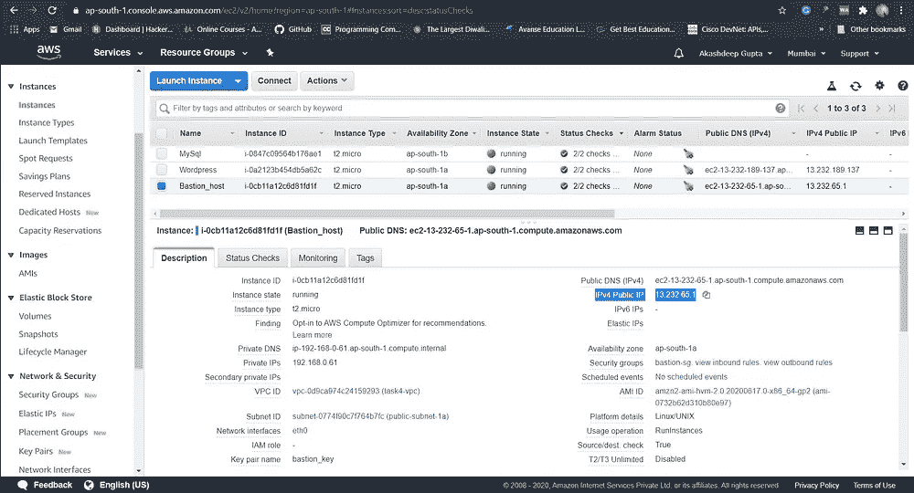

# 通过 NAT 网关为私有子网提供互联网连接

> 原文：<https://medium.com/analytics-vidhya/providing-internet-connectivity-to-private-subnet-through-nat-gateway-edf6955f8cea?source=collection_archive---------8----------------------->


之前在 AWS 上部署的 web 服务器使用 VPC，在公共子网中运行 WordPress 服务器，在私有子网中运行 MySql 数据库 ***(下面给出了那篇文章的链接)*** 。由于 MySql 在私有子网中启动，这意味着它没有互联网连接，这很好，但在更新软件、进行一些更改、修复漏洞或补丁的情况下，它可能会成为一个主要的安全威胁。

[](/@akashdeepg06/deploying-wordpress-and-mysql-server-in-our-own-vpc-59d5d4a2fedd) [## 在 VPC 部署 WordPress 和 MySql 服务器

### *我们会做什么？

medium.com](/@akashdeepg06/deploying-wordpress-and-mysql-server-in-our-own-vpc-59d5d4a2fedd) 

在这种情况下，我们将使用 NAT 网关为我们的数据库服务器提供互联网连接。我们还将推出一个名为 ***bastion host*** 的实例，它将用于 ping MySql 实例内部，还可以执行更新和修复 bug 等任务。

## ***将在本任务中使用的术语**

> NAT 网关

N AT Gateway 是一项高度可用的 AWS 托管服务，可以轻松地从亚马逊虚拟私有云(亚马逊 VPC)的私有子网内的实例连接到互联网。以前，您需要启动一个 NAT 实例来为私有子网中的实例启用 NAT。

> EIP

E lastic IP 地址是一个保留的公共 IP 地址，您可以将其分配给特定区域中的任何 EC2 实例，直到您选择释放它。要在特定地区为您的帐户分配弹性 IP 地址，请参阅分配弹性 IP 地址。

> 堡垒主机

主机是一种服务器，其目的是提供从外部网络(如互联网)到专用网络的访问。由于面临潜在的攻击，堡垒主机必须最大限度地减少渗透的机会。

**安全组**对于保持严密的安全性是必不可少的，并且在使 **bastion host** 解决方案工作中起着重要作用。

## *任务的解决方案

*   在创建 NAT 网关之前，我们必须为此创建 EIP。

```
# — Creating EIPresource “aws_eip” “task4-eip” {
 vpc = “true”
}
```

简单得没什么好解释的。


EIP

*   正在创建 NAT 网关。

```
# — Creating NAT gatewayresource “aws_nat_gateway” “task4-ngw” {
 allocation_id = “${aws_eip.task4-eip.id}
 subnet_id = “${aws_subnet.public-subnet-1a.id}”

 tags = {
 Name = “task4-ngw”
}
```

将此 NAT 网关分配给公共子网。


NAT 网关

*   为 NAT 网关及其与私有子网的关联创建路由表，以实现互联网连接。

```
# — Create route table for nat gatewayresource “aws_route_table” “task4-route-ngw” {
 depends_on = [ aws_nat_gateway.task4-ngw, 
 ]
 vpc_id = “${aws_vpc.task4-vpc.id}”route {
 cidr_block = “0.0.0.0/0”
 gateway_id = “${aws_nat_gateway.task4-ngw.id}”
 }tags = {
 Name = “task4-route-ngw”
 }
}# — Subnet Association for nat gatewayresource “aws_route_table_association” “subnet-1b-asso” {
 subnet_id = “${aws_subnet.public-subnet-1b.id}”
 route_table_id = “${aws_route_table.task4-route-ngw.id}”
}
```


路由表

*   为堡垒主机创建密钥对。

```
# — Creating Key Pairs for bastion hostresource “tls_private_key” “key7” {
 algorithm = “RSA”
 rsa_bits = 4096
}resource “local_file” “key8” {
 content = “${tls_private_key.key7.private_key_pem}”
 filename = “bastion_key.pem”
 file_permission = 0400
}resource “aws_key_pair” “key9” {
 key_name = “bastion_key”
 public_key = “${tls_private_key.key7.public_key_openssh}”
}
```

*   为堡垒主机创建安全组。

```
# — Creating Security Groups for bastion hostresource “aws_security_group” “sg-bs” {
 name = “bastion-sg”
 description = “Allow TLS inbound traffic”
 vpc_id = “${aws_vpc.task4-vpc.id}”ingress {
 description = “SSH”
 from_port = 22
 to_port = 22
 protocol = “tcp”
 cidr_blocks = [ “0.0.0.0/0” ]
 }egress {
 from_port = 0
 to_port = 0
 protocol = “-1”
 cidr_blocks = [“0.0.0.0/0”]
 }tags = {
 Name = “bastion-sg”
 }
}
```

只允许 ssh 保护主机。


sg-bastion

*   为 MySql 创建一个安全组，只允许堡垒主机安全组执行 ssh。

```
# — Creating Security Groups for mySql for having connectivity with only bastion_host instanceresource “aws_security_group” “sg-db2” {
 depends_on = [
 aws_security_group.sg-bs,
 ]
 name = “mySql-sg2”
 description = “Allow TLS inbound traffic”
 vpc_id = “${aws_vpc.task4-vpc.id}”ingress {
 description = “SSH”
 from_port = 22
 to_port = 22
 protocol = “tcp”
 security_groups = [ “${aws_security_group.sg-bs.id}” ]
 }egress {
 from_port = 0
 to_port = 0
 protocol = “-1”
 cidr_blocks = [“0.0.0.0/0”]
 }tags = {
 Name = “mySql-sg2”
 }
}
```


sg-mysql

*   正在启动堡垒主机实例。

```
# — Creating Ec2 instance for bastion_hostresource “aws_instance” “bash_host” {
 ami = “ami-0732b62d310b80e97”
 subnet_id = “${aws_subnet.public-subnet-1a.id}”
 availability_zone = “${data.aws_availability_zones.zones.names[0]}”
 instance_type = “t2.micro”
 root_block_device {
 volume_type = “gp2”
 delete_on_termination = true
 }
 key_name = “${aws_key_pair.key9.key_name}”
 vpc_security_group_ids = [ “${aws_security_group.sg-bs.id}” ]
 associate_public_ip_address = true

 tags = {
 Name = “Bastion_host”
 }
}
```



例子

现在，使用这个 bastion 主机，我们可以在我们的 MySql 实例中的私有子网内登录，并可以使用它的密钥对进行 ssh。

对于 key pair，查看您创建项目的本地存储库，并通过 WindSCP 将其从您的存储库发送到 bastion 主机实例。

```
Bastion host Public IP: 13.232.65.1
MySql Private IP: 192.168.1.109# sudo su - root# cd /home/ec2-user
***Note:- As going to this loction as a have copied the key(mySql)to this location***# ssh -i mysql_key.pem -l ec2-user 192.168.1.109# ping goo.gl# sudo su - root# now install any software or fix bugs.
```


## 感谢阅读！！

请随时给我建议和任何疑问，然后给我发邮件。

**Github repo 获取帮助和完整代码**

[](https://github.com/Akashdeep-47/cloud_task4.git) [## 阿卡什迪普-47/云任务 4

### 通过 NAT 网关为私有子网提供互联网连接 NAT 网关是一个高度可用的 AWS 管理…

github.com](https://github.com/Akashdeep-47/cloud_task4.git)