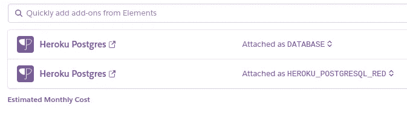

# 在 Heroku 上为 Django 应用程序提供一个测试 PostgreSQL 数据库

> 原文：<https://medium.com/analytics-vidhya/provisioning-a-test-postgresql-database-on-heroku-for-your-django-app-febb2b5d3b29?source=collection_archive---------7----------------------->


Heroku 已经成为一个流行的后端应用程序托管平台。Heroku 支持的流行框架之一是 Django。Django 是一个 python 框架，最初是为了加速新的相关网站的开发而构建的，但现在正被用于通过 REST APIs 支持各种应用程序。

使用 Heroku 部署 Django 的众多优势之一是 Heroku 提供的 Postgres 插件。这实质上允许后端开发人员在同一个平台上管理应用程序和数据库。

由于 Heroku 提供的 Postgres 数据库的性质和 Django 中运行测试的方式，如果您已经将 Heroku Postgres 附加组件连接到您的 Django 应用程序，那么在尝试运行测试时会遇到错误。

本文向您展示了如何解决这个问题，从而仍然能够使用 Heroku 的 Postgres 数据库，并且仍然能够轻松地运行测试。

名词（noun 的缩写）b:我假设你熟悉 Django 框架和连接 Heroku Postgres 数据库。

**问题**

Settings.py

这个设置显示 Django 应用程序当前正在使用 Heroku Postgres 附加组件。

尝试运行测试命令会导致此错误

```
$bash: python manage.py testCreating test database for alias 'default'...
RuntimeWarning: Normally Django will use a connection to the 'postgres' database to avoid running initialization queries against the production database when it's not needed (for example, when running tests). Django was unable to create a connection to the 'postgres' database and will use the first PostgreSQL database instead.
Got an error creating the test database: permission denied to create database
```

这里的关键字是“创建数据库的权限被拒绝”。

Heroku 提供 Postgres 数据库的方式是，用户没有创建新数据库的权限。您可以通过使用 Heroku CLI 检查这一点，进入 PSQL 并检查用户在 Heroku 提供的数据库中的访问权限。

这是我们的解决方法。

1.  创建一个附加的 Postgres 数据库。我们将使用它作为我们的测试数据库



2.在 settings.py 中，对其进行配置，以便 Django 根据 CLI 命令有选择地选择一个数据库。本质上，当测试运行时，它指向测试数据库。对于正常操作，将使用您的临时或生产数据库。将{ ' TEST ':{ ' NAME ':your _ testdb _ NAME } }添加到测试数据库配置的数据库字典中是很重要的。这为 Django 指明了正确的方向。

3.运行带有标记'— keepdb '的测试命令。这确保了 Django 不会试图创建新的数据库

```
$bash: python manage.py test --keepdb
System check identified no issues (0 silenced).
..
----------------------------------------------------------------------
Ran 2 tests in 6.954sOK
```

恭喜你。你可以走了。测试愉快！

如果你喜欢这个，你可以在这里或者在推特上关注我。https://twitter.com/pelumi_sa[有时我会在那里谈论技术](https://twitter.com/pelumi_sa)

页（page 的缩写）S

这个解决方法非常适合这个用例。凭直觉，您可能想知道为什么 Django 不提供定义 TEST_DATABASE 配置的能力？Django 认为用于测试的数据库应该与生产中使用的数据库相同。当前设置强制执行此操作。

如果您想通过本地 PostgreSQL 服务器运行您的测试，您可以简单地重新配置数据库配置以指向该服务器。

在 Liko Health，我们最初使用 docker 映像作为 Postgresql 实例，但决定切换到 Heroku Postgres 作为通用数据库，尽管我们可以继续使用该映像进行测试，但我们决定也切换到附加组件进行测试。