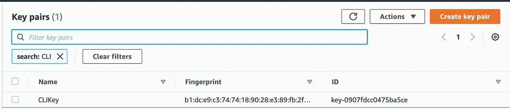
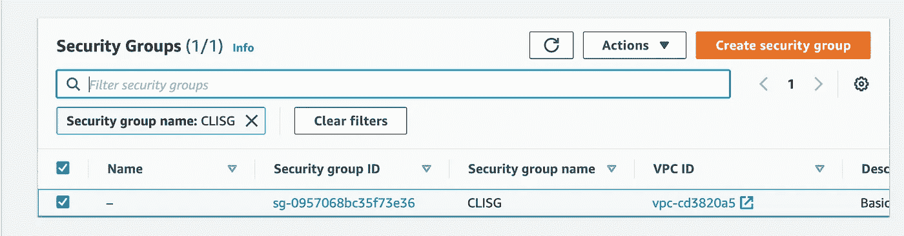
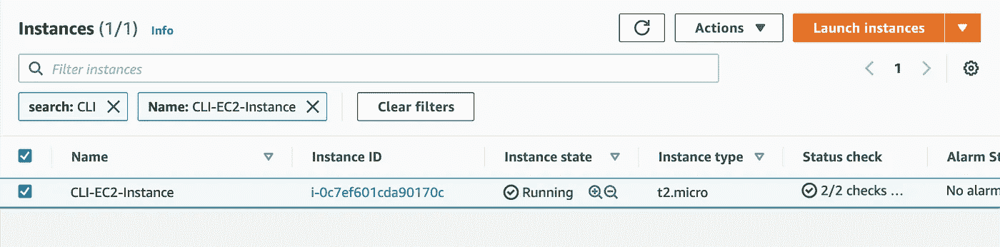
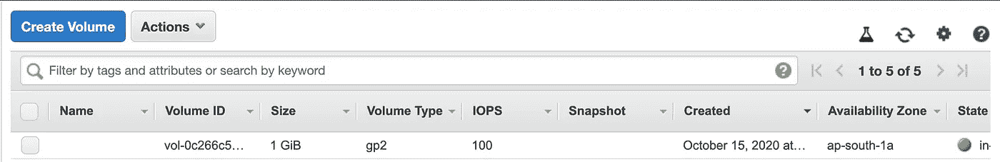
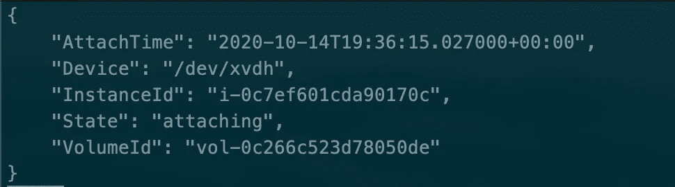
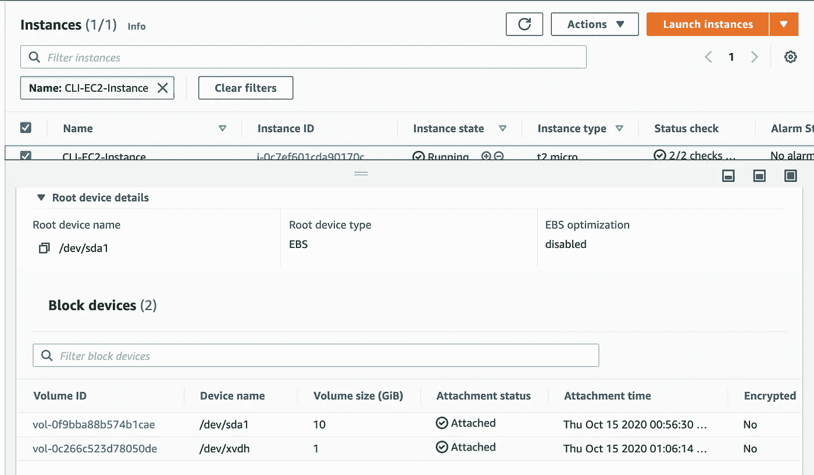

# 使用 AWS CLI 为 EC2 实例配置外部 EBS 卷！

> 原文：<https://medium.com/analytics-vidhya/provisioning-ec2-instances-with-external-ebs-volume-attached-using-aws-cli-ac85a9ce67ed?source=collection_archive---------26----------------------->

## 这篇博客旨在解释使用 AWS CLI 包创建并附加外部 EBS 卷来配置 AWS EC2 实例的过程！


[**来源**](https://www.google.com/url?sa=i&url=https%3A%2F%2Fwww.knowledgehut.com%2Fblog%2Fcloud-computing%2Faws-cli&psig=AOvVaw3Go-i2sCQ6a4JSDWQhuFve&ust=1602790705971000&source=images&cd=vfe&ved=0CAIQjRxqFwoTCPjxm-7qtOwCFQAAAAAdAAAAABAD)

在当今动态快速的世界中，自动化已经创造了自己的形象，要想在这个世界中生存，了解自动化部分是非常重要的。

走向自动化的第一步是使用大多数程序的 CLI，因为它给人一种真正的脚本感觉。使用 CLI 而不是 WebUI 的另一个好处是它消耗更少的网络带宽和资源。除此之外，如果您知道命令，还可以节省大量时间。

因此，在这个世界上学习 CLI 是必须的&写这篇博客是为了教你 AWS CLI 包的一些基础知识，它是 AWS 的官方 CLI。

# 此任务的先决条件！

*   熟悉 AWS 基本服务。

> **在这篇博客的结尾，您将能够为 AWS EC2 实例创建一个密钥对，创建一个将附加到 EC2 实例的安全组，启动一个 EC2 实例，创建一个额外的 EBS 卷，&将其附加到所创建的 EC2 实例。**

让我们开始使用 AWS CLI 构建设置:

首先，要创建一个密钥对，执行下面给出的命令。

```
aws ec2 create-key-pair --key-name <name of the key> > <name of the Key File>.pem**For example:** “aws ec2 create-key-pair --key-name CLIKey > CLIKey.pem”
```

上面显示的命令将使用命令中提到的名称创建一个密钥对，并将密钥保存到命令中提到的文件中。这个密钥对将在将来用于访问 EC2 实例。



**图片作者！**

现在，让我们创建一个安全组，它将附加到 EC2 实例，该实例将在下一步中创建。

要创建安全组，请执行下面给出的命令。

```
aws ec2 create-security-group --group-name <name of the Security Group> --description “Any Description abou the security group“**For example:** aws ec2 create-security-group --group-name CLISG --description "Basic Security group created using AWS CLI! "
```

上面显示的命令将使用命令中提到的名称和描述创建一个安全组。



**图片作者！**

在创建了 KeyPair & Security 组之后，现在让我们创建 EC2 实例。

要创建相同的内容，请执行下面显示的命令。

```
aws ec2 run-instances --image-id <AMI Image ID> --key-name <Key Name> --instance-type <Type Of Instance> --security-groups <Name of the Security Group> --tag-specifications 'ResourceType=instance,Tags=[{Key=<Any Key>,Value=<Any Value>}]'**For Example:** aws ec2 run-instances --image-id ami-052c08d70def0ac62 --key-name CLIKey --instance-type t2.micro --security-groups CLISG --tag-specifications 'ResourceType=instance,Tags=[{Key=Name,Value=CLI-EC2-Instance}]'
```

上面显示的命令将使用指定的资源创建一个 AWS EC2 实例。



**图片作者！**

现在，让我们为持久存储创建一个额外的 EBS 卷。

要完成同样的任务，请执行下面给出的命令。

```
aws ec2 create-volume --size <Size in GiB> --availability-zone <Name of the Availability Zone where EC2 Instance is launched>**For Example:** aws ec2 create-volume --size 1 --availability-zone ap-south-1a
```

上面显示的命令将在可用性分区“ap-south-1a”中创建一个大小为 1 GiB 的 EBS 卷。



**图片作者！**

作为这篇博客的最后一步，让我们将这个卷附加到我们上面已经创建的 EC2 实例上。

要完成同样的任务，请执行下面给出的命令。

```
aws ec2 attach-volume --volume-id <Volume ID to be attached> --instance-id  <Instance ID to which this volume has to be attached>  --device <Device Name>**For Example:** aws ec2 attach-volume --volume-id vol-0c266c523d78050de --instance-id  i-0c7ef601cda90170c  --device /dev/xvdh
```

上面显示的命令将把创建的 EBS 卷附加到 AWS 实例。

运行该命令后，输出如下:



**图片作者！**



**图片作者！**

上面显示的命令将附加创建的 EBS 卷，并将它附加到 EC2 实例！

***我希望我的文章用所有深刻的概念和解释来解释与主题相关的每一件事。非常感谢你花时间阅读我的博客&来增长你的知识。如果你喜欢我的作品，那么我请求你为这个博客鼓掌！***