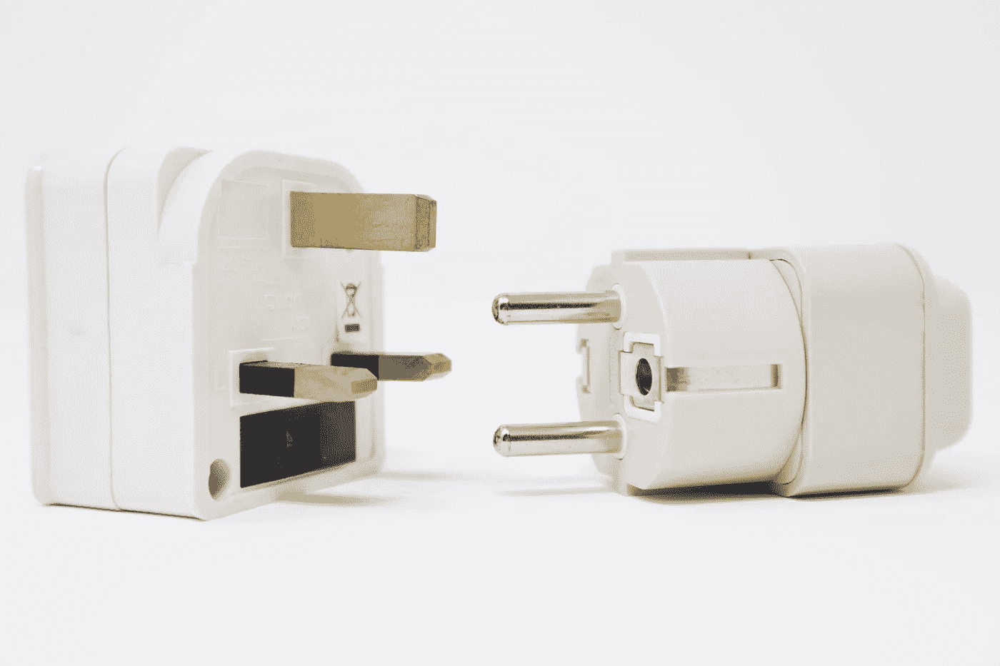

# 使用 Python 的代理、外观和适配器模式

> 原文：<https://medium.com/analytics-vidhya/proxy-facade-and-adapter-pattern-using-python-69e5a0e72b42?source=collection_archive---------11----------------------->

在本帖中，我们将看看在每个程序员的职业生涯中以这种或那种形式使用过的一些模式。我们将讨论代理、外观和适配器模式，因为它们容易混淆，更重要的是，一起讨论将使我们有机会比较和对比它们。



可以作为类比的一个最好的例子是《蝙蝠侠:动画系列》中的一集，蝙蝠侠身体不适或失踪，哥谭市需要他。超人决定接替他的位置，以阻止高谭市的犯罪，并给人留下蝙蝠侠仍在游荡的印象。可以看到蝙蝠侠(伪装超人)和贝恩的打斗。

这是我最喜欢的蝙蝠侠秀，我想在某个地方引用它很久了。让我们从设计模式开始。可以广泛地说，我们所涉及的所有三种模式背后的思想几乎与上面的视频中所示的相同。你有一件蝙蝠侠斗篷(界面)，连超人都能穿，能像蝙蝠侠一样战斗。

关键是“像蝙蝠侠一样战斗”，而不是成为他。他必须坚持和蝙蝠侠一样的战斗方式。他不会飞，不会射激光，尽管他很有能力这样做。他坚持蝙蝠侠的规则，但通过在视频结尾使用“超高速”稍微变通了一下。这种轻微的弯曲也可以被认为是适应。

既然所有的模式都是关于用另一个相似的对象替换一个对象来完成任务，那么为什么会有三个呢？我听到你问了。为了回答这个问题，让我们更深入地研究一下它们。

首先，我们必须首先设置学习这些模式时要使用的框架。

这是我最喜欢的蝙蝠侠秀，我想在某个地方引用它很久了。不管怎样，让我们开始理解这些设计模式。

可以广泛地说，我们所涉及的所有三种模式背后的思想几乎与上面的视频中所示的相同。你有一件蝙蝠侠斗篷(界面)，连超人都能穿，能像蝙蝠侠一样战斗。

关键是“像蝙蝠侠一样战斗”，而不是成为他。他必须坚持和蝙蝠侠一样的战斗方式。他不会飞，不会射激光，尽管他很有能力这样做。他坚持蝙蝠侠的规则，但通过在视频结尾使用“超高速”稍微变通了一下。

因为，所有这些模式都是关于用另一个相似的对象替换一个对象来完成任务，那么它回避了一个问题，区别是什么。让我们找出答案。

# 代理模式

列表中的第一个是代理模式，顾名思义，它用于代理一个对象。一个最大的例子是 RPC 或 CORBA。基本上，我们用一个轻量级的对象替换一个更重的对象，它负责在需要的时候管理这个重对象。

当需要一个替代对象(较轻的对象)时，代理模式起作用，这个替代对象实际上将作为中间人与一个远程对象(或较重的对象)进行通信。这样的设计最大的回报就是可测性。我们可以用本地对象测试我们的服务，当我们准备好了，我们可以用远程调用对象替换本地对象。

```
class DataStore:

    @abc.abstractmethod
    def load(self, query):
        passclass FileSystem(DataStore): def __init__(self):
        # Initialize volume def load(self, query):
        # Call some heavy method that takes a lot of time
        data = load_data_from_files_by(query) 
        return data class CacheSystem(DataStore): def __init__(self, actual_data_store: DataStore):
        this.store = actual_data_store
        this.cache = {} def load(self, query):
        if query in this.cache:
            return this.cache[query]
        data = this.store.load(query)
        this.cache[query] = data
        return data
```

在上面的例子中，我们可以看到一个简单的内存缓存的实现。这里，我们有一个带有方法 *load、*的抽象接口，它是由实现类如 CacheSystem 和 FileSystem 实现的。 *load* 方法接受一个查询并返回与该查询相关的数据。

可以看到，文件系统存储使用某种繁重的方法调用从磁盘加载实际数据，如果反复使用，会给系统资源带来很大压力。为了避免这种压力，我们可以简单地创建一个缓存系统，如上所示，作为文件系统和文件系统用户之间的代理。

代理的工作方式是确保当一个查询被给出来加载数据时，它首先检查它自己的缓存中是否已经加载并存储了该数据。如果是，则返回该数据，如果不是，则从实际存储中检索数据，存储在缓存中供以后使用，并返回给调用者。如您所见，实际存储在构造期间被传递给缓存存储。

这种中间工作正是代理所擅长的。它无缝地在客户机和服务器之间增加了一层，通常最终会减少客户机对服务器的调用次数，而客户机对此一无所知。

同一层还将客户机与服务器解耦，这样，如果服务器没有启动，代理也可以确保客户机不会中断等等。它最终真的使系统比不存在这些层的系统健壮得多，并且直接受到服务器上发生的事情的影响。

# 适配器模式

除了一点之外，适配器模式在所有方面都非常类似于代理模式。它适应客户端和服务器之间的接口。其他一切都一样。为了清楚地理解适配器和代理之间的区别，我们将考虑一个代理模式的例子。

```
class MicrosoftServer:
    def service(self):
         passclass AppleServer:
    def service_with_class(self):
         passclass GoogleServer:
    def service_nicely_but_without_guarantee(self):
        passclass ServerProxy:
    def __init__(self, server):
        self.server = server def service(self):
        if type(self.server) == AppleServer:
            return self.server.service_with_class()
        elif type(self.server) == GoogleServer:
            return self.sever.service_nicely_but_without_guarantee()
        return self.server.service()class Client:
     def __init__(self, server):
          self.server = server def call_server(self):
          service_received = self.server.service()
          # enjoy the service
```

如果你看到上面的例子，有三个服务提供公司:微软，谷歌和苹果。每个都有自己的服务接口。您正在编写的客户端可能需要基于某些约束与一个或另一个服务提供者进行对话。

所以真正的困境是，我们将不得不到处写 if else 条件，以确保我们使用这些公司公开的正确的服务方法。

想象一下这样一种情况，客户机类可能不在您的控制范围内，而您要对服务提供者负责。在这种情况下，服务提供者在接口上的差异会泄露给负责客户端类的任何人。

因此，为了避免泄漏抽象的情况，客户端必须知道它们每次都在与哪个服务器对话，我们可以创建一个适配器类，它就像代理类一样位于调用客户端和服务提供者之间。

适配器的这一层可以标准化服务方法，并确保所有客户端都不知道哪个提供者公开了哪个服务，从而将它们解耦。

这种分离是通过扮演中间人的角色来实现的，这类似于代理模式，但同时，您要使服务提供者适应与您的调用客户端共享的不同标准。

# 立面图案

顾名思义，Facade 模式就是在客户机和服务器之间放置一层 facade。就像代理和适配器一样，它的作用就像一个中间人，将客户机与服务器解耦。但是，与代理和适配器模式相反，facade 只是一个 facade。

这种模式的核心职责是简化接口。在意识形态上，它位于代理和适配器模式之间。与代理模式不同，它不像一个替身对象。与适配器模式不同，它不仅标准化了接口，还简化了接口。让我们再用一个例子来理解。

```
class Airplane:
    def tilt_left(self): pass
    def tilt_right(self): pass
    def rudder_right(self): pass
    def rudder_left(self): pass
    def tires_in(self): pass
    def tires_out(self): pass
    def throttle_up(self): pass
    def throttle_down(self): pass
    def is_high_enough(self): pass
    def is_low_enough(self): passclass AirplaneFacade(self):
    def __init__(self, airplane: Airplane):
        self.plane = plane def take_off(self):
        self.plane.tilt_up()
        while not self.plane.is_high_enough():
             self.plane.throttle_up()

        self.plane.tires_in() def land(self):
        self.plane.tilt_down()
        while not self.plane.is_low_enough()
             self.plane.throttle_down()
        self.plane.tires_out()

    def rudder_right(self):
        self.plane.rudder_right()

    ....
```

在上面的例子中，有一个飞机类，它公开了一些真正的技术和飞行员级别的方法。如果我们希望能够让一名新飞行员轻松驾驶飞机，而不必在简单的事情之前学习艰难的事情，那么我们需要揭露更简单的方法，这些方法隐藏了他们背后的艰难工作，并再次由某种中间人负责。

这正是 AirplaneFacade 所做的。它创建了一个具有额外方法的层，这样任何新飞行员都可以简单地起飞和降落，而不必太担心它们的复杂性，并最初专注于高空飞行。

这样，对他们来说，通过简单的飞行来训练自己，然后学习起飞和着陆的艰难工作变得很容易。虽然，我不认为这是飞行员真正的学习方式。老实说，我不知道，我猜:起飞和降落将是任何飞行员应该学习的第一件事。

不管怎样，为了我们的例子，让我们把起飞和着陆看作是不必要的困难的事情，可以在以后学习(是的，对！).

# 最后

正如您在上面所看到的，这些模式彼此非常相似，但又有足够的细微差别，可以称之为独立的模式。代理有助于隐藏大的东西，适配器隐藏了变化，外观简化了。我希望这能坚持下去。

最初发布于[https://Prog arsenal . com/proxy-facade-and-adapter-pattern-using-python/](https://progarsenal.com/proxy-facade-and-adapter-pattern-using-python/)