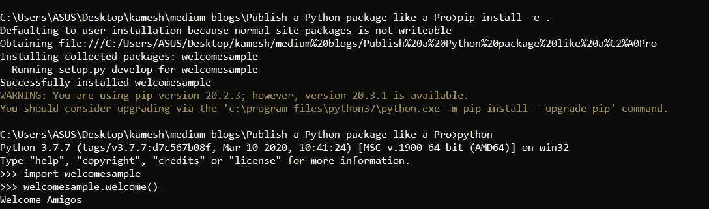
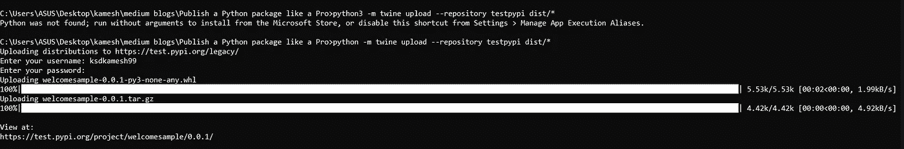
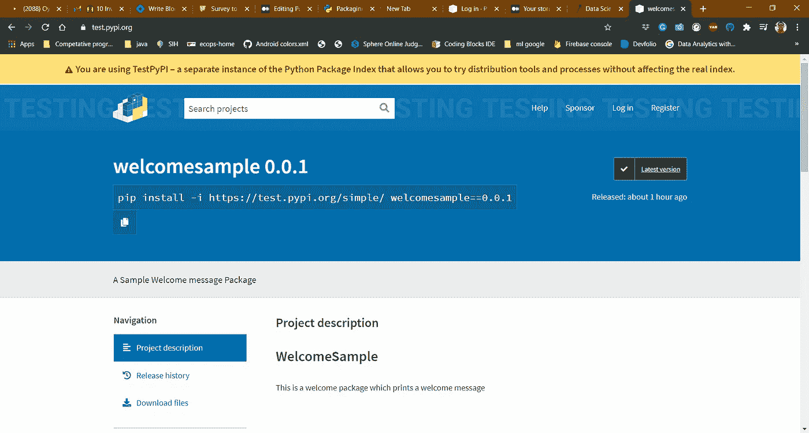
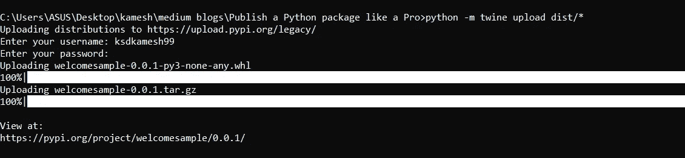
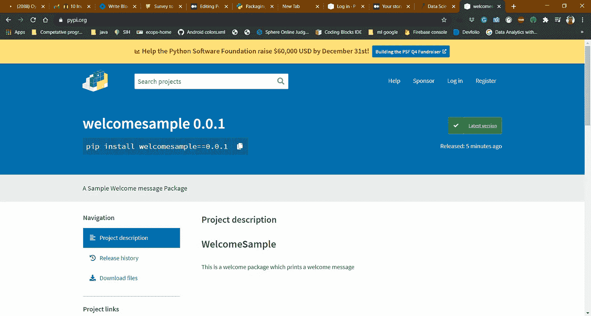

# 像专业人士一样发布 Python 包

> 原文：<https://medium.com/analytics-vidhya/publish-a-python-package-like-a-pro-bbda96e68bfb?source=collection_archive---------14----------------------->


来源:-[https://meme generator . net/instance/74177282/disaster-girl-they-said-they-wanted-python-I-show-them-pip-install](https://memegenerator.net/instance/74177282/disaster-girl-they-said-they-wanted-python-i-showed-them-pip-install)

如果你在 Pythoneer/Pythonista 或者至少熟悉 python，你会遇到单词 **PIP** ，因为这是一个重要的工具，我们将使用它来安装一个包以导入程序中的任何包。你有没有想过创建你的包或想知道这个过程是如何工作的，然后你来了一个完美的地方？这篇文章演示了您的一步一步的过程，因此您可以在阅读完这篇文章后立即发布您的包。

# **在 PIP 中发布 python 包的步骤:-**

1.  首先，您需要创建一个想要作为包发布的 python 脚本。例如，在我的例子中，我正在创建一个简单的脚本，它将返回一条欢迎消息。这是我想发表的以下脚本。

2.这个文件应该保存为 <packagename>.py。在我的例子中，我的包名是 welcomesample，所以上面的脚本应该保存为***welcome sample . py .***</packagename>

3.现在创建一个新文件夹，并保持它的名称与包名相同。

4.现在，在项目文件夹中创建一个名为“src”的子文件夹，并移动上述脚本所需的所有程序和文件。

5.现在用下面的脚本创建一个 setup.py 文件。

在上面的脚本中，setup()文件具有以下属性。

*   **名称**是您的软件包的*发行名称*。这可以是任何名称，只要仅包含字母、数字、`_`和`-`。它也不能已经采取了 pypi.org。**请务必使用您的用户名进行更新，**这样可以确保您在上传软件包时不会试图上传与已有软件包同名的软件包。在我的例子中，name 属性值是
*   **版本**是包的版本号。如果是第一个版本，您可以指定 0.0.1。它应该为包中的每个更新而更新。
*   **作者**是指发布这个包的作者的名字。
*   **author_email** 指作者的邮件。这个字段是可选的，但是很重要。
*   **描述**指对包装的简短描述，通常为 10 到 25 个字。
*   **long_description** 指的是软件包的文档，通常以降价文件的形式给出，这将在下一步中深入讨论。
*   **url** 指的是包的源代码。它可以是可选的，但很重要。通常，我们可以把包的 Github 库 URL。
*   **包**是指[分发包](https://packaging.python.org/glossary/#term-Distribution-Package)中应该包含的所有 Python [导入包](https://packaging.python.org/glossary/#term-Import-Package)的列表。我们可以使用`find_packages()`来自动发现所有的包和子包，而不是手动列出每个包。
*   **分类器**用于在 PyPI 过滤器领域对我们的项目进行分类。如果你想了解更多关于分类器的信息，你可以点击[链接](https://pypi.org/classifiers/)。
*   **python_requires** 用于指定你的包使用哪个 python 版本。为此，您需要手动检查并填写该字段。
*   **py_module** 指的是包名。这是强制性的。
*   **package_dir** 是指 src 文件路径。这是强制性的。

6.创建 setup.py 文件后，您需要创建一个 README.md markdown 文件来编写软件包的文档。它应该包含关于包的简短描述，如何使用这个包等细节。例如，您的 README.md 可能如下所示

```
# WelcomeSampleThis is a welcome package which prints a welcome message
```

README.md 文件的输出如下所示。

7.创建一个名为 Licence 的许可证文件。上传到 Python 包索引的每个包都必须包含一个许可证，这一点很重要。寻找许可证模板的最好方法是从 GitHub 中选择一个许可证模板，或者从 https://choosealicense.com/选择一个。例如，如果您选择 MIT 许可证格式，那么您的许可证将如下所示

8.完成上述步骤后，目录结构看起来与下图相似。请检查您的包目录看起来是否相似。

```
tutorial
├── LICENSE
├── README.md
├── WelcomeSample
│   └── src
       └── welcomesample.py
├── setup.py 
```

9.现在您需要为您需要创建的包生成分发归档文件。这些档案帮助我们在任何操作系统中安装我们的软件包。为此，您需要在 CMD 中运行以下命令来安装 wheel 和 setuptools。

```
python -m pip install --user --upgrade setuptools wheel
```

10.成功安装以上软件包后，现在您需要运行以下命令来生成归档文件(。gz)和车轮文件(。对于您要创建的包。

```
python setup.py sdist bdist_wheel
```

上述命令的输出将在您的工作包目录中生成两个目录，即 dist 和 build。如果你检查文件夹，你可以看到 2 个文件，即车轮。whl)和源归档文件(。gz)文件。这些对于发布您的包非常重要。目录结构如下所示

```
tutorial
├── build
├── dist
      ├── welcomesample-0.0.1.tar.gz 
      ├── welcomesample-0.0.1-py3-none-any.whl
├── LICENSE
├── README.md
├── WelcomeSample
│   └── src
       └── welcomesample.py
├── setup.py
```

我们需要 wheel 和源档案文件的原因是，较新的 pip 版本支持 wheel 构建的发行版，但如果需要的话，将会退回到源档案。如果我们包含这两个文件，那么我们的包可以安装在任何平台上。

11.现在我们可以使用下面的命令在系统中本地安装这个包。

```
pip install -e .
```

12.我们可以通过编写以下代码并运行它，在您的 IDE 中本地测试该包。

```
import welcomesample
print(welcomesample.welcome())
```

上面代码的输出如下所示。



万岁！它工作正常😎。

13.现在是时候将代码交付给 **PyPI** 了。在此之前，你需要先发布你的代码来测试PyPI。Test PyPI 是一个类似于 PyPI 的平台，用于实验和测试目的。您需要在以下网站注册才能继续。

[](https://test.pypi.org/account/register/) [## 创建一个帐户

### 跳到您正在使用的主要内容 TestPyPI——Python 包索引的一个独立实例，它允许您尝试…

test.pypi.org](https://test.pypi.org/account/register/) [](https://pypi.org/account/register/) [## 创建一个帐户

### Python 包索引(PyPI)是 Python 编程语言的软件仓库。

pypi.org](https://pypi.org/account/register/) 

14.在 2 个平台上创建帐户后，我们需要安装一个包裹绳来帮助运输包裹。为此，您需要在 CMD 中运行以下命令。

```
python -m pip install --user --upgrade twine
```

一旦安装了 twine 包，您就需要运行下面的命令来发布测试 PyPI 的代码。

```
python -m twine upload --repository testpypi dist/*
```

当我们运行上述命令时，它会要求您输入用户名和密码。输入我们在 Test PyPI 中注册帐户的凭据。一旦我们输入这些凭证，您的包就成功地安装在测试 PyPI 中。上述命令的输出如下所示。



15.现在我们可以访问给定的链接来检查包。现在我们的包正式发布在 Test PyPI 中。我们可以通过从给定的网页链接中获取命令，在任何系统中测试这个发布的包。在这种情况下，网页看起来像



```
pip install -i https://test.pypi.org/simple/ welcomesample==0.0.1
```

通过使用网页上的上述命令，我们可以很容易地将其安装在任何系统中。**但请记住这只是为了测试目的。**

16.一旦我们成功地安装了来自测试版 PyPI 的包，下一步就是在 PyPI 中为最终用户发布这个包。在发布之前，我们需要检查我们的包是否工作正常，然后继续下一步。

17.现在我们需要在 CMD 中运行下面的命令来将它发布到 PyPI。

```
python -m twine upload dist/*
```

当我们运行上述命令时，它会要求输入用户名和密码。我们需要输入在 PyPI 中注册帐户的凭证。一旦我们输入这些凭证，我们的包就成功地安装在 PyPI 中了。完成了，我们实现了🤩。上面代码的输出如下所示。



现在，您可以访问 CMD 中的给定链接，在 PyPI 中查看您的包页面。在我的例子中，它看起来像这样



## **现在你可以像专业人士一样发布任何 python 包。**

您可以使用 pip 命令在任何系统中安装这个软件包。对我来说是的

```
pip install welcomesample==0.0.1
```

# 一些重要提示:-

1.  当您想要更新您的 python 包时，请确保您增加了版本号，否则它可能会在过程中引发错误。
2.  当你想发布任何包时，确保你在 https://pypi.org/的[中检查是否存在任何带有你的包的包名。如果是这样，请确保将其更改为另一个并开始发布。](https://pypi.org/)
3.  当您想要更新 python 包时，请确保删除 dist 文件夹中的分发存档文件，并重复相同的过程进行发布。

这样，我们可以像专业人士一样轻松地将任何 python 脚本发布为一个包。

# 参考资料:-

 [## 打包 Python 项目——Python 打包用户指南

### 本教程将带您了解如何打包一个简单的 Python 项目。它将向您展示如何添加必要的文件…

packaging.python.org](https://packaging.python.org/tutorials/packaging-projects/)