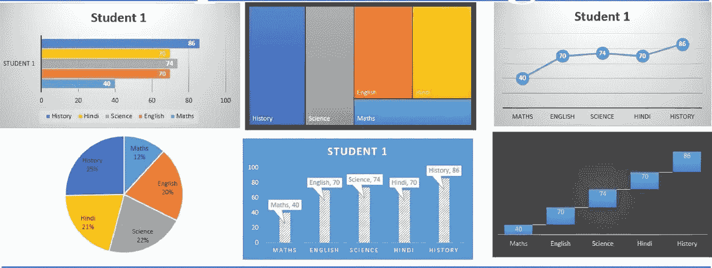

# 在“数据”领域追求你的职业生涯

> 原文：<https://medium.com/analytics-vidhya/pursue-your-career-in-the-data-field-edacb2f7d42b?source=collection_archive---------3----------------------->

> 让我们首先能够区分不断发展的行业中的工作角色，以正确设定我们的目标。

一个对数据一无所知的人，他/她可能想知道这个“基于数据的工作”是关于什么的。

首先想到的是术语**数据**是什么意思。一般来说，**数据**是为了某种目的(通常是分析)而收集和翻译的任何字符集。它可以是任何字符，包括文本和数字、图片或任何其他内容。如果数据不放在上下文中，它不会对人或计算机产生任何影响。

令人惊讶的是，在我们对“数据”这个词的简单理解中，有 8 种类型的工作角色。

1.  数据分析师
2.  数据科学家
3.  数据工程师/数据架构
4.  机器学习工程师
5.  商业分析员
6.  统计员
7.  大数据工程师
8.  MIS 报告主管

对于很多涉足这个领域或者想在这个以数据为基础的工作行业追求职业生涯的人来说，工作角色、要求和区别并不明确。不仅仅是求职者，有时招聘公司也不确定他们的招聘要求和数据型工作的哪个部分。他们不清楚自己希望员工从事的实际工作是什么，公司需要什么，他们的目标是什么，以及他们正在寻找的工作领域。

最常见的错误是，公司以及求职者认为数据分析师和数据科学家是一样的！有些情况下，一家公司想要雇用某人作为数据科学家，但他们最终雇用了数据分析师，反之亦然。作为一名数据工程师或机器学习工程师，也存在类似的困惑。

所以，让我们先了解一下工作，要求和工作之间的区别。

**数据分析师**:数据分析师在数据科学中扮演着重要角色。他们执行与收集、组织数据和从中获取统计信息相关的各种任务。他们还负责以图表、图形和表格的形式呈现数据，并使用这些数据为组织构建关系数据库。当数据科学项目的结果需要传达给其他部门时，数据分析师必须精通数据故事的艺术。而且，由于数据的解释不需要完整的编码，数据分析师可以是一个不知道太多编码的人！

**数据科学家:**数据科学家是一名专业人士，通常拥有应用数学和/或统计学背景以及计算机科学。数据科学家也将有背景选择适当的机器学习算法，训练它们，并设计测试其准确性的方法。他/她从业务角度理解数据。他负责进行预测，帮助企业做出准确的决策。让他们与众不同的是他们在商业上的才华，以及与商业和 IT 领导打交道的出色沟通技巧。当数据科学项目的结果需要传达给业务堆栈持有人时，数据科学家必须精通数据故事的艺术。这项工作需要能够以涉众能够理解的方式口头和视觉传达复杂的结果和观察结果。数据科学家还应该掌握 R 或 Python 语言的编码技能。一个数据科学家的编程技能不应该有那么高的水平。

**数据工程师:**数据工程师是有编程背景的人。他们的背景通常是 Python、Java 或 Scala 之类的语言。他们的重点是分布式系统和大数据。与数据科学家相比，他们的编程技能更先进，专门用于构建高可用性生产系统，尽管数据工程师也实施数据科学家为生产环境选择的机器学习算法。数据工程师的编程技能被用来创建大规模的数据管道。这涉及到集成多种大数据技术。数据工程师也深入了解数据技术和框架，以及如何将它们与数据管道集成。

**数据架构师:**数据架构师的工作是定义各种数据实体和 IT 系统将如何存储、消费、集成以及管理数据。他们基本上为企业建立复杂的计算机数据库系统，并与负责数据库需求的团队一起工作，这些数据库是可用的，需要维护，等等。

**机器学习(ML)工程师:**ML 工程师的主要职责是处理大量结构化或非结构化数据，并设计和实现机器学习算法。ML 工程师应该能够设计和开发高质量、生产就绪的代码，这些代码可以被组织中的云平台用户使用。他/她应该在 Python、R 等统计语言方面有丰富的经验。和 ML 概念的知识，应该知道如何处理大量的数据集和分布式计算，还应该有数据挖掘技术等方面的概念。

**商业分析师:**他们分析企业和设计机构、部委以及非营利组织。任何公司的核心业务都充满了流程，而这些流程的成功运行是业务分析师的责任。业务分析师的角色包括产生新流程的想法，开发新流程，并在本质上实现新流程以确保它们运行良好，分析业务模型以及它们与技术的关联。业务分析包括以下级别:

*   **战略规划**——在这个层次中，分析包括对公司战略活动的评估。
*   **业务/运营模式分析** —这一级别包括识别组织开展业务的政策和程序。
*   **流程定义&设计** —这里分析的是业务流程建模，它往往是流程设计和建模的结果。
*   **IT &技术业务分析** —这种级别的分析通常会在 IT 领域遇到。

**统计员:**统计员收集数字数据来解决现实世界的问题。他们使用数学和统计技术来深入分析数据，并帮助企业、医院、研究公司和政府机构。他们识别用户趋势并做出明智的决策。他们既可以独立工作，也可以团队合作。他们单独在医疗保健行业工作，也在政府和金融机构的团队中工作(即与其他数学家、工程师和科学家一起工作)。统计学家帮助机构做出明智的业务和政策选择。要成为统计学家，通常需要统计学或数学硕士学位。这个人应该是注重细节的人，喜欢处理大量的数据。雇主还会寻找以下技能:

*   ***统计编程***
*   ***数据分析***
*   ***数学技能***
*   ***写作技巧***
*   ***项目管理***
*   ***人际交往能力***
*   ***批判思维***

**大数据工程师:**顾名思义，大数据是非常大的数据集，可以通过分析来揭示模式、趋势和关联，尤其是与人类行为和互动相关的模式、趋势和关联。大数据工程师就是从事这些工作的人。大数据工程师是创建和管理公司大数据基础设施和工具的人，也是知道如何快速从大量数据中获得结果的人。主要重点在于通过监控和实施来选择最佳解决方案。要成为大数据工程师，应该具备:

*   了解分布式计算原理
*   精通 Hadoop，管理 Hadoop 集群
*   了解大数据查询工具，如 Pig、Hive 和 Impala。
*   了解 Spark，整合来自多个数据源的数据。

**MIS 报告主管:**你首先想到的一定是 MIS 代表什么。井信息系统是管理信息系统。业务经理依靠 MIS 报告来自动跟踪进度、做出决策和识别发生的问题。大多数系统提供按需报告，整理业务信息，如销售收入、客户服务电话或产品库存，这些信息可以与组织中的主要利益相关者共享。MIS 报告主管可以拥有计算机科学或工程、信息系统、商业管理或财务分析的学位。他们与公司公共关系、财务、运营和营销团队的顶级客户和同事会面，讨论这些系统在多大程度上帮助企业实现了目标。

# 结论:

数据科学教育和基于数据的工作正处于早期发展阶段；它正在演变成一个自我支持的学科，并产生具有独特和互补技能的专业人员。然而，在学生兴趣和行业需求不断增长的推动下，数据科学教育很可能会成为本科生经历的主要内容。随着数据技能的价值得到更广泛的认可，获得证书或学习数据科学课程的学生人数将会增加。但是到目前为止，这个领域的工作机会比有抱负的人多。因此，如果你正在考虑是否应该从事数据科学领域的职业，那么现在进入数据科学领域是一个很大的 ***是的！***