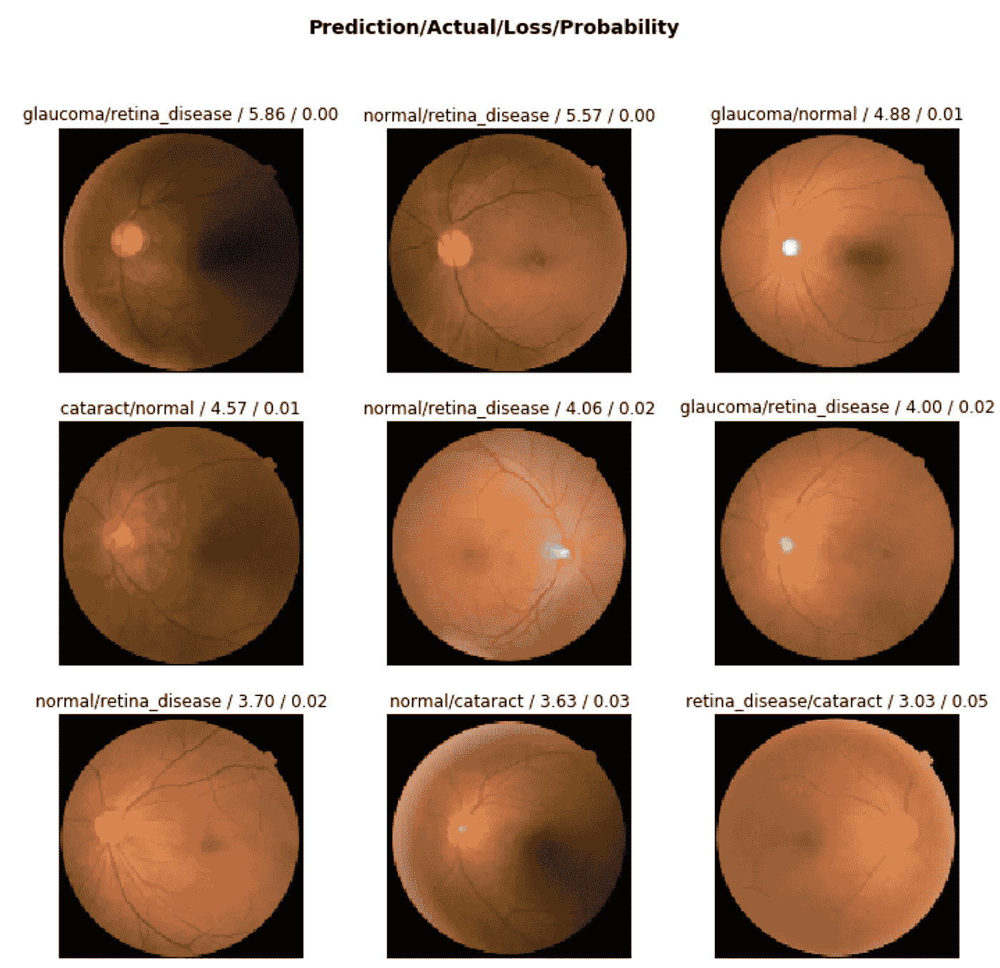
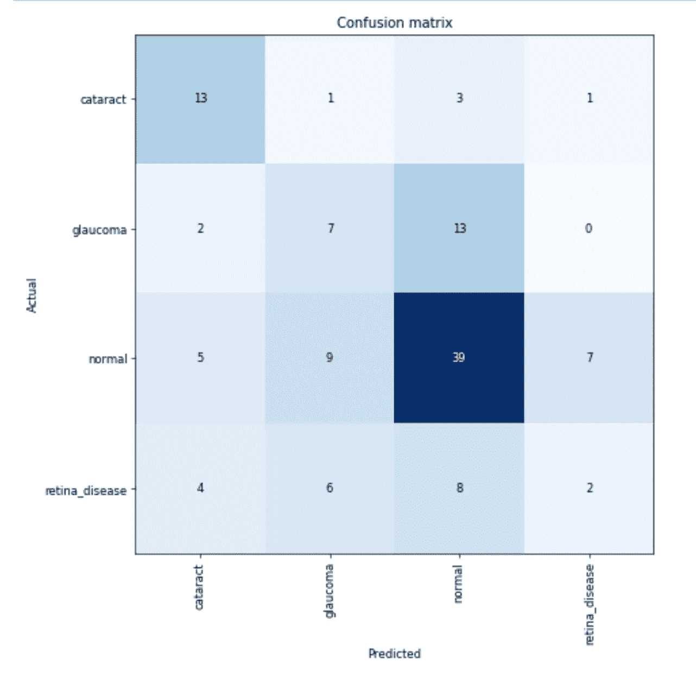
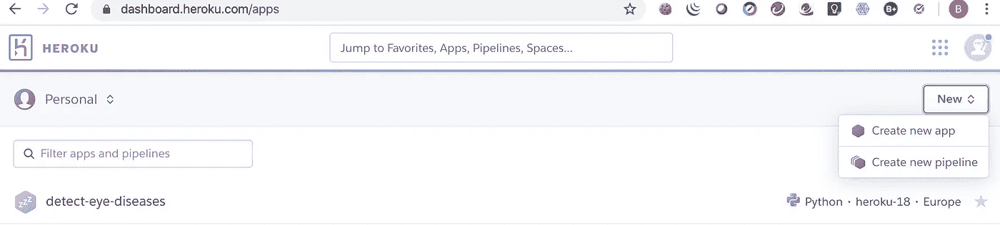
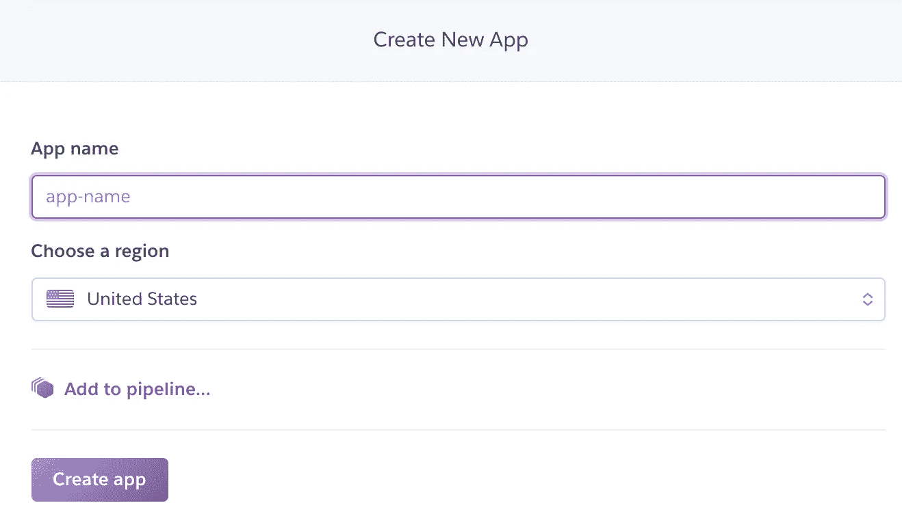
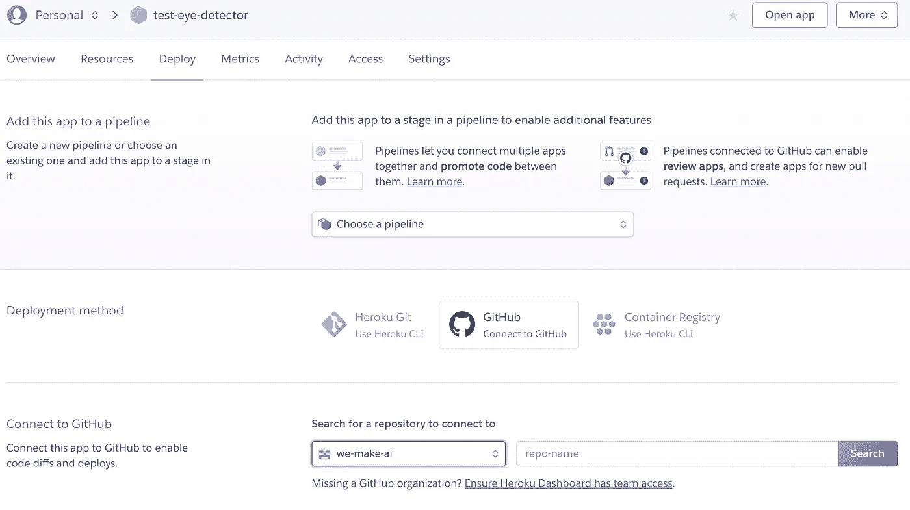

# 将深度学习图像分类器付诸行动

> 原文：<https://medium.com/analytics-vidhya/put-deep-learning-image-classifier-in-action-a956c4a9bc58?source=collection_archive---------8----------------------->

将基于 fastai 框架的图像分类器部署到 heroku。查看 github 上的完整项目代码:【https://github.com/we-make-ai/detect-eye-diseases 

在全球范围内，超过 10 亿人因未治疗的白内障(6520 万)、青光眼(690 万)和视网膜疾病(300 万)而受到视力障碍或失明的影响。

这篇博文展示了如何使用 [fast.ai 框架](https://www.fast.ai/)来检测眼部疾病——感谢杰瑞米·霍华德开发了这个奇妙的框架——并将模型部署到 heroku 这样的平台上(作为 python web-app)。

**图像分类器能够将视网膜图像分类为以下 4 类之一:**

*   常态
*   白内障
*   青光眼
*   视网膜疾病

我使用一个相当小的数据集进行训练，大约有 300 张来自 kaggle 比赛的图片:[https://www.kaggle.com/jr2ngb/cataractdataset/version/2](https://www.kaggle.com/jr2ngb/cataractdataset/version/2)

虽然数据集不是很大，但在迁移学习的帮助下，我获得了大约 75%的准确率。浏览笔记本，我将解释我做了什么来展示如何使用 fast.ai 来解决图像分类器的问题。

aveat:我没有和眼科医生讨论过这个结果。

这篇博客文章将关注部署完全训练好的模型的步骤。如果你对使用 fastai 框架更感兴趣，可以看看包含在项目 github repo 中的 [jupyter 笔记本文件](http://detect_eye_diseases.ipynb)。

# 数据集

让我们来看看一些训练数据:



还显示了混淆矩阵:



最终模型的准确率约为 75%。第一次尝试还不错。

# 导出模型

训练完模型后，我们必须导出它:

```
learn.export()
```

该函数将模型保存到项目路径(export.pkl)中。

我们希望使用一个低成本的 cpu 实例来进行预测。因此，我们必须将模型放在 cpu 上，而不是 gpu 上。

```
defaults.device = torch.device(‘cpu’)
```

现在，我们可以使用 load_learner(PROJECT_PATH)在我们的 web 应用程序中重新加载模型。

# 创建 Web 应用程序

starlette 框架是一种在网络上部署我们的模型的简单方法。我们可以使用任何网络前端来访问我们的模型。

我们必须实现服务于我们模型的 webapp 文件。

就看我在 github 上的[实现吧。Starlette 非常简单，只需定义一个路由和实现代码来提供一个 API-Backend。对于这个简单的演示，我只使用静态 HTML，但你也可以实现任何 javascript 前端客户端。](https://github.com/we-make-ai/detect-eye-diseases/blob/master/detect-eye-diseases.py)

我使用了 Jeremy 的存储库中的模板代码:[https://github . com/render-examples/fastai-v3/blob/master/app/server . py](https://github.com/render-examples/fastai-v3/blob/master/app/server.py)

为了访问分类器，我提供了上传图像或粘贴图像 URL 的功能。

```
@app.route(“/upload”, methods=[“POST”])async def upload(request): data = await request.form() bytes = await (data[“file”].read()) return predict_image_from_bytes(bytes) @app.route(“/classify-url”, methods=[“GET”])async def classify_url(request): bytes = await get_bytes(request.query_params[“url”]) return predict_image_from_bytes(bytes)
```

# 设置 heroku 应用程序

为了建立部署管道，我将 github 存储库与 heroku 集成在一起。只需创建一个新应用程序:



点击**新建**，选择**创建新应用**。

为您的应用程序选择一个名称，并在附近选择一个部署区域。然后点击“**创建 App** ”。



接下来，你去“连接到 GitHub”部分。选择您的 github 组织/帐户以及您想要链接到应用程序的存储库。

也许你必须在你的 github 帐号上安装 heroku 插件，以允许 heroku 访问你的库。



现在，每当你在 github repo 上推你的主分支时，heroku 会在你的应用程序上构建并部署一个新版本。您可以在“Activity”选项卡上看到构建过程的日志。

此外，您还可以使用 heroku cli 工具。安装 CLI-tools([https://devcenter.heroku.com/articles/heroku-cli](https://devcenter.heroku.com/articles/heroku-cli))后，只需登录您的终端并键入:

```
heroku logs -t — app=NAME_OF_YOUR_APP
```

如果您需要更细粒度的部署，您甚至可以使用不同的分支进行暂存。只需将您的应用程序连接到管道。

# **部署所需的附加文件**

将这些文件添加到您的存储库中:

**Procfile** (没有任何文件扩展名！).该文件包含 heroku 应用程序启动时的命令:

```
heroku ps:scale web=0
heroku ps:scale web=1
web: uvicorn ./app/detect-eye-diseases:app — host=0.0.0.0 — port=${PORT:-5000}
```

我必须添加“heroku ps:scale web=0”和“heroku ps:scale web=1”来停用和激活我的应用程序的 dyno。我认为这也可以通过仪表板来完成。

**requirement.txt** 指定你的 python 模块。你需要什么就选什么。

**runtime.txt** 指定基本系统。我使用 python 3.7.2

**。赫鲁库允许一个最大值。段塞大小为 500MB。添加部署时不需要的 repo 中的任何文件，以减少 slugsize。该文件的工作方式类似于. gitignore 文件。**

# 我为什么选择 heroku 进行部署？

首先:Heroku 对于小型演示应用是免费的。如果你想运行一个生产应用，你需要更多的能量，更多的能量意味着"*请投入更多的硬币……*"

第二，部署过程相当简单(如果你第一次就克服了困难……)

# 我在哪里可以找到这个伟大的应用程序？

就去 https://detect-eye-diseases.herokuapp.com/

如果需要一些医学影像进行检测:[https://www . medicine net . com/image-collection/retinal _ detachment _ picture/picture . htm](https://www.medicinenet.com/image-collection/retinal_detachment_picture/picture.htm)

查看 github 上的完整源代码:【https://github.com/we-make-ai/detect-eye-diseases 

如果想了解更多，关于如何利用 pytorch 和 fastai 从深度学习中获得最大收益，让我们看看我们的人工智能学院:[https://academy.we-make.ai/courses/](https://academy.we-make.ai/courses/)。

# 我是谁？

我是提供人工智能服务的公司 we-make.ai 的创始人之一。我们是一个由管理顾问和软件工程师组成的团队，专注于人工智能(尤其是深度学习)。

你对我们关于如何用人工智能改变商业的想法感兴趣？看看我们的新书吧！可通过亚马逊购买。

[https://amzn.to/2TUimWL](https://amzn.to/2TUimWL)

