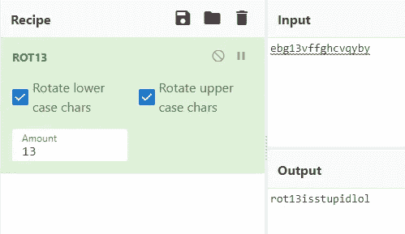
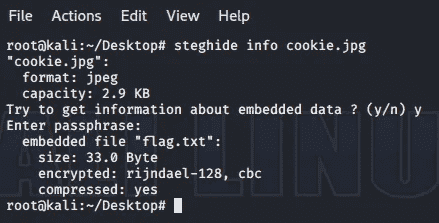

# 【PwndayCTF】书面报告

> 原文：<https://medium.com/analytics-vidhya/pwndayctf-writeup-52796355216?source=collection_archive---------21----------------------->

这是我第二次写 CTF！我在我经常浏览的一个子网站上看到了这个 CTF。如果你想试试这个 CTF，你可以从这个[链接](https://pwndayctf.live/challenges/)获得资源。这个 CTF 包含了来自 4 个不同领域的 20 个挑战！ **| Crypto | Misc | Stego | Web |。**请随意跟随！莱斯古·☀

> **加密挑战**

# 挑战 1 —不和谐机器人

```
import logging
import socket
from typing import Optionalimport aiohttp
from discord.ext import commands
from prometheus_async.aio.web import start_http_server as start_prometheus_http_serverfrom bot import apilog = logging.getLogger(‘bot’)class Bot(commands.Bot):
 def __init__(self, *args, **kwargs):
 self.connector = aiohttp.TCPConnector(
 resolver=aiohttp.AsyncResolver(),
 family=socket.AF_INET,
 )super().__init__(*args, connector=self.connector, **kwargs)self.http_session: Optional[aiohttp.ClientSession] = None
 self.api_client = api.APIClient(loop=self.loop, connector=self.connector)log.addHandler(api.APILoggingHandler(self.api_client))def add_cog(self, cog: commands.Cog) -> None:
 “””Adds a “cog” to the bot and logs the operation.”””
 super().add_cog(cog)
 log.info(f”Cog loaded: {cog.qualified_name}”)def clear(self) -> None:
 “””Clears the internal state of the bot and resets the API client.”””
 super().clear()
 self.api_client.recreate()async def close(self) -> None:
 “””Close the aiohttp session after closing the Discord connection.”””
 await super().close()await self.http_session.close()
 await self.api_client.close()async def start(self, *args, **kwargs) -> None:
 “””Open an aiohttp session before logging in and connecting to Discord.”””
 self.http_session = aiohttp.ClientSession(connector=self.connector)await start_prometheus_http_server(addr=”0.0.0.0", port=9330)
 log.debug(“Started Prometheus server on port 9330.”)
 await super().start(*args, **kwargs)client.run(‘WkdqnvIruKhoslqjPhRxwSZQHG’)
```

“几天前我发现了一个不和谐的机器人代码，你能帮我弄清楚在旗子是你的之后机器人在做什么吗?”！:)"

我们还获得了上面的字符串和代码片段。

我首先注意到的是代码片段最后一行中的客户端密钥。我猜测这可能是某种加密算法的结果。我启动了我的 goto 工具 [**CyberChef**](https://gchq.github.io/CyberChef/) 。在尝试了多种算法解密之后，最后用的是 ROT 13。但是，我没有转牌价值。所以我开始使用暴力，最终发现值是 23。


> flag—PWNDAYCTF { ThanksForHelpingMeOutPWNED }

# 挑战 2——啦啦土地

```
sister was singing a song, i think she hides something! Can you find it out?LALALLLLLLLALALLLLLLLALALLLLLLLALLLLALLLALLAAALLLAALLALLAAALALALLLAALLLLALLLLLAALLLLLALLALLLLLLALLLALALLALALALLLLLLLALALLLLLLLALALLLLLL
```

Erm w0t…..是的，当我第一次遇到这个挑战时，我也有同样的反应。经过大约 30 分钟的研究，我发现这是培根密码[](https://en.wikipedia.org/wiki/Bacon%27s_cipher)**。这是我第一次听说这样的密码。发现之后，我启动了 [**Cryptii**](https://cryptii.com/pipes/bacon-cipher) 试图解密它。**

****

**将“L”设为字母 1，将“A”设为字母 2 后。给了我这次挑战的旗帜**

> **flag—PWNDAYCTF { LaLaLaIJustPwnedATaskLaLaLa }**

# **挑战 3—第 13 名**

```
This should be easy..ebg13vffghcvqyby
```

**正如文本所暗示的，这个挑战实际上非常简单。标题“13 号”让我思考这是否与《腐烂 13 号》有关。所以我马上回到 cyber chef，检查这是不是正在使用的加密算法。**

****

> **flag—PWNDAYCTF { rot 13 isstupidlol }**

# **挑战 4——我的老朋友约翰尼**

```
I hacked a server last night and i found out a backup of root's password! But i cant crack it...... can u help me ? After that the flag is yours.$6$root$8u7I64NHnAq8bz/Ihl2UDGE2wKHZlHlhQesNehuq4dajROd9npVZor.NpO4YBU4sxezAKvlZQ.5ftQZIODrju0
```

**看完挑战赛的标题，我首先想到的是基于 Linux 的工具，[**JohnTheRipper**](https://www.openwall.com/john/)。我迅速拿起我信任的单词表，在密码散列上运行约翰。惊喜惊喜！我拿到旗子了。**

```
root@kali:~/Desktop# john — wordlist=wordlist.txt passwd
```

****

> **Flag — PWNDAYCTF{369852}**

# **挑战 5——邪恶配方**

```
9iOGO<EMS0:,5^:;):[.9ibq)[@oYBiAOpcU](http://twitter.com/oYBiAOpcU):KD:J<c)YQ@7<pm@r>sn=]e*K@;8h1;)!6><_#o-;f->r<&%6rA6;,T:2XlmAOUES@RY*T;L1fQ9mU;+=)2>J@kpMu>$#f$>!u+S9h7lW>#]08<`N!S:.7cF9gqW1@;9UI@PDbC@RNgB@5CMn<CBSQ@ou>m:.SPf:.7cuAStOf<GP3!@okNa<Cf_]=%5qY9is_s:/tg_=)E%u9iu(%:,#:09iu?mA8>4h9iXYQ<C]f%32 -> 58 -> -> 62 -> 64 -> 85 ??
```

**这个挑战的题目又把我引向了我的赛博咖啡馆(geddit？？recipe，cyberchef)。我想知道加密密文下面的数字是什么意思。然后琢磨了一会儿，我得出结论，它们和基础编码有关。**

****

**所以我决定解码数字和箭头后面的编码文本。这让我直接看到了下面的旗子。**

****

> **flag—PWNDAYCTF { 3 ggs _ s0d 4 _ 4nd _ 0n 3 _ L1z4d _ T41l _ mu 4 H4 H4 H4 h 4 }**

> ****隐写挑战****

# **挑战 1 — b33r**

****

**我只是被挑战创造者给了这张照片。我必须想办法从这个图像中得到一面旗帜。由于这是一个隐写挑战，我想到了使用 [**字符串**](https://www.lifewire.com/strings-linux-command-4093452) 工具来检查隐藏文本的图像。我就是这么做的。**

```
root@kali:~/Desktop# strings b33r.jpg > output.txt
```

****

**在输出的最后，我能够看到看起来像 base 64 编码的字符串。然后，我再次启动了赛博咖啡馆，并试图得到这面旗帜。**

****

> **flag—PWNDAYCTF { 34sy _ st3g0z _ ar3 _ l1ke }**

# **挑战 2—曲奇**

****

```
Give a “cookie” to the dog and you will get the flag. :)
```

**挑战创建者只给了我这张图片和这串文字。我必须想办法从这个图像中得到一面旗帜。“给一块饼干”这句话在我听来有点怪。我开始思考这意味着什么。我最终得到了类似于……的东西。cookie 是密码，我必须输入它才能获得标志。所以我就去尝试了。**

**经过一番研究，我发现了一个叫做 [**Steghide**](http://steghide.sourceforge.net/) 的工具。我用这个从图片中提取数据。**

```
root@kali:~/Desktop# steghide info cookie.jpg
```

****

**这个命令告诉我们有一个名为 **"flag.txt"** 的文件隐藏在图像中，但是我们需要输入另一个命令来提取这个文件。**

```
root@kali:~/Desktop# steghide extract -sf cookie.jpg 
Enter passphrase: 
wrote extracted data to "flag.txt".root@kali:~/Desktop# cat flag.txt 
PWNDAYCTF{yummy_yummy_thank_you}
```

**在输出的最后，我能够看到看起来像 base 64 编码的字符串。然后，我再次启动了赛博咖啡馆，并试图得到这面旗帜。**

****

> **flag—PWNDAYCTF { yummy _ yummy _ thank _ you }**

# **挑战 3—年兽**

****

**我只是被挑战创造者给了这张照片。我必须想办法从这个图像中得到一面旗帜。我做了和第一次挑战一样的事情。我点燃了绳子，再次分析了图像**

```
root@kali:~/Desktop# strings Nyan\ cat.jpg > output.txt
```

****

**在输出的最后，我能够看到看起来像 Pastebin 的链接，所以我跟着它。**

****

**这看起来像是一个基本的编码，所以我再次启动了赛博咖啡馆。它最终是一个 Base32 编码。所以我破译了它，拿到了旗子。**

****

> **flag—PWNDAYCTF { Ny4n _ c4t _ 1s _ c00l }**

# **挑战 4—QR 分解**

********

**给了我一个破二维码。它分为两部分。我赶紧启动 photoshop 尝试修补！**

****

**我成功拼凑后，用手机扫码，拿到了旗子！**

****

> **flag—PWNDAYCTF { ph 0t 0 sh 0 p _ sk 1 llz }**

# **挑战 5—到处都是旗帜**

****

**我只是被挑战创造者给了这张照片。我必须想办法从这个图像中得到一面旗帜。经过大量的研究，我发现这是 [**【旗语】**](https://en.wikipedia.org/wiki/Flag_semaphore) 。我用字符集来解密这条消息，并得出了标志。**

****

> **flag—PWNDAYCTF { ST 3g 0 sc 4 nb 3 int 3r 3s t1 ng }**

> ****杂项挑战****

# **挑战 1 —树**

****

**我只是从挑战的作者那里得到了这个 ASCII 签名/文本。我继续用我的肉眼分析它。这次挑战不需要工具。我找回了旗子。**

> **flag—PWNDAYCTF { D4mn _ Y0u _ F0und _ M3 _ Agrrrrrrr }**

# **挑战 2—异或**

```
39–39–38–2d-32–30–21–38–23–12–5f-18–36–07–01–51–33–56–07–0a-29–58–00–07–16–33–0c-07–18–1f-1a-1a-0b-0e-09–18Key is invisible sadly :(
```

**这个挑战的描述非常可疑，让我想起了 Stego Challenges 的挑战 2。然而，这个挑战的题目是异或。这次我用了 [**Dcode**](https://www.dcode.fr/xor-cipher) 而不是 CyberChef。我在字段中输入 xor 密码，并为 ASCII 密钥输入“不可见”。成功了！**

****

> **flag—PWNDAYCTF { 1n _ th3 _ 3nd _ 1 snt _ invisible }**

# **挑战 3—字母数字**

```
ABABAAAA ABABABBB ABAABBBA ABAAABAA ABAAAAAB ABABBAAB ABAAAABB ABABABAA ABAAABBA ABBBBABB ABBAAABA AABBAAAB ABBABBBA AABBABAA ABBBAABA ABBBBAAB ABABBBBB ABBAABBA ABBBABAB ABBABBBA ABBBBBAB
```

**这个挑战只有 a 和 b。我应该用这些做一面旗子。我首先想到的是把它转换成 1 和 0。这要归功于我的一个朋友[Synth#39**]，他为此编写了一个 python 脚本。**

****

**然后我把这些二进制数字转换成文本，最后得到了旗子！**

****

> **Flag — PWNDAYCTF{b1n4ry_fun}**

# **挑战 4—黑色**

****

**这是我得到的照片。这面旗帜被藏在显眼的地方。我不得不使用 windows photos 应用程序调整图像设置**

****

> **Flag — PWNDAYCTF{BL4CK_1S_4RT}**

# **挑战 5——纯艺术**

****

**这是我在这次挑战中得到的照片。国旗就藏在这张照片里……嗯，我在网上搜索过类似的东西，但没找到多少。经过几个小时的搜索，我发现了一个叫做**“Piet 程序”**的东西。它基本上是在这样的图像中隐藏文本串。这就像把你的代码构建到一个应用程序中，但是在这种情况下，图像就是代码……酷吧？！最终，我找到了这个执行 piet 程序的[](https://www.bertnase.de/npiet/npiet-execute.php)**网站。在执行完图像后，我成功地使用了标志。****

********

> ****Flag — PWNDAYCTF{p1et_ftw_baby}****

> ******网络挑战******

# ****挑战 1 —猎旗****

********

****当我访问这个网址时，迎接我的就是这个。和往常一样，我首先查看了 HTML 源代码。没有什么有趣的东西。然后我在 CSS 拐角处转了一圈。有几个值看起来是基本编码的。****

********

****然后，我使用这个命令将它们解码成 bash****

```
**root@kali:~# echo -n "insert_encoded_value" | base64 -d**
```

********

> ****flag—PWNDAYCTF { d4mn _ why _ y0u _ d1d _ Th1s }****

# ****挑战 2—滚装滚装****

********

****当我访问这个网址时，迎接我的就是这个。和往常一样，我首先查看了 HTML 源代码。没有什么有趣的东西。然后，我意识到有一个机器人的图片和“机器人. txt”是一个大多数网络服务器都有的文件，以防止爬虫访问他们网站的某些部分。所以很自然地，我导航到了/robots.txt. Boom！我们拿到旗子了:)****

> ****Flag — PWNDAYCTF{1_l0v3_r0b0ts}****

# ****挑战 3—客户端很糟糕****

********

****当我访问这个网址时，迎接我的就是这个。很明显，我必须绕过某种认证系统。因此，我查看了网站的源代码，发现了一些非常有趣的东西。成功登录后，网站会将你导向的 URL 被列出。因此我前往那里。不出所料，我拿到了旗子。****

****************

> ****flag—PWNDAYCTF { 1 _ h4t3 _ y0u _ 1ll _ B3 _ b4ck _ s00n _ g3t _ r34dy }****

# ****挑战 4—客户端吮吸 2****

********

****当我访问这个网址时，迎接我的就是这个。很明显，我必须绕过某种认证系统。因此，我查看了网站的源代码，发现了一些非常有趣的东西。成功登录后，该网站将引导你到的网址再次列出。这次挑战和上一次的唯一区别是我不能用快捷键访问开发者标签。输入被站点阻止。我只是通过使用浏览器选项手动打开它来解决这个问题。****

****************

****我最终得到了一个十六进制值。我只是简单地将十六进制转换为文本，并获得了标志。****

********

> ****Flag — PWNDAYCTF{1_g1v3_up_by3}****

# ****挑战 5—精英安全****

********

****当我访问这个网址时，迎接我的就是这个。很明显，我必须绕过某种认证系统。因此，我查看了网站的源代码，发现了一些非常有趣的东西。成功登录后，该网站将引导你到的网址再次列出。登录代码是用 javascript 写的，被混淆了。我花了一些时间美化代码。以下是前后对比。****

****************

****这里简单解释一下。上面的原始代码首先创建一个数组，数组中的单词可以在我的代码的修改版本的顶部找到。然而，这些值是作为十六进制值输入的。因此我们无法阅读它们。在解码了对应于数组的每个值之后，我们就知道这个循环要做什么了。=> **如果 UserId = Administrator，Pswrd = s 3c 8 r 34 shock，就让他们进来。这是网站开发人员的一个很好的努力，但并不难破解。破解代码后，我输入用户名和密码登录。******

********

****迎接我的是这幅图像，而不是国旗。思考了一会儿后，我决定下载这张图片并运行我在隐写挑战中使用的字符串工具。****

```
**root@kali:~/Desktop# strings notreallytheflag.jpg > output.txt**
```

********

****在检查输出时，我意识到有一个用 base 64 编码的翻转字符串。我很快得到了一个脚本来帮助翻转文本，以便我可以解码。之后我解码了字符串，成功拿到了旗子。****

****************

```
**root@kali:~/Desktop# echo "UFdOREFZQ1RGe0c0bTNfMHYzcl8xX2d1M3NzfQ==" | base64 -dPWNDAYCTF{G4m3_0v3r_1_gu3ss}**
```

> ****flag—PWNDAYCTF { g4m 3 _ 0v3r _ 1 _ gu3ss }****