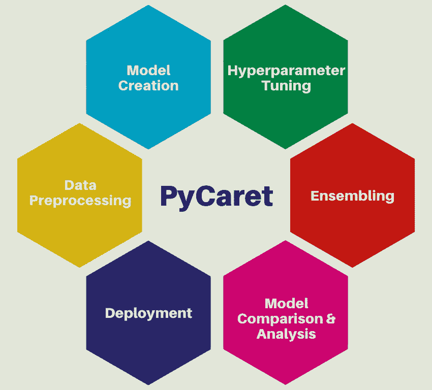

# py caret—在几分钟内准备好您的机器学习模型

> 原文：<https://medium.com/analytics-vidhya/pycaret-prepare-your-machine-learning-model-in-minutes-db7525d8615?source=collection_archive---------5----------------------->

py caret——涵盖快速原型制作的所有基础知识

在研究机器学习问题时，如果我们可以快速比较几个模型，这将反过来帮助我们决定我们将时间和资源投入哪个模型，这不是更好吗？PyCaret 就是这样一个库。即使是 scikit-learn 也可以做到这一点，但 PyCaret 的与众不同之处在于它提供了一个低代码版本，我们可以在这个版本上工作…