# PyCharm 的主要特性

> 原文：<https://medium.com/analytics-vidhya/pycharms-top-features-611a886e953a?source=collection_archive---------5----------------------->

## Python 编程最著名的 IDE 之一的[隐藏]品质

> PyCharm 是我用过的最重的 ide 之一，它很慢，需要太多内存，最重要的是我讨厌它的索引时间。也就是说，我喜欢它。

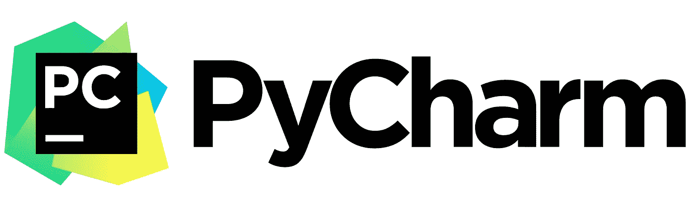

老派的程序员可能不同意，但是让我们面对现实吧，就日常工作而言，IDE 是极其重要的，它越简化您的工作越好。以下是我最喜欢的一些功能:

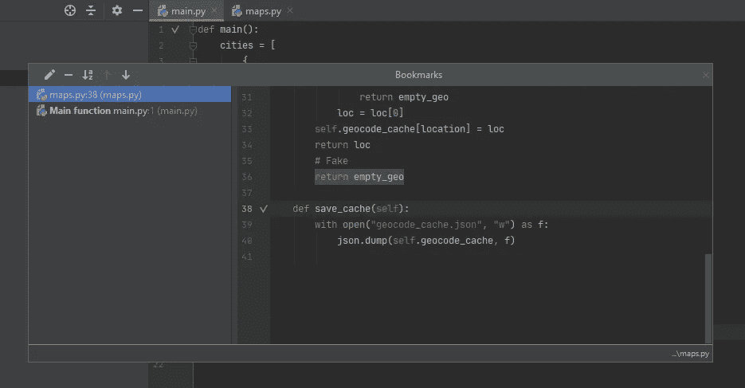

## 10.书签

当您有一个大型项目时，您经常会发现自己在搜索一些代码片段，您知道这些代码片段可能是问题的根源，或者是您开始调试错误的通常入口点。

书签使用起来非常直观，不需要太多解释，你只需标记一行代码( *F11* ，打开所有书签( *Shift+F11* )，就可以轻松导航回该行代码。

## 9.到处搜索

这实际上是我最常用的功能之一，只需简单地双击 Shift 键 PyCharm 就会打开一个搜索工具，让您在 python 类、文件名和其他符号中搜索一个术语。
右上角的过滤工具也有助于更好地完善您的研究。这对快速完成大项目至关重要。

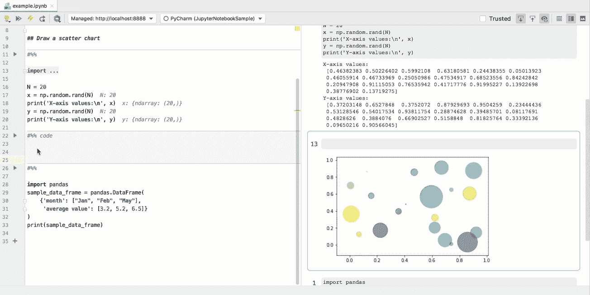

单个笔记本单元执行和调试的示例

## 8.Jupyter 笔记本支持

*仅专业功能* 如果您同时使用 python 笔记本和 python 文件，您可以在同一个 IDE 中轻松切换它们。
PyCharm 提供三种不同的查看模式和其他笔记本的必备工具。

## 7.Node.js 外部调试器

如果您使用 python 编程，您可能会想"*为什么我需要 PyCharm 中 Node.js 的外部调试器？*”。但是如果您使用 python 进行 web 开发，您会知道许多现代设置在大多数时候都有一个 JS 服务器在某个地方工作，尤其是对于基于微服务的架构。

通过安装这两个可选插件: [Node.js](https://plugins.jetbrains.com/plugin/6098-node-js) 和 [Node.js 远程解释器](https://plugins.jetbrains.com/plugin/8116-node-js-remote-interpreter/)，PyCharm 允许您通过利用 Node.js 的“- inspect”功能来插入一个**远程调试器**

要使用它，只需启动一个激活了"- inspect "的服务器，它将显示一个 PyCharm 可以连接的端口，之后，您可以通过选择" Attach to Node.js/Chrome". "来创建一个运行/调试配置，我将在这里留下[一个更详细的官方文档指南](https://www.jetbrains.com/help/pycharm/run-debug-configuration-node-js-remote-debug.html)。

好的一面是，无论您的节点服务器是运行在 *Docker 容器*还是运行在 *localhost* 中，它都可以工作(如果您使用 Docker，记得暴露- inspect 端口)。

## 6.码头译员

*Professional feature only*
我不会在这里喋喋不休地谈论 Docker 的重要性和实用性，但是如果您喜欢它，PyCharm 完全支持您使用远程解释器。

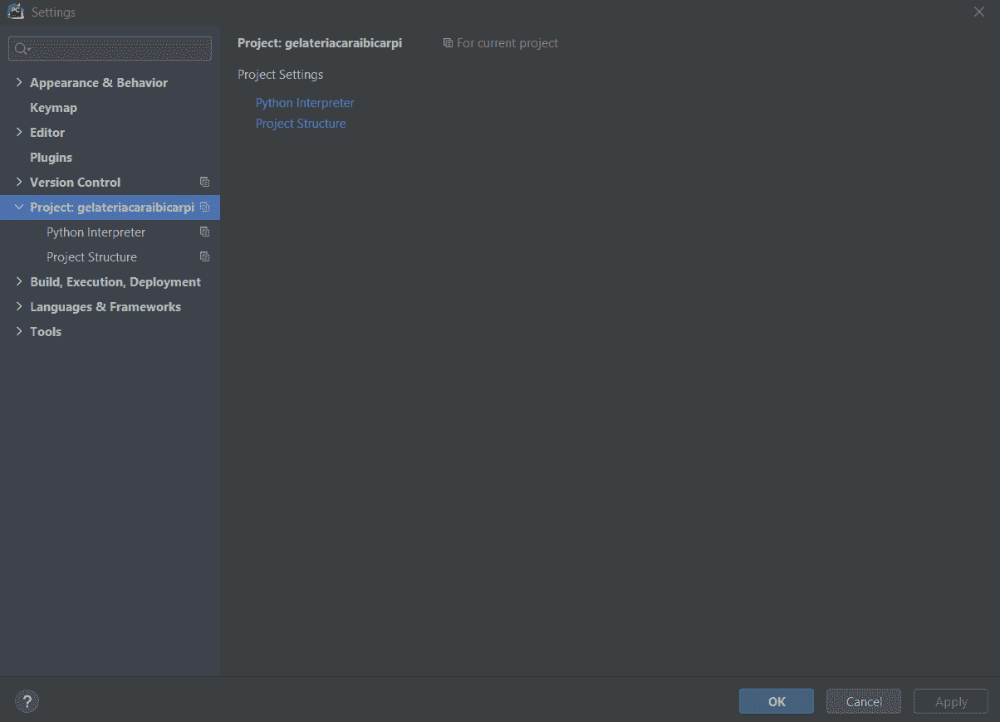

只需 3 个步骤即可轻松设置基于 Docker 的解释器，PyCharm 会自动选择您的 docker-compose 文件(如果找到的话)

设置它很简单，只需通过选择 *Docker* 或 *docker-compose* 来设置您的项目解释器(甚至更简单)，它就完成了:PyCharm 将在每次您使用这个解释器运行某些东西时自动创建 Docker 容器，并附加另一个容器以使用调试器。

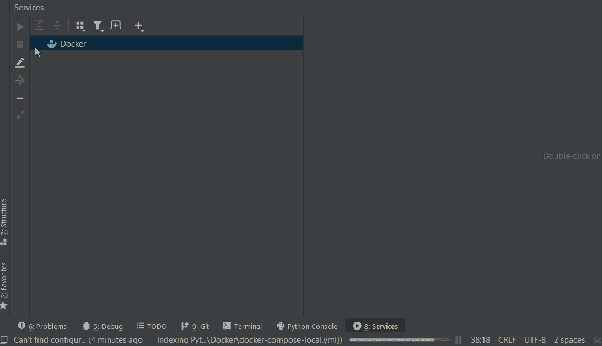

docker exec 的一个例子是一个已经启动并运行的容器，我们启动一个 shell 命令(/bin/bash)让我们在容器内部操作。

我发现的唯一恼人的缺点是，你不能用同一个基于 Docker 的解释器运行两个或更多的运行/调试配置，因为它会试图重新创建一个容器，停止另一个。
一个绕过这个问题的有用工具是使用[*docker attach*](https://docs.docker.com/engine/reference/commandline/attach/)*或 [*docker exec*](https://docs.docker.com/engine/reference/commandline/exec/) ，你可以在命令行中使用这些命令或者通过使用图形界面下的 *Services* 菜单。*

*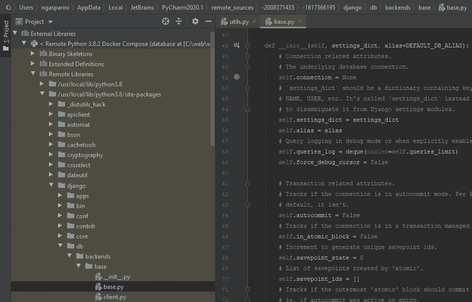*

*在 Darcula 主题中，外部库文件以黄色显示*

***调试 docker 外部库***

*如果我们讨论的是 Docker，值得一提的是，一旦你设置了一个远程 Docker 解释器，PyCharm 就可以让你在你的项目根文件下面看到一个“外部库”列表。即使对于其他解释器(如虚拟环境)来说也是如此，但是您可能不知道，如果一个外部包给您带来了一些麻烦，您可以将它作为您自己的文件之一进行调试，只需探索路径、设置断点并调试它*

*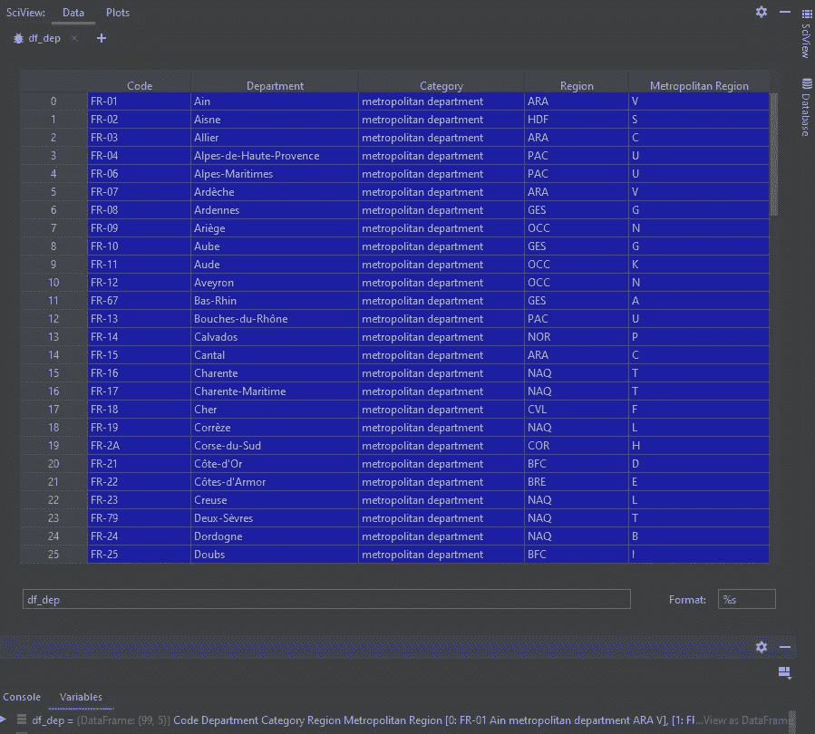*

*展示熊猫数据框架的科学视图示例*

## *5.科学观*

**Professional feature only* Pandas 在[年度堆栈溢出调查](https://insights.stackoverflow.com/survey/2019#technology-_-most-loved-dreaded-and-wanted-other-frameworks-libraries-and-tools)中排名第四，是今年最受欢迎的框架，如果你使用它，你肯定会需要查看你正在处理的数据，而且，让我们承认， *df.head()* 不是很方便。
PyCharm 的**科学视图**对于查看和调试数据帧非常有用，因为它允许您直接评估过滤器、格式化数据和保存多个数据集。*

## *4.自动格式化程序和导入优化程序*

*对于订单狂热者和完美主义者来说，这是一个不错的选择，这两个功能可以帮助您保持干净的代码，遵循 PEP8 标准，甚至解决一些麻烦，如循环依赖。它不能像 python black 那样工作，但是 PyCharm 可以让你选择要使用的格式化选项和要格式化的内容。*

*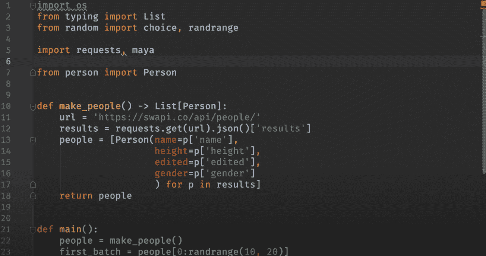*

*优化导入，用 Ctrl+Alt+O 试试*

*这是用一个简单的键盘快捷键保持代码格式的一个简单而干净的方法: *Ctrl+Alt+L* 格式化代码， *Ctrl+Alt+O* 优化导入。*

*PyCharm professional 还允许您将这些特性用于其他语言，如 *JS* 。*

*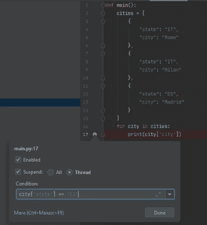*

## *3.条件断点*

*调试器的一个强大功能是它的条件断点。*

*名字说明了一切，只有在满足特定条件时才停止调试器，没有比这更简单的了，但是非常有用。*

*要激活条件断点，只需添加一个并右键单击它。*

*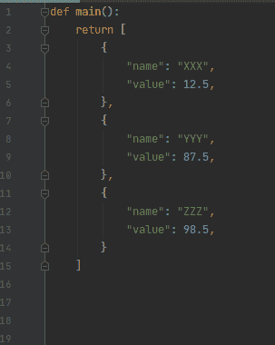*

## *2.多光标书写*

*这没有上面列出的其他功能有用，但它非常酷，给你一种不可思议的力量感，这是它值得位居第二的主要原因。
通常用于 JSON 文件，而不是实际的编程，当你处理许多类似的对象时，它仍然是一个非常好的时间节省器。*

## *1.评估对话框*

*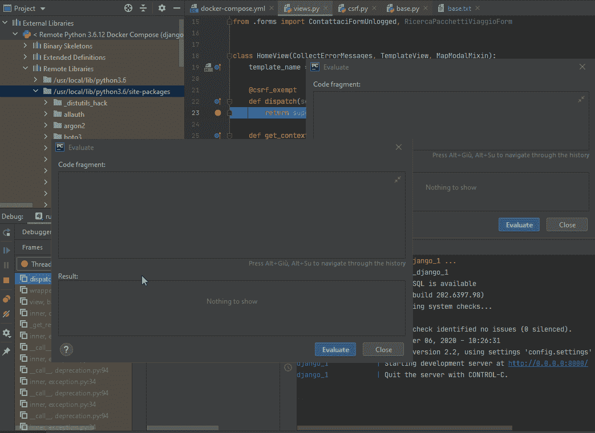*

*在一个评估窗口中定义函数，并在另一个窗口中使用它。Alt+F8 打开对话窗口，Shift+Enter 从单行切换到多行。*

*这只是 IDE 中最基本的功能之一，但我相信 PyCharm 提高了很多:通过评估对话框，它提供了一个可分离的、多行、多窗口的工具，可以让您轻松地编写整个应用程序，同时保持调试状态。*

*你当然可以用它来定义或调用函数和变量，改变现有的函数和变量，测试函数调用是否有异常，导入丢失的包，但是它的强项在于它的可用性，你甚至可以搜索和替换窗口内的文本，或者维护评估历史。*

*虽然不是 evaluate 本身的特性，但是 PyCharm 的 [Frames](https://www.jetbrains.com/help/pycharm/debug-tool-window-frames.html) 面板可以让您轻松地在调试执行的历史中切换线程，并评估变量，就好像您就在那里一样。*

## ***奖励功能！解决冲突***

*查看[这里的官方文档](https://www.jetbrains.com/help/pycharm/resolve-conflicts.html)关于这个特性，它并不吸引人，但是它真的有用！一旦你掌握了窍门，它会让你接下来的冲突变得轻而易举。*

*这就是我列出的 PyCharm 的特性，我想回顾一下我在日常工作中经常使用的一些特性，希望它们能像对我一样节省别人的时间。*