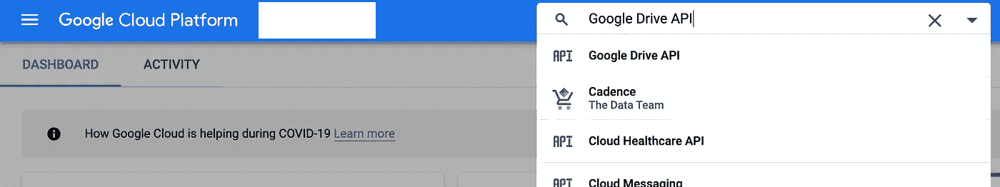
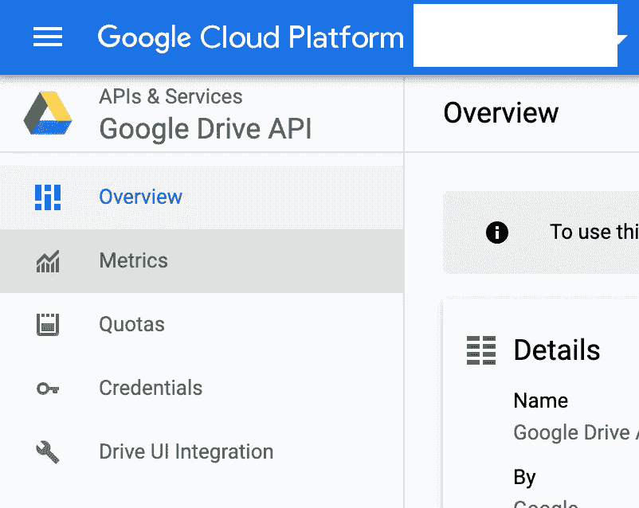
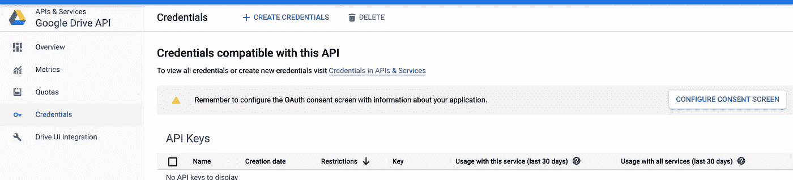
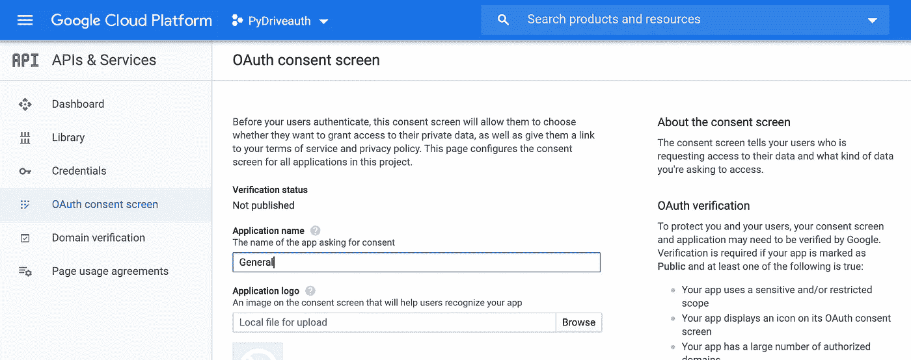
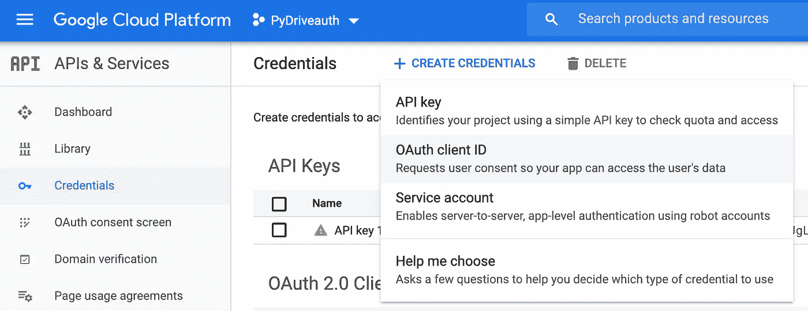
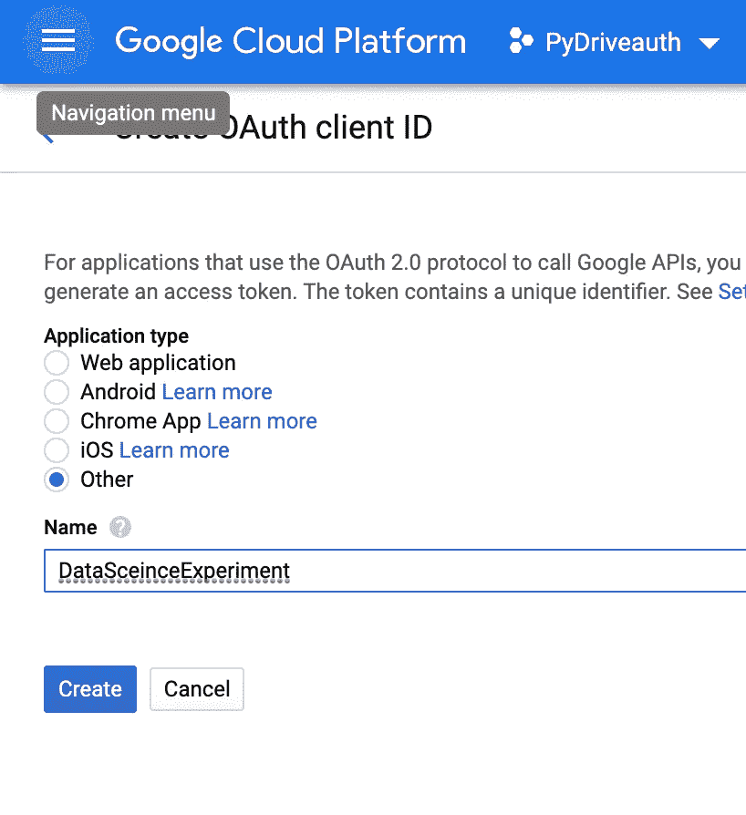
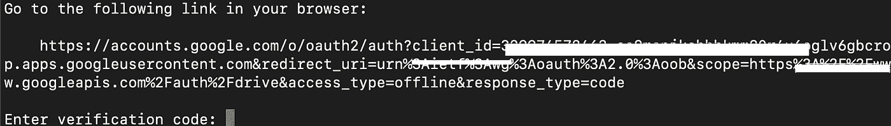
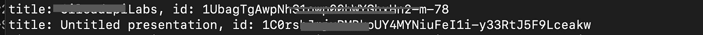

# Pydrive 从 Google Drive 下载到远程机器

> 原文：<https://medium.com/analytics-vidhya/pydrive-to-download-from-google-drive-to-a-remote-machine-14c2d086e84e?source=collection_archive---------2----------------------->

1.  **安装 PYDRIVE**

在您想要从 Google drive 下载文件的远程机器上，使用 pip 命令安装 PyDrive

```
$ pip3 install PyDrive
```

**2。OAuth 验证:正在下载 client_secrets.json 文件。**

驱动器 API 需要 OAuth2.0 进行身份验证。转到[API 控制台](https://console.developers.google.com/iam-admin/projects)并创建您的项目。当你点击链接时，你将被带到你的谷歌云开发者控制台。单击“创建项目”创建一个新项目。在项目仪表板中搜索“Google Drive API ”,选择条目，然后单击“启用”。



从左侧菜单中选择“凭据”，单击“创建凭据”。点击配置同意屏幕。



如下所示配置 OAuth 同意。



完成 OAuth 同意后，单击 OAuth 客户端 ID。



为“应用程序类型”选择“其他”,并为 OAuth 客户机 ID 命名，然后单击“创建”。



一旦创建了 OAuth 客户端 ID，您就可以下载“client_*************”。json。这个 json 文件包含应用程序的所有身份验证信息。将文件重命名为“client_secrets.json ”,并将其放在您的工作目录中。

**3。对远程机器**使用 CommanLineAuth()

使用下面的代码，在与 client_secrets.json 文件相同的文件夹中创建 *quickstart.py* 文件。我们使用 CommandLineAuth()，因为 [CommandLineAuth()](https://pythonhosted.org/PyDrive/pydrive.html#pydrive.auth.GoogleAuth.CommandLineAuth) 从用户的命令行获取代码。在 quickstart.py 中键入以下命令

```
from pydrive.auth import GoogleAuthfrom pydrive.drive import GoogleDrivegauth = GoogleAuth()gauth.CommandLineAuth()drive = GoogleDrive(gauth)
```

当您运行 quickstart.py 时，您将获得链接以获取验证码，如下所示。将链接复制到浏览器，从浏览器获取验证码并粘贴。



一旦你输入验证码-你会得到'认证成功'。

要获得驱动器中所有文件的列表，请将此代码添加到 quickstart.py 中

```
file_list = drive.ListFile({‘q’: “‘root’ in parents and trashed=false”}).GetList()for file in file_list:
    print(‘title: %s, id: %s’ % (file[‘title’], file[‘id’]))
```

这将列出根目录中所有文件的标题和 id。



要下载特定目录中的所有文件，请获取该目录的 id，并使用 GetContentFile()下载所有文件。

```
file_list = drive.ListFile({‘q’: “‘*******-4GVR2j****RdPSGquB-***’ in parents and trashed=false”}).GetList()for file in file_list:
    print(‘title: %s, id: %s’ % (file[‘title’],file[‘id’]))
    file.GetContentFile(file[‘title’])
```

每次运行 quickstart.py 时，都会要求您输入验证码。为了自动化验证，您可以将 settings.yaml 文件添加到您的文件夹中。将以下代码添加到 settings.yaml 文件中。对于 client_config 下的' client_id '和' client_secret ',从 client_secrets.json 文件中复制它们。另外，使用 vim 在文件夹中创建一个名为 creds.json 的空文件。

注意— creds.json 将在您第一次运行 quickstart.py 时自动获取所有凭据。所以这里一开始就是空的。

```
client_config_backend: ‘settings’
client_config:
   client_id: “{client_id from client_secrets.json}”
   client_secret: “{client_secret from client_secrets.json}”
save_credentials: True
save_credentials_backend: ‘file'
save_credentials_file: ‘creds.json’
oauth_scope:
- “https://www.googleapis.com/auth/drive"
```

基本上，当前工作文件夹应该包含以下所有文件。

```
quickstart.py
creds.json
settings.yaml
client_secrets.json
```

添加 settings.yaml 文件后，第一次运行 quickstart.py 时，会提示输入验证码。一旦第一次成功通过身份验证，您的登录凭证就会保存到 creds.json 文件中。当您稍后运行 quickstart.py 时，身份验证会自动进行。

代码可从[https://github . com/bhuvanakundumani/py drive _ 4 _ remote machine . git](https://github.com/bhuvanakundumani/pydrive_4_remotemachine.git)获得