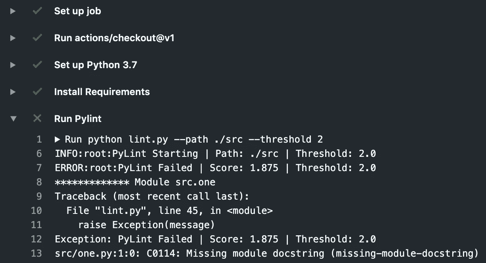
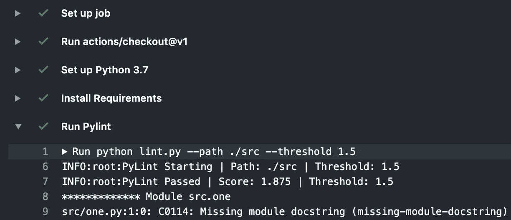
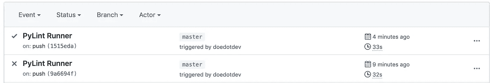

# Pylint 静态代码分析| Github 在分数阈值以下失败的操作

> 原文：<https://medium.com/analytics-vidhya/pylint-static-code-analysis-github-action-to-fail-below-a-score-threshold-58a124aafaa0?source=collection_archive---------6----------------------->


绵羊生产羊毛，羊毛生产皮棉，这是我在这篇关于皮棉代码的文章中能想到的最有创意的东西了。

Pylint 对于静态代码分析来说是一个非常有用的工具。它提供了一个简单的分数(满分为 10 分),一个关于要修复的内容的详细输出，以及忽略您不相信的事情的能力。

[](https://www.pylint.org/) [## Python | www.Pylint.org 的 pylint 代码分析

### 检查行代码的长度，检查变量名是否符合你的编码标准，检查是否…

www.pylint.org](https://www.pylint.org/) 

这是我正在做的关于如何在我的项目中使用 Pylint 的系列文章的第三部分。

*   第 1 部分:用命令行和编程方式执行

[](/@doedotdev/pylint-static-code-analysis-executing-with-command-line-vs-programmatically-63797fb2ac22) [## Pylint 静态代码分析|用命令行执行 vs 编程

### Pylint 对于静态代码分析来说是一个非常有用的工具。运行它从命令行或编程，并…

medium.com](/@doedotdev/pylint-static-code-analysis-executing-with-command-line-vs-programmatically-63797fb2ac22) 

*   第 2 部分:具有可变阈值的 Pylint Runner 脚本

[](/@doedotdev/pylint-static-code-analysis-python-script-with-adjustable-threshold-b0d6d2c8647b) [## Pylint 静态代码分析|阈值可调的 Python 脚本

### Pylint 对于静态代码分析来说是一个非常有用的工具。这里我们创建一个脚本来运行 Pylint，如果它命中…

medium.com](/@doedotdev/pylint-static-code-analysis-python-script-with-adjustable-threshold-b0d6d2c8647b) 

*   **第 3 部分:针对低于 Pylint 阈值的失败构建的 Github 动作**

## Pylint Github 操作

当你签入代码时，Github 动作对于自动做事情非常有用。构建、部署、测试，在这种情况下，分析代码。

[](https://github.com/features/actions) [## 功能* GitHub 操作

### GitHub Actions 现在拥有世界一流的 CI/CD，可以轻松实现所有软件工作流程的自动化。构建、测试和…

github.com](https://github.com/features/actions) 

在本系列的上一篇文章(第 2 部分)中，我更深入地讨论了如何创建一个 Pylint runner，它的失败或通过取决于 Pylint 是否达到给定的阈值。您可以调用带有指定的`path`代码和分数`threshold`的`lint.py`文件来通过或失败构建！这是脚本要点的副本。

lint.py

现在我们可以利用这个脚本来创建一个 Github 动作，根据这个分数来决定一个构建是通过还是失败。

下面是`lint.yml`代码:

lint.yml

构建有 3 个主要步骤:

*   设置 Python 环境，在本例中为 3.7
*   安装需求，在这种情况下只是 Pylint
*   使用设置的最小阈值运行 lint.py

如果您的代码没有达到这个阈值(在上面的例子中是 2 ),那么这会产生一个失败的构建。



请注意，分数 1.875 没有达到阈值 2.0

在这里，在一个通过的案例中(因为这个测试代码，我在我的工作流中将阈值降低到 1.5)，您的构建将通过！它仍然会显示修复代码的潜在机会，以及您的输入阈值和最终得分。



现在您的工作流历史将显示您的代码已经改进！(或者你只是改变了你的门槛……)



我鼓励你多看看 Github 的动作，在那里你可以阻止失败动作的合并，从动作中部署到 pypi stratigh，验证你的测试可以和你想要的 python 的每个版本一起工作，等等！

## 个人笔记

真正的项目应该期望更高的分数。我的制作项目通常设置为 9 或 9.5 T4 作为分数阈值限制。然而，我确实使用了不同于基本 Pylint 设置的附加排除。

```
C0114, # missing-module-docstring
C0115, # missing-class-docstring
C0116, # missing-function-docstring
R0903  # too-few-public-methods
```

这个片段可以被复制并粘贴到一个`.pylintrc`文件的`disable`部分，它会忽略那些错误，它们不会降低你的分数。

## 结束了

这个三部分系列的所有代码都在 Github 上。它甚至使用自己的代码对自己运行 Github 操作。

[](https://github.com/doedotdev/wool) [## 羊毛

### Pylint 示例| Pylint Runner 脚本| Pylint Github 操作- doedotdev/wool

github.com](https://github.com/doedotdev/wool) 

如果你迷路了，一定要回去重温本系列的第 2 部分，在那里我将讨论我们在 Github 操作中运行的`lint.py`文件的用法。

[](/@doedotdev/pylint-static-code-analysis-python-script-with-adjustable-threshold-b0d6d2c8647b) [## Pylint 静态代码分析|阈值可调的 Python 脚本

### Pylint 对于静态代码分析来说是一个非常有用的工具。这里我们创建一个脚本来运行 Pylint，如果它命中…

medium.com](/@doedotdev/pylint-static-code-analysis-python-script-with-adjustable-threshold-b0d6d2c8647b) 

谢谢！