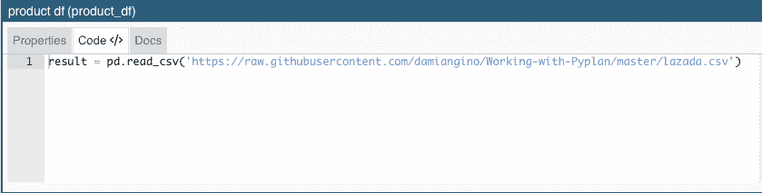

# Pyplan，创建和共享数据分析应用程序的最简单方法。

> 原文：<https://medium.com/analytics-vidhya/pyplan-the-easiest-way-to-create-and-share-a-data-analytic-app-8c6c8a9f1eeb?source=collection_archive---------3----------------------->

去年，我读过[文森特·塔坦](https://medium.com/u/9848578f8495?source=post_page-----8c6c8a9f1eeb--------------------------------)的[这篇文章](https://towardsdatascience.com/build-your-own-data-dashboard-93e4848a0dcf)，他在文章中提出并教授了如何使用免费工具构建自己的数据仪表板。

作为一名数据分析顾问，我非常熟悉我们每天向没有数据科学技术知识的人暴露我们的见解时所面临的问题。一个好的仪表板对于向这些用户传达过程、数据和结果是必不可少的。受 Tatan 文章的启发，我决定分享我发现的最理想的平台，旨在轻松创建数据分析应用程序:Pyplan。

> "我们可以用 Python 免费构建一个仪表板 Web 应用程序吗？"—文森特·塔坦

# Pyplan 是什么？

Pyplan 是一个图形集成开发环境(IDE ),用于创建和共享数据分析应用。它旨在方便数据分析师创建和部署数据分析应用程序，与 Pandas、Numpy 和 Xarray 库高度集成。

与 Jupyter 笔记本不同，在 jupy ter 笔记本中，代码是以句子列表的形式组织的，而在 Pyplan 中，代码包含在作为计算步骤的节点中，并组织在一个分层影响图中。可以对节点进行评估，并通过控制台输出或以表格或图形的形式显示其结果。

用户界面是通过在画布上拖动节点来创建的，最终的应用程序可以通过一次点击分享给普通观众。

Pyplan 代码方法借鉴了传统工作流( [ETL](https://es.wikipedia.org/wiki/Extract,_transform_and_load) 管道)和交互式编程(Jupyter 笔记本)的精华。这个想法看起来很有前途，值得一试，但我认为，在我们发现它作为一种编程选择得到广泛应用之前，还需要一段时间。

为了让读者更容易理解 Jupyter 笔记本和 Pyplan 之间的区别，我制作了一个表格来比较主要功能:


**Pyplan vs Jupyter 笔记本创建应用**

使用 Pyplan 有两种方法:

一种是通过 web 应用程序，不需要安装，只需在[https://my.pyplan.org](https://my.pyplan.org)创建一个免费账户，就可以开始使用 Pyplan 了。

另一个是任何 python 用户都熟悉的，通过 [PIP](https://pypi.org/project/pip/) 、 [Conda](https://docs.conda.io/en/latest/) 或 [Anaconda Navigator](https://anaconda.org/) 安装它，在你的计算机上运行 Pyplan local。解释如何做的说明可以在[这里](https://pyplan.org)找到。

**更新:在发表这篇文章后，Pyplan 联系我，问我他们是否可以将这个模型添加到他们的在线示例库中，所以现在你可以通过以下路径从你的免费帐户的文件管理器中访问它:py plan>Public>Examples>09—laza da Trends。**

# 现在，对于这个项目:

*   用于这个模型的数据可以在我的 Github [这里](https://github.com/damiangino/Working-with-Pyplan)获得。
*   你可以在这里看到我们最终发布的应用程序。

在他的模型中，Vincent Tatan 使用来自 Lazada(电子商务平台)的数据集，生成数据可视化，以了解 Lazada 产品随日期和时间的价格变化。

我将专注于创建应用程序，以便从读取价格数据库开始。

登录后，我们将创建新模型，只需单击橙色按钮并为其命名:


在 Pyplan 中创建新模型

让我们创建第一个节点(拖放)，并将其定义为:

```
result = pd.read_csv(‘https://raw.githubusercontent.com/damiangino/Working-with-Pyplan/master/lazada.csv')
```



Pyplan 中控制台窗口中的代码

请记住，属性面板中节点的 **id** 名称就是您在代码中调用它的方式:


节点的属性面板

请记住，任何节点都必须结束定义变量**结果**，并指示在评估节点时将显示哪个输出(通过双击或 ctrl+R)。在这种情况下，如果我们评估创建的节点，结果将如下所示:


Pyplan 中表的结果视图

现在，我们将创建一个选择器来选择我们想要检查价格变化的产品:

让我们拖放一个决策节点“decision”(矩形)，并将其定义为:

```
list_of_products = product_df["product_title"].unique().tolist()result = selector(list_of_products, [0,5], True)
```

该节点将帮助我们选择要检查的项目。

然后，我们将创建过滤项目表。让我们拖动一个新节点，并将其定义为*“产品 df 过滤器”*，并将其定义为:

```
# Filter database by the elements contained in the selector_filter = product_df['product_title'].isin( product_selector.value )
df = product_df[_filter]df = df.sort_values('datetime', ascending=False)result = df
```

最后，让我们创建两个输出，拖放两个新节点:**产品评级**定义为:

```
result = product_df_filter[['product_title', 'rating_count']].set_index('product_title')
```

而**产品价格趋势**定义为:

```
result = product_df_filter[['product_title', 'datetime', 'product_price']].set_index(['product_title', 'datetime'])
```

我们应该以这样的图表结束:


您可以使用 **Ctrl+Y** 在标题和 id 之间切换图表视图:


使用 Ctrl+Y 可以在标题和 ids 视图之间切换

现在我们准备创建我们的用户界面。

为此，我们将单击“界面”图标菜单，然后单击“新建界面”。我们将把我们的界面命名为**价格优化仪表板**。


在 Pyplan 中创建新界面

现在我们有一个空的界面，我们将创建应用程序，并在短短三个步骤中分享它。**不需要编码！！！**。

## 步骤 1 —设计用户界面布局

首先双击新界面将其打开。

一旦进入界面画布，让我们首先添加一个新的小部件(点击 **+** )，然后选择图图标。我们稍后将使用该图从其中拖动节点。

现在让我们垂直分割上面的小部件(右上方菜单上的右箭头)，然后水平分割左边的小部件。下图显示了这一过程。


在 Pyplan 中设计界面布局

## 步骤 2 —向用户界面添加 I/O 元素

现在**Shift+点击选择器上的**(绿色节点“选择产品名称”)，然后点击目标部件(左上角)，然后点击“格式”，然后选择“多选”


配置选择器

下一步是将“product df filtered”节点拖动到右上角，以显示由选择器过滤的属性列表。我们将把这个小部件保存为一个表。

接下来，让我们将“产品评级”拖到空的小部件上，并将其配置为水平栏。让我们也拖动“product_title”维度作为条形的标题。


在 Pyplan 中配置界面布局上的小部件

最后，让我们在仪表板中显示价格趋势。为此，开始清除仪表板中的图表小部件的内容，接下来在选项菜单中，选择图表，系统将提示您选择一个节点，搜索 *product_price_trends* ，然后将图表类型从条形更改为线性，并接受它以保存新的 UI 配置。


在 Pyplan 界面中更改图形元素的类型

## 步骤 3-分享应用程序

现在我们有了最终的用户界面，我们准备分享我们的应用程序。只需点击共享图标并选择“共享外部”,用户无需登录 Pyplan 即可使用该应用程序。复制链接并与任何人分享，以便即时访问完整的操作应用程序。


在 Pyplan 中共享仪表板

# 结论:

从这个例子中，你可以看出，这种类型的解决方案为那些进行数据分析的人提供了无限可能。直观的界面、计算逻辑的透明性以及创建和共享交互式应用的便利性，使 Pyplan 成为我们这些必须在任何组织中进行数据分析的人的理想平台。

我更喜欢 Pyplan，而不是其他替代方案，因为它需要编写更少的代码，还因为具有最低编程技能的用户可以非常快速地开始生成数据分析

我希望发现这个工具对你和对我一样有用。