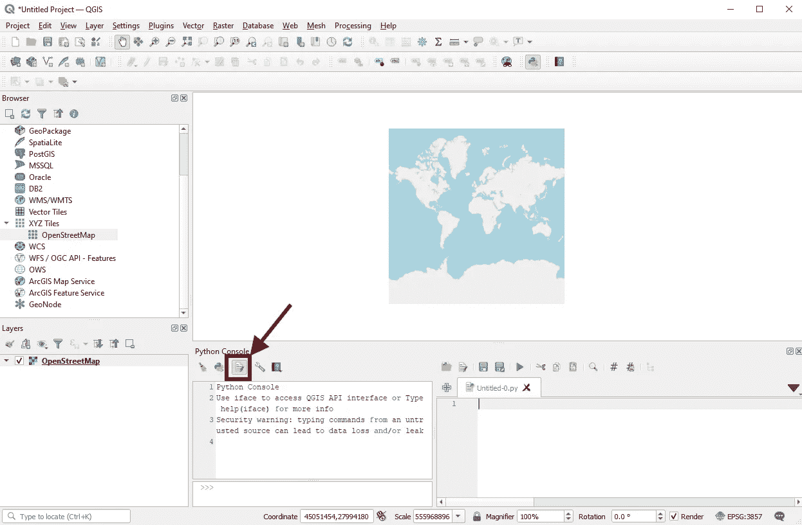

# PyQGIS —基于网格的数据可视化脚本

> 原文：<https://medium.com/analytics-vidhya/pyqgis-script-for-drawing-colored-rectangles-4c4944caffe4?source=collection_archive---------20----------------------->

利用 QGIS 实现网格数据可视化的简单方法

基于网格的可视化(图片作者:作者)

您是否尝试过在地图上可视化基于网格的数据？QGIS 是处理地图和可视化的绝佳选择！有时，当您处理大量数据和层时，使用 GUI(图形用户界面)是一项挑战。这里，皮格吉斯人进来了！该软件将强大且语法简单的编程语言 Python 与 QGIS 功能相结合。在这个故事中，将一步一步地解释为基于网格的数据的可视化绘制彩色矩形的脚本。如果你只是想要代码，请访问:[https://github.com/tisljaricleo/PyQgisScripts](https://github.com/tisljaricleo/PyQgisScripts)

# **问题描述**

让我们来定义我们的问题。在处理基于网格的数据时，可视化有时非常重要。在这个故事中，我们将展示如何可视化这种数据，并根据某些值对其进行着色。我们的示例将包括使用 QGIS 和 PyQGIS 在 [OSM(开放街道地图)](https://www.openstreetmap.org)上创建网格，其中矩形的颜色将指示车辆的平均速度(绿色-高速；黄色-中速；红色-低速)。

可视化基于网格的数据的其他示例可以是某些区域的新冠肺炎病例数、细胞中的人口密度、城市中的污染以及各种热图的可视化。

# **工具**

1.  QGIS——免费开源地理信息系统软件。你可以在 https://qgis.org/en/site/官方页面[下载。在](https://qgis.org/en/site/)[媒体](/)上有一些关于如何安装 QGIS 的教程。
2.  PyQGIS 结合 Python 和 QGIS 功能的软件。它用于重复任务的自动化，如创建和编辑大量的层。官方文件可以在这里找到[https://docs.qgis.org/3.10/en/docs/index.html](https://docs.qgis.org/3.10/en/docs/index.html)
3.  Python 控制台——QGIS 有它的 Python 安装和控制台，所以我们**不必从官方页面安装** Python。

# 让我们工作吧

首先，在 QGIS 应用程序中打开新项目，并添加 OSM 地图图层。

向 QGIS 项目添加 OSM 地图(图片来源:作者)

打开 Python 控制台。

打开 Python 控制台(图片作者:作者)

单击“显示编辑器”按钮，打开编辑 Python 代码的窗口。

Python 代码编辑器(图片作者:作者)

将 Github 资源库[中的代码复制并粘贴到 Python 代码编辑器中。然后按绿色的播放按钮。](https://github.com/tisljaricleo/PyQgisScripts/blob/main/Rectangle%20drawing/rectangle_drawing.py)

按下绿色播放按钮后，一些新的层将被创建。要查看结果，右键单击其中一个图层并选择“缩放至图层”选项。

此示例显示了 5x5 矩形网格。这些颜色表示在矩形区域行驶的车辆的速度。在下一节中，您将学习如何定制代码来满足您的需求。

# 自定义网格可视化

创建自定义网格可视化只需更改几个参数。

1.  矩形的形状和大小

变量 lon_start 和 lat_start 将定义地图上的起始 GNSS 点。lon_step 和 lat_step 是用于增加对应于距离度量的某个定义数的经度和纬度的系数。让我们更详细地解释这一点。在这个例子中，我们想要创建 500x500 m 的矩形。这意味着要在地图上移动 500 米，我们必须增加/减少经度 0.006545 和纬度 0.004579。变量 x_num 和 y_num 将定义要绘制的矩形的行数和列数。所有变量如下图所示。

用于绘图的自定义变量(图片来源:作者)

2.矩形颜色

速度矩阵必须具有与矩形相同的尺寸(行和颜色)。换句话说，每个矩形必须有一个相应的速度值。矩形的颜色基于某个数值。在本例中，它是平均速度，如下面的代码所示。
你可以使用任何其他值(密度，污染等。)只要尺寸与矩形的数量相匹配。

3.颜色范围

如果您需要不同的颜色范围，您必须编辑函数 def drawRectangles(points，c_value，name)。找到下面列出的部分代码，并在括号内添加或更改定义的值。

**(类别名称，下限，上限，(红色，绿色，蓝色，阿尔法))**

# 结论

谢谢你读了这个故事！我希望这些内容对你有用。更多类似的故事，请访问我的个人资料。

完整代码可以在这里找到:[https://github . com/tisljarico/pyqgiscripts/blob/main/Rectangle % 20 drawing/Rectangle _ drawing . py](https://github.com/tisljaricleo/PyQgisScripts/blob/main/Rectangle%20drawing/rectangle_drawing.py)

如有任何问题或建议，欢迎评论或联系我！

领英:[https://www.linkedin.com/in/leo-tisljaric-28a56b123/](https://www.linkedin.com/in/leo-tisljaric-28a56b123/)