# Pyspark CSV 阅读器深度潜水

> 原文：<https://medium.com/analytics-vidhya/pyspark-csv-reader-deep-dive-6096cb2c2880?source=collection_archive---------6----------------------->

Jez Timms 在 [Unsplash](https://unsplash.com?utm_source=medium&utm_medium=referral) 上拍摄的照片

大家好！

Spark 是大数据世界中的一个伟大框架。

我在发表这篇文章的时候，考虑到了一个拥有 spark 理论知识的开发人员，并且必须着手使用 spark

csv 和 tsv 是广泛使用的格式，所以让我们用 spark 分析一些数据。

让我们把博客分成几个步骤。

1.  创建 Spark 会话
2.  阅读 CSV
3.  添加标题
4.  处理模式
5.  处理畸形数据
6.  处理日期、时间戳(续..)
7.  处理压缩数据(续..)
8.  csv 阅读器中的其他选项

**第一步:创造火花**

通过导入如下所示的 SparkSession，如果一切顺利，您将看到如下输出

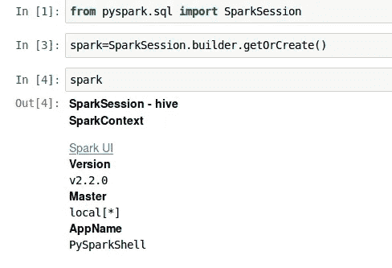

**第二步:读取 Csv**

spark 提供了一个非常好的 api 来处理 Csv 数据，如下所示

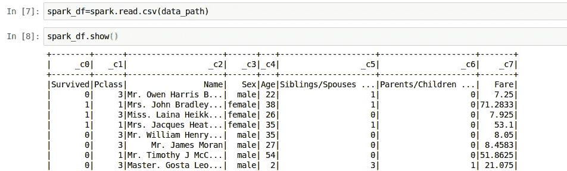

**第三步:添加标题**

我们注意到没有可用的头，所以 spark 默认填充 _c0 头来添加头，我们可以使用设置为 true 的头选项

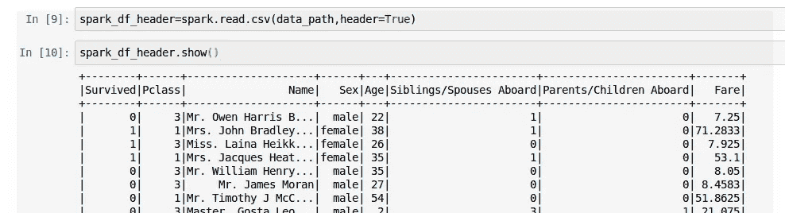

但是这里又有一个问题，列名有一些空格，在读取列时会影响 spark parser。因此，我们最好创建一个带有自己标题的数据帧

因此，我们使用 regex 清除列名，用“_”替换空格和/

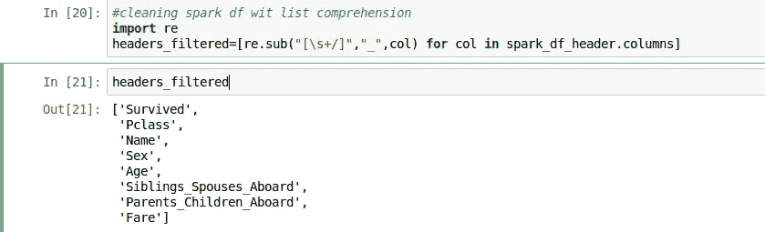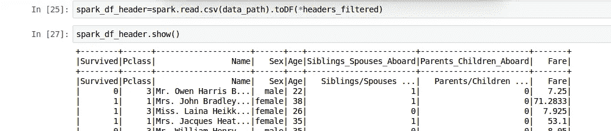

这里的问题是我们的数据中也有重复的标题列。但是 spark 没有跳过顶部几行的选项。因此，我们将从 DF 中过滤第一个

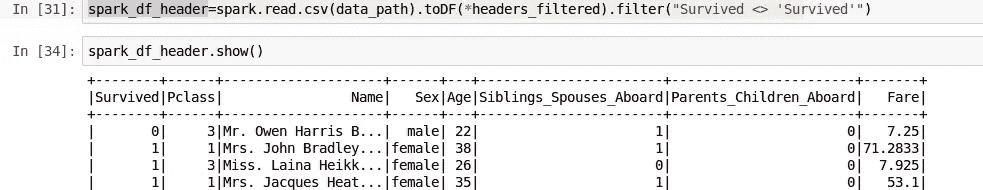

**步骤 4:处理模式**

默认情况下，spark 会将所有列读取为字符串，我们可以使用 dtypes 来确认这一点

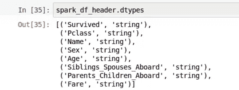

我们可以使用 inferschema 来允许 spark 解析器推断模式，但是对于大的 csv 文件来说，这是很昂贵的，因为它必须读取文件

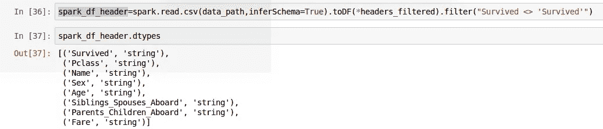

相反，我们可以通过导入 spark.sql.types 并在单个步骤中添加头和模式，轻松地将模式指定为 int、string 等

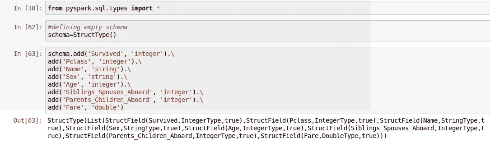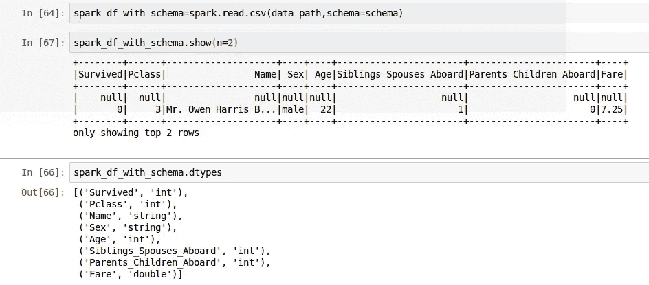

**第五步:处理格式错误的数据**

正如我们上面看到的，如果数据不符合模式，我们可以看到数据被转换为 null，因此我们可以通过使用模式选项“drop formattered”来更改这一点

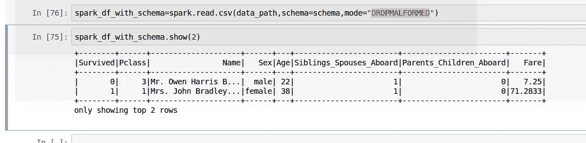

但是，上面的方法删除了所有格式错误的行，因此效果不好。相反，我们可以添加一个损坏的列和模式，我们可以使用它来查看损坏的数据，这样我们就不会丢失任何信息

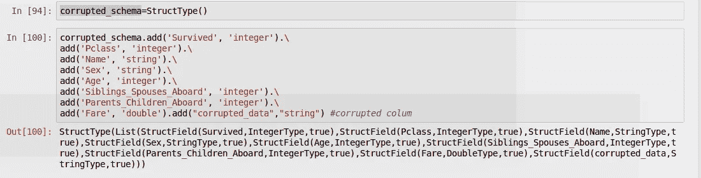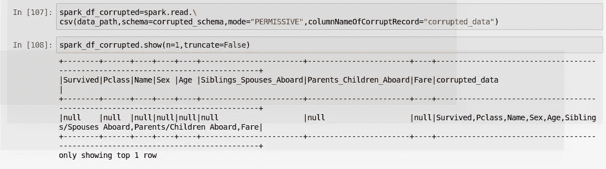

Github 链接:[https://github . com/SomanathSankaran/spark _ medium/tree/master/spark _ CSV](https://github.com/SomanathSankaran/spark_medium/tree/master/spark_csv)

***请把我在 spark 中必须涉及的话题发给我，并给我提供改进写作的建议:)***

**延续:**

 [## 火花 CSV 深潜-第二部分

### 这是我上一篇文章的延续

medium.com](/@somanathsankaran/spark-csv-deep-dive-part-ii-6d3389904f71) 

**学习并让别人学习！！**