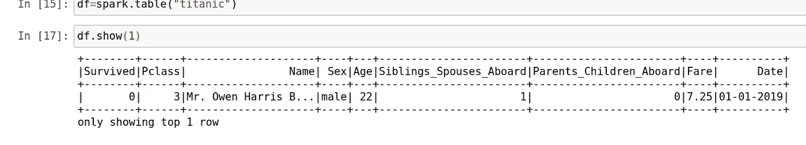
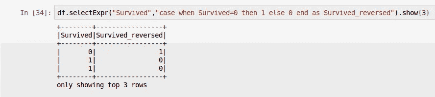
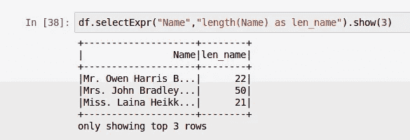
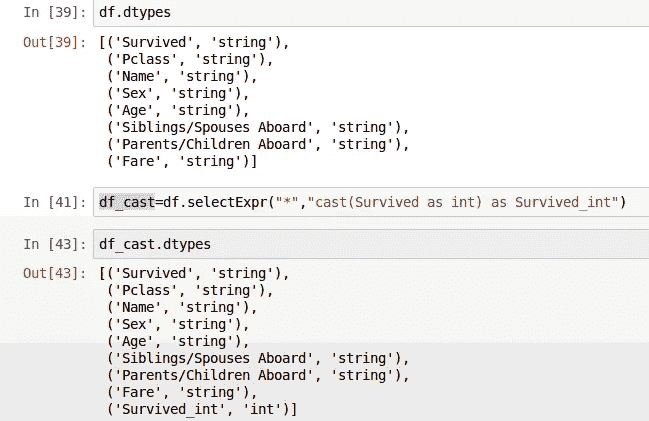
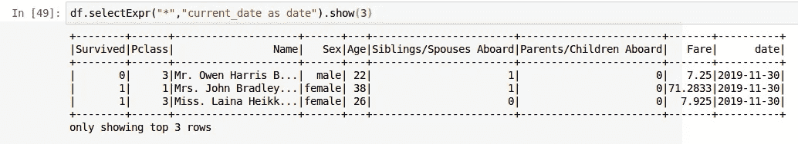
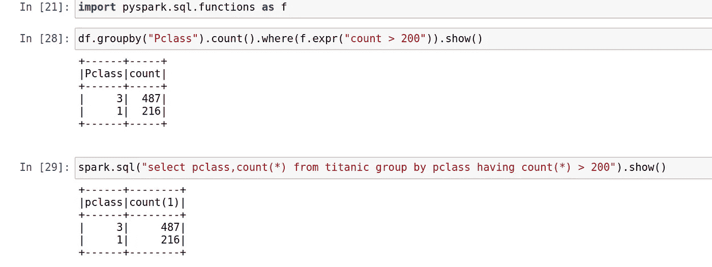
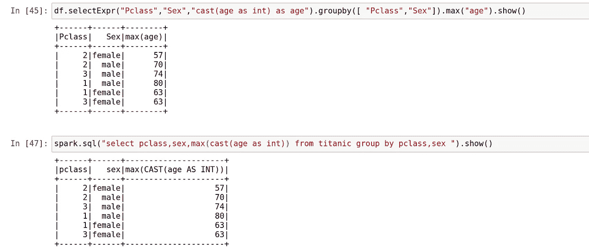
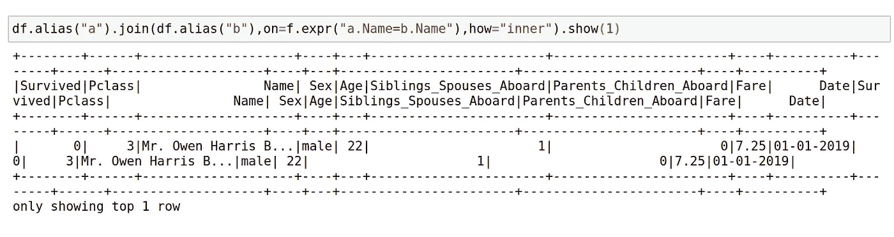
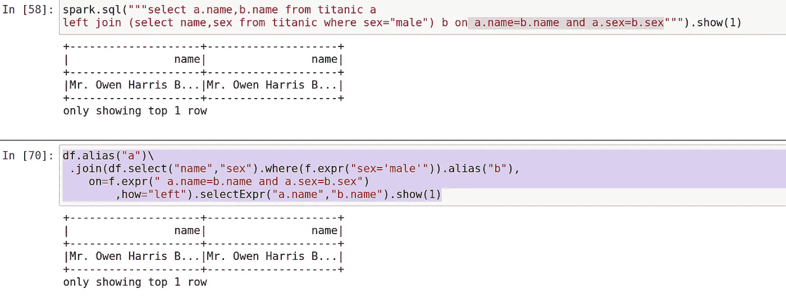
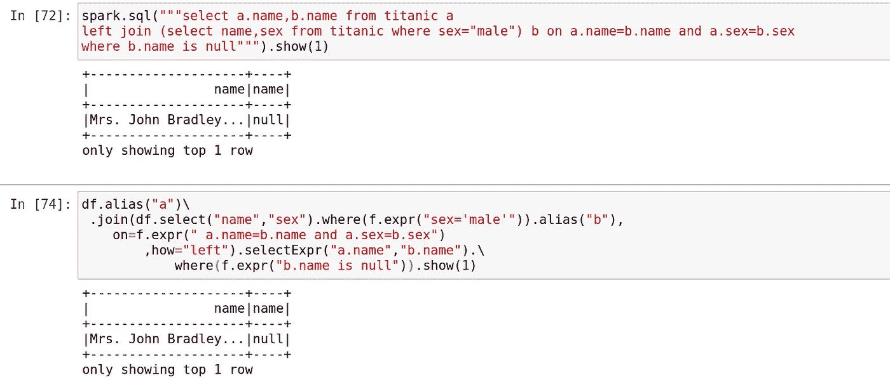

# SQL 分析师的 Pyspark 数据框架

> 原文：<https://medium.com/analytics-vidhya/pyspark-dataframe-for-sql-aanalyst-99de486627b0?source=collection_archive---------9----------------------->

这是我在《火花深潜》中的一个故事

 [## somanath sankaran —中等

### 阅读索马纳特·桑卡兰在媒介上的作品。对 python 和 spark 感兴趣的大数据开发者。每天，索马纳特…

medium.com](/@somanathsankaran) 

嗨，这个博客是专为 sql 开发人员和 Sql 分析师

作为一名 sql 分析师，我们可能会使用 spark sql 来进行分析。

但是让你惊讶的是, ***spark 有一些强大的功能，允许你表达 sql，这就是为什么它被正确地命名为 expr***

我们使用的主子句是 select、join、groupby 和 where 子句。

让我们看看下面的子句和它们的 spark DF 等价物

选择->选择表达式

分组依据->分组依据+表达式

连接->连接+表达式

where -> where + expr

**数据集:为此我使用了一个巨大的数据集**样本表

**选择- >选择表达式**

如果你是 sql /Hive 用户，我也是，如果你错过了 spark 中强大的 select 和 other 语句。

不要担心 selectExpr 会来救援

1.SelectExpr 对于灵活的 sql 语句和添加字段非常有用

2.使用所有内置的配置单元函数

3.使用 selectExpr 转换数据类型很容易

这里我们将幸存的 dtypes 从 string 转换为 int

4.用 SelectExpr 添加常数

一个常见的用例是添加像 current_date 这样的常量字段

这可以用 SelectExpr 轻松完成

**分组依据- >分组依据+表达式**

spark 有一个 groupby 子句，groupby 的一个重要用例是检查重复计数

**通过计数(*) > 200** 的 pclass 从钛组中选择 pclass，count(*)的

**在上面的步骤中，我们使用了 expr，这是 spark 中一个强大但被低估的函数**

**Expr 允许您将 sql 语句转换成 spark 等价物，如上图所示**

我们也可以按多列分组，并使用其他聚合函数，如 max、min avg 等，如下所示

注意:这里的强制转换是因为年龄作为字符串存储在源数据中

**join - > join + expr**

让我们看看如何将连接查询转换成 spark 数据帧等价物

**“从泰坦尼克 a 上选择*加入泰坦尼克 b 上 a . name = b . name”**

df.alias("a ")。join(df.alias("b ")，on=f.expr("a.Name=b.Name ")，how="inner ")。展示(1)

上面的一行代码简洁而强大，我们正在创建一个别名并进行内部连接，如果我们使用子查询并进行如下所示的连接，这将会很有帮助

***select * from titanic a left join(select name，sex from titanic where sex = " male ")on a . name = b . name and a . sex = b . sex***

**df.alias("a")\
。join(df.select("name "，" sex ")。where(f.expr("sex='male ' ")。别名(" b ")，
on=f.expr(" a.name=b.name 和 a.sex=b.sex")
，how="left ")。selectExpr("a.name "，" b.name ")。显示(** 1)

第 1 行:选择别名为 a 的 df

第 2 行:选择 df 姓名和性别，用 where 子句选择男性乘客

第 3 行:用与 sql 相同的方式指定连接条件

第 4 行:选择所需的列

**where - > where + expr**

sql 的一个常见用例是在连接后过滤记录。

比方说，我们必须找到一个不匹配的记录，所以我们将添加一个连接后为空的过滤器，如下所示

**select * from titanic a left join(select name，sex from titanic where sex = " male ")on a . name = b . name and a . sex = b . sex where b . name 为空 **

用 where 和 expr 可以很容易地添加同样的内容，除了 where 子句之外，几乎不用添加任何东西

Github 链接:[https://github . com/SomanathSankaran/spark _ medium/tree/master/spark _ CSV](https://github.com/SomanathSankaran/spark_medium/tree/master/spark_csv)

***请给我发 spark 中我必须涉及的话题，并给我改进写作的建议:)***

**学习并让别人学习！！**