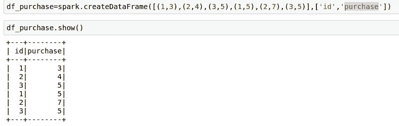

# Pyspark 用户定义函数(UDF)深入分析

> 原文：<https://medium.com/analytics-vidhya/pyspark-udf-deep-dive-8ae984bfac00?source=collection_archive---------6----------------------->

Jez Timms 在 [Unsplash](https://unsplash.com?utm_source=medium&utm_medium=referral) 上拍摄的照片

这是我在星火深潜系列中的一个故事

 [## 索玛纳特·桑卡兰培养基

### 阅读索马纳特·桑卡兰在媒介上的作品。对 python 和 spark 感兴趣的大数据开发者。每天，索马纳特…

medium.com](/@somanathsankaran) 

用户定义的函数非常常见，我们需要使用它，因为我们知道 python 有丰富的函数，所以我们可以使用 python 模块来改进 spark 的功能。

在这篇文章中，我们将看到

1.  用户自定义函数
2.  熊猫 _udf 及其优势
3.  标量熊猫自定义项
4.  分组熊猫自定义项
5.  分组聚合熊猫自定义项

**UDF**

这是 spark 提供的旧 udf，它涉及到从 JVM 对象到 python 对象的序列化(pickling)转换，这会导致大量开销。

***该 udf 将获取特定列的每一行，并应用给定的函数，添加一个新列***

步骤 1:创建示例数据框架

让我们创建一个包含示例单词的示例 udf，我们必须检查给定的字符串是否是回文

**第二步:创建回文 python 函数**

这里我们有一个函数回文，它接受一行，如果单词的 reverse(row[::-1]将字符串反转并转换为小写)等于单词本身，它将返回 true，否则将返回 false

**第三步:注册自定义项作为函数调用**

下一步是用 spark sql 函数注册这个 python，以便可以在类似 df.select(回文(col)的列上调用它

为此，我们必须使用 udf 函数，并通过指定函数和返回类型来创建 spark 可访问的 udf 函数，如下所示。

现在可以用 spark df 调用 check_palindrome，如下所示

现在我们可以用 dtypes 检查返回类型

**熊猫 _ 自定义项及其优势**

上述 udf 的主要缺点是它涉及到从 jvm 对象到 python 序列化 pickle 对象的转换，这会导致大量开销，

所以在 spark 2.0 中，引入了 pandas_udf，它具有以下优点

1.  它使用 apache arrow，这是一种列格式，不需要任何转换
2.  它是矢量化的，可以像 numpy 数组或 hive 中的矢量化一样进行批量操作

**步骤 1:检查 Pyarrow 安装**

要使用 pandas udf pyarrow，需要安装它，它的版本需要高于 0.8，我们必须启用 arrow 执行

**标量熊猫自定义项:**

它与上面的 udf 类似，但它将通过将 spark df 转换为 pandas 系列来运行

要使用 pandas udf，我们必须更改该函数，以便它将对序列进行操作，如下所示，方法是向称为 vector palindrome 的回文函数添加一个包装函数，该函数将使用 pandas series 的 apply 方法对 pandas series 使用回文函数

然后我们必须用 pandas udf 注册这个函数并调用这个函数

使用 functionType，返回如下所示的类型

**分组熊猫自定义项:**

这类似于 pandas 中的 group by apply 构造，因此，例如，我们必须按特定列进行分组，并计算该组的几何平均值

因此，我们将创建 id 为的 2 列 df 和他们的购买

我们将使用 python stats 模块来获取平均值，并将其作为一个新列分配

然后，我们将 udf 注册为 grouped_map 类型，并使用函数返回的 df 的返回模式，如下所示

因为上面的函数返回 3 列 id、purchase 和 geometric mean 以及它们在 returntype 中的模式，如下所示

按 id 分组后应用函数

**分组聚合熊猫自定义项**:

它是分组和执行自定义聚合功能，比如说只为每个 id 添加零头购买。

我们可以使用 decorator 语法包装 python 函数，而不是创建像矢量化几何图形这样的新函数。比如我们可以在函数上修饰@熊猫 _UDF

今天就到这里吧！！:)

Github 链接:[https://github . com/SomanathSankaran/spark _ medium/tree/master/spark _ CSV](https://github.com/SomanathSankaran/spark_medium/tree/master/spark_csv)

****学习并让别人学习！！****