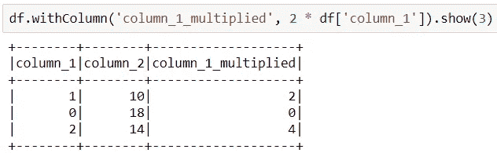

# PySpark 语法—5 个快速提示

> 原文：<https://medium.com/analytics-vidhya/pyspark-xp-syntax-f57a9e6a500f?source=collection_archive---------8----------------------->

这是一系列帖子中的第一个帖子， ***PySpark XP*** ，每个帖子由 5 个提示组成。 **XP** 代表**经验值**，因为这些提示与我在 PySpark 的经历中了解到的事情有关。每篇文章都将提供我使用 PySpark 的不同方面的技巧。

第一个帖子是关于**语法**。对于 PySpark 初学者来说，这将是很有价值的一课。更有经验的开发人员也可以从中学习(查看**提示#2** )。

查看本帖的 Jupyter 笔记本点击 [**此处**](https://github.com/danflomin/medium/blob/main/Tips/Part%201%20-%20Syntax/Medium%20-%20Tips%20-%20Syntax.ipynb) 。

## 提示 1 —列对象

列本身就是对象。人们可以将一列放入一个列表或另一个集合中，或者对对象本身应用函数。这将列的概念与其父数据框架分离开来。

这里有一个例子。

我们有一个包含两列整数的数据帧。

图 1

多，常用列整体来进行`select`或`withColumn`操作。像这样—

图 2

但是列也可以在`select`或`withColumn`操作之外相乘。

**看下面—**

首先我们导入 Spark 的函数。

图 3

现在我们把`df`的列放在一个列表中。

图 4

魔力来了。我们将每列乘以 2，并将相乘后的列“返回”到数据帧。

图 5

## 提示#2 —选择与使用列

在我的第一篇和最后一篇文章中(点击 [**此处**](/p/e273ede0ca13) 查看)，我讨论了关于 Spark join 优化，以及如何使用`withColumn`而不是`join`进行优化。

一位读者让我注意到这样一个事实，即一次又一次地连续使用`withColumn`，应该比对所有需要的新列使用 1 个`select`要慢(仅针对驱动程序)。

这相当于图 3，但是使用了两次`withColumn`而不是一个`select`子句。

图 6

其原因是 dataframe 对象是不可变的，因此在每个`withColumn`之后，返回一个新的 dataframe 对象。新数据帧的构建需要时间 Spark 的内部实现消耗了这些时间。

对于这种现象更彻底的解释，请查看底部的参考资料部分。

## 技巧 3 —混叠

最常见的情况是当你想分组然后求和时。最简单的语法留给我们一个奇怪命名的列(就像**技巧 1** )。以后使用这个专栏名称可能会令人沮丧，但不会影响交易。

图 7

绕过这个问题的方法如下—

图 8

## 提示 4—选择表达式

在 PySpark 代码中使用来自`pyspark.sql.functions`的函数是很常见的。导入所需的函数可能有点麻烦，而且没有人希望总是导入函数(尤其是在 Jupyter 笔记本中)。

假设我们想要对我们的 2 列应用 **sin** 函数。我们可以做下面的事情，当然是用别名(；

图 9

另一种方法是给数据帧一个名称，然后使用 SQL 语法查询数据帧，如下例所示。

图 10

但是，我更喜欢另一种选择。`selectExpr`能够在数据帧上使用 SQL 语法进行选择，使用字符串，无需命名数据帧或导入所需函数。

请看下文，了解如何做到这一点。

图 11

而且…我们甚至可以在`selectExpr`子句中为我们的列起别名！

## 技巧 5 —行对象

一个数据帧在某种程度上是一个**行**的集合。我们说的是类`pyspark.sql.Row`。

当你`collect`一个数据帧时，你最终会得到一个列表，其中每个元素都是一个`Row`。你遇到`Row`对象的另一个地方是当你把数据帧转换成 RDD 时。

图 12

让我们抓住一排—

图 13

可以通过几种方式访问行的值。这里有两个:

图 14

# 结论

感谢阅读我关于 PySpark 语法的 5 个技巧。

## 系列文章

(2) [PySpark 规划——首次创业指南](https://flomin-dan.medium.com/pyspark-planning-a-guide-for-1st-timers-e9a79a4706aa)

## 参考

[提示# 3](/@manuzhang/the-hidden-cost-of-spark-withcolumn-8ffea517c015)——“火花*与*列的隐性成本”。