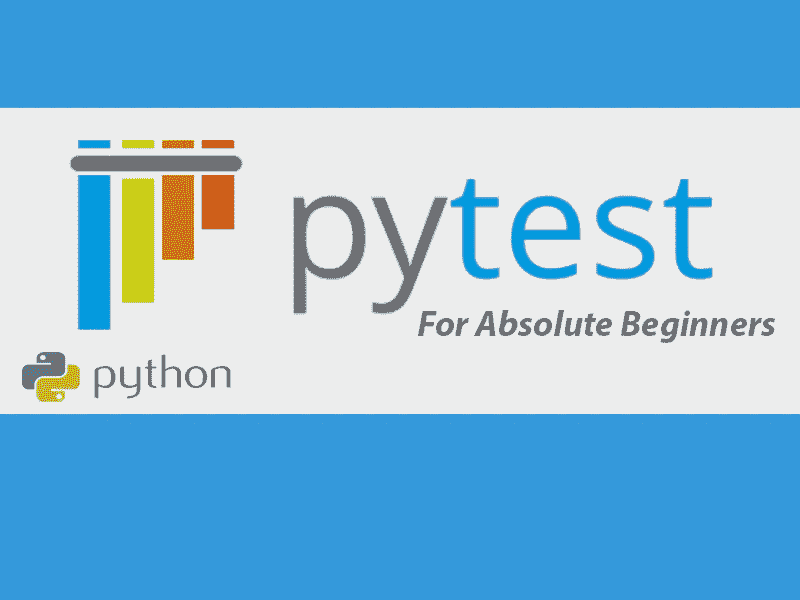
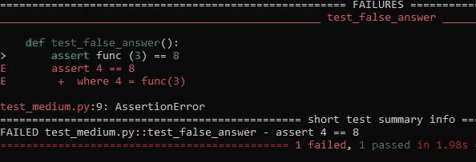
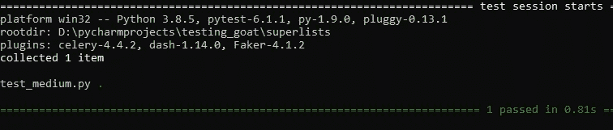

# 绝对初学者的 Pytest

> 原文：<https://medium.com/analytics-vidhya/pytest-for-absolute-beginners-4a166324b350?source=collection_archive---------9----------------------->

## 初学者的基本提示和技巧



P ython 是一种动态类型的语言，用于软件开发和其他领域，如数据分析、研究科学等，在过去几年中，这种语言的使用一直在增加，因此，正确、有效和高效地对这些领域中使用的软件进行测试以确保它们产生正确的预期结果的需求非常突出。来了**“pytest”**

**什么是 pytest:**

Pytest 是一个框架，它使得构建简单且可伸缩的测试变得容易。

**为什么选择 pytest**

*   不需要锅炉代码
*   复杂测试变得易于编写
*   测试很容易阅读
*   你可以在几秒钟内开始
*   与使用 self.assertEqual 等东西的 Unittest 不同，您使用 assert 来使测试失败
*   它可以用于运行为 Unittest 编写测试

**Pytest 安装**

在命令行上运行以下命令

> pip 安装 pytest

**py Test 中进行测试的条件**

为了在 pytest 中进行测试，需要满足以下条件:

*   该文件必须以 test_ <something>开头或以 <something>_test 结尾</something></something>
*   测试类应该命名为 Test<something></something>

**Pytest 入门**

让我们在一个名为***test _ medium . py***的文件中创建一个简单的测试函数

```
**def** func(x):
    **return** x + 1

**def** test_correct():
    **assert** func(4) == 5**def** test_false_answer():
    **assert** func (3) == 8
```

接下来:

我们跑

> pytest 当前工作目录中的 test_sample.py



我们的产量

**py test 输出的解释**

从上面的输出中，我们可以看到一个测试失败了，另一个通过了。与其他测试框架相比，pytest 的魅力就在于它非常容易阅读和理解

# 关于预期异常的断言

为了编写关于引发异常的断言，您可以使用`pytest.raises`作为上下文管理器。举个例子，

```
**import pytest** **def** test_zero_division():
    **with** pytest.raises(ZeroDivisionError):
        1 / 0
```

> 输出



通过断言测试

**断言输出解释**

从上面的输出，我们可以通过测试。

> 名词（noun 的缩写）乙:

绿点(。)表示我们只运行了一个测试函数

**测试功能的可能结果**

通过了(。):测试运行成功

失败(F):测试不成功

跳过:测试被跳过

xfail (x):测试本不应该通过、运行和失败

XPASS (X):测试不应该通过、运行和通过

错误(E):异常发生在 fixture 或 hook 函数的测试函数之外

**如何运行单个测试**

默认情况下，pytest 在当前工作目录中查找 test，然后通过查找必要的测试文件在子目录中查找。

为了运行单个测试，我们指定文件目录并添加一个“::test_name”

**使用选项**

要查看 pytest 中所有可用选项的列表，请在命令行上运行以下命令

> pytest —救命

我们将讨论一些常用的方法，

*- v，-verbose* :这个选项报告了比没有这个选项时更多的测试信息

*- q，-quiet*:这是 verbose 的反义词

— *版本:*此选项显示 pytest 的版本

*- h* :向您展示如何使用 pytest

*- l，-showlocals* :显示局部变量及其值，并对失败的测试进行回溯

*- lf，-last-failed* :这为我们提供了一种方便的方式来编写失败的测试

*- ff，-failed-first* :与-if 一样运行上次通过的其余测试

**结论**

以上仅仅是使用 *pytest* 进行测试的冰山一角，但是我相信这些为任何初学者开始使用 *pytest 框架提供了基本的诀窍。*在期待我的中级教程时，请务必查看下面的参考资料以获取更多信息，因为我将涵盖更高级和有点复杂的主题*。*

同时在主要时间，一定要留个赞，鼓掌，分享，关注，评论。

> **暂且不提**

也可以看看我之前的建书店教程[*带 flask 的 web app API with】*](/@ntsendifor/build-a-bookstore-web-app-api-with-python-flask-70db13f1ed9a)

**参考资料/演职员表**

 [## 完整的 pytest 文档

### 测试中断言的编写和报告

docs.pytest.org](https://docs.pytest.org/en/stable/contents.html) 

凯瑟琳·德沃夏克用 Pytest 进行 Python 测试