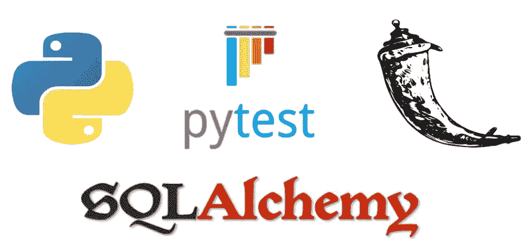

# Pytest 嘲讽小抄

> 原文：<https://medium.com/analytics-vidhya/pytest-mocking-cheatsheet-dcebd84876e3?source=collection_archive---------0----------------------->



你好，你好，你好，我的工程师伙伴们！

编辑:(05/01/2023):如果您觉得这份备忘单有用，请关注！我真的很感激！

我已经有一段时间没有写这些了，但我最近开始了一个分享知识的探索，也许是为了避免有人像我解决问题一样用头撞墙。

在这里，我收集了一些我最常用的 pytest 夹具模拟。

所有这些模拟我都存储在 conftest.py 中，然后在需要时将它们放入我创建的测试中。

***依赖:***

*   pytest
*   pytest_mock
*   瓶
*   烧瓶 _sqlalchemy

# **如何模仿一个物体:**

```
"""*conftest.py"""*import pytest@pytest.fixture
def mock_object():
   class MockObject(object):
      object_id = "id"
      some_property = "some_property_value"

      def to_json(self):
         return {
            "objectId": self.object_id,
            "someProperty": self.some_property,

         }
   return MockObject()
```

我们可以这样在测试中使用它:

```
"""test_functions.py"""def test_mocked_object(mock_object):
    mock_object.object_id = "new_id"

    assert mock_object.to_json()["objectId"] == "new_id"
```

显然，你可以根据自己的需要把它们变得复杂，但是为了节省时间，我会保持简单。

# **如何模拟对象属性:**

```
"""*conftest.py"""*import pytest@pytest.fixture
def mock_object_property(mocker):
    mock = mocker.patch(
        "test_functions.MyObject.property",
        new_callable=mocker.PropertyMock,
        return_value="new_property_value"
    )
    return mock
```

如果你以下面的方式使用它，你会注意到“some_property”神奇地变成了“new_property_mock”:

```
*"""test_functions.py"""* class MyObject(object):
    property = "some_property"

def test_mocked_property(mock_object_property):
    test_object = MyObject()
    assert test_object.property == "new_property_value"
```

现在最常用的模拟…

# **如何模拟函数返回:**

```
"""*conftest.py"""*import pytest@pytest.fixture
def mock_function(mocker):
    return mocker.patch("test_functions.my_function")
```

您可以在 conftest 中设置返回值，但是为了更加灵活，我倾向于在测试中设置:

```
*"""test_functions.py"""* def my_function():
    return "my_function_value"

def test_mock_function(mock_function):
    mock_function.return_value = "new_value"
    response = my_function()

    assert response == "new_value"
```

# 如何模拟 SQLAlchemy 数据库模型:

假设您的 function.py 文件中有以下模型

```
*"""functions.py"""*from flask_sqlalchemy import SQLAlchemy
from sqlalchemy.dialects.postgresql import VARCHARdb = SQLAlchemy()class MyModel(db.Model):
    id = db.Column(
        "id",
        VARCHAR,
        primary_key=True,
        unique=True,
        nullable=False,
    )
```

你可以这样嘲笑它:

```
"""*conftest.py"""*import pytest
from functions_to_mock.functions import MyModel

@pytest.fixture
def mock_my_model():
    my_model = MyModel(
        id="my_mock_id",
    )
    return my_model
```

并在您的测试案例中使用:

```
*"""test_functions.py"""*def test_sqlalchemy_model_mock(mock_my_model):

    my_model = mock_my_model

    assert my_model.id == "my_mock_id"
```

我利用上述模型模仿的最常见方式是模仿 SQLAlchemy 查询属性 get 函数(我查询数据库的主要方式)。

# **模拟 SQLAlchemy 查询属性获取函数:**

下面是如何模拟查询属性的 get 函数:

```
"""*conftest.py"""*import pytest@pytest.fixture
def mock_get_sqlalchemy(mocker):
    mock = mocker.patch("flask_sqlalchemy._QueryProperty.__get__").return_value = mocker.Mock()
    return mock
```

重复使用前面的“我的模型”和“模拟我的模型”,我们可以在这样的测试中使用它:

```
*"""test_functions.py"""*from functions_to_mock.functions import MyModel

def test_sqlalchemy_query_property_get_mock(
        mock_my_model,
        mock_get_sqlalchemy,
):
    # SQLAlchemy returns a list for an "all" query
    mock_get_sqlalchemy.all.return_value = [mock_my_model]  
    response = MyModel.query.all()

    assert response == [mock_my_model]
```

可爱的朱布里！

# 如何模拟烧瓶应用程序:

最后，对于我们这些开发应用程序的人来说，这是一个非常常用的模拟。

假设您有以下应用程序:

```
*"""functions.py"""*from flask import Flask, jsonify

app = Flask(__name__)

@app.route("/", methods=['GET'])
def get_value():
    return jsonify("some_value"), 200
```

这是一个非常简单的应用程序示例，但在现实世界中，这将读入用户、数据库等的配置。所以在大多数情况下，你会想要模仿，所以你不用为单元测试设置整个应用程序。

```
"""*conftest.py"""*import pytest
from flask import Flask@pytest.fixture
def flask_app_mock():
    *"""Flask application set up."""* app_mock = Flask(__name__)
    return app_mock
```

按以下方式使用:

```
*"""test_functions.py"""*from functions_to_mock.functions import get_value

def test_flask_app_light_mock(
        flask_app_mock,
):
    with flask_app_mock.app_context():
        response = get_value()

    assert response[0].json == "some_value"
```

是时候使用我们之前创建的模拟来模拟一些“真实世界”的复杂应用程序级别了…

# **奖励:模拟全系统(掌握你的模拟)**

这是事情真正升温的地方！假设您在 functions.py 文件中有以下小 flask 应用程序。这包含一个应用程序，该应用程序将 SQLAlchemy 绑定到一个模型(MyModel)。对于本地路由，它返回数据库中 id 的值。

```
"""functions.py"""from flask import Flask, jsonify
from flask_sqlalchemy import SQLAlchemy
from sqlalchemy.dialects.postgresql import VARCHARdb = SQLAlchemy()app = Flask(__name__)
app.config["SQLALCHEMY_DATABASE_URI"] = "postgresql+pg8000://alex@localhost:5432/test_alex"
app.config["SQLALCHEMY_BINDS"] = {
"test_alex": app.config["SQLALCHEMY_DATABASE_URI"]
}
app.config["SQLALCHEMY_TRACK_MODIFICATIONS"] = Falsedb.init_app(app) class MyModel(db.Model):
    id = db.Column(
        "id",
        VARCHAR,
        primary_key=True,
        unique=True,
        nullable=False,
    ) @app.route("/", methods=['GET'])
def get_value():
    mod = MyModel.query.first()
    return jsonify(mod.id), 200
```

我们可以利用之前所学的知识，将以下设备添加到 conftest.py 文件中，以帮助模拟上述系统:

```
"""*conftest.py"""*import pytest

from flask import Flask
from flask_sqlalchemy import SQLAlchemy

from functions_to_mock.functions import MyModel # This fixture will mock your DB table model
@pytest.fixture
def mock_my_model(): 
    my_model = MyModel(
        id="my_mock_id",
    )
    return my_model # This fixture will mock the SQLAlchemy query response from the DB
@pytest.fixture
def mock_get_sqlalchemy(mocker):
    mock = mocker.patch("flask_sqlalchemy._QueryProperty.__get__").return_value = mocker.Mock()
    return mock #This fixture will mock your flask application
@pytest.fixture
def flask_app_mock():
    *"""Flask application mock set up."""* app_mock = Flask(__name__)
    db = SQLAlchemy(app_mock)
    db.init_app(app_mock)
    return app_mock
```

您的快乐之路单元测试如下所示:

```
*"""test_functions.py"""* from functions_to_mock.functions import get_value

def test_flask_app_mock(
        flask_app_mock,
        mock_my_model,
        mock_get_sqlalchemy,
):
    mock_get_sqlalchemy.first.return_value = mock_my_model
    with flask_app_mock.app_context():
        response = get_value()

    assert response[0].json == "my_mock_id"
```

我希望你已经发现这是有用的。如果你这样做，我会看看创造更多的 cheatsheet 类型的职位。

如果你是一个更注重听觉的学习者，我还在 YouTube 上开设了一个知识分享频道:[https://www.youtube.com/channel/UCEQ8k6Ybr3P-XqScPBMoikA](https://www.youtube.com/channel/UCEQ8k6Ybr3P-XqScPBMoikA)

开心嘲讽！