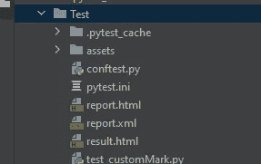

# Pytest —第 2 部分

> 原文：<https://medium.com/analytics-vidhya/pytest-part-2-9c594c36b9f4?source=collection_archive---------2----------------------->

这个博客是我的 pytest 初学者指南博客的延续。

[](https://gunturu-lali.medium.com/pytest-a-beginner-guide-9ba84a18d3dd) [## pytest——初学者指南。📄

### pytest 框架入门…

gunturu-lali.medium.com](https://gunturu-lali.medium.com/pytest-a-beginner-guide-9ba84a18d3dd) 

在 [Unsplash](https://unsplash.com?utm_source=medium&utm_medium=referral) 上拍摄的 [ThisisEngineering RAEng](https://unsplash.com/@thisisengineering?utm_source=medium&utm_medium=referral)

这里涉及的主题有:

*   ***分组测试***
*   ***创建 pytest.ini 文件***
*   ***自定义标记***
*   ***内置标记***
*   ***为什么 python 脱颖而出***
*   ***参数化标记***
*   ***并行测试***
*   ***N 次失败后停止***
*   ***汇报***

**分组测试-**

在 pytest 中，我们可以使用测试函数上的标记对测试进行分组。pytest 的妙处就在这里，我们可以使用内置的标记，或者如果需要，我们可以创建自己的标记。最广泛使用的标记是 parametrize、xfail 和 skip。创建自定义标记的语法是，

```
@pytest.mark.<markername>
```

这里，@ symbol 描述了一个装饰器，为了使用标记，我们必须首先用命令**导入 pytest** 导入 pytest 模块。


泰勒·米利根在 [Unsplash](https://unsplash.com?utm_source=medium&utm_medium=referral) 上拍摄的照片

pytest 中有两种类型的标记。他们是，

*   内置标记
*   自定义标记

标记只能应用于测试，对夹具没有影响。

要显示所有可用的标记(包括内置的和自定义的),使用的命令是，

```
*pytest --markers*
```

示例代码，

```
import pytest@pytest.mark.concat
def test_strConcat(input_value):
    assert "Hello " + input_value == "Hello python"
```

这里 ***concat*** 是自定义标记，分配给函数执行字符串串联操作。

要使用特定的标记执行特定的测试，可以使用下面的命令。

```
pytest -m <markername> -v
```

例子，

```
pytest -m concat -v
```

该命令获取所有标有*连接*的测试，并执行这些测试。

如果我们有自定义标记，他们需要注册。为了注册，我们必须创建一个名为 ***pytest.ini.*** 的文件

# 正在创建 pytest.ini 文件

INI 代表初始化。从它的名字我们可以看出它保存了配置信息。它包含文本内容，这样我们可以很容易地阅读，这有助于如果一个新的程序员进入概念。它遵循一个结构，我们必须添加我们的自定义标记名称。



从上图可以看到， ***Test*** 是我的包，pytest.ini 是创建的文件。

pytest.ini 文件的示例结构如下:

```
[pytest]markers =
    add : to add numbers
    sub : to subtract numbers
    concat : To concatenate strings
```

这里， *add，sub，concat* 是自定义标记，定义每个标记的用法供用户参考，是可选的。

Pytest 提供了一个优秀的特性，叫做 *strict markers，*，如果 marker 没有注册，通过它我们可以限制测试的执行。

这可以通过使用， ***addopts = — strict -markers 来实现。***

```
[pytest]addopts = --strict -markers
markers =
    add : to add numbers
    sub : to subtract numbers
    concat : To concatenate strings
```

# 内置标记

Pytest 提供了一些内置的标记，最常用的有 ***skip、xfail、parametrize、incremental 等。***

***跳过—*** 总是跳过一个测试功能

语法，

```
pytest -m skip filename.py
```

***xfail —*** 如果满足某个条件，就会产生“预期失败”的结果。

```
pytest -m xfail filename.py
```

***参数化—*** 测试的参数化是通过多组输入/数据来运行测试。

# pytest 脱颖而出的原因-

现在让我们考虑一个测试在一段时间内不相关的情况，这里 python 提供了一个优秀的标记，叫做 **xfail。我们有两个选择，要么失败，要么跳过。**

在这里，pytest 实际上执行了 xfailed 测试，但是它不被视为通过或失败的测试，即使测试失败，也不会打印测试的更多细节。

我们可以使用以下标记进行 xfail 测试

```
@pytest.mark.xfail
```

例子，

```
import pytest@pytest.mark.skip
def test_upper(input_value):
    assert input_value.upper() == "PYTHON"@pytest.mark.xfail
def test_lower(input_value):
    assert input_value.lower() == "python"
```

使用以下命令执行测试

```
pytest test_customMark.py -v
```

执行时，上述命令将生成以下结果

```
========================= test session starts =========================
platform win32 -- Python 3.9.0, pytest-6.1.2, py-1.9.0, pluggy-0.13.1 -- c:\users\pycharmprojects\testing\venv\scripts\python.exe
cachedir: .pytest_cache
metadata: {'Python': '3.9.0', 'Platform': 'Windows-10-10.0.18362-SP0', 'Packages': {'pytest': '6.1.2', 'py': '1.9.0', 'pluggy': '0.13.1'}, 'Plugins': {'forked': '1.3.0', 'html': '2.1.1', 'metadata': '1.10.0', 'xdist': '2.1.0'}}
rootdir: C:\Users\PycharmProjects\Testing\Test, configfile: pytest.ini
plugins: forked-1.3.0, html-2.1.1, metadata-1.10.0, xdist-2.1.0
collected 2 items / 2 deselected ======================= 2 deselected in 0.05s ========================
```

如果我们分析执行，两个测试函数被执行，但是没有显示为选中。

# 参数化标记

完成测试的参数化是为了用多组输入/数据运行测试。Pytest 提供了一个内置的标记来执行参数化。

这可以使用参数化装饰来完成。

```
@pytest.mark.parametrize
```

创建参数化夹具，

```
@pytest.mark.parametrize("variable1, variable2",
			 [(dataset1),(dataset2)]
			 )
def function_name(variable1, variable2):
	** --- assertion here --- **
```

这里，*变量 1 和变量 2* 是两个**参数名。**

*数据集 1 和数据集 2* 是两个**参数值。**

现在让我们以相同的字符串连接操作为例来看看它是如何工作的，

```
import pytest
@pytest.mark.parametrize("str1,str2,result",
                         [("Open ", "source", "Open source"),
                         ("Hello ", "World", "Hello World") 
                          ])
def test_strConcat(str1, str2, result):
    assert str1 + str2 == result
```

输出-

```
collected 2 items                                                                                                                                                                                                                         
test_Parameterized.py ..                                                                                                                                                                                                            [100%]==================================== 2 passed in 0.04s =====================================
```

# 平行测试

并行测试意味着我们通过分割处理器的数量来执行测试。我们可以分配多个工人并执行。


[Jan Canty](https://unsplash.com/@jancanty?utm_source=medium&utm_medium=referral) 在 [Unsplash](https://unsplash.com?utm_source=medium&utm_medium=referral) 上拍照

Pytest 按顺序运行所有的测试文件。当执行一堆测试时，它会自动增加执行时间。在这种情况下，并行测试有助于并行运行测试。

为此，我们必须安装一个名为，

```
pytest-xdist
```

在命令行中执行以下命令-

```
pip install pytest-xdist
```

数字可以指定为:

```
**pytest -n <num>**
```

例子，

```
pytest -n 2
```

输出，

```
(venv) C:\Users\user1\PycharmProjects\Testing\Test>pytest -n 2
===================== test session starts =============================
platform win32 -- Python 3.9.0, pytest-6.1.2, py-1.9.0, pluggy-0.13.1
rootdir: C:\Users\user1\PycharmProjects\Testing\Test, configfile: pytest.ini
plugins: forked-1.3.0, html-2.1.1, metadata-1.10.0, xdist-2.1.0
gw0 [0] / gw1 [0]=================== no tests ran in 0.75s ============================
```

如果我们分析执行的测试代码，内部测试被分组并执行。swe 提及 2，测试被分组为 gw0[0] / gw1[0]

***gw*** 代表集团职工。

实施例 2，

```
pytest -n 4
```

输出，

```
(venv) C:\Users\PycharmProjects\Testing\Test>pytest -n 4
======================= test session starts ===========================
platform win32 -- Python 3.9.0, pytest-6.1.2, py-1.9.0, pluggy-0.13.1
rootdir: C:\Users\PycharmProjects\Testing\Test, configfile: pytest.ini
plugins: forked-1.3.0, html-2.1.1, metadata-1.10.0, xdist-2.1.0
gw0 [0] / gw1 [0] / gw2 [0] / gw3 [0]======================= no tests ran in 0.96s =========================
```

这里测试分为 4 组，分别为 gw0[0]，gw1[0]，gw2[0]，gw3[0]

如果我们想知道执行了哪些测试，我们可以尝试使用-v verbose 选项，如下所示

**T5【pytest-n4-v**

*举例，*

```
(venv) C:\Users\user1\PycharmProjects\Testing\Test>pytest -n 4 -v
======================== test session starts =========================
platform win32 -- Python 3.9.0, pytest-6.1.2, py-1.9.0, pluggy-0.13.1 -- c:\users\pycharmprojects\testing\venv\scripts\python.exe
cachedir: .pytest_cache
metadata: {'Python': '3.9.0', 'Platform': 'Windows-10-10.0.18362-SP0', 'Packages': {'pytest': '6.1.2', 'py': '1.9.0', 'pluggy': '0.13.1'}, 'Plugins': {'forked': '1.3.0', 'html': '2.1.1', 'metadata': '1.10.0', 'xdist': '2.1.0'}}
rootdir: C:\Users\PycharmProjects\Testing\Test, configfile: pytest.ini
plugins: forked-1.3.0, html-2.1.1, metadata-1.10.0, xdist-2.1.0
[gw0] win32 Python 3.9.0 cwd: C:\Users\user1\PycharmProjects\Testing\Test
[gw1] win32 Python 3.9.0 cwd: C:\Users\user1\PycharmProjects\Testing\Test
[gw2] win32 Python 3.9.0 cwd: C:\Users\user1\PycharmProjects\Testing\Test
[gw3] win32 Python 3.9.0 cwd: C:\Users\use1\PycharmProjects\Testing\Test
[gw0] Python 3.9.0 (tags/v3.9.0:9cf6752, Oct  5 2020, 15:34:40) [MSC v.1927 64 bit (AMD64)]
[gw1] Python 3.9.0 (tags/v3.9.0:9cf6752, Oct  5 2020, 15:34:40) [MSC v.1927 64 bit (AMD64)]
[gw2] Python 3.9.0 (tags/v3.9.0:9cf6752, Oct  5 2020, 15:34:40) [MSC v.1927 64 bit (AMD64)]
[gw3] Python 3.9.0 (tags/v3.9.0:9cf6752, Oct  5 2020, 15:34:40) [MSC v.1927 64 bit (AMD64)]
gw0 [0] / gw1 [0] / gw2 [0] / gw3 [0]
scheduling tests via LoadScheduling
```

这将给出每个工人执行测试详细视图。

# N 次失败后停止

该功能允许在发生“n”次故障后停止进一步测试。

在实际场景中，一旦新版本的代码准备好进行部署，它将首先部署到生产前/准备环境中。然后在其上运行一个测试套件。

只有测试套件通过，代码才有资格部署到生产环境中。如果测试失败，不管是一次还是多次，代码都没有准备好投入生产。

因此，如果我们想在 n 次测试失败后立即停止测试套件的执行，该怎么办。这可以在 pytest 中使用 maxfail 来完成。

在 n 次测试失败后立即停止执行测试套件的语法如下

```
pytest --maxfail = <num>
```

要在第一次失败后停止测试，

```
pytest -x
```

要在第一次失败后停止测试，

```
pytest --exitfirst
```

使用以下代码创建一个文件 test_failure.py。

```
pytest --exitfirst 2
```

执行此测试文件时，所有测试都将失败。这里，我们将在两次失败后停止测试的执行。

# 报告

执行此操作的第一步是使用以下命令安装 html 包，

**pip install pytest-html —** 在命令提示符下安装所有软件包，生成一个 html 文件。

然后执行这个命令，

**pytest—html = report . html**

一旦我们执行了这个命令，HTML 或 XML 文件就会出现在我们的项目树中。


这就是为我们的测试创建 XML 或 HTML 报告的方式。

感谢阅读…