# 皮西亚斯作为获取 YouTube 数据的工具

> 原文：<https://medium.com/analytics-vidhya/pytheas-as-a-tool-to-get-youtubedata-3b238d698418?source=collection_archive---------15----------------------->

你有没有尝试从 youTube 上提取数据，然后发现这非常困难，文档很乱，最后你没有得到你想要的东西？

> 皮西亚斯是一个网站应用程序，可以用你自己的 APIyouTubeDataV3 下载数据视频，频道，播放列表，通过查询搜索视频/频道，获得每个视频的统计数据，字幕，评论。由 [Cortext 团队](https://gitlab.com/cortext/pytheas-youtube)的 Nicola Ricci 创作

你只需要有一个 **API youtube Data V3，**那么首先，你只需要创建凭证，转到这个[链接](https://console.developers.google.com/apis)，用你的 gmail 创建一个账户，然后创建一个新项目。如果你已经有 API 的关键只是通过这前 3 张照片。

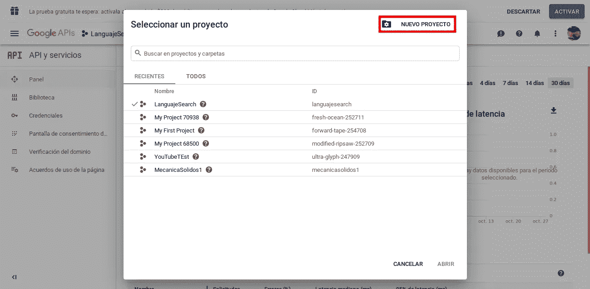

在库部分，你会看到 youTube API

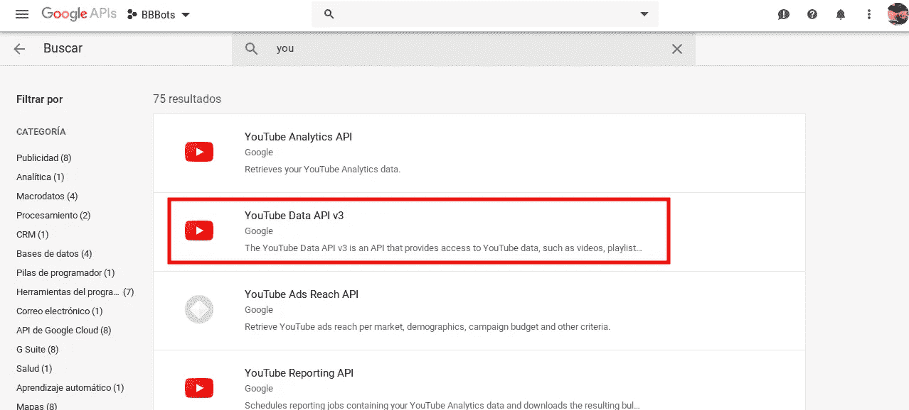

选择 Youtube DataAPI v3，点击“启用”即可使用。然后进入凭证部分并创建一个新凭证(特别是一个 API 密匙)，最后您只需复制 API 密匙

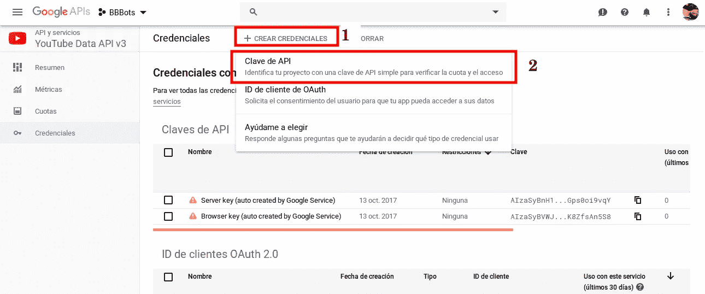

现在困难的部分结束了，容易的部分来了。使用 API 密钥，让我们复制并将其粘贴到皮西亚斯配置中。转到 [pytheas，](https://pytheas.cortext.net/manage)创建一个帐户，并在这里设置您的 API 密钥

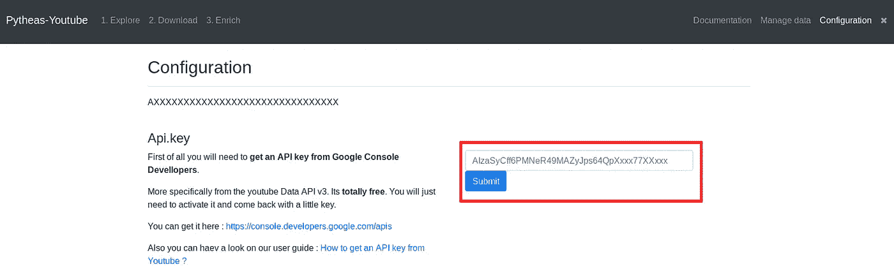

> 现在皮西亚斯的所有功能

## **1。一条视频信息:**

当您只有一个视频并且想要收集数据时，您可以浏览并选择“什么是视频？”并粘贴你想要获取相关信息的视频的 id/url。像这样

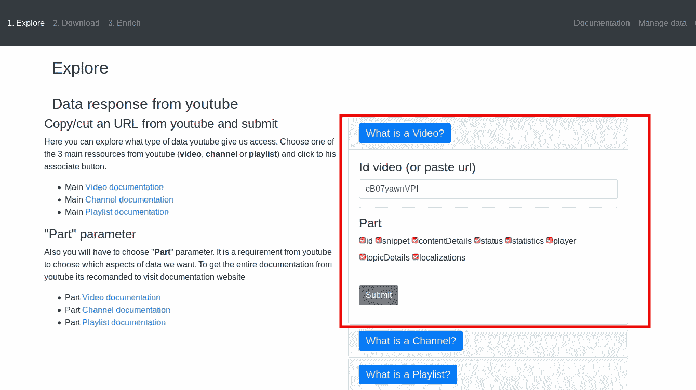

您将从状态/内容细节/统计/片段中获得信息。如果您不想要所有这些细节，您可以取消选择。

## **2。一个频道信息:**

在 Explore 部分选择“什么是渠道”,并填写 IdChannel 或您想要获取信息的渠道的链接。您可以选择填写频道的用户名；然后选择您想要获取并提交的信息。

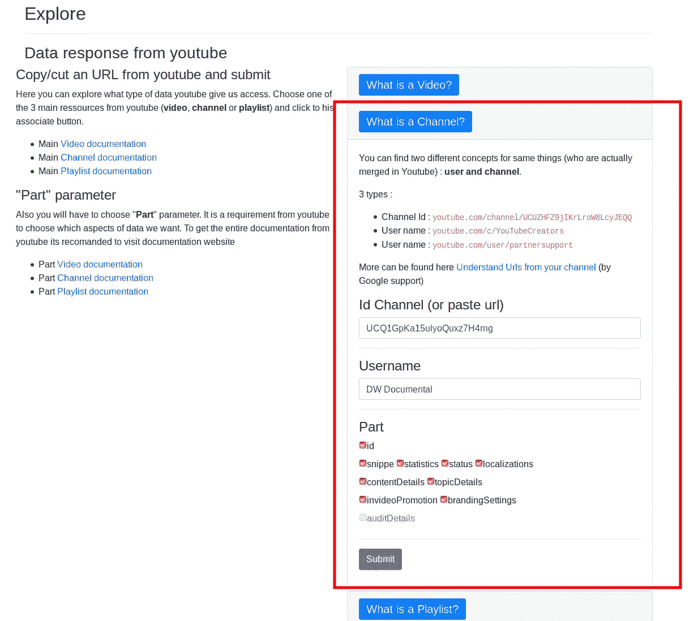

## **3。一个播放列表信息:**

播放列表也差不多，你可以使用 playlistId 或者播放列表的链接；然后选择您想要获取并提交的数据。

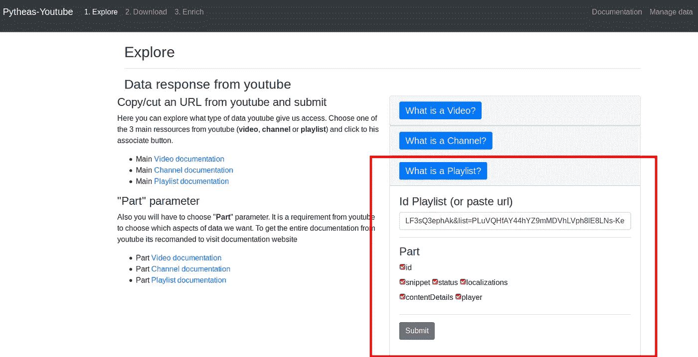

## **4。从一个频道下载视频:**

这个功能是从一个频道获取所有的视频。您只需要频道 ID 和用户名。您还可以命名搜索来组织 pytheas 数据。

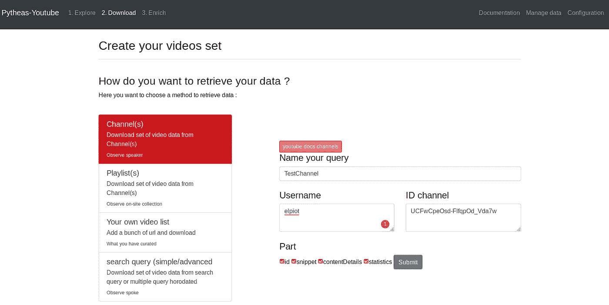

## **5。从一个播放列表下载视频:**

在播放列表中，您可以命名查询和播放列表的 id。播放列表的 id 在带有参数“list”的视频的 url 中

播放列表的 id

获得参数后，只需将其复制并粘贴到皮西亚斯的 idPlaylist 中，然后“添加”id。最后提交请求

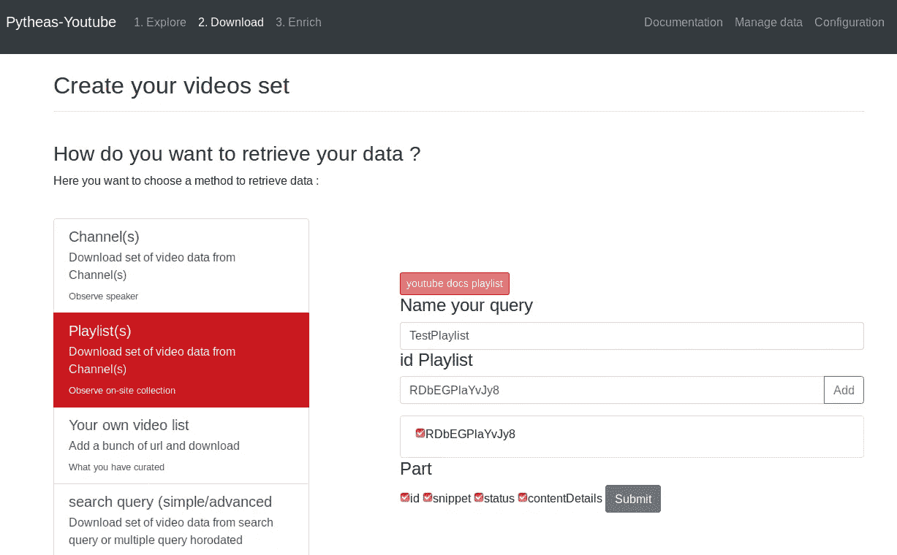

## **6。从视频列表中下载视频:**

如果您有一个 IdVideos 列表，并且想要扩展您已经从视频中获得的数据，那么这个特性非常有用，因此您命名查询，编写 id 列表并提交。

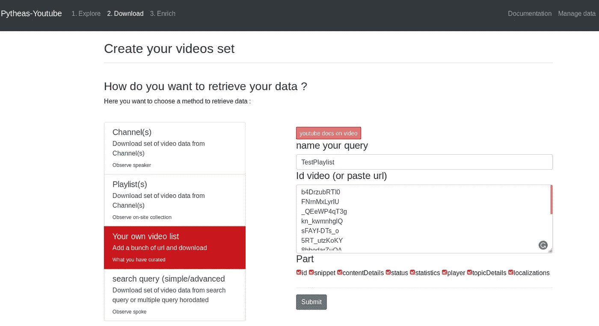

## **7。从搜索查询下载视频:**

另一个非常有用的工具是通过查询来搜索视频，有两种方法。

**简单的方法**你会得到更少的数据，因为 youTube 的算法会给你按相关性、比率、浏览量、视频数或标题排序的数据，但通常不会超过 1000。因此，你把你想要提取的查询，数据的语言和我们选择的顺序按你需要的顺序(可以是相关性，率，观看计数，视频计数或标题)。

**另一种方式是高级搜索**，使用 order by date 并选择一段时间进行搜索。

> 一个很大的提示是，如果你只需要下载视频，你可以用'，-播放列表，-频道'过滤搜索

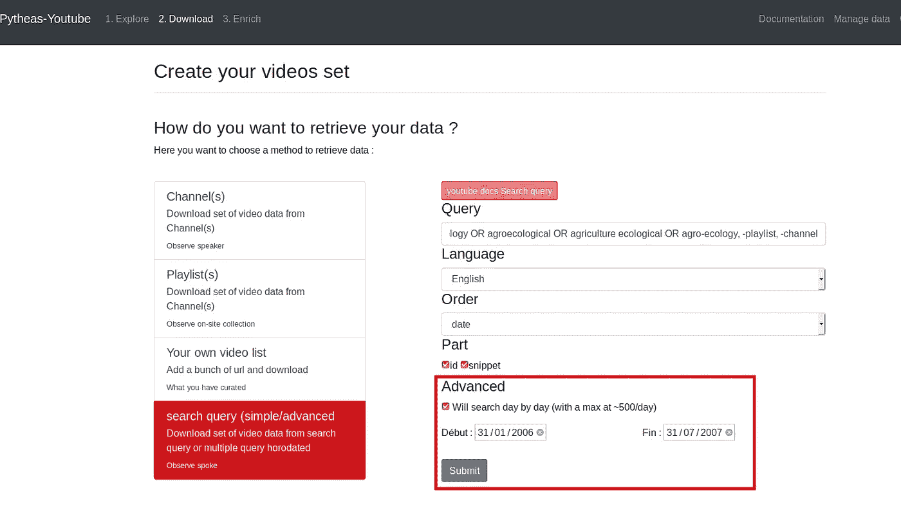

## **8。从一堆视频中获取评论/字幕/统计/相关视频:**

最后但同样重要的部分是下载视频的相关数据，使用脚本手动下载字幕和评论到 youTube API 是一件非常困难的事情，所以这个网站真的很有用，让你的工作更容易更快。
从你已经得到的数据中，去 Enrich part，选择你想要的东西，选择你的查询数据，提交，等待你的结果

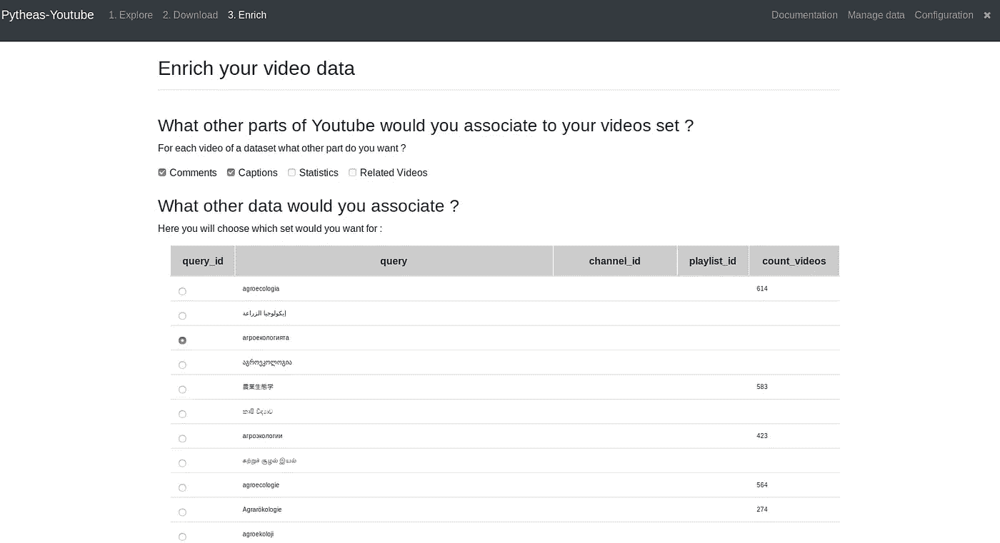

> 我的数据在哪里？

所有数据都在**管理数据中。**你可以看到它，并以 json 格式下载

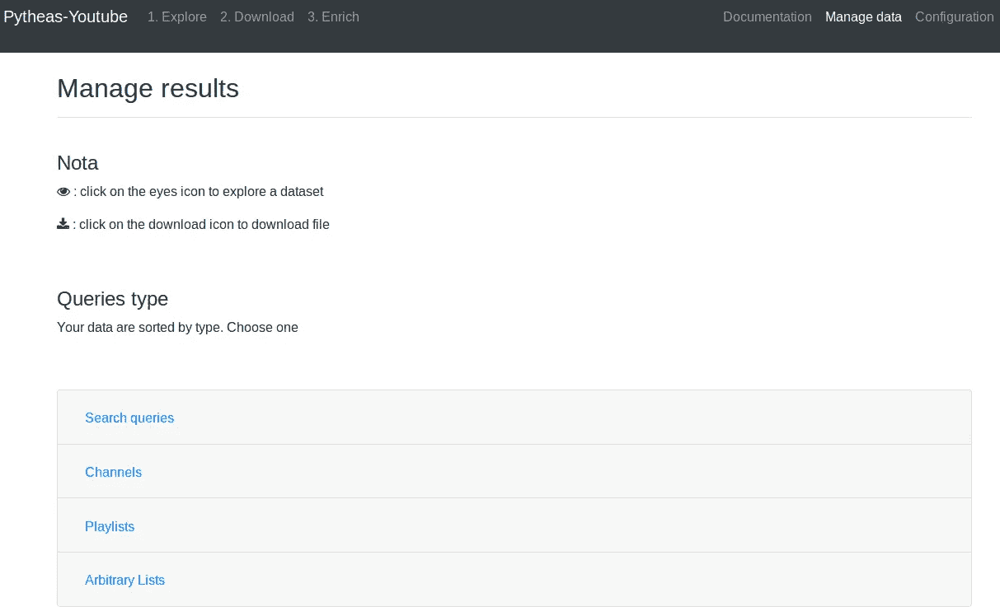

管理数据

感谢阅读本教程，希望你喜欢它，使用它等。

任何问题或意见，请张贴在下面。