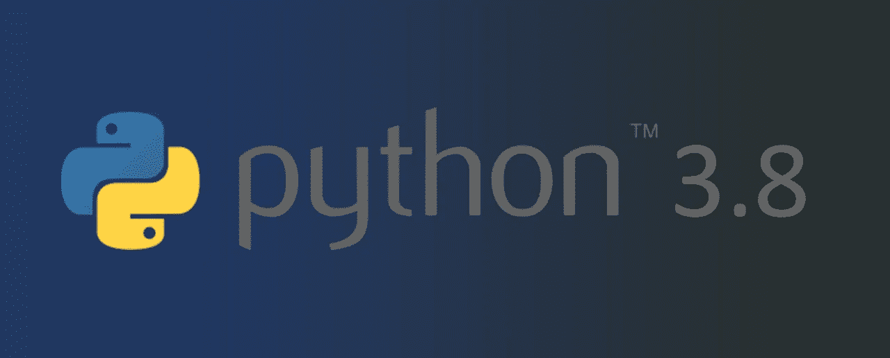

# Python 3.8 新特性:Walrus 运算符和仅位置参数

> 原文：<https://medium.com/analytics-vidhya/python-3-8-new-features-the-walrus-operator-and-positional-only-parameters-e7333eb8be2a?source=collection_archive---------14----------------------->



# 部分概述

*   海象运营商
*   仅位置参数
*   参考

# 第 1 部分 Walrus 运算符(赋值表达式)

我们使用赋值表达式(`walrus operator`)。它使用 walrus 操作符(`:=`)在一个表达式中对变量名赋值和求值，从而减少了重复。这是在`Python 3.8`中引入的一种新语法，解决了该语言长期存在的导致代码重复的问题。

现在，让我们看看:

```
**if** fake_val :**=** fake_func():
    *# do something with fake_val***while** fake_val :**=** fake_func():
    *# do something with fake_val* fake_val **=** fake_func1()**if** **not** fake_val:
    logging**.**warning('fake func1')
    fake_val **=** fake_func2()
    **if** **not** fake_val:
        logging**.**warning('fake func2')
        val **=** func3()**if** **not** fake_val:
    **raise** ValueError('....')
```

升级到 3.8 后，您可以将其重构为:

```
**if** **not** (fake_val :**=** fake_func1()):
    logging**.**warning('fake func1')
    **if** **not** (fake_val :**=** fake_func2()):
        logging**.**warning('fake func2')
        **if** **not** (fake_val :**=** fake_func3()):
            **raise** ValueError('....')
```

例如，在这里，我定义了篮子的内容。

```
fruits_in_basket **=** {
    'apple': 15,
    'peach': 10,
    'lemon': 5,
}
```

现在我们想点一些柠檬。所以我们需要确保篮子里至少有一个柠檬。

```
**def** **order_func**(count):
    **...****def** **out_of_stock**():
    **...**count **=** fruits_in_basket**.**get('lemon', 0)
**if** count:
    order_func(count)
**else**:
    out_of_stock()
```

升级到 3.8 后，您可以将其重构为:

```
**if** count :**=** fruits_in_basket**.**get('lemon', 0):
    order_func(count)
**else**:
    out_of_stock()
```

如果我们想做柠檬汁，我们需要 10 个柠檬。

```
**def** **make_lemon_juice**(count):
    **...**count **=** fruits_in_basket**.**get('lemon', 0)
**if** count **>=** 10:
    make_lemon_juice(count)
**else**:
    out_of_stock()
```

升级到 3.8 后，您可以将其重构为:

```
**if** (count :**=** fruits_in_basket**.**get('lemon', 0)) **>=** 10:
    make_lemon_juice(count)
**else**:
    out_of_stock()
```

如果我们想点桃子和柠檬汁；

```
**def** **make_peach_juice**(count):
    **...****def** **make_lemon_juice**(count):
    **...**count **=** fruits_in_basket**.**get('peach', 0)
**if** count **>=** 2:
    make_peach_juice(count)
**else**:
    count **=** fruits_in_basket**.**get('lemon', 0)
    **if** count **>=** 10:
        make_lemon_juice(count)
    **else**:
        *# 'Nothing'*
```

升级到 3.8 后，您可以将其重构为:

```
**if** (count :**=** fruits_in_basket**.**get('peach', 0)) **>=** 2:
    make_peach_juice(count)
**elif** (count :**=** fruits_in_basket**.**get('lemon', 0)) **>=** 10:
    make_lemon_juice(count)
**else**:
    *# 'Nothing'*
```

一般来说，当您发现自己在一组行中多次重复相同的表达式或赋值时，是时候考虑使用赋值表达式来提高可读性了。

# 第 2 部分—仅位置参数

我们可以在函数定义中使用`/`来表示在它之前的参数只是位置性的。

例如:

```
**def** **func**(a, **/**):
    **pass**func('foobar')*# This raises*
func(a**=**'foobar')
```

如果 func 在需要`positional-only`时使用`keyword argument`，则`TypeError`发生。

下面是一个包含所有参数类型的函数定义示例。

```
**def** **func**(a, **/**, b, *****, c):
    **pass**a: positional-only
b: positional or keyword
c: keyword-only
```

因此，`func`可以这样叫:

```
func('foo', 'bar', c**=**'foobar')func('foo', b**=**'bar', c**=**'foobar')
```

但不是这样的:

```
*# TypeError: func() got some positional-only arguments passed as keyword arguments: 'a'*
func(a**=**'foo', b**=**'bar', c**=**'foobar')*# TypeError: func() takes 2 positional arguments but 3 were given*
func('foo', 'bar', 'foobar')
```

# 第 3 节—参考文献

*   [https://www.python.org/dev/peps/pep-0569/#id6](https://www.python.org/dev/peps/pep-0569/#id6)
*   [https://docs.python.org/3.8/whatsnew/3.8.html](https://docs.python.org/3.8/whatsnew/3.8.html)
*   [https://www.python.org/dev/peps/pep-0572/](https://www.python.org/dev/peps/pep-0572/)
*   [https://www . python . org/dev/peps/pep-0013/#选举委员会](https://www.python.org/dev/peps/pep-0013/#electing-the-council)
*   [https://docs . python . org/3/glossary . html #仅关键字-参数](https://docs.python.org/3/glossary.html#keyword-only-parameter)