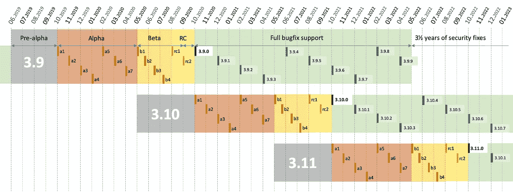

# Python 3.9:对 Python 未来的一瞥

> 原文：<https://medium.com/analytics-vidhya/python-3-9-a-peek-into-the-future-of-python-b696b80a2b12?source=collection_archive---------7----------------------->

## Python 3.9 对 Python 编程的未来有多大影响。


照片由[华尔街日报](https://www.wsj.com/articles/the-office-pet-is-a-pig-no-really-1435708431)拍摄

Python 3.9 于 2020 年 10 月 5 日星期一发布，带来了许多令人兴奋的新特性。

在本文中，我们将重点关注以下内容:

1.  Python 的年度发布周期
2.  解释器改进
3.  新的内置功能
4.  新的语法功能

老实说**并不**喜欢阅读这些关于 python 如何消亡的文章，就像[的杰森·杜沙](https://towardsdatascience.com/python-is-slowly-losing-its-charm-9ca652726492)写的 Python 正在慢慢失去魅力；即使他们非常固执己见。

python 的新版本显示了它仍然有多么活跃，以及为什么我们应该从这一点上期待更多。跟我一起阅读，看看如何…

# Python 的年度发布周期

Python 3.9 标志着一个新发布日历的开始，将周期从 1 年缩短到仅 12 个月。



Python 的年度发布周期— [PEP 602](https://s3.dualstack.us-east-2.amazonaws.com/pythondotorg-assets/media/dev/peps/pep-0602/pep-0602-example-release-calendar_llvnU1W.png)

这将大大加快发布的速度，以至于我们可能会在每年的十月看到一个新的发布。

这一改变带来了一些好处，例如，使后续的**版本变得更小**，这将鼓励**更快地在用户手中修复**错误；仅举几个例子。

阅读更多关于 [PEP 602](https://www.python.org/dev/peps/pep-0602) 的内容。

# 解释器改进

## CPython 的新 PEG 解析器

Python 3.9 将采用一个新的基于 [PEG](https://en.wikipedia.org/wiki/Parsing_expression_grammar) 的解析器来代替当前的 [LL(1)](https://en.wikipedia.org/wiki/LL_parser) 。我们预计 Python 3.9 会更快，因为与 LL(1)解析器相比，新的 PEG 解析器在最坏的情况下会呈现指数级的时间性能。这是真的，因为 PEG 解析器有一个**无限前瞻**，这意味着它们可以在决定一个规则之前考虑任意数量的标记。

> 新解析器的**性能**已经过调整，在**速度**和**内存消耗**两方面都与旧解析器相差**在 10%** 以内。

完成了一个有 100，000 行的规范文件测试，无休止地重复以下三行:

```
1 + 2 + 4 + 5 + 6 + 7 + 8 + 9 + 10 + ((((((11 * 12 * 13 * 14 * 15 + 16 * 17 + 18 * 19 * 20))))))
2*3 + 4*5*6
12 + (2 * 3 * 4 * 5 + 6 + 7 * 8)
```

这个测试文件测试的结果证明，新的解析器比当前的解析器更快，使用的内存更少。

*   解析和编译成字节码需要 1.28 秒(新)。
*   解析和编译需要 1.44 秒(当前解析器)。

然而，在 Python 3.10 之前，我们不会看到新解析器的太多动作。根据 [PEP 617](https://www.python.org/dev/peps/pep-0617/) ，对新解析器的更改将遵循精心设计的[迁移计划](https://www.python.org/dev/peps/pep-0617/#id38)。

## 新的数学函数

内置的数学模块有新的令人敬畏的功能。

这个方法现在可以处理多个参数，而不是最初的两个。

**LCM** —这个新方法返回指定参数的最小公倍数。

**next after**—`math.nextafter()`函数返回 x 之后 y 方向的下一个可表示的浮点值，如果 y 小于 x，这些函数将返回小于 x 的最大可表示数。

**ULP** —代表“最后一个位置的单元”。该函数返回浮点值 *x.* 的最低有效位的值

**用法**

```
>>> import math>>> # gcd
>>> math.gcd(36,72,24)
12>>> #lcm
>>> math.lcm(36,72,24)
72
```

# 新的内置功能

## removeprefix()和 removesuffix()字符串方法

`removeprefix('prefix')`和`removesuffix('suffix)`是字符串方法，可以分别用来轻松删除不需要的*前缀*或*后缀*。

**用法**

```
>>> text = 'Python 3.9'>>> text.removeprefix('Python ') 
# returns '3.9'>>> text.removesuffix(' 3.9') 
# returns 'Python'
```

`lstrip/rstrtip`和新`remove(prefix/suffix)`之间可能会有混淆，因此，应考虑以下差异。

**lstrip/rstrip:**

*   该参数被解释为字符集。
*   这些字符会从字符串的适当位置重复删除。

**删除(前缀/后缀):**

*   该参数被解释为连续的子字符串。
*   最多只删除前缀/后缀的一个副本。

# 新的语法功能

## 词典联盟

以前我们只有合并字典的`dict.update`和`{**d1, **d2}`方法。现在我们有两个以上的运营商实现联盟。

**字典合并** `**|**`

```
>>> old = {'one':1, 'two':2, 'three':3}
>>> new = {'four':4, 'five':5}
>>> old | new 
*{'one':1, 'two':2, 'three':3, 'four':4, 'five':5}*
```

**更新操作符** `**|=**`

```
>>> old = {'one':1.0, 'two':2.0, 'three':3}
>>> new = {'one':1.0, 'two':2.0, 'three':3.0, 'four':4.0}
>>> old |= new
{'one':1.0, 'two':2.0, 'three':3.0, 'four':4.0}
```

**用 Iterables 更新**

字典更新操作符`|=`的另一个非常酷的特性是它可以使用 iterables 来更新字典。

```
>>> even = {'two':2, 'four':4}
>>> other = [('six', 6), ('eight', 8)]
>>> even |= other
{'two':2, 'four':4, 'six':6, 'eight':8}
```

# 结论

每一个新的 python 版本都有使它更快、更强大的特性。毫无疑问，Python 3.9 将对 2021 年 10 月 Python 3.10 开始的后续版本产生巨大影响。

随着 python 社区的迅速发展，我相信 python 编程从未如此活跃过。

[下载](https://www.python.org/downloads/)享受[新功能](https://docs.python.org/3.9/whatsnew/3.9.html)。

您可以在 Twitter 上向我提出问题或建议。

感谢阅读！