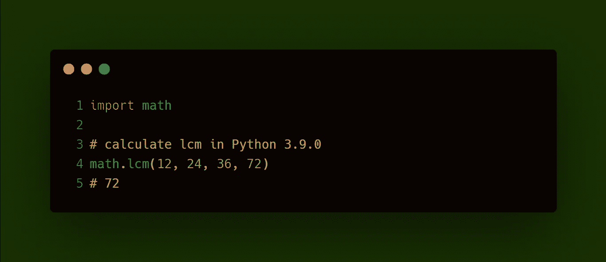

# Python 3.9 出来了！探索您应该知道的 7 个令人兴奋的 Python 3.9 特性

> 原文：<https://medium.com/analytics-vidhya/python-3-9-is-out-explore-7-exciting-python-3-9-features-that-you-should-know-5300b08eca81?source=collection_archive---------21----------------------->

正如著名作家韦恩·W·戴尔所说，

> 改变你看待事物的方式，你所看待的事物也会随之改变。

当 Python 的新版本出来时，许多人担心向后兼容性问题和其他问题。但是如果你喜欢 Python，你肯定会对新更新中发布的酷功能感到兴奋。

Python 的最新版本将于 2020 年 10 月 5 日星期一发布。本文向您展示了 Python 3.9 的一系列特性，您现在就可以尝试。

# 更新 Python

让我们从更新到 python 的新版本开始。如果您不确定您当前使用的版本，请使用下面的代码检查您当前的版本。

在 cmd 中，键入

要更新您的版本，[进入 Python 下载页面](https://www.python.org/downloads/)，获取安装并开始安装。**注意:**确保更新环境变量中的路径。

现在我们有了最新的版本，是时候看看有什么新内容了。让我们开始吧。

# 1.词典更新

字典是 Python 中最有用和最常用的数据结构之一。新版本优化了合并和更新词典的方式。

## 1.1 合并字典

假设我们有两个字典 dict1 和 dict2，

dict1 包含汽车的名称和型号，而 dict2 包含发动机和整备重量。

现在我们想要合并这两个字典，因为它们包含关于同一辆汽车的信息。在 Python 3.8 和更早的版本中，为了合并两个字典，我们使用

内置**更新**方法，

或者表达 ****，**

这有时会很不方便和麻烦。

在 Python 3.9.0 中，我们用| union 操作符进行了流畅的语法更新，合并了两个字典，

这种方式非常干净、简洁、坦率。它还提高了代码的可读性。

如果两个字典有一个公共键，那么第二个字典中的值将被保留。

## 1.2 更新字典

为了在 Python 3.8 或更早版本中用新的键值对更新现有字典，我们将

使用**更新**的方法，

或者用可迭代更新，

在 3.9 中，我们现在有了更新操作符|=它以更简单的方式完成同样的工作。

在这里，|=的工作方式类似于增加的赋值操作符。

> *dict1 |= dict2 表示 dict1 = dict1 | dict2*

# 2.类型提示

在正常情况下，我们不会在 Python 中指定数据类型。但是在某些情况下，我们可能需要一个变量来表现某种类型的行为。在这种情况下，Python 的灵活性可能会令人讨厌。从 Python 3.5 开始，我们可以指定类型，但是这次更新让事情变得太简单了。

考虑一个计算圆直径的函数，

在这种情况下，传递给函数的值的类型非常重要。虽然代码中没有错误，但是传递一个字符串会将同一个值连接两次。

在最新版本中，借助于类型提示，我们可以将预期的类型指定为 int，

# 3.字符串方法

两个新特性被添加到 ***str*** 对象中。在探索性的数据分析过程中，这个特性有时会派上用场。

一个函数从字符串中删除前缀

Other 函数从字符串中删除后缀

# 4.数学函数

# 4.1 GCD

对现有数学函数进行了修改。在早期版本中，计算 *GCD* 的函数只接受两个数字。但是现在，它可以应用于任意数量的值。

# 4.2 LCM

在 ***数学*** 模块中增加了一个新的函数来计算 *LCM* 。像 *GCD* 函数一样， *LCM* 函数也接受任意数量的值。

# 4.3 接下来

*math.nextafter()函数*接受两个参数 x 和 Python 3.9 的这个特性是一个函数，它返回 x 向 y 移动后的下一个浮点值。它考虑了浮点的精度。

# 4.4 单位在最后一位

Python 3.9 的下一个特性是查找最后一位单位的函数，即浮点数之间的间距。考虑一个 3 位数的数，8.14。最接近这个数字的较大数字是 8.15。这两个数字最后相差 1 个单位(ULP)。Math.ulp 函数的返回值相当于这个例子。

要详细了解上一个位置的单位(ULP)，请检查[这个](https://matthew-brett.github.io/teaching/floating_error.html)。

# 5.一致的包导入错误

这与其说是一个特性，不如说是一个修复。当一个相对导入通过它的顶层包时，早期版本的 Python 会引发[不一致的导入错误](https://bugs.python.org/issue37444)。

> *内置。__import__()提升值错误，而*
> 
> importlib。_ _ import _ _()raise import error

*__import__()* 现在提出 ImportError 而不是 ValueError 更有意义。

# 6.随机字节生成

在 [*random*](https://docs.python.org/3/library/random.html) 模块中引入了一个名为 randbytes()的新方法来生成随机字节。Python 已经支持通过 3 个不同的函数生成随机字节

但是它们不能生成伪随机图案。

随机的。Random.randbytes()函数可以以可控的方式生成随机字节，并且可以从种子中重现。虽然，只有在安全性无所谓的情况下才能使用。

# 7.支持 IANA 时区

引入了一个新的模块 zoneinfo，并将其添加到标准库中以支持 IANA 时区。

考虑一个从印度标准时间转换到马德里当前时间的例子。在 3.9 之前，我们会通过 pip 安装 *pytz* 来实现这一点，

对于 zoneinfo 模块，这是相当坦率的。您可以直接导入 ZoneInfo 类。

除此之外，我们现在还拥有新的高性能的基于 PEG 的解析器、Graphlib 模块、AsyncIO 和多处理改进、HTTP 状态代码和一系列冗余功能已被删除。了解[更多](https://docs.python.org/3.9/whatsnew/3.9.html)。感谢你一路阅读到这里。如果你有任何问题、反馈或批评，请在评论区告诉我。祝你今天开心！玩的开心！

*原载于 2020 年 10 月 11 日***。**