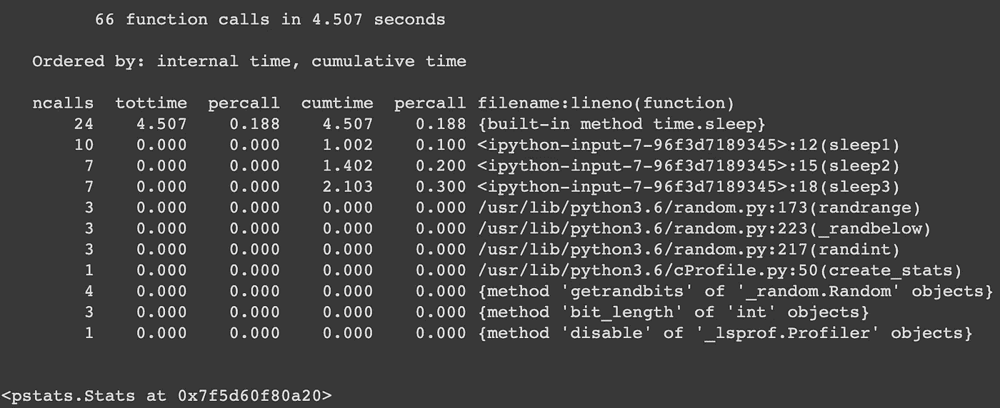
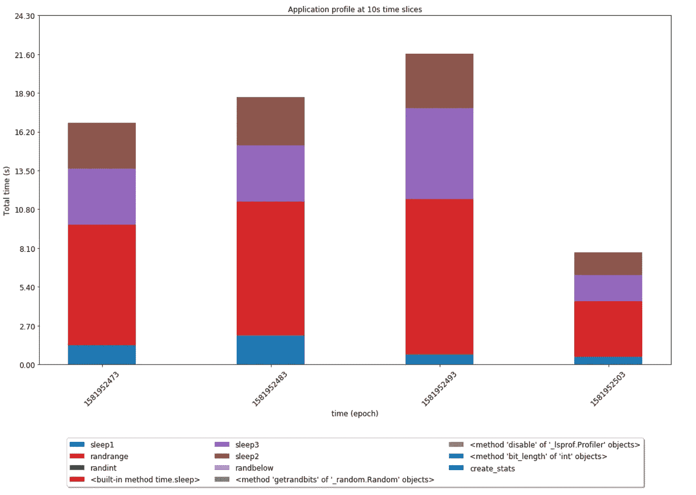

# python 3.9 stats profile——我对 cPython 的第一个 OSS 贡献

> 原文：<https://medium.com/analytics-vidhya/python-3-9-statsprofile-my-first-oss-contribution-to-cpython-9dd6847eb802?source=collection_archive---------8----------------------->

*你可以使用* [*这款谷歌合作笔记本*](https://colab.research.google.com/drive/1GBxS6UnJOLyztivEheHBEDOHFFqpRG2y#scrollTo=Vmky1qQQzvVt) *亲自尝试本文中的所有代码。*

如果你曾经试图调试和优化你的 python 应用程序，很可能你偶然发现了 [Python Profiles](https://docs.python.org/3/library/profile.html#) 来了解大部分执行时间花在哪里。使用`pr.enable()`在您感兴趣的代码段的开头启用分析器，并在结尾调用`pr.create_stats()`。

之后，您可以创建一个 [Stats](https://docs.python.org/3/library/profile.html#the-stats-class) 对象，并使用`ps.print_stats()`以人类可读的格式打印结果。

上面的输出非常有用，可以带你走很长的路。但是，如果您不知道哪种数据输入会导致应用程序出现瓶颈，该怎么办呢？如果您对聚合和评估一段时间内的分析数据感兴趣，该怎么办呢？如果您的团队正在对您的应用程序进行测试，而您想要对其进行概要分析，该怎么办呢？我发现在 ETL 管道中使用这些数据没有一种简单的方法，在这种管道中，您可以对更大的数据集进行进一步的离线分析。

我最近做出了我的第一个[开源 cPython 贡献](https://github.com/python/cpython/pull/15495)，它增加了一个[数据类](https://docs.python.org/3/library/dataclasses.html)来解决这个问题。在创建了 stats 对象之后，您可以通过调用`ps.get_stats_profile()`来检索上面截图中的所有信息，并以编程的方式对其进行分析。

如果您还没有使用 Python3.9，下面的代码片段是 pull 请求中的代码的一个略微修改的版本，您可以通过将它直接导入到您的项目中来开始使用。

现在，我们可以在几次不同的迭代中聚集和分析概要文件，而不是检查代码片段的单次执行的概要文件。在实际的生产服务中，根据您使用的日志记录工具，您可能需要在记录之前格式化和字符串化`StatsProfile` dataclass，但是对于本例来说，所有内容都存储在内存中。

为了模拟带时间戳的日志记录，在每次执行循环时，`(timestamp, stats_profile)`元组被附加到一个`timestamped_stats_profile` 列表中。

记录数据后，需要在特定时间片内对其进行汇总。大多数日志/可视化平台都有处理时间序列数据的功能，因此这是特定于平台的。Sumologic 具有[时间片](https://help.sumologic.com/05Search/Search-Query-Language/Search-Operators/timeslice)功能，Elasticsearch 具有如何进行[日期直方图聚合](https://www.elastic.co/guide/en/elasticsearch/reference/current/search-aggregations-bucket-datehistogram-aggregation.html)的示例，Datadog 具有[跨时间聚合下拉列表](https://www.datadoghq.com/blog/summary-graphs-metric-graphs-101/#distributions)等...

出于这个例子的目的，我用 python 手动进行聚合。我在 10 秒的时间间隔内存储所有记录的(即保存的)`StatsProfile`对象，合计每个函数调用的累计执行时间`cumtime`，并将结果计数器存储在`time_slices_counters`中。如果您对检查某些函数的调用次数感兴趣，而不是累计执行时间，您只需在下面的代码片段中修改在`line 21`上访问的参数。

在我看来，堆积条形图是可视化和轻松解释这些数据的好方法。使用以下代码片段:

我们可以生成一个类似这样的图表:

鉴于多次调用`sleep`的脚本非常简单，结果并不十分有趣或令人惊讶，但希望它在更复杂的应用程序中更有用。

值得注意的是，您可能不应该在生产中这样做。它可能对您的本地或开发环境有用，并且可能值得在一只金丝雀中启用，但可能会对产品产生负面影响。你会用大的`StatsProfile`结构污染你的日志，我还没有调查在 prod 中运行`cProfile`是否会潜在地降低你的服务性能。

顺便提一下，虽然有一些开销和一个小的学习曲线，但我很高兴为 cPython 做贡献是如此容易。除了发布[实际 PR](https://github.com/python/cpython/pull/15495) 之外，你还得签署 [PSF 贡献者协议](https://www.python.org/psf/contrib/contrib-form/)，在[bugs.python.org](https://bugs.python.org/issue37958)上开一个，并推动几个人让你的代码得到关注。关于如何在本地运行和执行测试，有一个很棒的[开发者指南](https://devguide.python.org/)。我最近也看到了这个文档，如果你以前没有为 cPython 做过贡献，这是一个很好的起点。

非常感谢 [Gregory P. Smith](https://medium.com/u/a5e37e79321?source=post_page-----9dd6847eb802--------------------------------) 审核并批准我的 cPython PR！另外，感谢[сергейяркин](https://medium.com/u/5ab59fdac23d?source=post_page-----9dd6847eb802--------------------------------)校对我的文章，并特别感谢 [Manuel Dell'Elce](https://medium.com/u/1d4e9c777efe?source=post_page-----9dd6847eb802--------------------------------) 构建了一个非常好的 [chrome 扩展](https://chrome.google.com/webstore/detail/code-medium/dganoageikmadjocbmklfgaejpkdigbe/related)，使得在这篇中型文章中嵌入代码片段变得轻而易举。