# 使用 ArcGIS 仪表盘对冠状病毒数据进行 Python 分析

> 原文：<https://medium.com/analytics-vidhya/python-analysis-on-corona-virus-data-with-arcgis-dashboards-68e91caa8758?source=collection_archive---------16----------------------->

简介:2020 年有许多意想不到的情景。最主要的担忧是冠状病毒(新冠肺炎),它每天都在印度传播。所以，让我们试着分析并想象它传播的速度有多快。我们使用 Python 工具来分析来自 git 的数据。

> 首先，让我们看看约翰·霍普金斯大学创建的仪表板。你可以看看下面的实时仪表盘，看看实时趋势。ArcGIS 制作的新冠肺炎实时仪表盘。现在，让我们使用 Python 为印度创建一个类似的分析，以可视化印度受冠状病毒影响最严重的邦。

 [## ArcGIS 仪表盘

### COVID 19 例 www.arcgis.com](https://www.arcgis.com/apps/opsdashboard/index.html#/bda7594740fd40299423467b48e9ecf6) 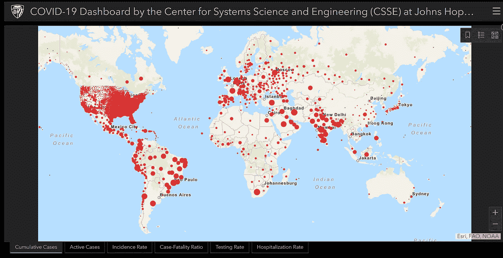

图 1.1:ARC GIS:2020 年累积案例

> 显示美国、巴西、印度累积病例的全球统计数据。使用 ARCGIS 软件制作的图 1 图表有助于我们呈现活动病例的数据，指示率、病死率、检测率、住院率。在数据点的帮助下，我们了解数据点的全局呈现。

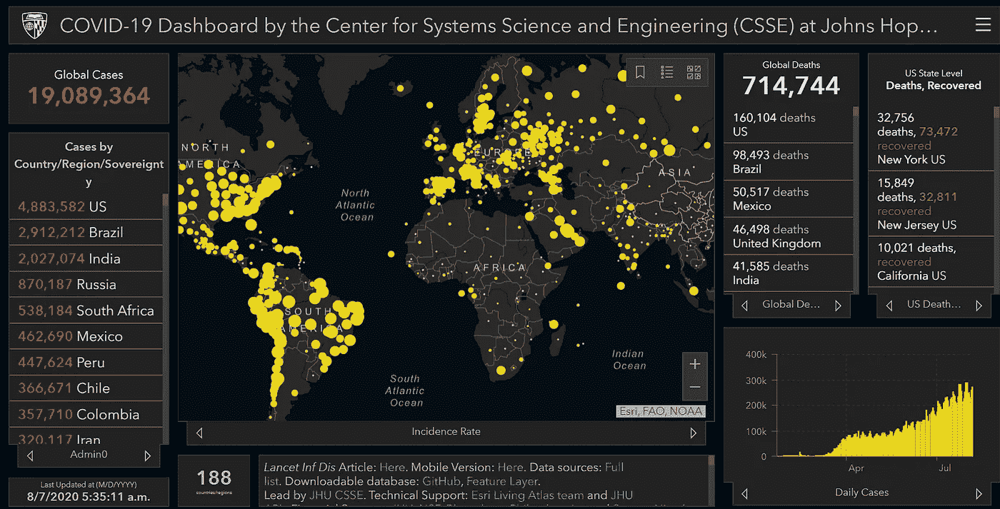

图 1.2。解释全球死亡和发病率的仪表板

> 借助图 1.2，仪表板解释了总发病率。每个国家的全球死亡总数。数据分布有 5 个选项卡。图表左侧是按地区统计的案例数。图的右侧是恢复的数量和死亡区域的数量。垂直条形图显示在仪表板的右侧角落。

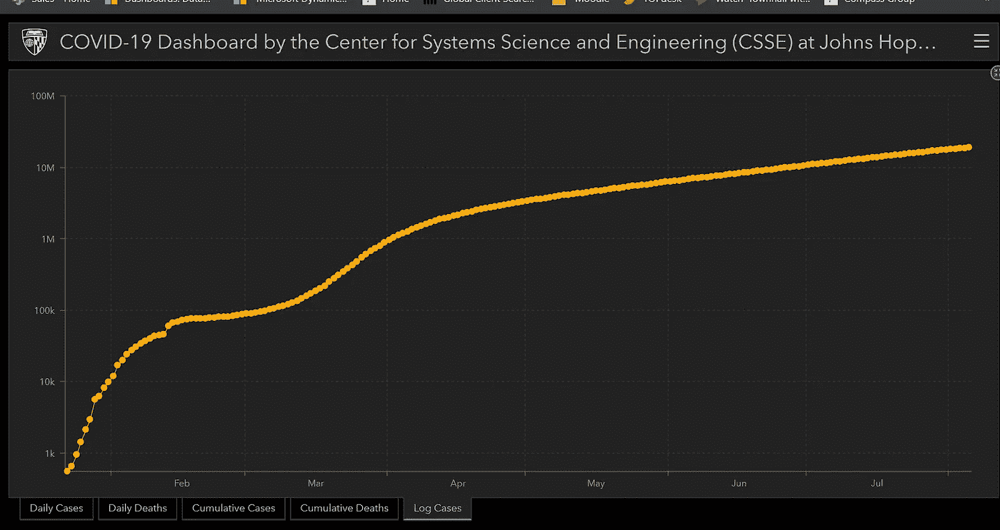

图 1.3。人数与月数的对数案例

> 图 1.3 中的曲线代表人数与六个月数据的对数情况。增加的数字显示了在中心图处凸出的线性曲线。通过该图，我们了解了冠状病毒病例的数量如何与以月数测量的时间尺度相关。然而，这些信息是从 worldometers.info 链接引用的图 1.4 中列出的。

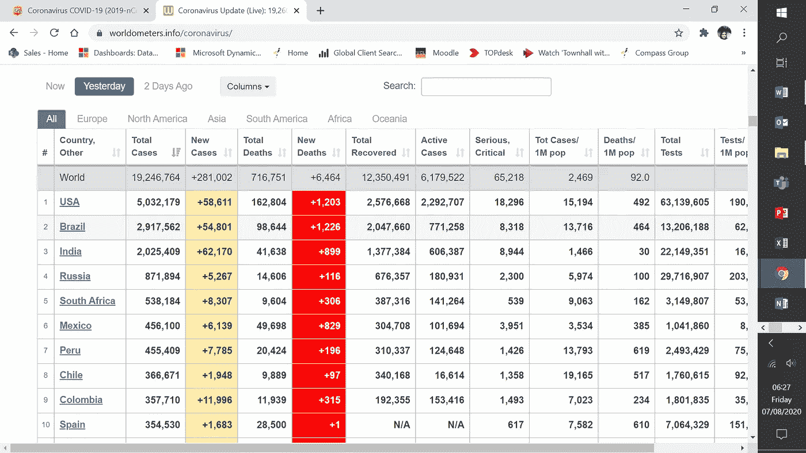

图 1.4。全球每个国家的冠状病毒数据电子表格

> 图 1.4 中的数据显示了美国、巴西和印度病例数最多的所有国家。武汉(病毒起源的城市)是中国中部最大的城市，人口超过 1100 万。该市于 1 月 23 日关闭了交通联系。继武汉封锁之后，黄冈市也被隔离，鄂州市关闭了火车站。这意味着超过 1800 万人被隔离。世界卫生组织(世卫组织)表示，切断像武汉这样大的城市的联系是“公共卫生史上前所未有的”并称赞中国做出了令人难以置信的承诺，隔离病毒并尽量减少向其他国家的传播。

这种病毒危险吗？
为了评估这种新型冠状病毒带来的风险程度，需要了解三个参数:

1.  传染率(Ro)——单个病例中新感染的人数
2.  病死率(CFR) —导致死亡的病例百分比
3.  确定无症状传播是否可能

Python analysis 是一种具有简单语法的高级解释语言，有助于使用 Python 的正式定义中的关键字创建应用程序。

*Python 用于解决与数学、统计相关的复杂问题，并以逻辑的方式带来解决方案。然而，python 速度很慢，但却用很少的代码行实现了更高的生产率。*

*从 git-hub 中提取数据，用 COVID-19.git 的链接进行克隆。进一步安装要执行的命令的库。此外，我们需要在从插件安装后导入这些库。下一步是根据 git 数据创建国家/地区冠状病毒数量的数据框架。*

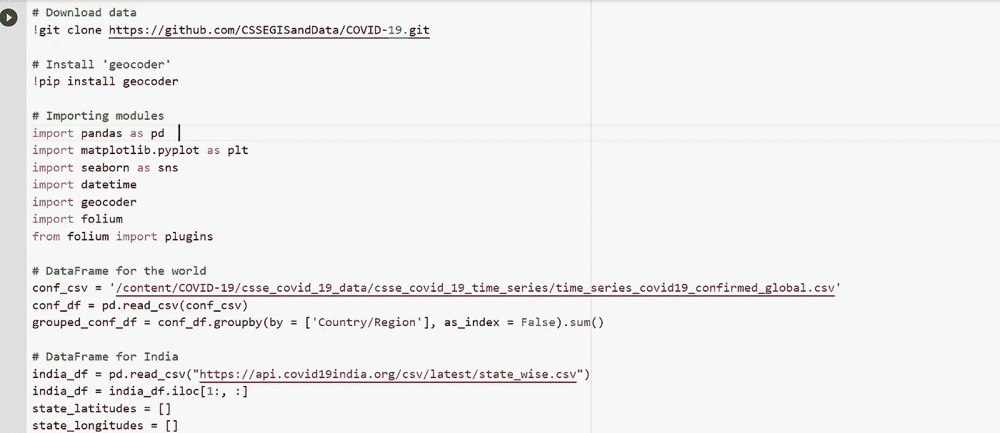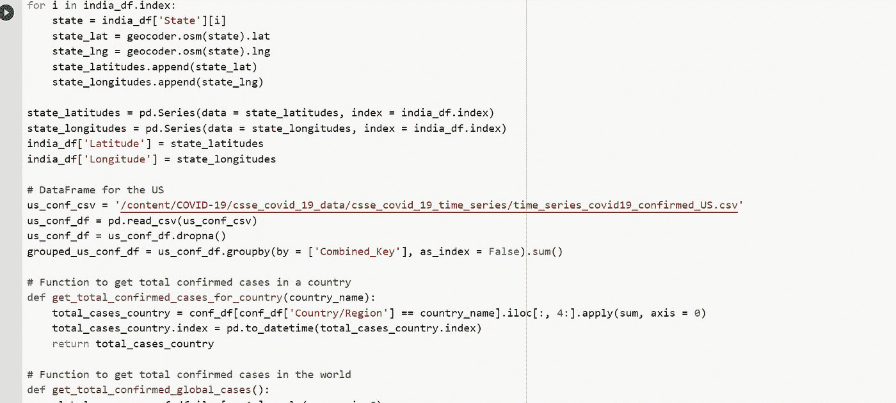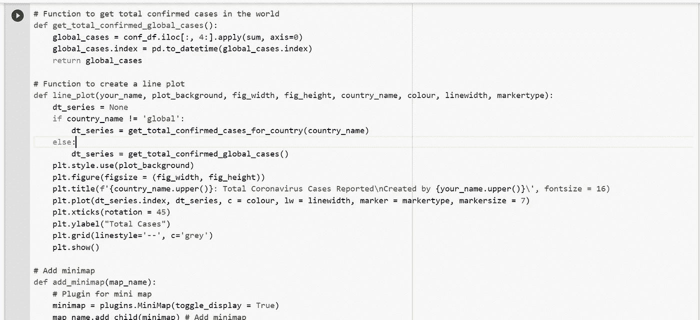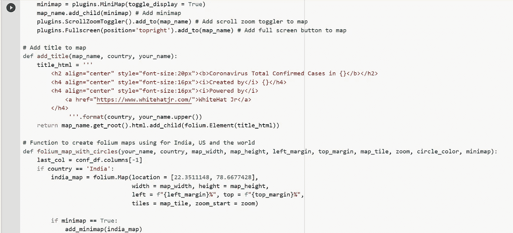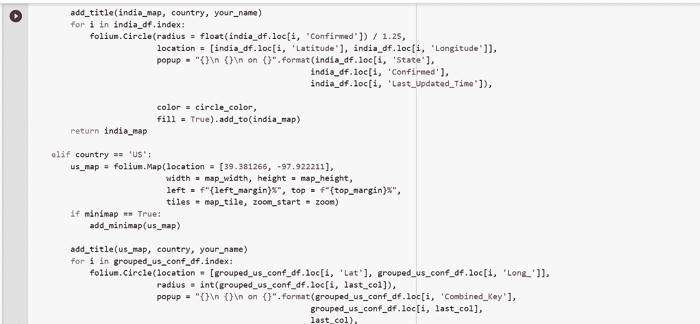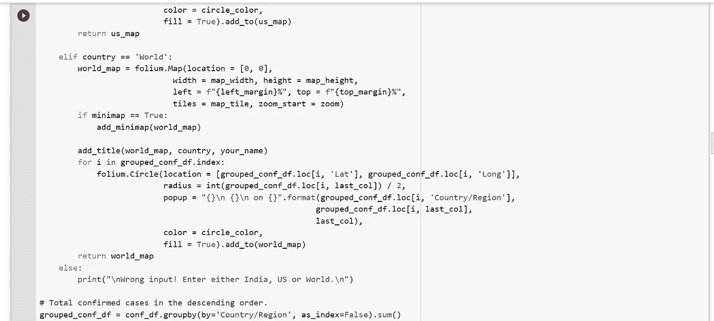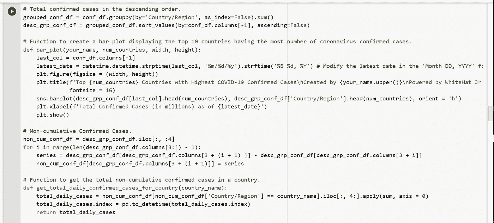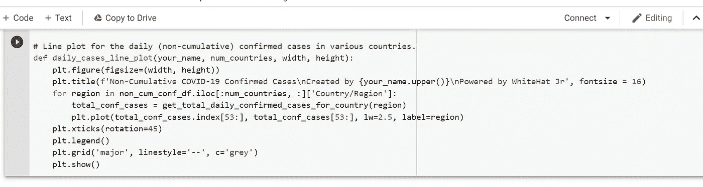

图 1.5。电晕病毒数据的 Python 代码

虽然这段 python 代码看起来很密集，内容也很丰富。我们可以进一步尝试创建函数和日期时间显示在绘图。在 Geo-statistic-GIS 的帮助下，我们可以在地图上绘制纬度和经度，以进一步创建一个框架。此外，这种分析依赖于地图使用的网格坐标。有趣的是，我们认为这项研究是分析冠状病毒数据的初级阶段。一旦疫情结束，将产生详细的展望。然而，这种毁灭性的疾病在 2020 年损害了经济。这进一步影响了我们社会的发展和健康。

让我们抱最好的希望吧！