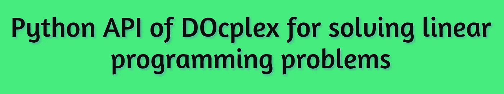

# DOcplex 的 Python API 求解线性规划问题

> 原文：<https://medium.com/analytics-vidhya/python-api-of-docplex-for-solving-linear-programming-problems-6ab6f2e9b553?source=collection_archive---------9----------------------->

在本教程中，我们将学习如何使用 *Python API* 为*线性规划问题* (LPPs)编写模型，并使用*IBM Decision Optimization CP lex(doc plex)Modeling*在您的计算机上使用*IBM ILOG CP lex Optimization Studio*为 Python 求解模型。这里，我们将假设您的机器上安装了 *Python3* 和*IBM ILOG CP lex Optimization Studio v 12.8*或更高版本。