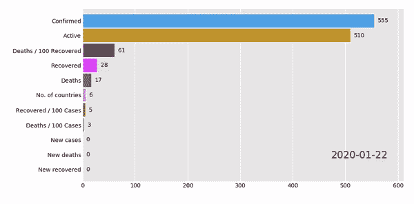
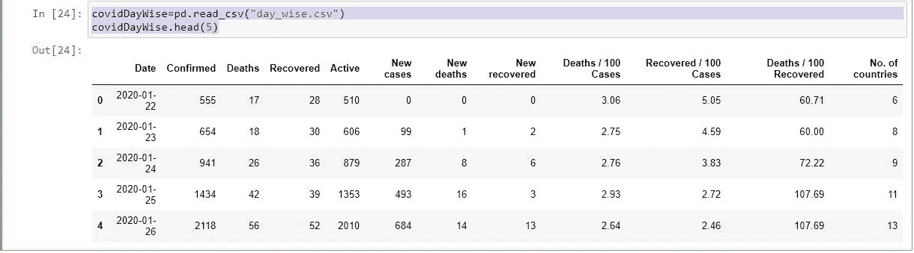
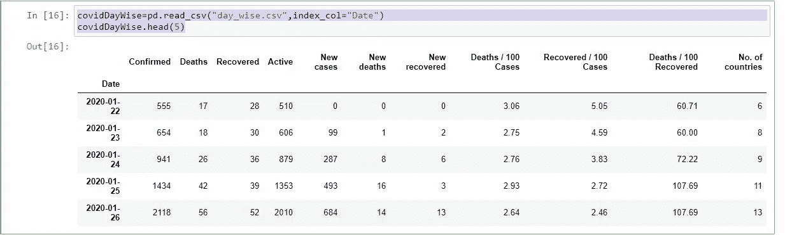
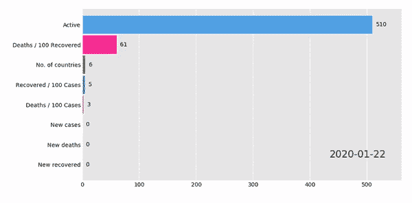
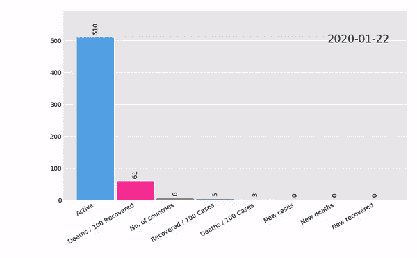

# 使用 bar_chart_race 的 Python 条形图动画

> 原文：<https://medium.com/analytics-vidhya/python-bar-chart-animation-using-bar-chart-race-e4102a11ee23?source=collection_archive---------17----------------------->

用于动画显示数据的条形图竞赛



示例:-条形图动画

**安装**

*   `pip install bar_chart_race`

*(* 或)

*   `conda install -c conda-forge bar_chart_race`

使用上面的命令安装 bar_chart_race 插件。

**导入插件**

```
*import pandas as pd**import numpy as np**import bar_chart_race as bcr*
```

*导入熊猫、numby 和 bar_chart_race*

**数据集**

*目前，我正在获取 covid19 的每日数据集。参考:-* [*日智 CSV*](https://www.kaggle.com/imdevskp/corona-virus-report?select=day_wise.csv)

***读取 csv 文件并显示前 5 位数据***

```
*covidDayWise=pd.read_csv(“day_wise.csv”)
covidDayWise.head(5)*
```



Covid19 数据集

**重新排列数据**

这里我们把日期看作一个时间段，所以，让我们把日期作为数据框中的一个索引。

```
*covidDayWise=pd.read_csv(“day_wise.csv”,index_col=”Date”)
covidDayWise.head(5)*
```



现在索引更改为“日期”列

**动画**

我们可以删除数据帧中不需要的列。

*在这里，我将从数据框中删除“已确认、死亡、已康复”列，并制作动画。*

```
*bcr.bar_chart_race(covidDayWise.drop([‘Confirmed’,’Deaths’,’Recovered’],axis=1))*
```



如果你在 jupyter 上运行它，它会直接转换成视频

**将方向转换为垂直**

*要改变方向，将参数传递给“方向=‘v’”表示垂直，传递给“h”表示水平*

```
*bcr.bar_chart_race(covidDayWise.drop([‘Confirmed’,’Deaths’,’Recovered’],axis=1),orientation=’v’)*
```



转换为垂直的数据