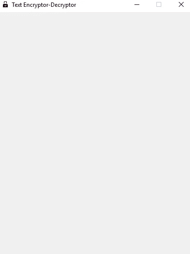
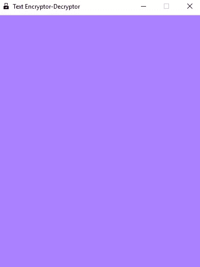
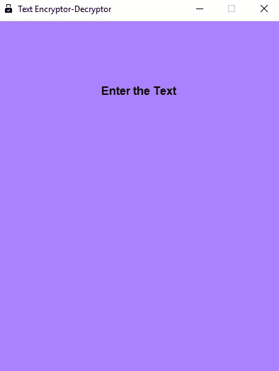
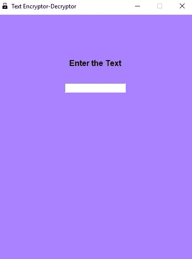
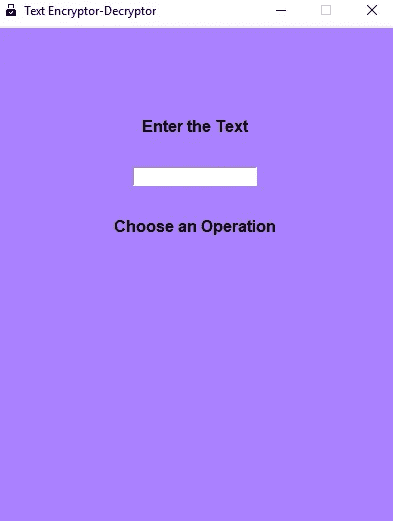
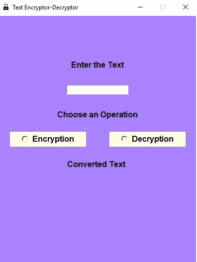
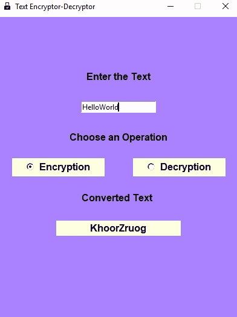
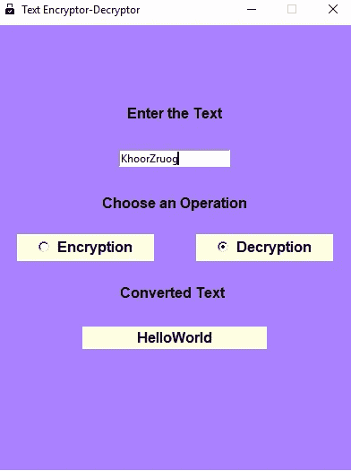

# 基于 Python 的 GUI 应用程序，使用 Caesar 密码加密和解密文本。

> 原文：<https://medium.com/analytics-vidhya/python-based-gui-application-to-encrypt-and-decrypt-text-using-caesar-cipher-23ec88e75558?source=collection_archive---------4----------------------->

在本教程中，我将向您展示如何建立一个 GUI 应用程序，可以加密和解密文本。我们将实现凯撒密码算法来执行上述操作。

该应用程序的基本工作是，该应用程序由一个用户输入文本的文本栏组成。有两个选项可用，要么用户可以加密文本，要么可以解密文本。当用户点击任何一个选项时，操作被执行，并且向用户呈现加密/解密的文本。

# 凯撒密码

凯撒密码是最早也是最简单的加密技术之一，它将字母表中的字母替换为当前字母下方三个位置的字母。这是一种替代密码。

例如:

**纯文本:** HelloWorld

**密文:**霍尔果斯

根据方案 A=0，B =1，C =2，…，通过首先将字母转换成数字来执行字母的加密/解密..，X=23，Y=24，Z=25，并执行模运算。

该算法可以表示如下:

**加密:** C = E(K，P) = (P + K)mod26

**解密:** P = D(K，C) = (C - K)mod26

在哪里

c:密文

K : Key(对于凯撒密码，Key=3)

p:纯文本

# 履行

首先，我们从加载所需的包开始:

现在，我们已经成功地加载了所需的包，我们开始创建 GUI 应用程序。我们通过创建一个根小部件来初始化 tkinter，这是一个框架/窗口，我们将在其中附加单选按钮和文本栏。请记住，只能有一个根部件，并且必须在创建任何其他部件之前创建。

现在，要更改标题栏中的标题和图标图像:

我们可以设置窗口的尺寸:

如果你正确地遵循了上面的步骤，只需在你的代码末尾添加 **root.mainloop()** 就可以运行程序了。当我们想运行程序时，我们使用 mainloop()方法。您将看到如下所示的窗口:

让我们添加一个画布到我们的窗口。画布是一个矩形区域，我们可以在其中放置文本和小部件。在下面一行代码中，我们将画布附加到根窗口或父窗口，并给定与根窗口相同的尺寸。我们也给画布一个背景色。

如果我们现在运行这个程序，我们可能会得到如下结果:

我们创建一个变量“bold_font ”,它使用“tkFont”模块，使我们能够创建字体实例。我们将使用它来设置字体属性，如系列，大小和风格，我们将使用它与我们的标签。

现在，让我们在画布上添加一个文本。我们创建了一个标签，它基本上允许我们显示文本和图像。用户不能与标签交互，但只能查看标签。

让我们运行程序。

我们将创建一个文本栏，用户可以在其中输入文本。我们使用入口小部件来输入和显示单行文本。

我们会得到这样的结果:

我们创建了另一个文本标签，告诉用户从给定的选项中“选择一个操作”。

运行该程序，我们得到:

Tkinter 为我们提供了变量，我们可以使用这些变量来操作 Tkinter 小部件的值。这种连接是双向的:如果变量由于某种原因发生变化，它所连接的小部件将会更新以反映新的值。该控制变量是在 Tkinter 模块中定义的变量类的子类。这些控制变量像常规 Python 变量一样用于保存某些值。我们构造一个整数变量，并将其连接到我们的单选按钮。

我们将它们定义如下:

我们现在定义一个函数“choice”，它将获取用户选择的单选按钮的值，并根据用户选择的选项执行加密或解密。所选单选按钮的值存储在我们上面创建的变量中。为了检索该值，我们使用 get()方法。

现在我们定义我们的加密和解密函数。该函数基本上逐个字符地遍历给定的文本。对于每个字符，我们根据之前定义的算法进行转换。然后我们返回新生成的文本。我们还创建了文本标签，用于显示函数执行后的输出。

加密功能

解密函数

现在，我们创建单选按钮。command 参数用于将单选按钮链接到上面定义的加密和解密函数。

最后，我们创建一个文本标签“转换后的文本”,用户可以在它下面找到转换后的文本。

最后，当我们运行程序时:

加密输出:

解密输出:

给你。您刚刚创建了可以加密和解密任何文本的安贵应用程序。

上述代码可在我的 Github 帐户中获得:

 [## RohitShubankar/凯撒-密码-GUI-App

### 基于 Python 的 GUI 应用程序，使用 Caesar 密码加密和解密文本。-RohitShubankar/凯撒-密码-GUI-App

github.com](https://github.com/RohitShubankar/Caesar-Cipher-GUI-App) 

如果任何人有任何问题/意见，随时联系我这里或邮件:rohit.shubankar@gmail.com

谢谢你